# Chapter 1: How Computers Work

> *"You can't design systems well if you don't understand what the machine is actually doing."*

Before we dive into designing large-scale systems, we need to understand the building blocks — the actual hardware that runs our software. This chapter gives you the mental model you need.

---

## 1.1 The Four Core Components

Every computer, from your laptop to a data center server, has four fundamental components:

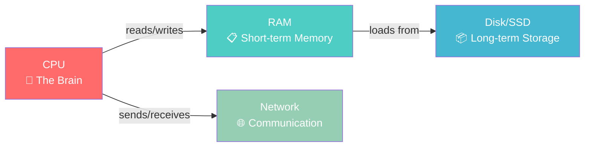

### CPU (Central Processing Unit) — The Brain

The CPU executes instructions. It's incredibly fast but can only do **one thing at a time per core**.

**Real-world analogy**: Think of the CPU as a chef in a kitchen. A single chef can only chop one vegetable at a time, but they do it incredibly fast. A multi-core CPU is like having multiple chefs — each can work independently.

**Key concepts**:
- **Clock Speed (GHz)**: How many operations per second. A 3 GHz CPU does ~3 billion simple operations per second.
- **Cores**: Modern CPUs have 4–64+ cores. Each core is an independent execution unit.
- **Cache (L1, L2, L3)**: Tiny, ultra-fast memory built into the CPU. L1 is fastest (1ns) but smallest (~64KB). L3 is slower (~10ns) but larger (~32MB).

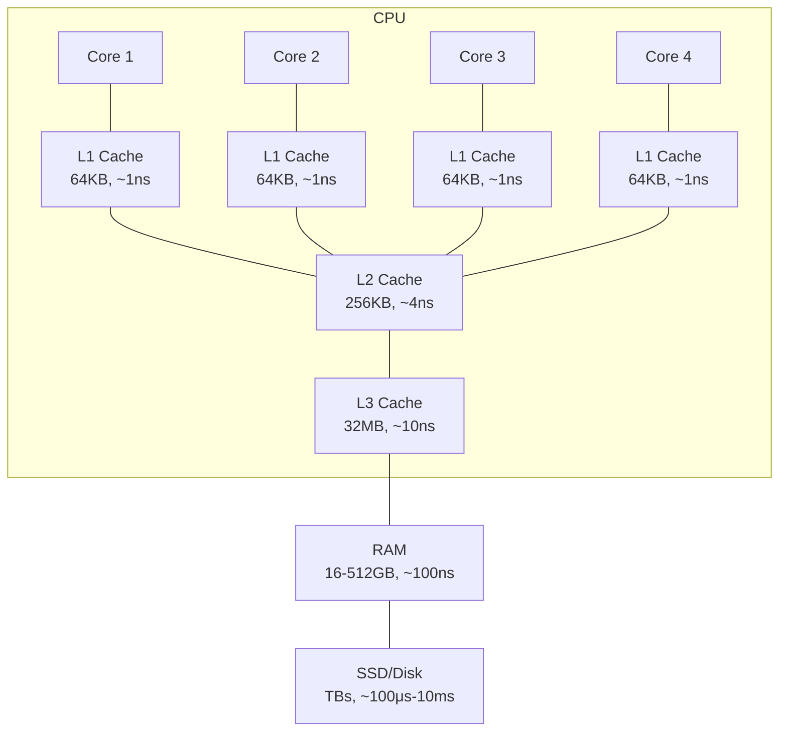

### RAM (Random Access Memory) — Short-term Memory

RAM is where active data lives. It's fast (~100ns access) but **volatile** — everything is lost when power goes off.

**Real-world analogy**: RAM is like your desk. You can access anything on your desk quickly, but it has limited space. When you turn off the lights (power off), your desk gets cleared.

**Key facts**:
- Typical server: 16GB – 512GB RAM
- Access time: ~100 nanoseconds
- Bandwidth: 25–50 GB/s
- **Why it matters for system design**: More RAM = more data cached in memory = fewer slow disk reads

### Disk (SSD / HDD) — Long-term Storage

Disk stores data permanently. It survives power loss but is much slower than RAM.

| Type | Access Time | Sequential Read | Cost per GB |
|------|-------------|-----------------|-------------|
| HDD (Spinning) | 5-10 ms | 100-200 MB/s | $0.02 |
| SSD (SATA) | 100 μs | 500 MB/s | $0.08 |
| SSD (NVMe) | 20 μs | 3-7 GB/s | $0.10 |

**Real-world analogy**: Disk is like a filing cabinet. It holds everything permanently, but finding and retrieving a specific folder takes much longer than grabbing something off your desk (RAM).

### Network — Communication

The network lets computers talk to each other. This is crucial in distributed systems where multiple machines work together.

**Key facts**:
- Same data center: 0.5ms round trip
- Cross-continent: 50-150ms round trip
- Network bandwidth: 1-100 Gbps in data centers

---

## 1.2 How a Program Executes

When you run a program, here's what actually happens:

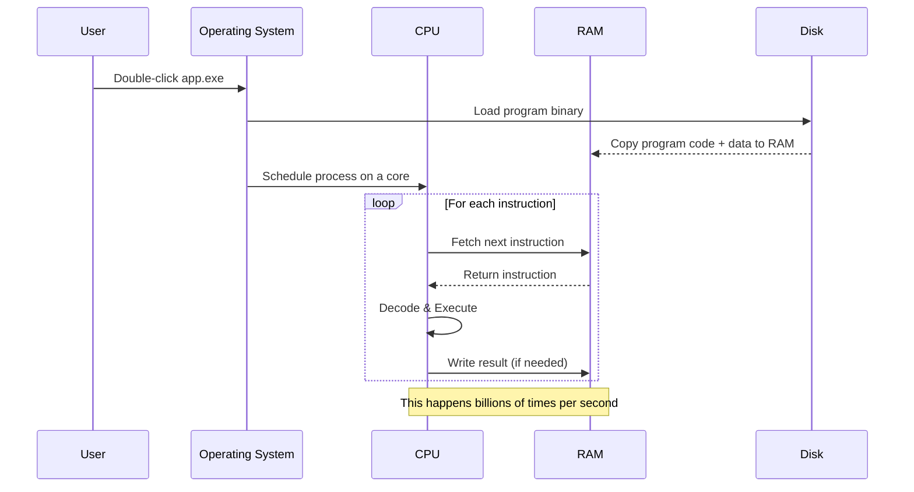

### The CPU Pipeline (Fetch-Decode-Execute Cycle):


> **Pipelining**: Modern CPUs overlap these stages — while one instruction is executing, the next is being decoded, and a third is being fetched. This is like a factory assembly line.

### Step-by-step:

1. **Loading**: The OS reads the program from disk into RAM
2. **Scheduling**: The OS assigns the program to a CPU core
3. **Fetch**: The CPU fetches the next instruction from RAM
4. **Decode**: The CPU figures out what the instruction means
5. **Execute**: The CPU performs the operation (add, compare, jump, etc.)
6. **Store**: Results are written back to RAM (or CPU registers/cache)

### The Memory Hierarchy

This is one of the **most important concepts** in system design. Data closer to the CPU is faster but more expensive and smaller:

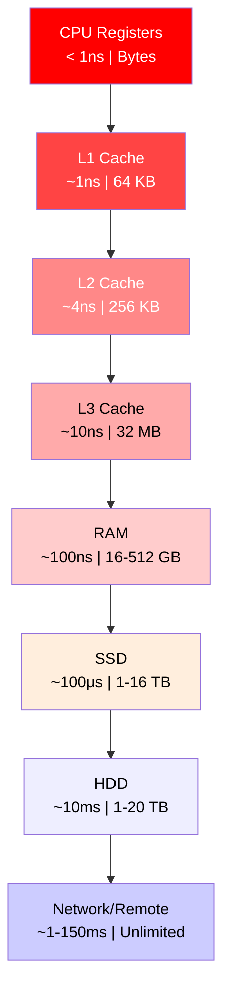

**Why this matters for system design**: Every caching strategy (Redis, CDN, browser cache) is essentially recreating this hierarchy at the distributed systems level. Keeping frequently accessed data "closer" to the user is the fundamental optimization.

---

## 1.3 Latency Numbers Every Programmer Should Know

This is a **legendary table** originally compiled by Jeff Dean (Google). Memorize the order of magnitude:

| Operation | Latency | Comparison |
|-----------|---------|------------|
| L1 cache reference | 1 ns | Blink of an eye |
| L2 cache reference | 4 ns | 4x L1 |
| Branch misprediction | 5 ns | |
| L3 cache reference | 10 ns | 10x L1 |
| Mutex lock/unlock | 25 ns | |
| **RAM reference** | **100 ns** | **100x L1** |
| Compress 1KB with Snappy | 3 μs | 3,000 ns |
| Send 1KB over 1 Gbps network | 10 μs | |
| **SSD random read** | **100 μs** | **1,000x RAM** |
| Read 1MB sequentially from RAM | 250 μs | |
| Round trip within data center | 500 μs | |
| **Read 1MB sequentially from SSD** | **1 ms** | |
| **HDD seek** | **10 ms** | **100x SSD** |
| Read 1MB sequentially from HDD | 20 ms | |
| Send packet CA→NL→CA | 150 ms | |

### Visual Scale (Powers of 10):

```mermaid
gantt
    title Latency Scale — Powers of 10 (log scale)
    dateFormat X
    axisFormat %s

    section Nanoseconds
    L1 Cache (1ns)          :a1, 0, 1
    L3 Cache (10ns)         :a2, 0, 10
    RAM (100ns)             :a3, 0, 100

    section Microseconds
    Network 1KB (10μs)      :a4, 0, 10000
    SSD Random (100μs)      :a5, 0, 100000

    section Milliseconds
    SSD Seq 1MB (1ms)       :a6, 0, 1000000
    HDD Seek (10ms)         :a7, 0, 10000000
    Cross-continent (150ms) :a8, 0, 150000000
```

```
1 ns    ████ L1 Cache
10 ns   ████████ L3 Cache  
100 ns  ████████████ RAM
1 μs    ████████████████ (1,000 ns)
10 μs   ████████████████████ Network send 1KB
100 μs  ████████████████████████ SSD random read
1 ms    ████████████████████████████ SSD sequential 1MB
10 ms   ████████████████████████████████ HDD seek
100 ms  ████████████████████████████████████ Cross-continent round trip
```

### Key Takeaways from Latency Numbers:

1. **RAM is 1000x faster than SSD** → This is why in-memory caches (Redis, Memcached) are game-changers
2. **SSD is 100x faster than HDD** → SSDs are standard in modern data centers
3. **Network within data center is ~500μs** → Co-locating services matters
4. **Cross-continent is ~150ms** → This is why CDNs exist (serve from nearby)
5. **Sequential reads are much faster than random reads** → This impacts database and log design

---

## 1.4 Throughput vs Latency

Two fundamental metrics you'll use throughout system design:

**Latency**: How long it takes to complete ONE operation (measured in ms, μs, ns)
- *Analogy*: How long it takes one car to travel from City A to City B

**Throughput**: How many operations can be completed per unit time (measured in requests/second, MB/s)
- *Analogy*: How many cars per hour can travel from City A to City B (depends on number of lanes)

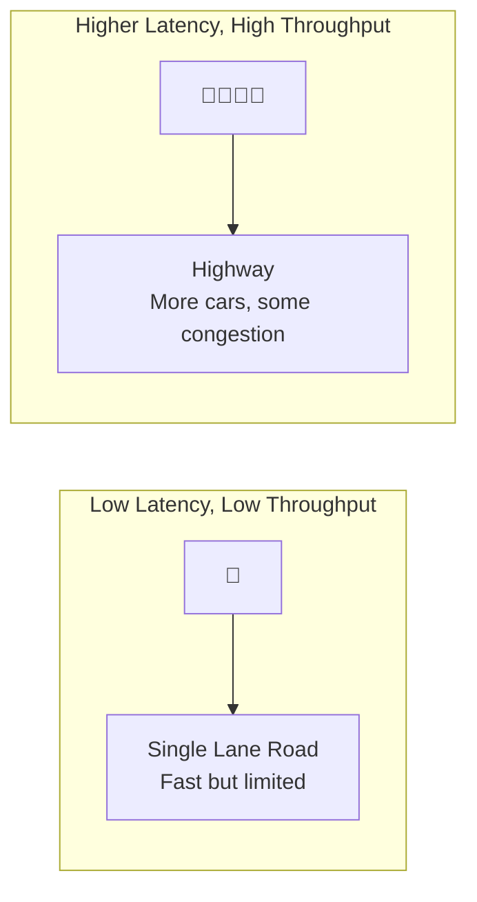

**Key insight**: You can have high throughput with high latency! Think of a cargo ship — it takes weeks (high latency) but carries millions of items (high throughput).

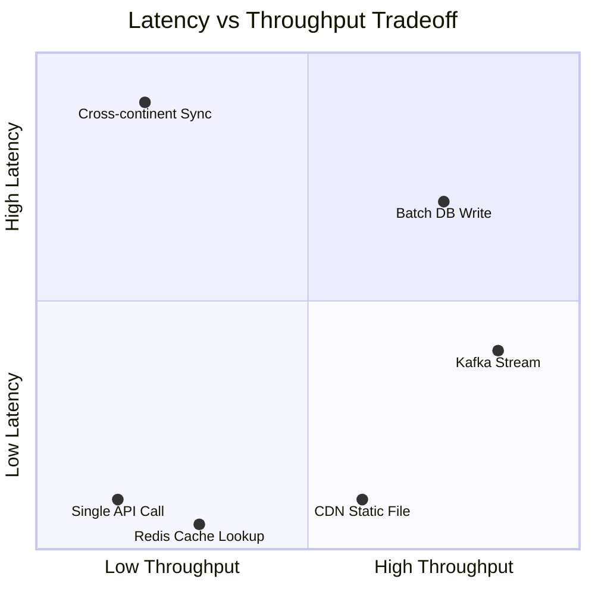

### Bandwidth vs Throughput

- **Bandwidth**: Maximum theoretical capacity (8-lane highway)
- **Throughput**: Actual data transferred (maybe only 5 lanes are used due to construction)

Throughput ≤ Bandwidth (always)

---

## 1.5 How Data is Stored

### Bits and Bytes

Everything in a computer is stored as **bits** (0 or 1).

| Unit | Size | Example |
|------|------|---------|
| 1 Bit | 0 or 1 | A single switch |
| 1 Byte | 8 bits | One character ('A') |
| 1 KB | 1,024 bytes | A short paragraph |
| 1 MB | 1,024 KB | A photo |
| 1 GB | 1,024 MB | A movie |
| 1 TB | 1,024 GB | ~250,000 photos |
| 1 PB | 1,024 TB | Major company's data |

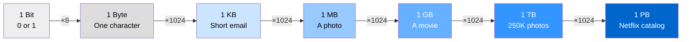

### Data on Disk: Files and Pages

Disks don't read individual bytes. They read in **pages** (typically 4KB or 8KB blocks).

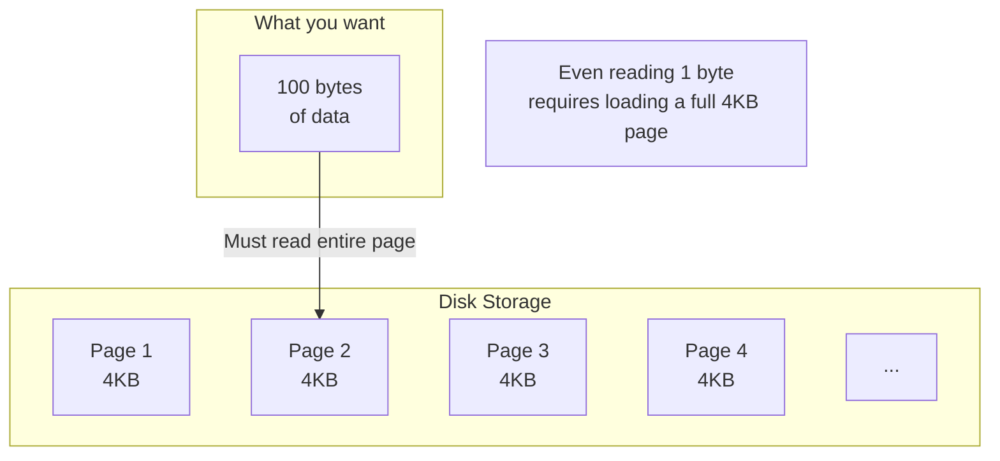

**Why this matters**: Databases are designed around page sizes. B-tree indexes, buffer pools, and write-ahead logs are all optimized for how disks actually work.

### Data in RAM: Arrays, Hash Maps, Trees

In RAM, data structures determine how fast you can find data:

| Data Structure | Search | Insert | Delete | Use Case |
|---------------|--------|--------|--------|----------|
| Array | O(n) | O(1)* | O(n) | Sequential data |
| Sorted Array | O(log n) | O(n) | O(n) | Static sorted data |
| Hash Map | O(1) avg | O(1) avg | O(1) avg | Key-value lookups |
| Binary Search Tree | O(log n) | O(log n) | O(log n) | Ordered data |
| B-Tree | O(log n) | O(log n) | O(log n) | Databases, filesystems |

---

## 1.6 Back-of-the-Envelope Estimation

A critical skill for system design interviews: quickly estimating system requirements.

### Common Numbers to Know:

| Metric | Value |
|--------|-------|
| Seconds in a day | ~86,400 ≈ ~100,000 (10^5) |
| Seconds in a month | ~2.5 million |
| Seconds in a year | ~31 million ≈ ~10^7.5 |
| Daily active users (DAU) for big app | 100M - 1B |
| Average web page size | ~2-3 MB |
| Average image size | 200KB - 2MB |
| Average video minute (720p) | ~50 MB |
| QPS for a single web server | 1,000 - 10,000 |
| QPS for a single database server | 1,000 - 10,000 |

### Estimation Example: Twitter's Storage

**Problem**: Estimate Twitter's daily tweet storage requirement.

**Approach**:
1. DAU: ~200 million
2. Tweets per user per day: ~2 (average, most users just read)
3. Total tweets/day: 200M × 2 = 400M tweets
4. Average tweet size: ~300 bytes (text) + metadata (~200 bytes) = ~500 bytes
5. Daily storage: 400M × 500 bytes = 200 GB/day
6. With 10% having images (~200KB each): 40M × 200KB = 8 TB/day
7. **Total: ~8.2 TB/day ≈ ~3 PB/year**

### Estimation Framework:

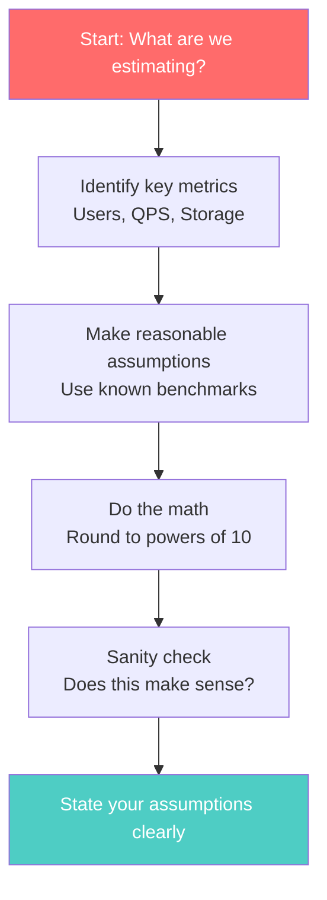

---

## 1.7 How the Web Works (High Level)

Before we go deeper in later chapters, here's the 10,000-foot view of what happens when you type a URL:

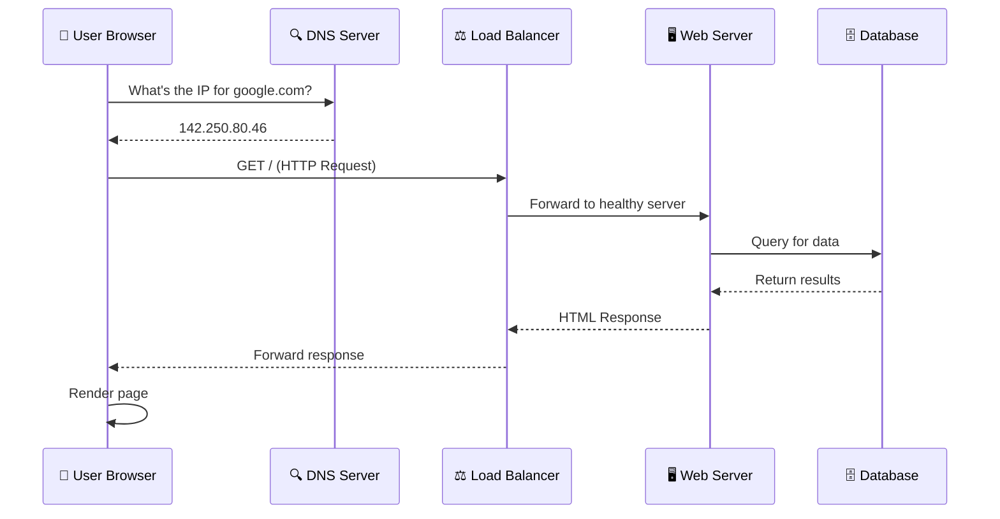

We'll break down every component of this in the coming chapters.

---

## Key Takeaways

| Concept | Why It Matters for System Design |
|---------|----------------------------------|
| Memory Hierarchy | Caching strategies mirror this at every level |
| Latency Numbers | Know the cost of every operation to make informed tradeoffs |
| Throughput vs Latency | Different systems optimize for different metrics |
| Page-based disk reads | Database internals, index design |
| Back-of-envelope math | Required in every system design interview |

---

## Practice Questions

1. **Estimation**: If a service handles 10,000 requests per second, and each request reads 1MB from disk, what throughput do you need? Is a single HDD sufficient? What about an SSD?

2. **Memory Hierarchy**: A web application queries a database for user profiles. The same 1,000 users are requested repeatedly. Where should you cache this data, and what latency improvement would you expect?

3. **Latency**: A user in Tokyo makes a request to a server in Virginia. The round-trip network latency is 150ms. The server takes 50ms to process. What is the total latency? How would you reduce it?

4. **Estimation**: Estimate the storage needed for a photo-sharing app with 50 million DAU, where each user uploads an average of 1 photo per day (average size 2MB). How much storage per year?

5. **Critical Thinking**: Why do databases typically use B-Trees instead of Hash Maps for indexes, even though Hash Maps have O(1) lookup?

---

*Next Chapter: [Networking Fundamentals →](./ch02-networking-fundamentals.md)*
