# Chapter 2: Networking Fundamentals

> *"Every system design is fundamentally about how machines talk to each other over a network."*

Almost every modern application is a distributed system — multiple computers communicating over a network. Understanding networking is non-negotiable.

---

## 2.1 The OSI Model — 7 Layers of Networking

The OSI (Open Systems Interconnection) model describes how data travels from your application to another computer. Think of it as an assembly line where each layer adds its own envelope around your data.

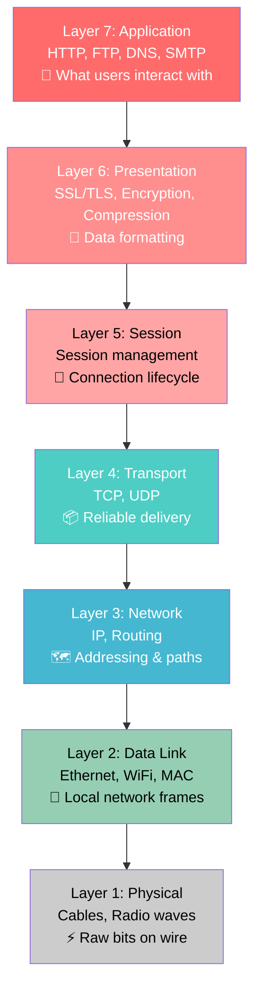

### For System Design, Focus on These Layers:

| Layer | Protocol | Why You Care |
|-------|----------|-------------|
| **7 - Application** | HTTP, WebSocket, gRPC | Your APIs and services communicate here |
| **4 - Transport** | TCP, UDP | Determines reliability vs speed tradeoff |
| **3 - Network** | IP | Addressing and routing between machines |

**Real-world analogy**: Sending a letter:
- **Application layer** = Writing the letter content
- **Presentation** = Translating to a language both sides understand
- **Session** = The ongoing conversation (back and forth letters)
- **Transport** = Registered mail (TCP) vs regular mail (UDP)
- **Network** = The postal routing system (addresses, zip codes)
- **Data Link** = The local mail truck on your street
- **Physical** = The actual road the truck drives on

### Packet Encapsulation — How Data Gets Wrapped

Each layer wraps the previous layer's data with its own header, like nested envelopes:

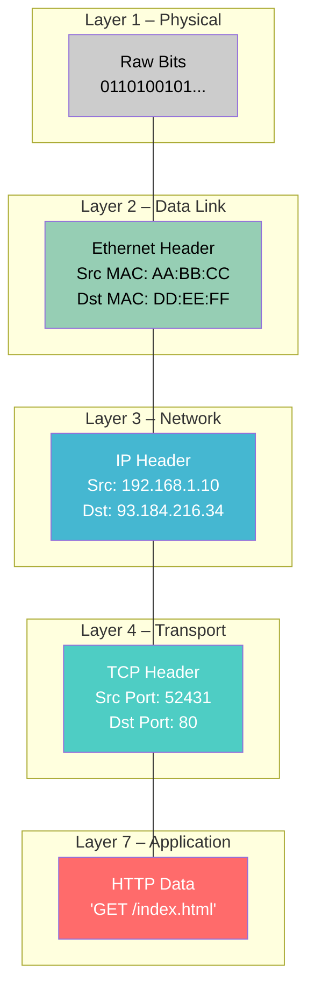

> At the receiving end, each layer **strips its header** in reverse order (de-encapsulation), until the application gets the original data.

---

## 2.2 TCP vs UDP

These are the two fundamental transport protocols. Every system design decision about networking starts here.

### TCP (Transmission Control Protocol) — Reliable

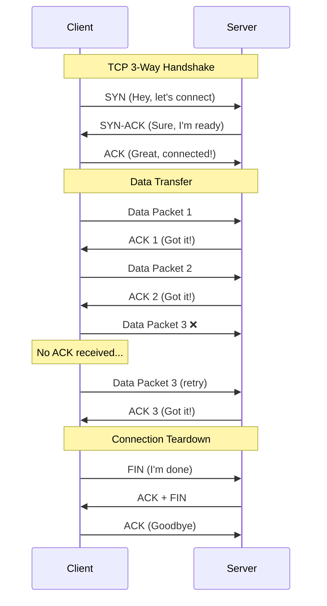

**TCP guarantees**:
- **Ordered delivery**: Packets arrive in order
- **Reliable delivery**: Lost packets are retransmitted
- **Flow control**: Sender won't overwhelm receiver
- **Congestion control**: Adapts to network conditions

**Use TCP when**: Data integrity matters — web pages, APIs, file transfers, emails

### UDP (User Datagram Protocol) — Fast

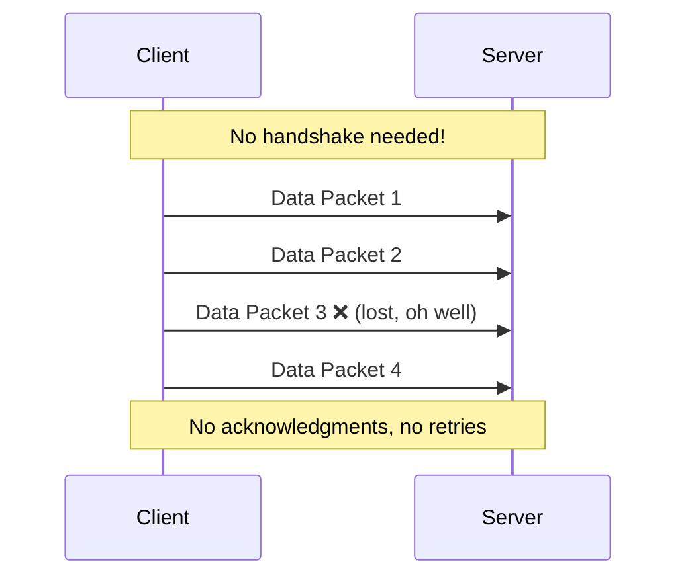

**UDP characteristics**:
- **No connection setup**: Just send!
- **No ordering guarantees**: Packets may arrive out of order
- **No retry**: Lost packets stay lost
- **Very fast**: Minimal overhead

**Use UDP when**: Speed matters more than completeness — video streaming, gaming, DNS lookups, VoIP

### TCP vs UDP Comparison:

| Feature | TCP | UDP |
|---------|-----|-----|
| Connection | Required (handshake) | Connectionless |
| Reliability | Guaranteed delivery | Best effort |
| Ordering | Ordered | Unordered |
| Speed | Slower (overhead) | Faster |
| Overhead | 20+ byte header | 8 byte header |
| Use Cases | HTTP, API, DB, Email | Streaming, DNS, Gaming |

---

## 2.3 IP Addressing

Every machine on a network has an IP address — like a street address for computers.

### IPv4 vs IPv6:

| Version | Format | Example | Total Addresses |
|---------|--------|---------|-----------------|
| IPv4 | 4 octets (32 bit) | 192.168.1.100 | ~4.3 billion |
| IPv6 | 8 groups (128 bit) | 2001:0db8:85a3::8a2e:0370:7334 | ~340 undecillion |

### Public vs Private IPs:

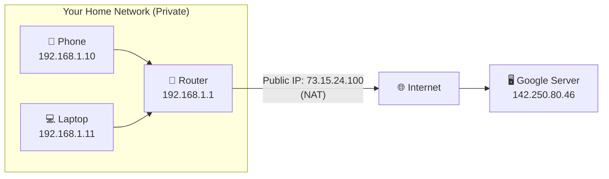

**Private IP ranges** (not routable on internet):
- 10.0.0.0 – 10.255.255.255
- 172.16.0.0 – 172.31.255.255
- 192.168.0.0 – 192.168.255.255

**NAT (Network Address Translation)**: Your router maps private IPs to one public IP. This is why multiple devices share one public IP.

---

## 2.4 DNS — The Internet's Phone Book

DNS (Domain Name System) translates human-readable names to IP addresses.

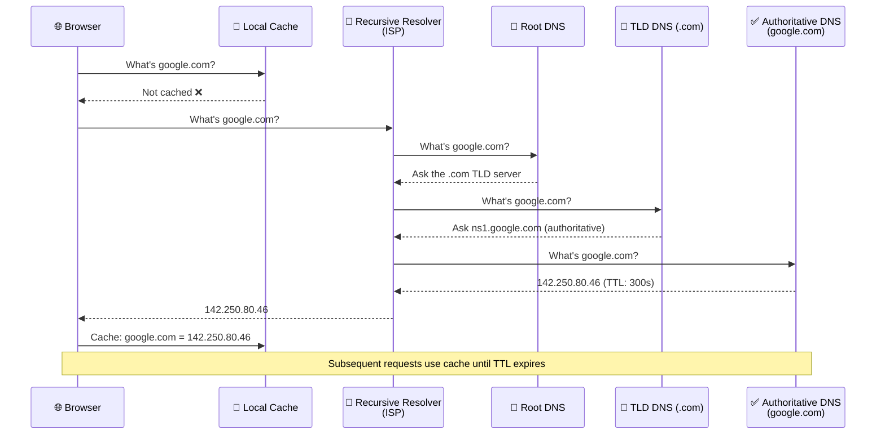

### DNS Record Types:

| Type | Purpose | Example |
|------|---------|---------|
| **A** | Domain → IPv4 | google.com → 142.250.80.46 |
| **AAAA** | Domain → IPv6 | google.com → 2607:f8b0:... |
| **CNAME** | Alias → Another domain | www.google.com → google.com |
| **MX** | Mail server | google.com → mail.google.com |
| **NS** | Nameserver | google.com → ns1.google.com |
| **TXT** | Arbitrary text | Used for verification, SPF |

### Why DNS Matters for System Design:

1. **Load Balancing**: DNS can return different IPs to distribute traffic (DNS round-robin)
2. **Failover**: If a server dies, update DNS to point to a healthy server
3. **CDN Routing**: DNS resolves to the nearest CDN edge server based on geography
4. **TTL Tradeoff**: Low TTL = faster failover but more DNS queries. High TTL = fewer queries but slower updates.

---

## 2.5 HTTP / HTTPS — The Language of the Web

HTTP (HyperText Transfer Protocol) is how browsers and servers communicate. HTTPS adds encryption.

### HTTP Request/Response Cycle:

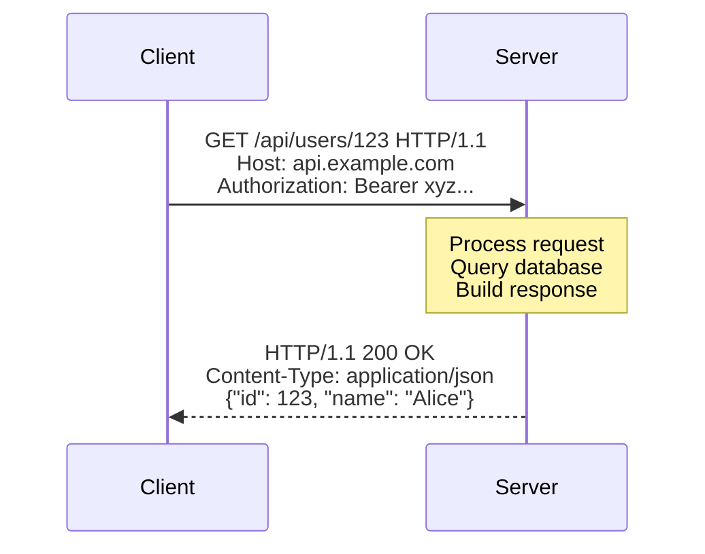

### HTTP Methods:

| Method | Purpose | Idempotent? | Safe? |
|--------|---------|-------------|-------|
| **GET** | Read data | Yes | Yes |
| **POST** | Create data | No | No |
| **PUT** | Replace data | Yes | No |
| **PATCH** | Partial update | No | No |
| **DELETE** | Remove data | Yes | No |

**Idempotent**: Same request multiple times = same result. `DELETE /users/123` three times still deletes user 123 once.

**Safe**: Doesn't modify server state. `GET` only reads.

### HTTP Status Codes:

| Range | Category | Common Codes |
|-------|----------|-------------|
| **2xx** | Success | 200 OK, 201 Created, 204 No Content |
| **3xx** | Redirect | 301 Moved Permanently, 302 Found, 304 Not Modified |
| **4xx** | Client Error | 400 Bad Request, 401 Unauthorized, 403 Forbidden, 404 Not Found, 429 Too Many Requests |
| **5xx** | Server Error | 500 Internal Server Error, 502 Bad Gateway, 503 Service Unavailable |

### HTTP/1.1 vs HTTP/2 vs HTTP/3:

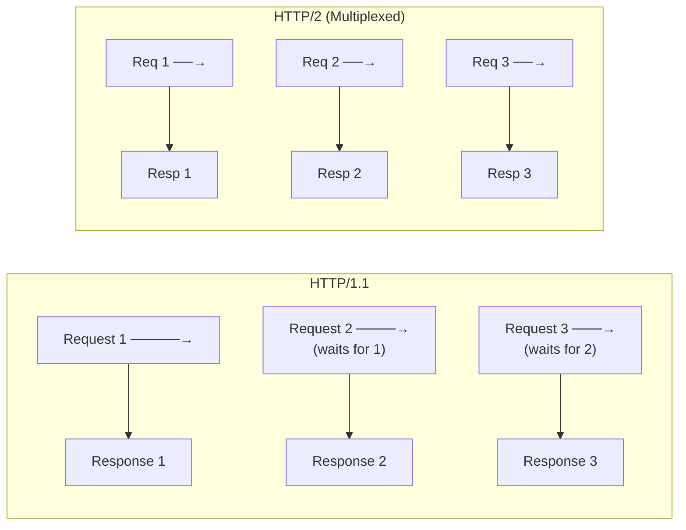

| Feature | HTTP/1.1 | HTTP/2 | HTTP/3 |
|---------|----------|--------|--------|
| Transport | TCP | TCP | QUIC (UDP-based) |
| Multiplexing | No (one at a time) | Yes (many in parallel) | Yes |
| Header Compression | No | HPACK | QPACK |
| Server Push | No | Yes | Yes |
| Head-of-line blocking | Yes | Partially solved | Fully solved |

### HTTPS — HTTP + Encryption

HTTPS uses TLS (Transport Layer Security) to encrypt communication:

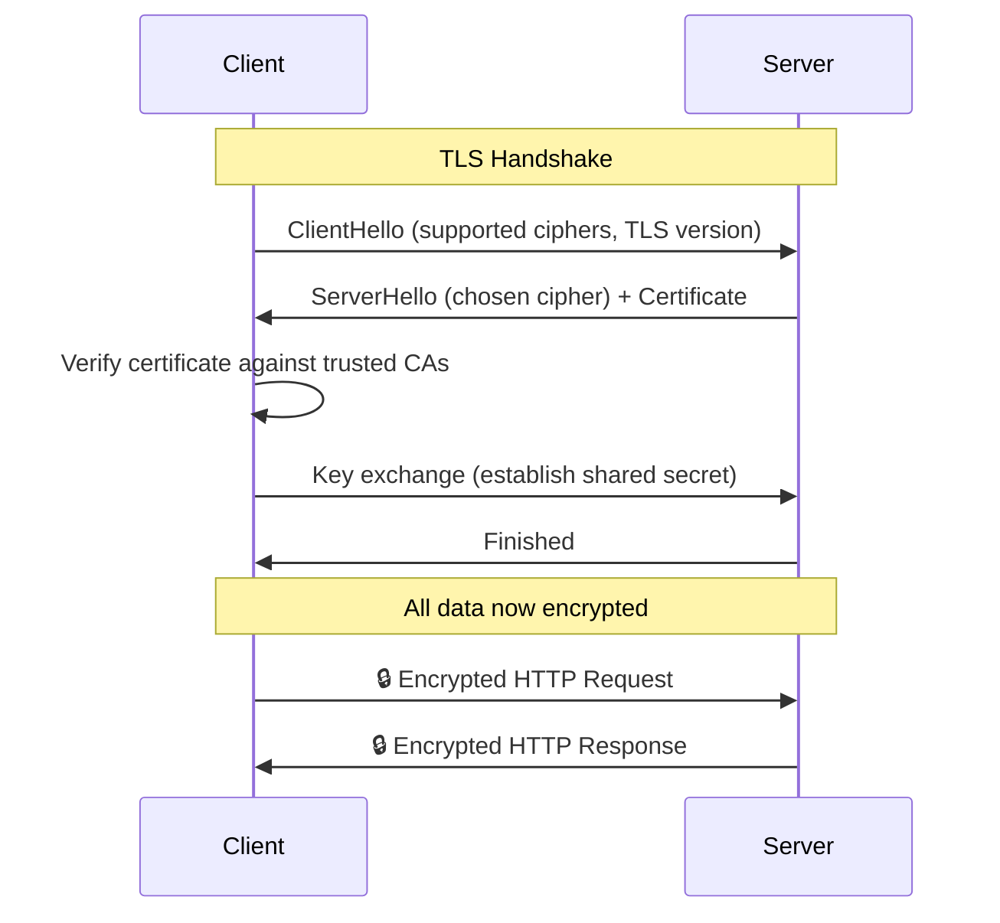

**Why HTTPS everywhere**: Prevents eavesdropping, tampering, and impersonation. Modern browsers flag HTTP as "Not Secure."

---

## 2.6 REST API Design

REST (Representational State Transfer) is the dominant architectural style for web APIs.

### REST Principles:

1. **Stateless**: Each request contains all needed info. Server doesn't remember previous requests.
2. **Resource-based**: URLs represent resources (nouns, not verbs)
3. **HTTP Methods as Verbs**: GET, POST, PUT, DELETE
4. **Uniform Interface**: Consistent URL patterns

### Good vs Bad REST Design:

| ❌ Bad | ✅ Good | Why |
|--------|---------|-----|
| GET /getUsers | GET /users | Method already says "get" |
| POST /createUser | POST /users | Method already says "create" |
| POST /deleteUser/123 | DELETE /users/123 | Use proper HTTP method |
| GET /users/123/getOrders | GET /users/123/orders | Don't use verbs in URLs |

### REST Example — User API:

```
GET    /users          → List all users
GET    /users/123      → Get user 123
POST   /users          → Create new user
PUT    /users/123      → Replace user 123
PATCH  /users/123      → Update user 123 partially
DELETE /users/123      → Delete user 123

GET    /users/123/orders        → Get orders for user 123
POST   /users/123/orders        → Create order for user 123
GET    /users/123/orders/456    → Get specific order
```

### Pagination, Filtering, Sorting:

```
GET /users?page=2&limit=20                    → Pagination
GET /users?status=active&role=admin           → Filtering
GET /users?sort=created_at&order=desc         → Sorting
GET /users?fields=id,name,email               → Field selection
```

---

## 2.7 REST vs RPC vs GraphQL

### RPC (Remote Procedure Call)

RPC treats remote services like local function calls.

```
# REST style
GET /users/123/orders?status=pending

# RPC style
POST /getUserPendingOrders
Body: { "user_id": 123 }
```

**gRPC** (Google's RPC framework):
- Uses Protocol Buffers (binary, smaller than JSON)
- HTTP/2 based (fast, multiplexed)
- Strongly typed (auto-generated client/server code)
- Supports streaming (bidirectional)

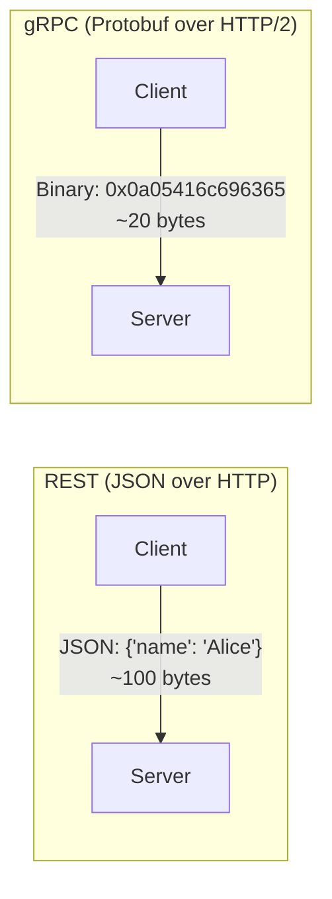

### GraphQL

Client specifies exactly what data it wants:

```graphql
# Client requests only what it needs
query {
  user(id: 123) {
    name
    email
    orders(status: "pending") {
      id
      total
    }
  }
}
```

### Comparison:

| Feature | REST | gRPC | GraphQL |
|---------|------|------|---------|
| Format | JSON | Protobuf (binary) | JSON |
| Transport | HTTP/1.1+ | HTTP/2 | HTTP |
| Schema | OpenAPI (optional) | .proto (required) | SDL (required) |
| Best For | Public APIs | Internal microservices | Complex nested data |
| Over/Under-fetching | Common problem | N/A (typed) | Solved by design |
| Learning Curve | Low | Medium | Medium-High |
| Streaming | SSE/WebSocket | Native bidirectional | Subscriptions |

### When to Use What:

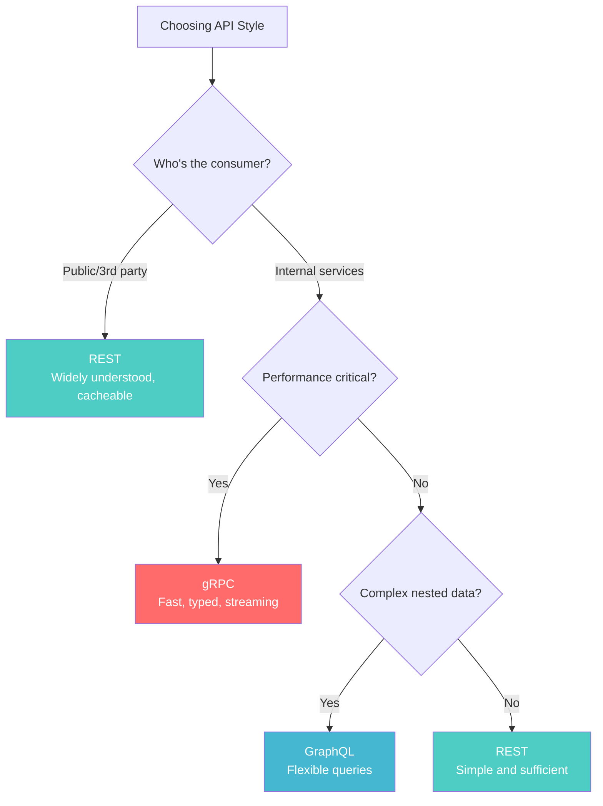

---

## 2.8 WebSockets — Real-time Communication

HTTP is request-response: client asks, server answers. But what about real-time updates (chat, live scores, stock prices)?

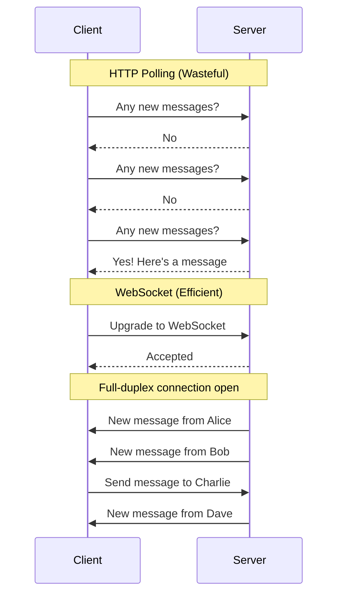

### Communication Patterns:

| Pattern | How It Works | Use Case |
|---------|-------------|----------|
| **Short Polling** | Client requests repeatedly on interval | Simple, wasteful |
| **Long Polling** | Server holds request until data available | Medium complexity |
| **SSE** | Server pushes events (one-way) | News feeds, notifications |
| **WebSocket** | Full-duplex, persistent connection | Chat, gaming, live data |

### Communication Patterns — Visual Comparison:

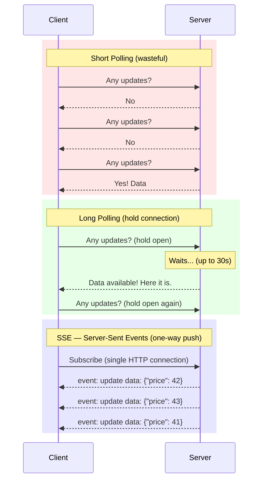

---

## 2.9 How a Web Request Works End-to-End

Let's trace what happens when you type `https://www.amazon.com` and press Enter:

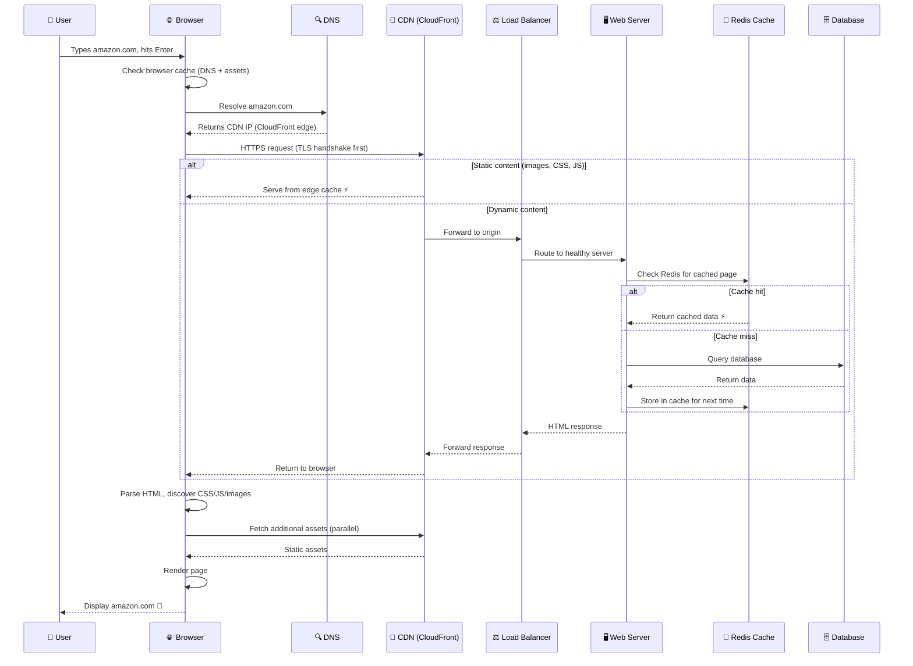

### Timeline:

| Step | Time | What Happens |
|------|------|-------------|
| DNS Lookup | ~20-100ms | Resolve domain to IP (often cached) |
| TCP + TLS Handshake | ~50-100ms | Establish secure connection |
| Server Processing | ~50-200ms | Generate the page |
| Content Download | ~50-500ms | Transfer HTML, CSS, JS, images |
| Browser Rendering | ~100-500ms | Parse and paint the page |
| **Total** | **~300-1500ms** | **Full page load** |

---

## Key Takeaways

| Concept | Why It Matters |
|---------|---------------|
| TCP vs UDP | Choose reliability vs speed for each service |
| DNS | Foundation for load balancing, failover, CDN routing |
| HTTP methods & status codes | Designing clean, predictable APIs |
| REST vs gRPC vs GraphQL | Right protocol for right use case |
| WebSockets | Real-time features need persistent connections |
| End-to-end flow | Understanding every hop helps you optimize |

---

## Practice Questions

1. **Design**: You're building a live multiplayer game. Would you use TCP or UDP? Why? What about the chat feature within the game?

2. **DNS**: If a server goes down, and DNS TTL is set to 1 hour, what happens to users? How would you fix this? What are the tradeoffs of a very low TTL?

3. **API Design**: Design a REST API for a blog platform. Include endpoints for posts, comments, and user management. Consider pagination and filtering.

4. **Protocol Choice**: You're building an internal microservices system with 50 services. Which API style (REST, gRPC, GraphQL) would you choose for service-to-service communication? Why?

5. **Estimation**: If each DNS lookup takes 50ms and a page requires 30 external resources from 15 different domains, what's the maximum DNS overhead? How do browsers optimize this?

---

*Previous: [← How Computers Work](./ch01-how-computers-work.md) | Next: [Operating System Basics →](./ch03-operating-system-basics.md)*
