# Chapter 3: Operating System Basics

> *"The OS is the silent manager of your system. Understanding it lets you design software that works WITH the machine, not against it."*

The operating system manages hardware resources and provides abstractions that your programs use. Key concepts here directly impact system design decisions.

---

## 3.1 Processes and Threads

### What is a Process?

A **process** is a running instance of a program. Each process has its own:
- Memory space (heap, stack)
- File descriptors
- Process ID (PID)
- Security context

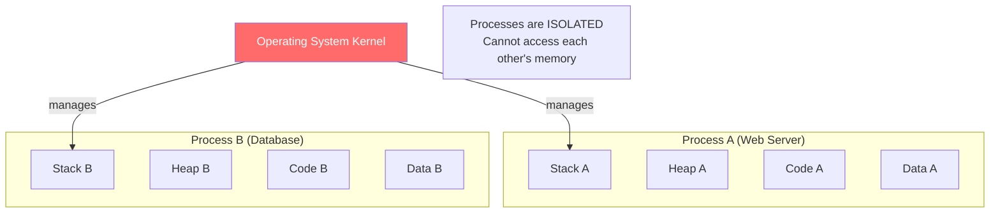

### What is a Thread?

A **thread** is a lightweight unit of execution within a process. Threads within the same process share memory.

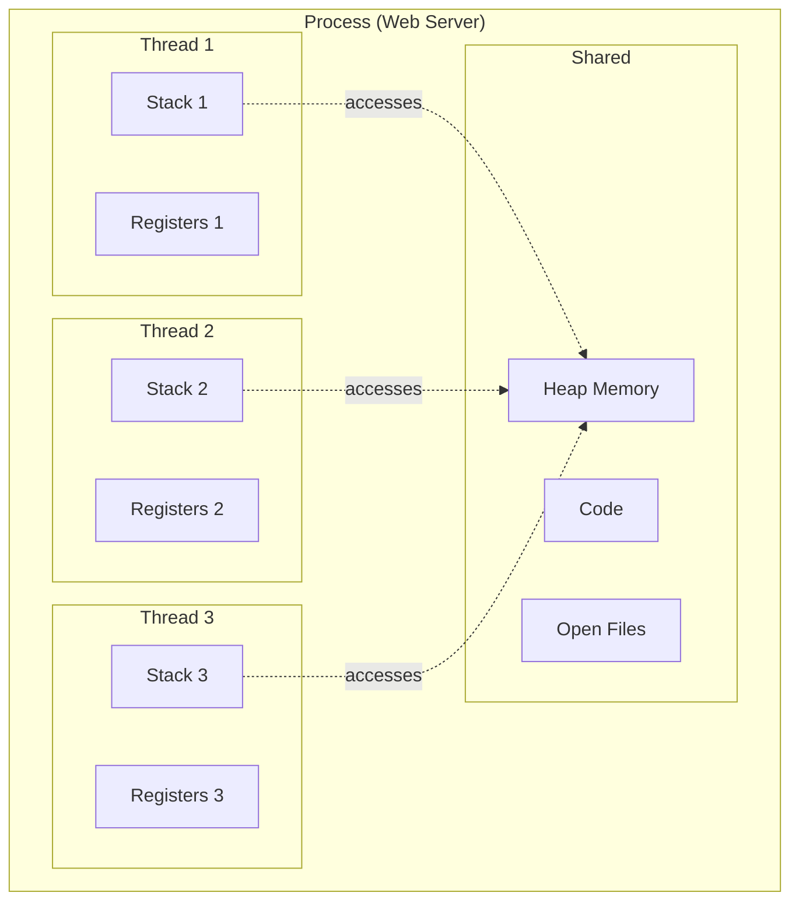

### Process vs Thread:

| Feature | Process | Thread |
|---------|---------|--------|
| Memory | Separate memory space | Shared memory within process |
| Creation cost | Heavy (~10ms) | Light (~0.1ms) |
| Communication | IPC (pipes, sockets, shared memory) | Direct shared memory |
| Isolation | Full (crash doesn't affect others) | None (one thread crashes = all crash) |
| Context switch | Expensive | Cheaper |

**Real-world analogy**:
- **Process** = Separate offices in a building (each has own space, can't see into each other)
- **Thread** = Workers within one office (share desks, whiteboards, can talk directly)

### Why This Matters for System Design:

- **Multi-process model** (e.g., Nginx workers): Better isolation, harder to share state
- **Multi-thread model** (e.g., Java servers): Easier shared state, risk of data races
- **Event loop model** (e.g., Node.js): Single thread, non-blocking I/O — no thread overhead

### Thread Lifecycle — State Machine:

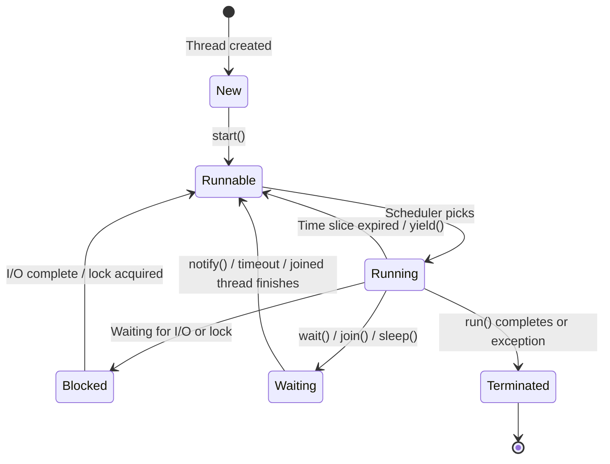

> Understanding thread states helps debug performance issues: too many threads in **Blocked** = I/O bottleneck. Too many in **Runnable** = CPU saturation.

---

## 3.2 Concurrency vs Parallelism

These are **not the same thing**:

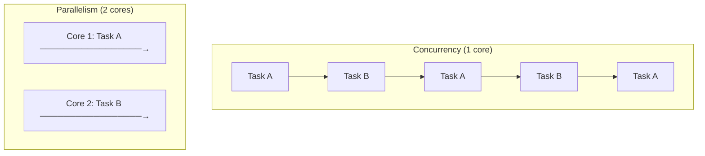

| Concept | Definition | Analogy |
|---------|-----------|---------|
| **Concurrency** | Managing multiple tasks that *overlap in time* | One chef switching between chopping and stirring |
| **Parallelism** | Executing multiple tasks *simultaneously* | Two chefs each doing a different task |

**Key insight**: You can have concurrency without parallelism (single core switching between tasks), and parallelism without concurrency (two cores doing independent, unrelated work).

### Concurrency Models in Practice:

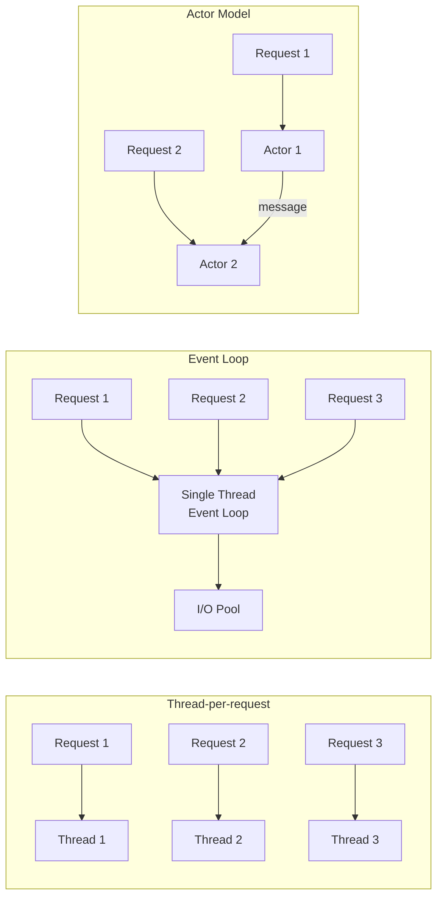

| Model | Used By | Pros | Cons |
|-------|---------|------|------|
| **Thread-per-request** | Java (Tomcat), Python | Simple to reason about | Thread overhead, C10K problem |
| **Event loop** | Node.js, Nginx | Handles many connections | CPU-bound blocks everything |
| **Actor model** | Erlang, Akka | Fault-tolerant, scalable | Complex programming model |
| **Coroutines/Async** | Go (goroutines), Python (asyncio) | Lightweight, efficient | Learning curve |

---

## 3.3 Synchronization — Locks, Mutexes, Semaphores

When multiple threads access shared data, you need synchronization to prevent **race conditions**.

### The Race Condition Problem:

```python
# DANGEROUS: Race condition
balance = 1000

# Thread 1: Withdraw 500
def withdraw():
    global balance
    temp = balance       # reads 1000
    temp = temp - 500    # calculates 500
    balance = temp       # writes 500

# Thread 2: Withdraw 300
def withdraw2():
    global balance
    temp = balance       # reads 1000 (BEFORE Thread 1 writes!)
    temp = temp - 300    # calculates 700
    balance = temp       # writes 700 (OVERWRITES Thread 1's result!)

# Expected: 1000 - 500 - 300 = 200
# Actual: Could be 500, 700, or 200 depending on timing!
```

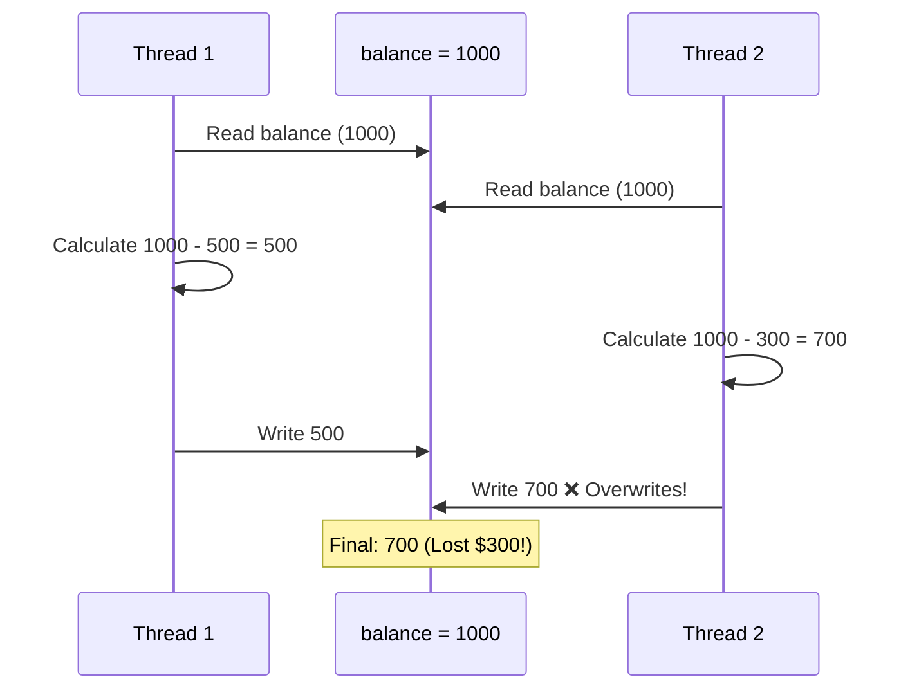

### Mutex (Mutual Exclusion Lock)

Only one thread can hold the lock at a time:

```python
import threading

balance = 1000
lock = threading.Lock()

def withdraw(amount):
    global balance
    lock.acquire()       # Wait until lock is available
    try:
        temp = balance
        temp = temp - amount
        balance = temp
    finally:
        lock.release()   # Always release!
```

```java
// Java equivalent
private int balance = 1000;
private final Object lock = new Object();

public void withdraw(int amount) {
    synchronized(lock) {
        balance -= amount;
    }
}
```

### Semaphore

Like a mutex, but allows N threads simultaneously. Think of it as a parking lot with N spots.

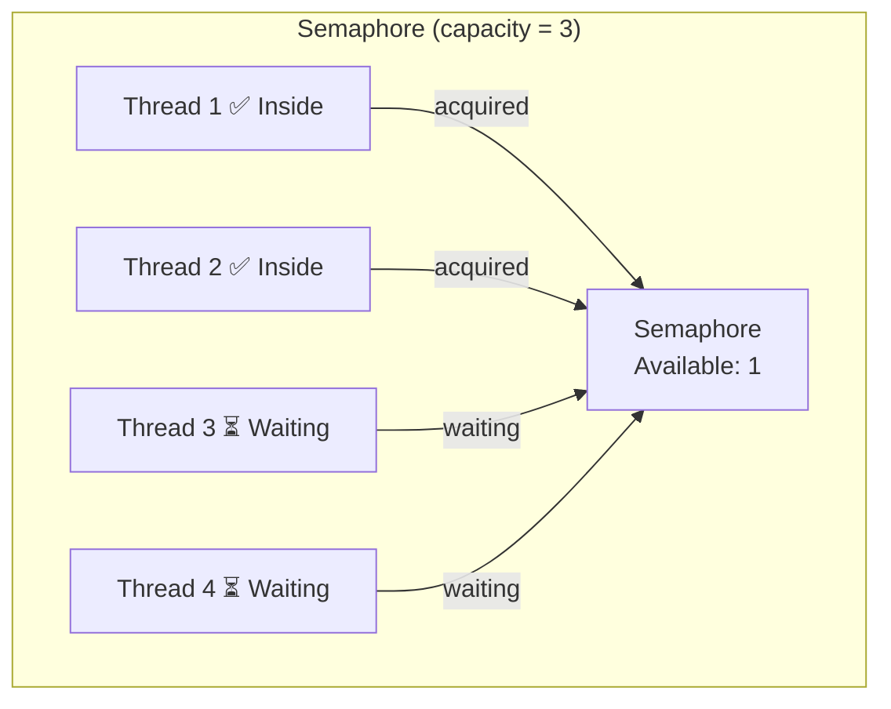

**Use cases**:
- **Mutex (Semaphore(1))**: Protect critical sections
- **Semaphore(N)**: Connection pool (max 10 DB connections), rate limiting

### Deadlock

When two or more threads are stuck waiting for each other forever:


**Deadlock conditions** (all four must be true):
1. **Mutual exclusion**: Resource can only be held by one thread
2. **Hold and wait**: Thread holds one resource while waiting for another
3. **No preemption**: Resources can't be forcibly taken
4. **Circular wait**: Circular chain of waiting

**Prevention strategies**:
- Lock ordering (always acquire locks in same order)
- Lock timeout (give up after N ms)
- Deadlock detection (detect cycles, kill one thread)

### Deadlock Conditions Flowchart:

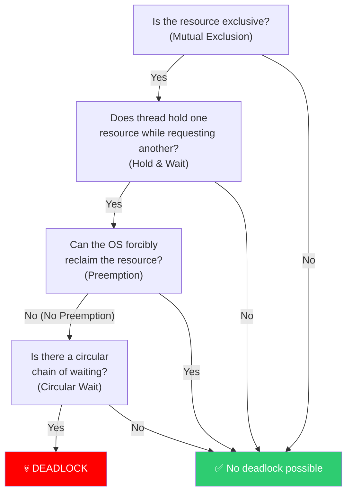

> **All four conditions** must hold simultaneously for deadlock. Eliminating any one prevents it.

---

## 3.4 Memory Management

### Virtual Memory

Each process thinks it has the entire memory space to itself. The OS maps virtual addresses to physical RAM.

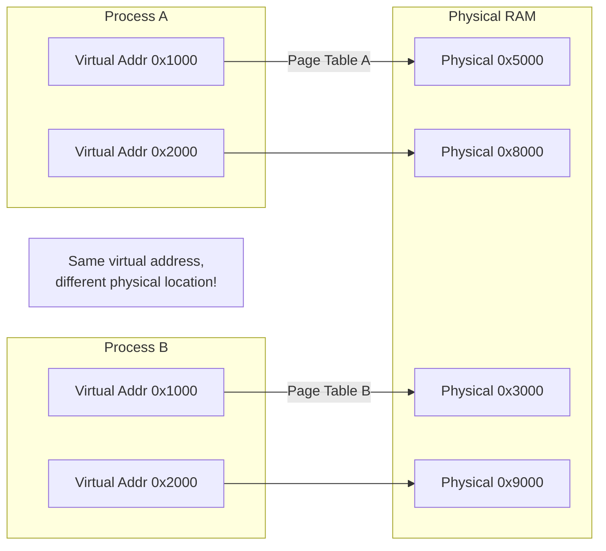

### Process Memory Layout:

```
High Address  ┌─────────────────────┐
              │       Stack         │  ← Local variables, function calls
              │    (grows down ↓)   │     Fixed per thread
              ├─────────────────────┤
              │         ↓           │
              │    Free Space       │
              │         ↑           │
              ├─────────────────────┤
              │        Heap         │  ← Dynamic allocation (new, malloc)
              │    (grows up ↑)     │     Shared among threads
              ├─────────────────────┤
              │   BSS (Uninit data) │  ← Uninitialized globals
              ├─────────────────────┤
              │   Data (Init data)  │  ← Initialized globals
              ├─────────────────────┤
              │       Code          │  ← Program instructions (read-only)
Low Address   └─────────────────────┘
```

### Stack vs Heap:

| Feature | Stack | Heap |
|---------|-------|------|
| Allocation | Automatic (function calls) | Manual (malloc/new) |
| Speed | Very fast (just move pointer) | Slower (find free block) |
| Size | Limited (1-8 MB per thread) | Large (limited by RAM) |
| Deallocation | Automatic (function returns) | Manual or GC |
| Thread safety | Each thread has own stack | Shared, needs synchronization |

### Garbage Collection (GC):

Automatic memory management used by Java, Python, Go, JavaScript:

| GC Algorithm | How It Works | Tradeoff |
|-------------|-------------|----------|
| **Reference counting** | Count pointers to each object, free when 0 | Fast but can't handle cycles |
| **Mark and sweep** | Mark reachable objects, free unmarked | Pauses application ("stop the world") |
| **Generational** | Young objects collected more often | Good for short-lived objects (most of them) |
| **Concurrent** | GC runs alongside application | Minimal pauses, more complex |

**Why this matters**: GC pauses can cause latency spikes in real-time systems. Java's G1GC, ZGC, and Go's concurrent GC are designed to minimize pauses.

---

## 3.5 I/O Models

How the OS handles input/output operations is crucial for server performance.

### Blocking vs Non-blocking I/O:

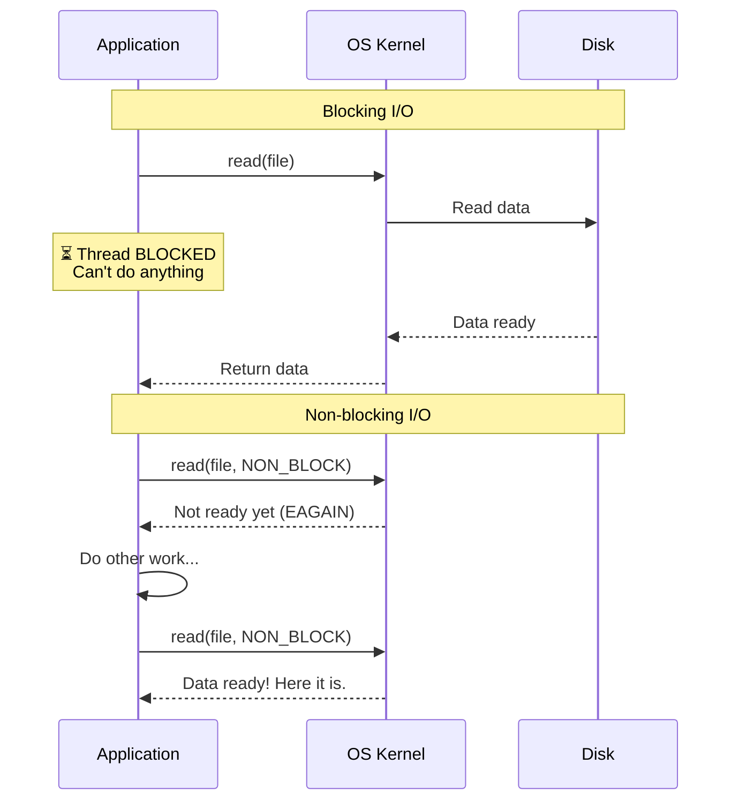

### I/O Multiplexing (select, poll, epoll):

The secret sauce behind high-performance servers:

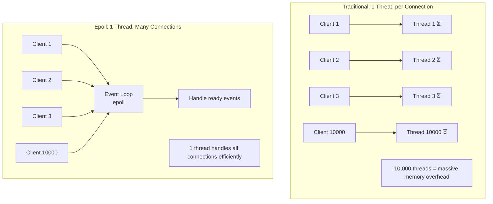

| Mechanism | Scalability | Used By |
|-----------|-------------|---------|
| **select** | O(n) scanning, max 1024 fds | Legacy systems |
| **poll** | O(n) scanning, no fd limit | Legacy systems |
| **epoll** (Linux) | O(1) event notification | Nginx, Node.js, Redis |
| **kqueue** (BSD/macOS) | O(1) event notification | FreeBSD, macOS servers |

**The C10K Problem**: In the early 2000s, handling 10,000 concurrent connections was hard because thread-per-connection models ran out of memory. Epoll solved this by allowing one thread to handle thousands of connections.

---

## 3.6 File Systems

### How Files Are Stored:

Files are broken into blocks (typically 4KB) and tracked by the filesystem:

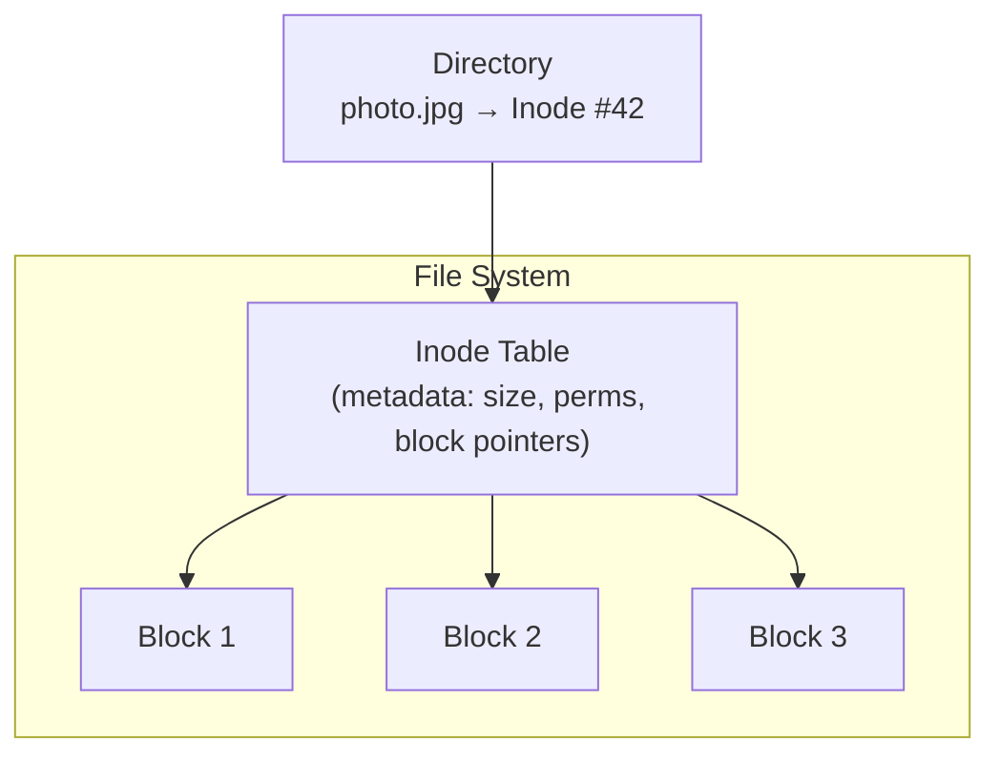

### Key Filesystem Concepts:

| Concept | Description | System Design Impact |
|---------|-------------|---------------------|
| **Inode** | Metadata about a file (permissions, size, block pointers) | File lookups require inode reads |
| **Block size** | Smallest unit of storage (4KB) | Small files waste space, large blocks reduce seeks |
| **File descriptor** | OS handle to an open file | Limited per process (default ~1024, increase for servers) |
| **Page cache** | OS caches disk pages in RAM | Repeated reads are fast (why `free` shows little "free" RAM) |
| **fsync** | Force write to disk (bypass cache) | Databases use this for durability guarantees |

### Write-Ahead Log (WAL):

A critical pattern used by databases:

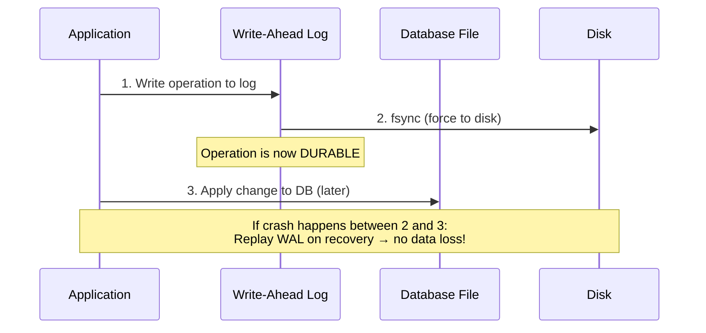

**Why WAL works**: Sequential writes (to log) are much faster than random writes (to database file). Databases write sequentially to WAL first, then lazily apply changes.

---

## 3.7 System Calls and the Kernel

Every program interacts with hardware through the OS kernel via **system calls**:

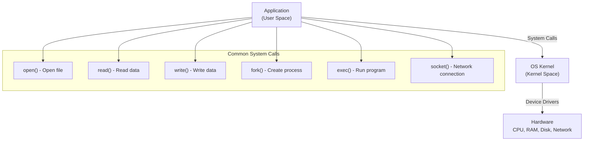

**Why this matters**: System calls are expensive (context switch from user space to kernel space, ~1-10μs). High-performance systems minimize syscalls by batching I/O operations.

---

## Key Takeaways

| Concept | System Design Impact |
|---------|---------------------|
| Process vs Thread | Choose isolation (processes) or efficiency (threads) |
| Concurrency models | Event loops handle more connections with less memory |
| Locks and synchronization | Distributed systems face the same problems at larger scale |
| Memory hierarchy | Caching and data placement optimization |
| I/O multiplexing (epoll) | How modern servers handle millions of connections |
| WAL pattern | How databases achieve durability with performance |
| File descriptors | Server configuration (ulimit) affects max connections |

---

## Practice Questions

1. **Concurrency**: A Java web server using thread-per-request model starts failing at 5,000 concurrent users. Explain why. What are three alternative approaches?

2. **Deadlock**: Two microservices each call the other and wait for a response. Is this a distributed deadlock? How would you prevent it?

3. **I/O**: Explain why Redis (in-memory, single-threaded, event loop) can handle 100K+ operations per second while a multi-threaded Java server might struggle with 10K.

4. **Memory**: A service caches 10GB of data in RAM. After GC runs, there's a 200ms latency spike. What's happening? How would you fix it?

5. **Design Decision**: You're choosing between Nginx (multi-process, event-driven) and Apache (thread-per-connection) for a service expecting 50,000 concurrent connections. Which do you choose and why?

---

*Previous: [← Networking Fundamentals](./ch02-networking-fundamentals.md) | Next: [Database Fundamentals →](./ch04-database-fundamentals.md)*
