# Chapter 4: Database Fundamentals

> *"Every system design interview comes down to: how do you store and retrieve data efficiently?"*

Databases are at the heart of every system. This chapter covers everything you need to know before diving into system design.

---

## 4.1 SQL vs NoSQL

The most fundamental database decision. Let's understand both deeply.

### Relational Databases (SQL)

Data organized in **tables** with **rows** and **columns**. Relationships between tables via foreign keys.

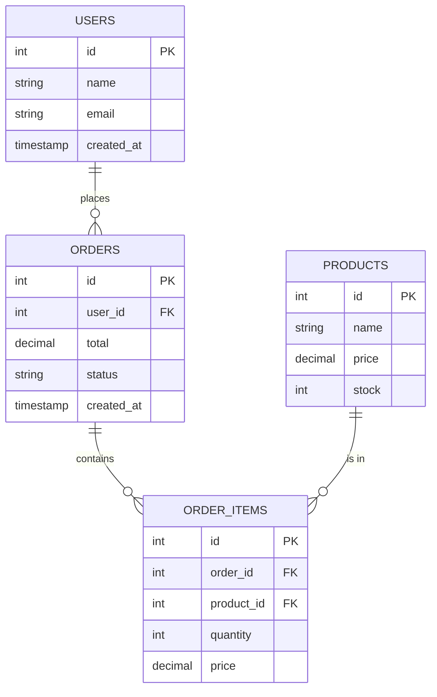

**Popular SQL databases**: PostgreSQL, MySQL, SQLite, Oracle, SQL Server

### NoSQL Databases

"Not Only SQL" — designed for specific access patterns:

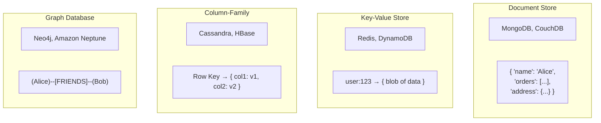

### SQL vs NoSQL Comparison:

| Feature | SQL | NoSQL |
|---------|-----|-------|
| **Schema** | Strict, predefined | Flexible, schema-less |
| **Relationships** | Joins, foreign keys | Denormalized, embedded |
| **Scaling** | Vertical (bigger machine) | Horizontal (more machines) |
| **Transactions** | Full ACID | Varies (eventual consistency common) |
| **Query Language** | SQL (standardized) | Custom per database |
| **Best For** | Complex queries, relationships | High write throughput, flexible schema |

### When to Use What:

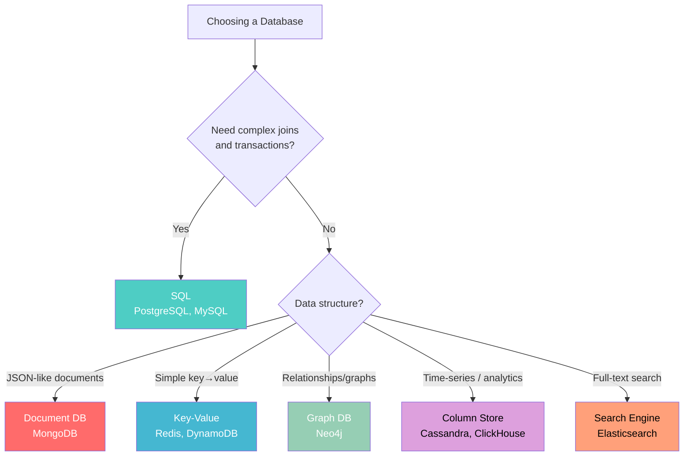

---

## 4.2 ACID Properties

ACID is what makes relational databases reliable. Every letter matters:

### Atomicity — All or Nothing

A transaction either completes entirely or has no effect.

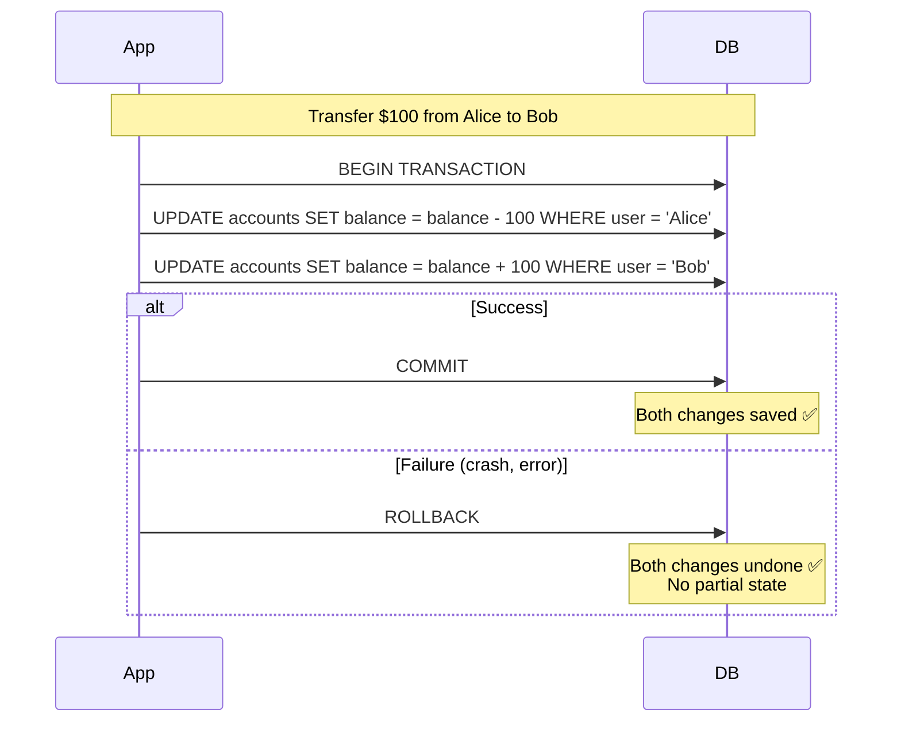

### Consistency — Valid State to Valid State

Database moves from one valid state to another. All rules (constraints, foreign keys) are enforced.

### Isolation — Transactions Don't Interfere

Concurrent transactions behave as if they ran sequentially.

**Isolation Levels** (from weakest to strongest):

| Level | Dirty Read | Non-repeatable Read | Phantom Read | Performance |
|-------|-----------|--------------------|--------------|-----------:|
| Read Uncommitted | ✅ Possible | ✅ Possible | ✅ Possible | Fastest |
| **Read Committed** | ❌ Prevented | ✅ Possible | ✅ Possible | Fast |
| **Repeatable Read** | ❌ Prevented | ❌ Prevented | ✅ Possible | Medium |
| **Serializable** | ❌ Prevented | ❌ Prevented | ❌ Prevented | Slowest |


**Dirty Read**: Reading uncommitted changes from another transaction.
**Non-repeatable Read**: Reading same row twice gives different results (another transaction modified it).
**Phantom Read**: Re-executing a query returns new rows (another transaction inserted rows).

### Durability — Committed = Permanent

Once committed, data survives crashes. Achieved through:
- Write-Ahead Log (WAL) — write log to disk before applying changes
- Checkpointing — periodically write all changes to disk

---

## 4.3 Indexes — Making Queries Fast

Without an index, the database scans every row (O(n)). With an index, it jumps to the right row (O(log n)).

### B-Tree Index (Default):

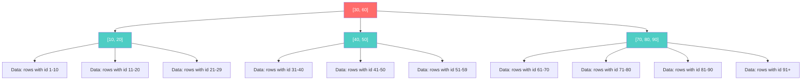

**Finding id = 45**:
1. Start at root: 45 > 30 and 45 < 60 → go middle
2. At [40, 50]: 45 > 40 and 45 < 50 → go middle
3. Read data page → found!

**Only 3 steps** instead of scanning all rows!

### Index Types:

| Index Type | Use Case | Example |
|-----------|----------|---------|
| **B-Tree** (default) | Equality & range queries | `WHERE age > 25` |
| **Hash** | Exact equality only | `WHERE email = 'alice@example.com'` |
| **Composite** | Multi-column queries | `WHERE country = 'US' AND city = 'SF'` |
| **Full-text** | Text search | `WHERE content LIKE '%system design%'` |
| **GIN/GiST** | JSON, arrays, spatial | `WHERE tags @> '["postgres"]'` |

### The Cost of Indexes:

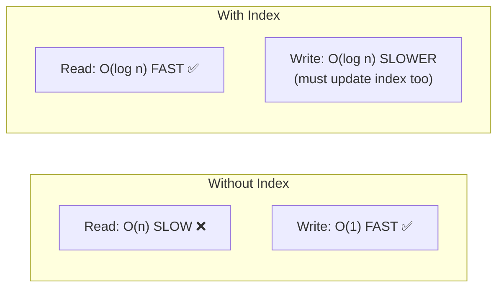

**Rule of thumb**: 
- Index columns used in WHERE, JOIN, ORDER BY
- Don't over-index (each index slows writes and uses storage)
- Composite index order matters: `(country, city)` helps `WHERE country = ?` but NOT `WHERE city = ?`

### Explain Query Plans:

```sql
-- Always check if your index is being used!
EXPLAIN ANALYZE SELECT * FROM users WHERE email = 'alice@example.com';

-- Good: "Index Scan using idx_users_email"
-- Bad: "Seq Scan on users" (full table scan!)
```

---

## 4.4 Normalization vs Denormalization

### Normalization — Eliminate Redundancy

Break data into related tables to avoid duplication:

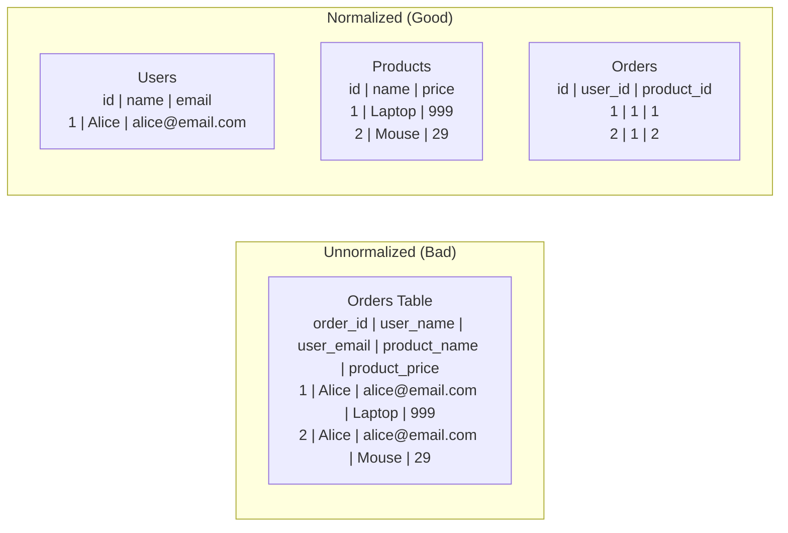

**Benefits**: No duplicate data, easier updates, less storage.
**Cost**: Need JOINs to reconstruct data → slower reads.

### Denormalization — Optimize for Reads

Intentionally duplicate data for faster reads:

```sql
-- Normalized: requires JOIN (slower)
SELECT u.name, o.total 
FROM orders o JOIN users u ON o.user_id = u.id;

-- Denormalized: no JOIN needed (faster)
SELECT user_name, total FROM orders;
-- (user_name is duplicated in orders table)
```

### When to Use Which:

| Approach | When | Example |
|----------|------|---------|
| **Normalize** | Write-heavy, data integrity critical | Banking, ERP |
| **Denormalize** | Read-heavy, speed critical | Social media feeds, analytics |
| **Hybrid** | Most real systems | Normalized DB + denormalized cache |

---

## 4.5 Transactions and Concurrency Control

### What is a Transaction?

A group of operations that execute as a single unit:

```sql
BEGIN TRANSACTION;
    UPDATE accounts SET balance = balance - 100 WHERE id = 1;  -- Debit Alice
    UPDATE accounts SET balance = balance + 100 WHERE id = 2;  -- Credit Bob
COMMIT;  -- Both succeed or both fail
```

### Concurrency Control Mechanisms:

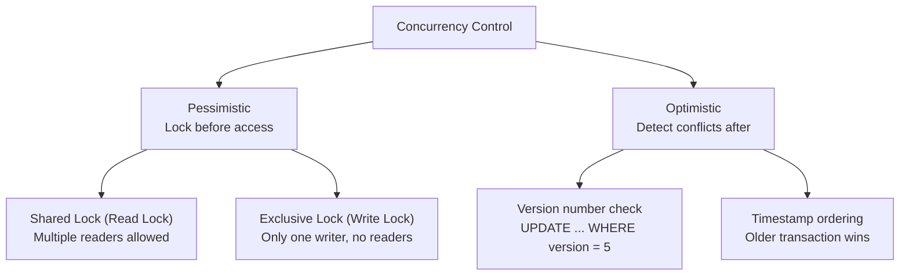

### Pessimistic Locking:

```sql
-- Thread 1: Lock the row before modifying
SELECT * FROM products WHERE id = 1 FOR UPDATE;  -- Acquires row lock
UPDATE products SET stock = stock - 1 WHERE id = 1;
COMMIT;  -- Releases lock

-- Thread 2 waits until Thread 1 commits
```

### Optimistic Locking:

```sql
-- Thread 1: Read current version
SELECT stock, version FROM products WHERE id = 1;
-- stock = 10, version = 5

-- Thread 1: Update only if version hasn't changed
UPDATE products 
SET stock = 9, version = 6 
WHERE id = 1 AND version = 5;
-- If 0 rows affected → someone else modified it → retry!
```

**When to use**:
- **Pessimistic**: High contention (many writers to same row) — banking
- **Optimistic**: Low contention (conflicts are rare) — e-commerce product pages

---

## 4.6 Types of NoSQL Databases (Deep Dive)

### Key-Value Stores

**What**: Simple key → value mapping. Think of it as a giant hash map.

| Database | Persistence | Best For |
|----------|------------|---------|
| **Redis** | In-memory (optional persistence) | Cache, sessions, leaderboards |
| **Memcached** | In-memory only | Simple caching |
| **DynamoDB** | Persistent, fully managed | Serverless, auto-scaling |

```python
# Redis example
import redis
r = redis.Redis()

r.set("user:123", '{"name": "Alice", "email": "alice@example.com"}')
r.get("user:123")  # Returns the JSON string
r.expire("user:123", 3600)  # TTL: 1 hour
```

### Document Stores

**What**: Store JSON-like documents. Each document can have different fields.

```json
// MongoDB document - no fixed schema!
{
  "_id": "user_123",
  "name": "Alice",
  "email": "alice@example.com",
  "addresses": [
    {"street": "123 Main St", "city": "SF", "state": "CA"},
    {"street": "456 Oak Ave", "city": "NYC", "state": "NY"}
  ],
  "preferences": {
    "theme": "dark",
    "notifications": true
  }
}
```

### Column-Family Stores

**What**: Data organized by columns rather than rows. Excellent for analytics.

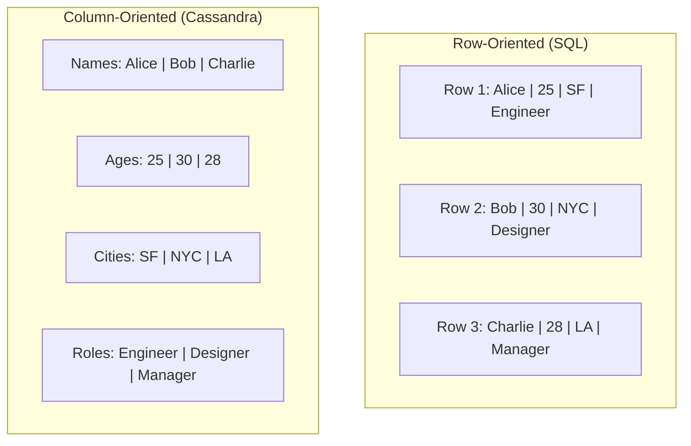

**Why column-oriented is better for analytics**:
- Query `SELECT AVG(age) FROM users` only reads the age column
- Row-oriented must read ALL columns of ALL rows (wasted I/O)
- Column data compresses better (similar values together)

### Graph Databases

**What**: Data modeled as nodes and edges. Perfect for relationship-heavy data.

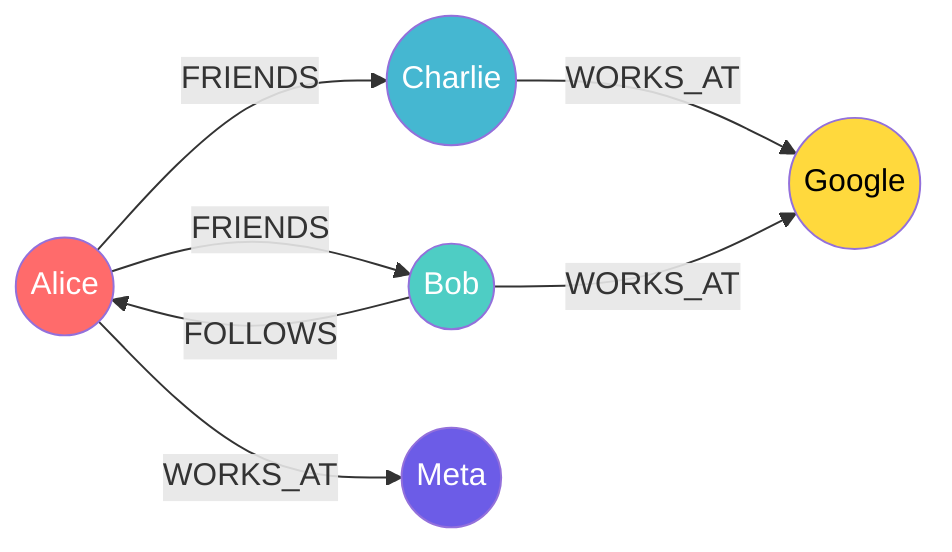

**Use cases**: Social networks, recommendation engines, fraud detection, knowledge graphs

---

## 4.7 Database Internals — How Storage Works

### B-Tree vs LSM-Tree

The two fundamental storage engine approaches:

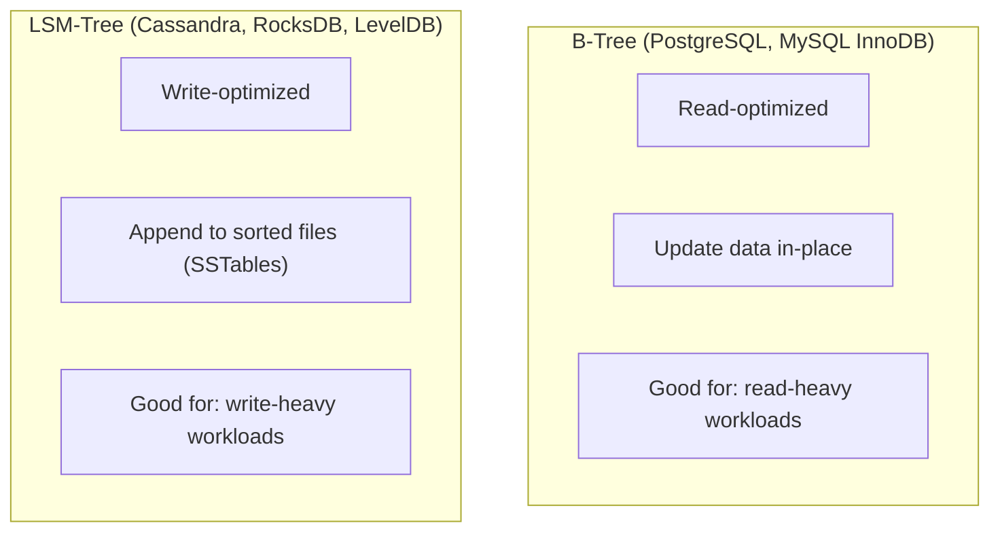

### LSM-Tree Write Path:

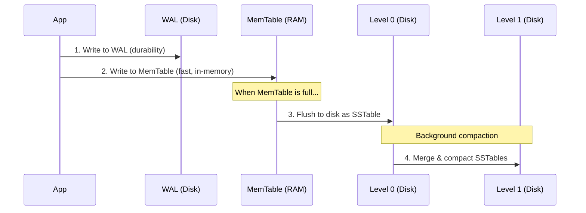

**Key tradeoff**:
- **B-Tree**: Fast reads (data in-place), slower writes (random I/O)
- **LSM-Tree**: Fast writes (sequential I/O), slower reads (may check multiple levels), write amplification

---

## 4.8 SQL Query Fundamentals

### JOINs Visualized:

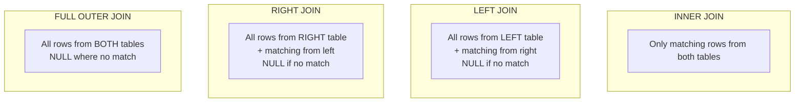

### Common SQL Patterns for System Design:

```sql
-- Pagination (offset-based)
SELECT * FROM posts ORDER BY created_at DESC LIMIT 20 OFFSET 40;
-- Problem: OFFSET 1000000 is SLOW (scans and discards rows)

-- Pagination (cursor-based — MUCH better)
SELECT * FROM posts 
WHERE created_at < '2024-01-15T10:30:00' 
ORDER BY created_at DESC 
LIMIT 20;

-- Aggregation
SELECT country, COUNT(*) as user_count 
FROM users 
GROUP BY country 
HAVING COUNT(*) > 1000
ORDER BY user_count DESC;

-- Subquery
SELECT * FROM users 
WHERE id IN (SELECT user_id FROM orders WHERE total > 100);

-- Window function (advanced)
SELECT name, salary, 
       RANK() OVER (PARTITION BY department ORDER BY salary DESC) as dept_rank
FROM employees;
```

---

## Key Takeaways

| Concept | System Design Impact |
|---------|---------------------|
| SQL vs NoSQL | Choose based on data relationships and access patterns |
| ACID | Required for financial, inventory — may sacrifice for performance |
| Indexes | Difference between 10ms and 10s queries |
| Normalization/Denormalization | Tradeoff between write and read performance |
| Locking strategies | Affect concurrent user handling |
| Storage engines | B-Tree for reads, LSM-Tree for writes |
| Cursor pagination | Required for infinite scroll at scale |

---

## Practice Questions

1. **Design**: You're building a social media feed. Would you normalize (users table + posts table + follows table) or denormalize (pre-computed feed per user)? What are the tradeoffs?

2. **Index**: A table has 100 million rows. The query `SELECT * FROM orders WHERE user_id = 123 AND status = 'pending' ORDER BY created_at DESC` is slow. What index would you create?

3. **NoSQL Choice**: For each use case, pick the best database type and explain:
   - User session storage
   - Product catalog with varying attributes
   - Social graph (friends of friends)
   - Real-time analytics on billions of events

4. **Transactions**: Two users simultaneously try to buy the last item in stock. How do you prevent overselling? Compare pessimistic vs optimistic approaches.

5. **Storage Engine**: You're building a logging system that writes 100,000 log entries per second and rarely reads them. Would you choose a B-Tree or LSM-Tree based storage engine? Why?

---

*Previous: [← Operating System Basics](./ch03-operating-system-basics.md) | Next: [OOP Principles →](../part2-lld/ch05-oop-principles.md)*
