# Chapter 5: Object-Oriented Programming Principles

> *"OOP is the language of Low-Level Design. Master it, and LLD interviews become conversations, not interrogations."*

Low-Level Design (LLD) is about designing the internal structure of a single system — classes, interfaces, relationships. OOP is the foundation.

---

## 5.1 The Four Pillars of OOP

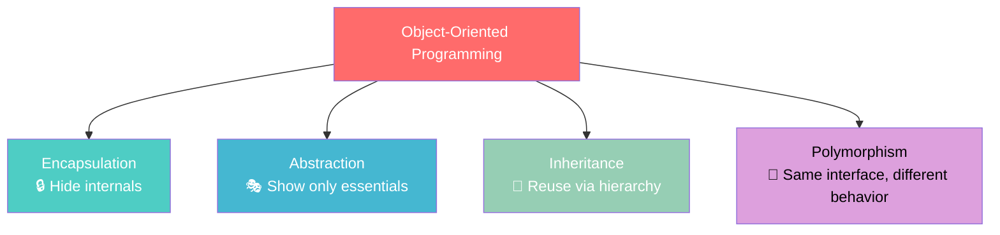

---

### Pillar 1: Encapsulation — Hide the Internals

Bundle data and the methods that operate on it together, and restrict direct access to internals.

**Real-world analogy**: A car's steering wheel. You turn it left/right (public interface) without needing to know the power steering mechanism (internal details).

```python
# BAD: No encapsulation — anyone can mess with internals
class BankAccount:
    def __init__(self):
        self.balance = 0  # Public! Anyone can set account.balance = -1000000

# GOOD: Encapsulated
class BankAccount:
    def __init__(self):
        self.__balance = 0  # Private
    
    def deposit(self, amount):
        if amount <= 0:
            raise ValueError("Deposit must be positive")
        self.__balance += amount
    
    def withdraw(self, amount):
        if amount > self.__balance:
            raise ValueError("Insufficient funds")
        self.__balance -= amount
    
    def get_balance(self):
        return self.__balance
```

```java
// Java equivalent
public class BankAccount {
    private double balance;  // Private field
    
    public void deposit(double amount) {
        if (amount <= 0) throw new IllegalArgumentException("Deposit must be positive");
        this.balance += amount;
    }
    
    public void withdraw(double amount) {
        if (amount > this.balance) throw new IllegalArgumentException("Insufficient funds");
        this.balance -= amount;
    }
    
    public double getBalance() {
        return this.balance;
    }
}
```

**Why it matters**: Encapsulation lets you change internal implementation without breaking external code. If you later add logging, validation, or a different storage mechanism, callers don't need to change.

---

### Pillar 2: Abstraction — Show Only What's Needed

Hide complex implementation details and expose only the relevant interface.

**Real-world analogy**: A TV remote. You press "Volume Up" without knowing about signal processing, amplifiers, or speaker circuits.

```python
from abc import ABC, abstractmethod

# Abstract interface — what the caller sees
class PaymentProcessor(ABC):
    @abstractmethod
    def charge(self, amount: float, currency: str) -> bool:
        pass
    
    @abstractmethod
    def refund(self, transaction_id: str) -> bool:
        pass

# Concrete implementation — hidden complexity
class StripeProcessor(PaymentProcessor):
    def charge(self, amount, currency):
        # Internally: validate card, check fraud, call Stripe API,
        # handle retries, log transaction, update DB...
        # Caller just sees: charge(100, "USD") → True/False
        return self._call_stripe_api("charge", amount, currency)
    
    def refund(self, transaction_id):
        return self._call_stripe_api("refund", transaction_id)
    
    def _call_stripe_api(self, action, *args):
        # Complex internal logic hidden from caller
        pass
```

**Abstraction vs Encapsulation**:
- **Encapsulation** = hiding DATA (private fields)
- **Abstraction** = hiding COMPLEXITY (abstract interfaces)

---

### Pillar 3: Inheritance — Reuse via Hierarchy

A class can inherit properties and methods from a parent class.

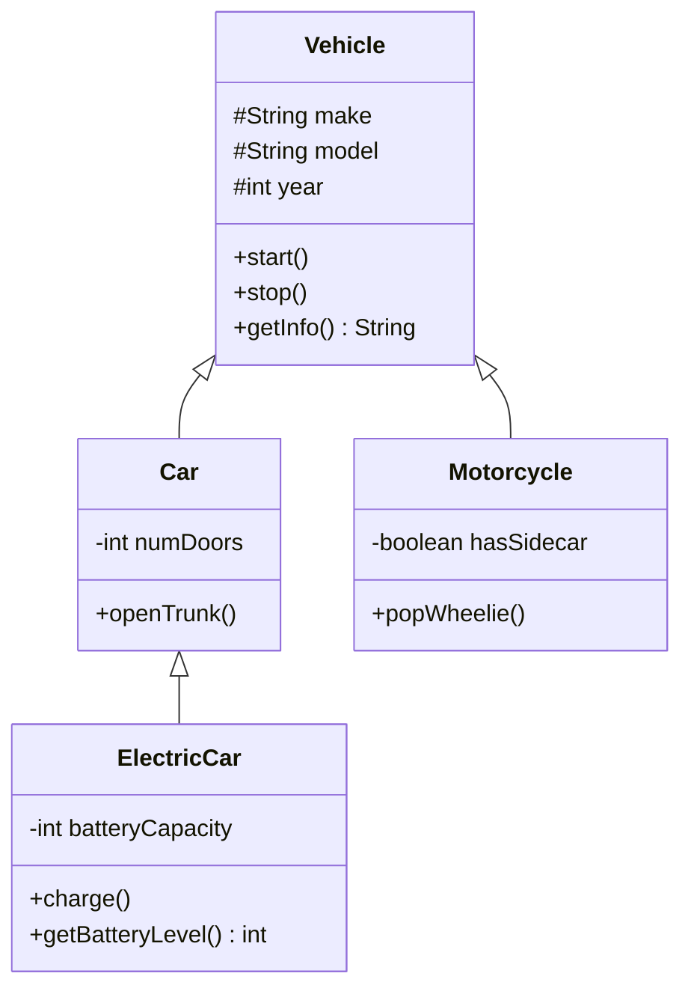

```python
class Vehicle:
    def __init__(self, make, model, year):
        self.make = make
        self.model = model
        self.year = year
    
    def start(self):
        print(f"{self.make} {self.model} started")
    
    def stop(self):
        print(f"{self.make} {self.model} stopped")

class Car(Vehicle):
    def __init__(self, make, model, year, num_doors):
        super().__init__(make, model, year)
        self.num_doors = num_doors
    
    def open_trunk(self):
        print("Trunk opened")

class ElectricCar(Car):
    def __init__(self, make, model, year, num_doors, battery_capacity):
        super().__init__(make, model, year, num_doors)
        self.battery_capacity = battery_capacity
        self.battery_level = 100
    
    def charge(self):
        self.battery_level = 100
        print("Fully charged!")

# Usage
tesla = ElectricCar("Tesla", "Model 3", 2024, 4, 75)
tesla.start()        # Inherited from Vehicle
tesla.open_trunk()   # Inherited from Car
tesla.charge()       # Own method
```

### ⚠️ The Inheritance Trap

Inheritance creates **tight coupling**. Overuse leads to fragile hierarchies:

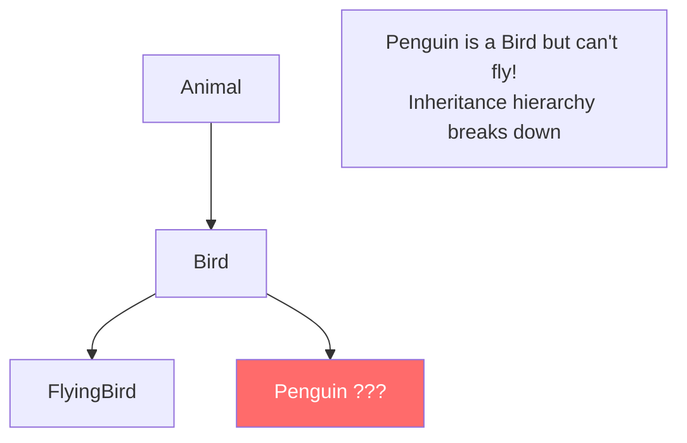

**Rule**: Prefer **composition over inheritance** (see Section 5.3).

---

### Pillar 4: Polymorphism — Same Interface, Different Behavior

The same method call behaves differently based on the object's actual type.

```python
class Shape:
    def area(self):
        raise NotImplementedError

class Circle(Shape):
    def __init__(self, radius):
        self.radius = radius
    
    def area(self):
        return 3.14159 * self.radius ** 2

class Rectangle(Shape):
    def __init__(self, width, height):
        self.width = width
        self.height = height
    
    def area(self):
        return self.width * self.height

class Triangle(Shape):
    def __init__(self, base, height):
        self.base = base
        self.height = height
    
    def area(self):
        return 0.5 * self.base * self.height

# Polymorphism in action — same method, different behavior
def print_areas(shapes: list):
    for shape in shapes:
        print(f"Area: {shape.area()}")  # Calls the RIGHT area() method

shapes = [Circle(5), Rectangle(4, 6), Triangle(3, 8)]
print_areas(shapes)
# Area: 78.54
# Area: 24
# Area: 12.0
```

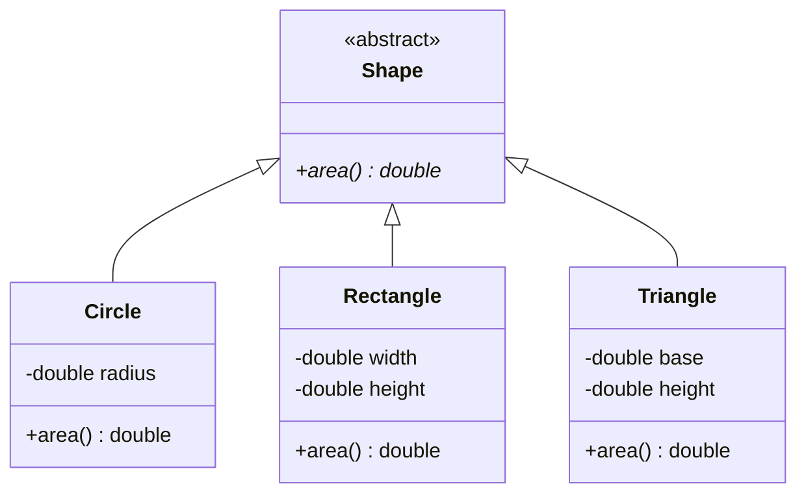

**Why polymorphism matters**: You can write code that works with the abstract type (Shape) without knowing the concrete type. Adding a new shape (Pentagon) requires NO changes to existing code.

### How Polymorphic Dispatch Works:

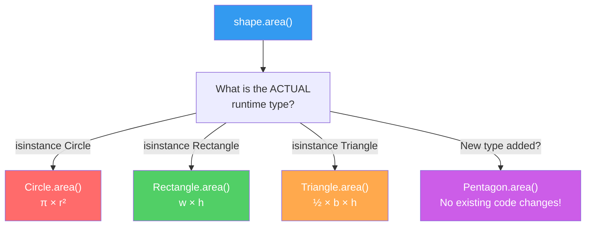

> The caller doesn't know (or care) which concrete type it's calling. The runtime dispatches to the correct method. This is the **Open/Closed Principle** in action (Chapter 6).

---

## 5.2 UML Class Diagrams — The Language of LLD

UML (Unified Modeling Language) class diagrams are how you communicate designs in interviews.

### Relationship Types:

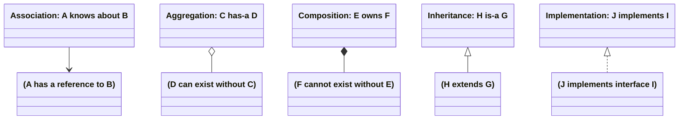

### Relationship Cheat Sheet:

| Relationship | Symbol | Example | Meaning |
|-------------|--------|---------|---------|
| **Association** | → | Student → Course | "uses" or "knows about" |
| **Aggregation** | ◇→ | Team ◇→ Player | "has-a" (part can exist independently) |
| **Composition** | ◆→ | House ◆→ Room | "owns" (part dies with whole) |
| **Inheritance** | ▷ | Dog ▷ Animal | "is-a" |
| **Implementation** | ▷.. | ArrayList ▷.. List | "implements" |
| **Dependency** | --> | OrderService --> EmailService | "uses temporarily" |

### Full Example — E-Commerce:

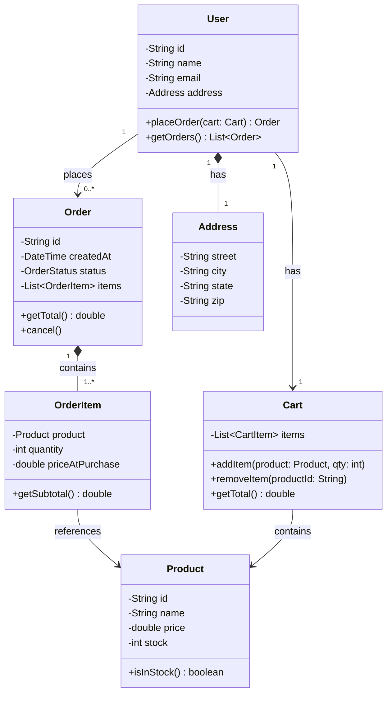

---

## 5.3 Composition vs Inheritance

This is one of the most important design decisions in OOP.

### The Problem with Inheritance:

```python
# Inheritance approach - rigid and problematic
class Animal:
    def eat(self): print("Eating")

class FlyingAnimal(Animal):
    def fly(self): print("Flying")

class SwimmingAnimal(Animal):
    def swim(self): print("Swimming")

# Duck can fly AND swim - which do we inherit from?
# Python allows multiple inheritance, but it's messy
# Java doesn't allow it at all!
class Duck(FlyingAnimal, SwimmingAnimal):  # Diamond problem!
    pass
```

### The Composition Solution:

```python
# Composition approach - flexible and clean
class FlyBehavior:
    def fly(self): print("Flying")

class SwimBehavior:
    def swim(self): print("Swimming")

class WalkBehavior:
    def walk(self): print("Walking")

class Duck:
    def __init__(self):
        self.fly_behavior = FlyBehavior()
        self.swim_behavior = SwimBehavior()
        self.walk_behavior = WalkBehavior()

class Penguin:
    def __init__(self):
        self.swim_behavior = SwimBehavior()
        self.walk_behavior = WalkBehavior()
        # No fly behavior!
```

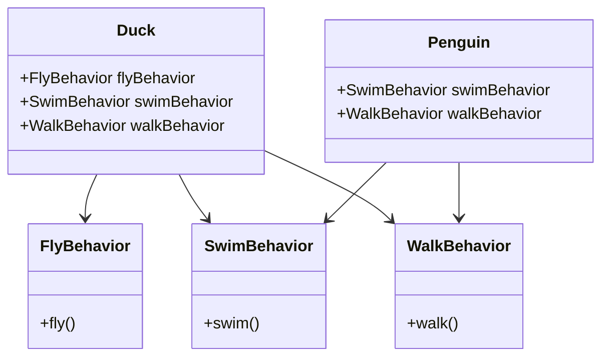

### When to Use Which:

| Use Inheritance When | Use Composition When |
|---------------------|---------------------|
| Clear "is-a" relationship | "has-a" relationship |
| Shared behavior across all subtypes | Mix-and-match capabilities |
| Hierarchy is stable and won't change | Requirements likely to change |
| Few levels (max 2-3) | Need runtime flexibility |

**Golden rule**: *"Favor composition over inheritance"* — Gang of Four

---

## 5.4 Interfaces and Abstract Classes

### Interface — A Contract

Defines WHAT a class must do, not HOW:

```java
// Java interface
public interface Sortable {
    int compareTo(Object other);
}

public interface Searchable {
    boolean matches(String query);
}

// A class can implement multiple interfaces
public class Product implements Sortable, Searchable {
    private String name;
    private double price;
    
    @Override
    public int compareTo(Object other) {
        return Double.compare(this.price, ((Product) other).price);
    }
    
    @Override
    public boolean matches(String query) {
        return this.name.toLowerCase().contains(query.toLowerCase());
    }
}
```

```python
# Python equivalent using ABC
from abc import ABC, abstractmethod

class Sortable(ABC):
    @abstractmethod
    def compare_to(self, other) -> int:
        pass

class Searchable(ABC):
    @abstractmethod
    def matches(self, query: str) -> bool:
        pass

class Product(Sortable, Searchable):
    def __init__(self, name: str, price: float):
        self.name = name
        self.price = price
    
    def compare_to(self, other) -> int:
        return (self.price > other.price) - (self.price < other.price)
    
    def matches(self, query: str) -> bool:
        return query.lower() in self.name.lower()
```

### Abstract Class — Partial Implementation

Can provide some implementation while leaving some methods abstract:

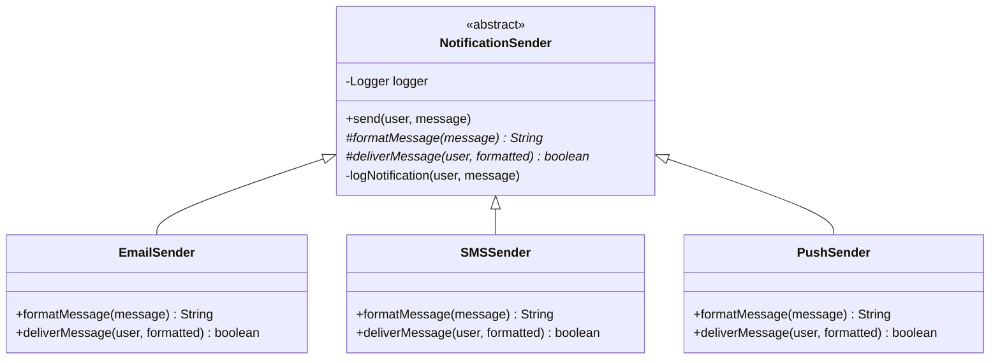

### Interface vs Abstract Class:

| Feature | Interface | Abstract Class |
|---------|-----------|---------------|
| Methods | All abstract (Java 8+: can have default) | Mix of abstract and concrete |
| Fields | Constants only | Any fields |
| Multiple | Can implement many | Can extend only one |
| Constructor | No | Yes |
| Use when | Defining a contract/capability | Sharing common code |

### Decision Flowchart: Interface vs Abstract Class

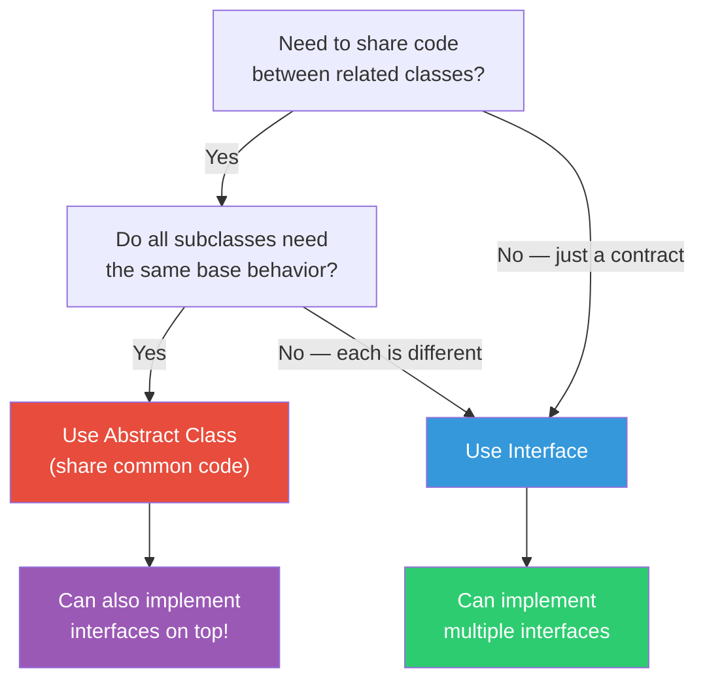

---

## 5.5 Enums and Value Objects

### Enums — Fixed Set of Values:

```python
from enum import Enum

class OrderStatus(Enum):
    PENDING = "pending"
    CONFIRMED = "confirmed"
    SHIPPED = "shipped"
    DELIVERED = "delivered"
    CANCELLED = "cancelled"

class PaymentMethod(Enum):
    CREDIT_CARD = "credit_card"
    DEBIT_CARD = "debit_card"
    UPI = "upi"
    NET_BANKING = "net_banking"
```

```java
public enum OrderStatus {
    PENDING, CONFIRMED, SHIPPED, DELIVERED, CANCELLED;
    
    public boolean canCancel() {
        return this == PENDING || this == CONFIRMED;
    }
}
```

### State Machines with Enums:

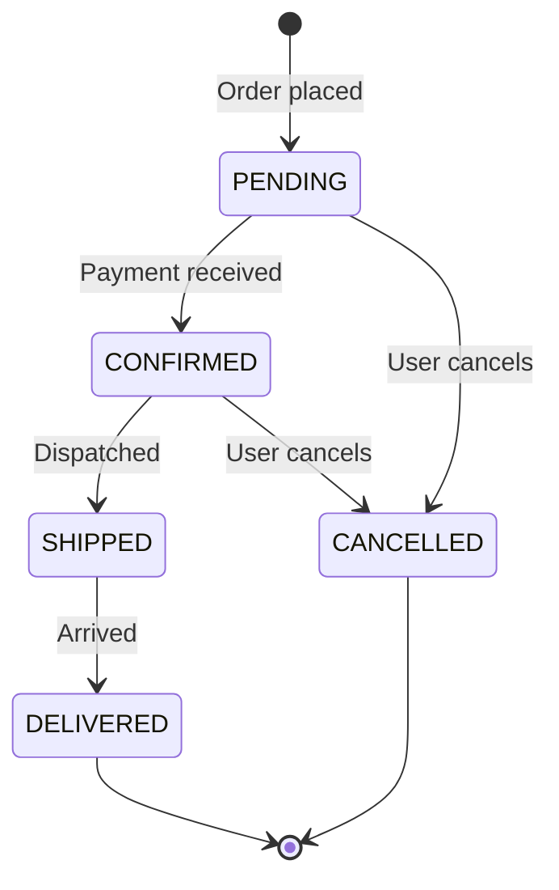

---

## Key Takeaways

| Concept | Interview Importance | Key Point |
|---------|---------------------|-----------|
| 4 Pillars of OOP | ⭐⭐⭐⭐⭐ | Know definitions AND real examples |
| UML Class Diagrams | ⭐⭐⭐⭐⭐ | Draw these in EVERY LLD interview |
| Composition > Inheritance | ⭐⭐⭐⭐⭐ | Default to composition unless clear is-a |
| Interface vs Abstract | ⭐⭐⭐⭐ | Interface = contract, Abstract = partial impl |
| Encapsulation | ⭐⭐⭐⭐ | Always make fields private |
| State machines | ⭐⭐⭐ | Model status transitions explicitly |

---

## Practice Questions

1. **Design**: Model a library system with classes for Book, Member, Librarian, and Loan. Draw the UML class diagram showing all relationships.

2. **Composition vs Inheritance**: A notification system needs to support Email, SMS, and Push notifications. Some notifications need to be sent immediately, some batched. Design using composition.

3. **Polymorphism**: Design a payment system that supports CreditCard, PayPal, UPI, and BankTransfer. How would you use polymorphism so the checkout code doesn't need to know which payment method is being used?

4. **Encapsulation**: Why is `public List<Item> getItems()` dangerous even though it's a getter? What's the fix?

5. **Abstract Class**: Design an abstract `DatabaseConnector` class that handles connection pooling (shared logic) but leaves `executeQuery()` and `connect()` to subclasses (MySQL, PostgreSQL, MongoDB).

---

*Previous: [← Database Fundamentals](../part1-foundations/ch04-database-fundamentals.md) | Next: [SOLID Principles →](./ch06-solid-principles.md)*
