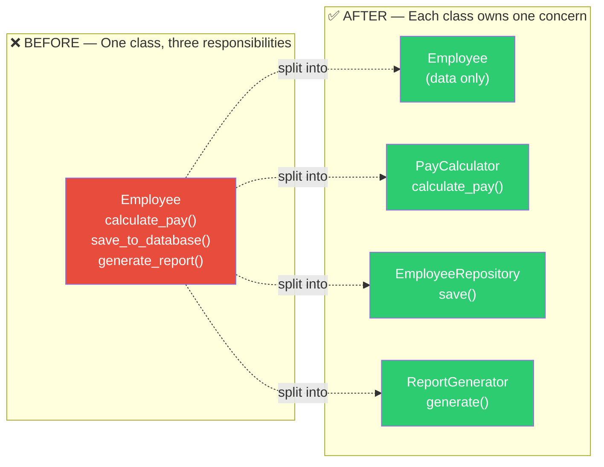
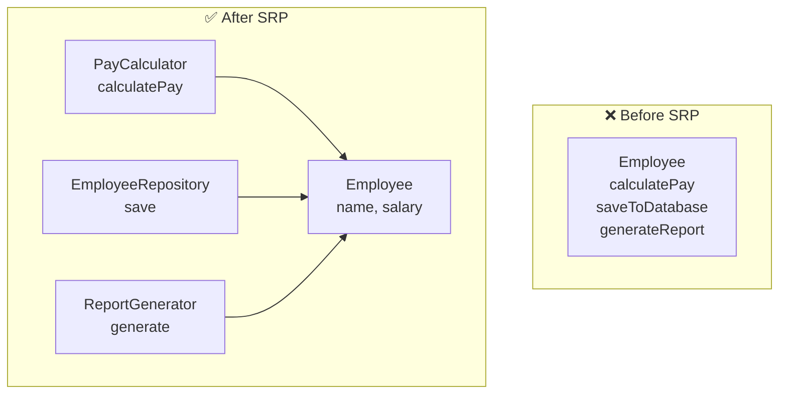
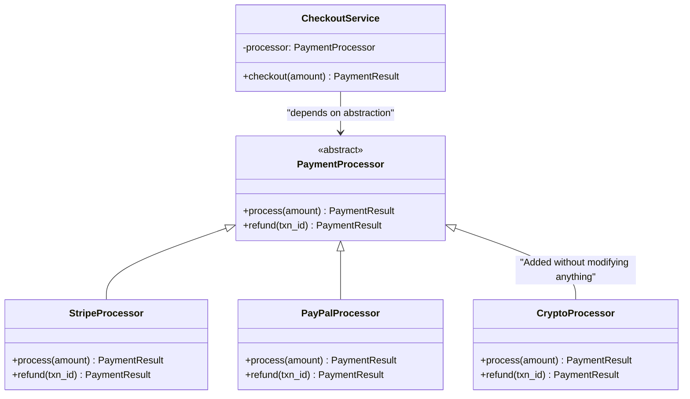
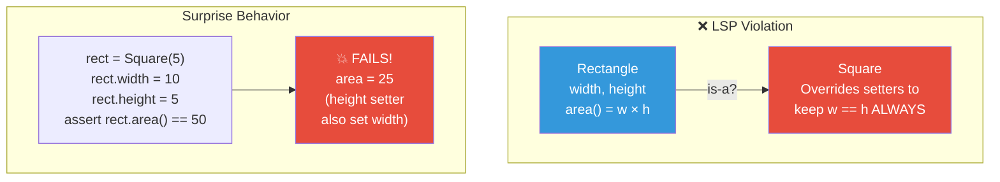
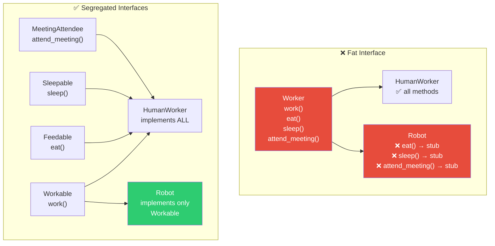
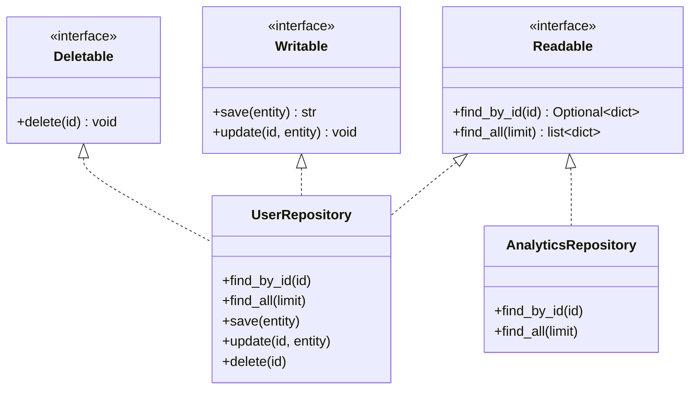
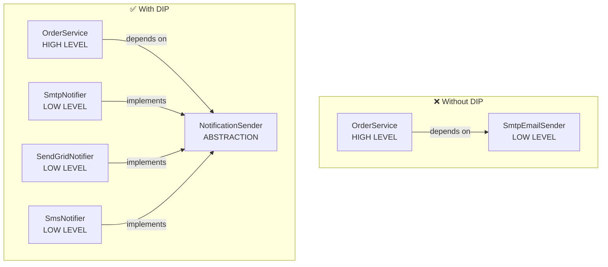
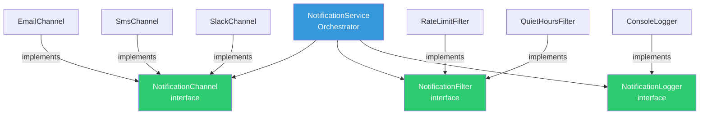

# Chapter 6: SOLID Principles

> "Any fool can write code that a computer can understand. Good programmers write code that humans can understand." — Martin Fowler

SOLID is a mnemonic for five design principles introduced by Robert C. Martin (Uncle Bob) that make software more **understandable**, **flexible**, and **maintainable**. These aren't abstract theory — they're the difference between code that evolves gracefully and code that rots with every change.

---

## 6.1 Why SOLID Matters

Bad code works too — until you need to change it. SOLID addresses the three enemies of maintainable code:

| Symptom | Description | SOLID Cure |
|---------|-------------|------------|
| **Rigidity** | One change breaks ten files | SRP, OCP |
| **Fragility** | Fixing bug A creates bug B | LSP, ISP |
| **Immobility** | Can't reuse anything | DIP, ISP |


---

## 6.2 Single Responsibility Principle (SRP)

> **A class should have one, and only one, reason to change.**

"Reason to change" means **one stakeholder** whose requirements could cause the class to be modified. If your `User` class handles authentication, email sending, and database persistence — three different teams could need changes to the same file.

### The Violation

```python
# BAD: This class has three reasons to change
class Employee:
    def __init__(self, name: str, salary: float):
        self.name = name
        self.salary = salary

    def calculate_pay(self) -> float:
        """Finance team owns this logic"""
        if self.salary > 100_000:
            return self.salary * 0.7  # tax bracket
        return self.salary * 0.8

    def save_to_database(self):
        """DBA team owns this logic"""
        db = DatabaseConnection.get_instance()
        db.execute(f"INSERT INTO employees VALUES ('{self.name}', {self.salary})")

    def generate_report(self) -> str:
        """HR team owns this logic"""
        return f"Employee Report\n==============\nName: {self.name}\nSalary: ${self.salary:,.2f}"
```

### The Fix

```python
# GOOD: Each class has exactly one reason to change
class Employee:
    """Data holder — changes only if employee structure changes"""
    def __init__(self, name: str, salary: float):
        self.name = name
        self.salary = salary
```



```java
// Java equivalent
public record Employee(String name, double salary) {}

public class PayCalculator {
    public double calculatePay(Employee employee) {
        return employee.salary() > 100_000
            ? employee.salary() * 0.7
            : employee.salary() * 0.8;
    }
}

public class EmployeeRepository {
    private final DataSource dataSource;

    public EmployeeRepository(DataSource dataSource) {
        this.dataSource = dataSource;
    }

    public void save(Employee employee) throws SQLException {
        try (var conn = dataSource.getConnection();
             var stmt = conn.prepareStatement(
                 "INSERT INTO employees (name, salary) VALUES (?, ?)")) {
            stmt.setString(1, employee.name());
            stmt.setDouble(2, employee.salary());
            stmt.executeUpdate();
        }
    }
}
```

### SRP Heuristic

Ask: **"What would make this class change?"** If you list more than one stakeholder or business reason, split it.



---

## 6.3 Open/Closed Principle (OCP)

> **Software entities should be open for extension, but closed for modification.**

You should be able to add new behavior **without changing existing code**. This is achieved through **abstraction** — programming to interfaces, not implementations.

### The Violation

```python
# BAD: Adding a new shape requires modifying this function
class AreaCalculator:
    def calculate(self, shape) -> float:
        if shape.type == "circle":
            return 3.14159 * shape.radius ** 2
        elif shape.type == "rectangle":
            return shape.width * shape.height
        elif shape.type == "triangle":  # Had to modify existing code!
            return 0.5 * shape.base * shape.height
        # Every new shape = modify this method
```

### The Fix

```python
from abc import ABC, abstractmethod
import math

# GOOD: New shapes extend, never modify existing code
class Shape(ABC):
    @abstractmethod
    def area(self) -> float:
        ...

class Circle(Shape):
    def __init__(self, radius: float):
        self.radius = radius

    def area(self) -> float:
        return math.pi * self.radius ** 2

class Rectangle(Shape):
    def __init__(self, width: float, height: float):
        self.width = width
        self.height = height

    def area(self) -> float:
        return self.width * self.height

# Adding Triangle requires ZERO changes to existing code
class Triangle(Shape):
    def __init__(self, base: float, height: float):
        self.base = base
        self.height = height

    def area(self) -> float:
        return 0.5 * self.base * self.height


class AreaCalculator:
    """This class NEVER needs to change"""
    def total_area(self, shapes: list[Shape]) -> float:
        return sum(shape.area() for shape in shapes)
```

```java
// Java equivalent
public sealed interface Shape permits Circle, Rectangle, Triangle {
    double area();
}

public record Circle(double radius) implements Shape {
    public double area() { return Math.PI * radius * radius; }
}

public record Rectangle(double width, double height) implements Shape {
    public double area() { return width * height; }
}

public record Triangle(double base, double height) implements Shape {
    public double area() { return 0.5 * base * height; }
}

public class AreaCalculator {
    public double totalArea(List<Shape> shapes) {
        return shapes.stream().mapToDouble(Shape::area).sum();
    }
}
```

### Real-World OCP: Payment Processing

```python
from abc import ABC, abstractmethod
from dataclasses import dataclass
from decimal import Decimal

@dataclass
class PaymentResult:
    success: bool
    transaction_id: str
    message: str

class PaymentProcessor(ABC):
    @abstractmethod
    def process(self, amount: Decimal) -> PaymentResult:
        ...

    @abstractmethod
    def refund(self, transaction_id: str) -> PaymentResult:
        ...

class StripeProcessor(PaymentProcessor):
    def process(self, amount: Decimal) -> PaymentResult:
        # Stripe API call
        return PaymentResult(True, "stripe_txn_123", "Payment processed")

    def refund(self, transaction_id: str) -> PaymentResult:
        return PaymentResult(True, transaction_id, "Refund processed")

class PayPalProcessor(PaymentProcessor):
    def process(self, amount: Decimal) -> PaymentResult:
        # PayPal API call
        return PaymentResult(True, "pp_txn_456", "Payment processed")

    def refund(self, transaction_id: str) -> PaymentResult:
        return PaymentResult(True, transaction_id, "Refund processed")

# Adding CryptoProcessor? Just create a new class. Zero existing code changes.

class CheckoutService:
    """Closed for modification — works with ANY PaymentProcessor"""
    def __init__(self, processor: PaymentProcessor):
        self._processor = processor

    def checkout(self, amount: Decimal) -> PaymentResult:
        if amount <= 0:
            return PaymentResult(False, "", "Invalid amount")
        return self._processor.process(amount)
```



---

## 6.4 Liskov Substitution Principle (LSP)

> **Subtypes must be substitutable for their base types without altering program correctness.**

If `S` is a subtype of `T`, then objects of type `T` can be replaced with objects of type `S` without breaking the program. This is about **behavioral compatibility**, not just interface matching.

### The Classic Violation: Square/Rectangle



```python
# BAD: Square violates LSP
class Rectangle:
    def __init__(self, width: float, height: float):
        self._width = width
        self._height = height

    @property
    def width(self) -> float:
        return self._width

    @width.setter
    def width(self, value: float):
        self._width = value

    @property
    def height(self) -> float:
        return self._height

    @height.setter
    def height(self, value: float):
        self._height = value

    def area(self) -> float:
        return self._width * self._height


class Square(Rectangle):
    """Seems logical: a square IS-A rectangle, right?"""
    def __init__(self, side: float):
        super().__init__(side, side)

    @Rectangle.width.setter
    def width(self, value: float):
        self._width = value
        self._height = value  # Surprise! Setting width also changes height

    @Rectangle.height.setter
    def height(self, value: float):
        self._width = value
        self._height = value


# This function expects Rectangle behavior
def stretch_width(rect: Rectangle):
    rect.width = rect.width * 2
    # For a Rectangle: area should double
    # For a Square: area QUADRUPLES — LSP violation!
    return rect.area()

r = Rectangle(5, 10)
print(stretch_width(r))  # 100 ✓ (10 * 10)

s = Square(5)
print(stretch_width(s))  # 100 ✗ Expected 50, got 100!
```

### The Fix

```python
from abc import ABC, abstractmethod

# GOOD: Model the actual behavior, not the taxonomy
class Shape(ABC):
    @abstractmethod
    def area(self) -> float:
        ...

class Rectangle(Shape):
    def __init__(self, width: float, height: float):
        self.width = width
        self.height = height

    def area(self) -> float:
        return self.width * self.height

class Square(Shape):
    """Square is NOT a Rectangle — it has different behavior"""
    def __init__(self, side: float):
        self.side = side

    def area(self) -> float:
        return self.side ** 2
```

### LSP Rules Checklist

A subtype must honor ALL of these:

| Rule | Meaning |
|------|---------|
| **Preconditions** | Cannot be strengthened (accept at least what parent accepts) |
| **Postconditions** | Cannot be weakened (guarantee at least what parent guarantees) |
| **Invariants** | Must be preserved |
| **History constraint** | Cannot introduce state changes parent doesn't allow |

### Real-World Violation: Read-Only Collections

```python
# BAD: ImmutableList "is-a" List but throws on mutation
class ImmutableList(list):
    def append(self, item):
        raise TypeError("Cannot modify immutable list")  # Strengthened precondition!

    def __setitem__(self, index, value):
        raise TypeError("Cannot modify immutable list")

# Code expecting a list will break:
def add_default(items: list):
    items.append("default")  # 💥 TypeError with ImmutableList
```

```python
# GOOD: Separate read and write interfaces
from abc import ABC, abstractmethod
from typing import Iterator

class ReadableCollection(ABC):
    @abstractmethod
    def __getitem__(self, index: int):
        ...

    @abstractmethod
    def __len__(self) -> int:
        ...

    @abstractmethod
    def __iter__(self) -> Iterator:
        ...

class MutableCollection(ReadableCollection):
    @abstractmethod
    def append(self, item) -> None:
        ...

    @abstractmethod
    def __setitem__(self, index: int, value) -> None:
        ...
```

---

## 6.5 Interface Segregation Principle (ISP)

> **No client should be forced to depend on methods it does not use.**

Fat interfaces force implementers to write stub methods or raise `NotImplementedError`. Split them into focused, cohesive interfaces.



### The Violation

```python
from abc import ABC, abstractmethod

# BAD: Fat interface — not all workers do everything
class Worker(ABC):
    @abstractmethod
    def work(self) -> None: ...

    @abstractmethod
    def eat(self) -> None: ...

    @abstractmethod
    def sleep(self) -> None: ...

    @abstractmethod
    def attend_meeting(self) -> None: ...


class Robot(Worker):
    def work(self) -> None:
        print("Working...")

    def eat(self) -> None:
        pass  # Robots don't eat! Dead code.

    def sleep(self) -> None:
        pass  # Robots don't sleep! Dead code.

    def attend_meeting(self) -> None:
        pass  # Robots don't attend meetings! Dead code.
```

### The Fix

```python
from abc import ABC, abstractmethod

# GOOD: Small, focused interfaces
class Workable(ABC):
    @abstractmethod
    def work(self) -> None: ...

class Feedable(ABC):
    @abstractmethod
    def eat(self) -> None: ...

class Sleepable(ABC):
    @abstractmethod
    def sleep(self) -> None: ...

class MeetingAttendee(ABC):
    @abstractmethod
    def attend_meeting(self) -> None: ...


class HumanWorker(Workable, Feedable, Sleepable, MeetingAttendee):
    def work(self) -> None:
        print("Writing code...")

    def eat(self) -> None:
        print("Lunch break...")

    def sleep(self) -> None:
        print("Going home to sleep...")

    def attend_meeting(self) -> None:
        print("In standup...")


class RobotWorker(Workable):
    """Only implements what it actually does"""
    def work(self) -> None:
        print("Assembling parts...")
```

```java
// Java equivalent
public interface Workable {
    void work();
}

public interface Feedable {
    void eat();
}

public interface Sleepable {
    void sleep();
}

public class HumanWorker implements Workable, Feedable, Sleepable {
    @Override public void work() { System.out.println("Coding..."); }
    @Override public void eat() { System.out.println("Lunch..."); }
    @Override public void sleep() { System.out.println("Sleeping..."); }
}

public class RobotWorker implements Workable {
    @Override public void work() { System.out.println("Assembling..."); }
}
```

### Real-World ISP: Repository Interfaces

```python
from abc import ABC, abstractmethod
from typing import Optional

# GOOD: Segregated repository interfaces
class Readable(ABC):
    @abstractmethod
    def find_by_id(self, id: str) -> Optional[dict]:
        ...

    @abstractmethod
    def find_all(self, limit: int = 100) -> list[dict]:
        ...

class Writable(ABC):
    @abstractmethod
    def save(self, entity: dict) -> str:
        ...

    @abstractmethod
    def update(self, id: str, entity: dict) -> None:
        ...

class Deletable(ABC):
    @abstractmethod
    def delete(self, id: str) -> None:
        ...

# Full CRUD repository
class UserRepository(Readable, Writable, Deletable):
    def find_by_id(self, id: str) -> Optional[dict]: ...
    def find_all(self, limit: int = 100) -> list[dict]: ...
    def save(self, entity: dict) -> str: ...
    def update(self, id: str, entity: dict) -> None: ...
    def delete(self, id: str) -> None: ...

# Read-only analytics repository — no dead methods
class AnalyticsRepository(Readable):
    def find_by_id(self, id: str) -> Optional[dict]: ...
    def find_all(self, limit: int = 100) -> list[dict]: ...


# Functions declare only the interface they need
def generate_report(source: Readable) -> str:
    """Only needs to read — accepts UserRepository OR AnalyticsRepository"""
    data = source.find_all(limit=1000)
    return f"Report: {len(data)} records"

def cleanup_old_users(repo: Deletable) -> int:
    """Only needs delete — won't accept AnalyticsRepository (correct!)"""
    ...
```



---

## 6.6 Dependency Inversion Principle (DIP)

> **High-level modules should not depend on low-level modules. Both should depend on abstractions.**
> **Abstractions should not depend on details. Details should depend on abstractions.**

This is about **the direction of dependencies**. Business logic (high-level) should define what it needs via interfaces. Infrastructure (low-level) implements those interfaces.

### The Violation

```python
import smtplib

# BAD: High-level OrderService depends directly on low-level SmtpEmailSender
class SmtpEmailSender:
    def send(self, to: str, subject: str, body: str) -> None:
        server = smtplib.SMTP("smtp.gmail.com", 587)
        server.send_message(to, subject, body)

class OrderService:
    def __init__(self):
        self.emailer = SmtpEmailSender()  # Hardcoded dependency!

    def place_order(self, order: dict) -> None:
        # ... process order ...
        self.emailer.send(
            order["email"],
            "Order Confirmed",
            f"Order {order['id']} placed successfully"
        )
        # Can't test without SMTP server
        # Can't switch to SendGrid without modifying OrderService
```

### The Fix

```python
from abc import ABC, abstractmethod

# GOOD: Both high and low level depend on abstraction

# 1. Define the abstraction (owned by the high-level module)
class NotificationSender(ABC):
    @abstractmethod
    def send(self, to: str, subject: str, body: str) -> None:
        ...

# 2. High-level module depends on abstraction
class OrderService:
    def __init__(self, notifier: NotificationSender):
        self._notifier = notifier  # Injected!

    def place_order(self, order: dict) -> None:
        # ... process order ...
        self._notifier.send(
            order["email"],
            "Order Confirmed",
            f"Order {order['id']} placed successfully"
        )

# 3. Low-level modules implement the abstraction
class SmtpNotifier(NotificationSender):
    def send(self, to: str, subject: str, body: str) -> None:
        # SMTP implementation
        ...

class SendGridNotifier(NotificationSender):
    def send(self, to: str, subject: str, body: str) -> None:
        # SendGrid API implementation
        ...

class SmsNotifier(NotificationSender):
    def send(self, to: str, subject: str, body: str) -> None:
        # Twilio SMS implementation
        ...

# 4. Easy to test!
class FakeNotifier(NotificationSender):
    def __init__(self):
        self.sent: list[tuple[str, str, str]] = []

    def send(self, to: str, subject: str, body: str) -> None:
        self.sent.append((to, subject, body))

# Usage
def test_place_order():
    fake = FakeNotifier()
    service = OrderService(fake)
    service.place_order({"id": "123", "email": "user@test.com"})
    assert len(fake.sent) == 1
    assert fake.sent[0][1] == "Order Confirmed"
```

```java
// Java equivalent with dependency injection
public interface NotificationSender {
    void send(String to, String subject, String body);
}

public class OrderService {
    private final NotificationSender notifier;

    // Constructor injection
    public OrderService(NotificationSender notifier) {
        this.notifier = notifier;
    }

    public void placeOrder(Order order) {
        // ... process order ...
        notifier.send(
            order.getEmail(),
            "Order Confirmed",
            "Order " + order.getId() + " placed"
        );
    }
}

// Swap implementations freely:
var emailService = new OrderService(new SmtpNotifier());
var smsService = new OrderService(new SmsNotifier());
var testService = new OrderService(new FakeNotifier());
```

### The Dependency Direction



### Dependency Injection vs Dependency Inversion

These are **different concepts** often confused:

| Concept | What It Is | Example |
|---------|-----------|---------|
| **Dependency Inversion** | Design principle — depend on abstractions | `OrderService` depends on `NotificationSender` interface |
| **Dependency Injection** | Implementation technique — pass dependencies from outside | `OrderService(notifier)` instead of `self.emailer = SmtpEmailSender()` |
| **IoC Container** | Tool that automates injection | Spring, Guice, Python's `inject` |

DIP tells you **what** to do. DI tells you **how** to do it.

---

## 6.7 SOLID in Concert: A Complete Example

Let's design a **notification system** that applies all five principles together.

```python
from abc import ABC, abstractmethod
from dataclasses import dataclass
from datetime import datetime
from enum import Enum
from typing import Optional


# === Domain Models (SRP: pure data) ===

class Priority(Enum):
    LOW = "low"
    MEDIUM = "medium"
    HIGH = "high"
    CRITICAL = "critical"

@dataclass
class Notification:
    recipient: str
    subject: str
    body: str
    priority: Priority
    created_at: datetime = None

    def __post_init__(self):
        if self.created_at is None:
            self.created_at = datetime.utcnow()


@dataclass
class DeliveryResult:
    success: bool
    provider: str
    message_id: Optional[str] = None
    error: Optional[str] = None


# === Interfaces (ISP: small, focused) ===

class NotificationChannel(ABC):
    """Send a single notification (OCP: extend with new channels)"""
    @abstractmethod
    def send(self, notification: Notification) -> DeliveryResult:
        ...

    @abstractmethod
    def supports(self, notification: Notification) -> bool:
        ...

class NotificationFilter(ABC):
    """Decide if a notification should be sent"""
    @abstractmethod
    def should_send(self, notification: Notification) -> bool:
        ...

class NotificationLogger(ABC):
    """Record notification outcomes"""
    @abstractmethod
    def log_sent(self, notification: Notification, result: DeliveryResult) -> None:
        ...

    @abstractmethod
    def log_filtered(self, notification: Notification, reason: str) -> None:
        ...


# === Implementations (DIP: details depend on abstractions) ===

class EmailChannel(NotificationChannel):
    def __init__(self, smtp_host: str, smtp_port: int):
        self._host = smtp_host
        self._port = smtp_port

    def send(self, notification: Notification) -> DeliveryResult:
        # SMTP sending logic here
        return DeliveryResult(True, "email", f"email_{id(notification)}")

    def supports(self, notification: Notification) -> bool:
        return "@" in notification.recipient


class SmsChannel(NotificationChannel):
    def __init__(self, api_key: str):
        self._api_key = api_key

    def send(self, notification: Notification) -> DeliveryResult:
        # SMS API logic here
        return DeliveryResult(True, "sms", f"sms_{id(notification)}")

    def supports(self, notification: Notification) -> bool:
        return notification.recipient.startswith("+")


class SlackChannel(NotificationChannel):
    def __init__(self, webhook_url: str):
        self._webhook = webhook_url

    def send(self, notification: Notification) -> DeliveryResult:
        # Slack webhook logic here
        return DeliveryResult(True, "slack", f"slack_{id(notification)}")

    def supports(self, notification: Notification) -> bool:
        return notification.recipient.startswith("#")


class RateLimitFilter(NotificationFilter):
    def __init__(self, max_per_minute: int = 60):
        self._max = max_per_minute
        self._count = 0

    def should_send(self, notification: Notification) -> bool:
        self._count += 1
        return self._count <= self._max


class QuietHoursFilter(NotificationFilter):
    def __init__(self, quiet_start: int = 22, quiet_end: int = 8):
        self._start = quiet_start
        self._end = quiet_end

    def should_send(self, notification: Notification) -> bool:
        hour = datetime.utcnow().hour
        in_quiet = (hour >= self._start or hour < self._end)
        # Always send critical, filter others during quiet hours
        return notification.priority == Priority.CRITICAL or not in_quiet


class ConsoleLogger(NotificationLogger):
    def log_sent(self, notification: Notification, result: DeliveryResult) -> None:
        print(f"[SENT] {notification.subject} via {result.provider} -> {result.message_id}")

    def log_filtered(self, notification: Notification, reason: str) -> None:
        print(f"[FILTERED] {notification.subject}: {reason}")


# === Orchestrator (SRP: only coordinates) ===

class NotificationService:
    """
    SRP: Only orchestrates — doesn't send, filter, or log itself.
    OCP: Add channels/filters without modifying this class.
    DIP: Depends only on abstractions.
    """
    def __init__(
        self,
        channels: list[NotificationChannel],
        filters: list[NotificationFilter],
        logger: NotificationLogger,
    ):
        self._channels = channels
        self._filters = filters
        self._logger = logger

    def notify(self, notification: Notification) -> list[DeliveryResult]:
        # Apply filters
        for f in self._filters:
            if not f.should_send(notification):
                self._logger.log_filtered(
                    notification, f"{f.__class__.__name__} blocked"
                )
                return []

        # Send via all supporting channels
        results = []
        for channel in self._channels:
            if channel.supports(notification):
                result = channel.send(notification)
                self._logger.log_sent(notification, result)
                results.append(result)

        return results


# === Wiring (composition root) ===
def create_notification_service() -> NotificationService:
    return NotificationService(
        channels=[
            EmailChannel("smtp.example.com", 587),
            SmsChannel("twilio_api_key"),
            SlackChannel("https://hooks.slack.com/xxx"),
        ],
        filters=[
            RateLimitFilter(max_per_minute=100),
            QuietHoursFilter(quiet_start=22, quiet_end=8),
        ],
        logger=ConsoleLogger(),
    )
```



### How Each Principle Applies

| Principle | Where Applied |
|-----------|--------------|
| **SRP** | `NotificationService` only orchestrates. `EmailChannel` only sends email. `RateLimitFilter` only rate-limits. |
| **OCP** | Add `PushNotificationChannel` without changing `NotificationService`. |
| **LSP** | Any `NotificationChannel` works wherever the interface is expected. |
| **ISP** | Three small interfaces instead of one `NotificationHandler` god-interface. |
| **DIP** | `NotificationService` depends on abstractions, not `SmtpLib` or `TwilioClient`. |

---

## 6.8 When NOT to Apply SOLID

SOLID is a **guideline**, not a law. Over-application creates its own problems:

| Over-Application | Symptom | Better Approach |
|-----------------|---------|-----------------|
| SRP taken to extreme | 200 classes for a CRUD app | Group related logic; split when actual pain appears |
| OCP everywhere | Abstract everything upfront | Wait for the second use case before abstracting |
| ISP gone wild | Interfaces with 1 method each, 50 interfaces | 3-5 methods per interface is fine |
| DIP in scripts | Dependency injection in a 50-line script | Direct instantiation is fine for simple code |

### The Rule of Three

> Don't abstract until you have **three concrete examples** of the variation you're abstracting over.

```python
# First payment method: just write it
def charge_stripe(amount): ...

# Second payment method: note the pattern, maybe extract
def charge_paypal(amount): ...

# Third payment method: NOW abstract
class PaymentProcessor(ABC):
    @abstractmethod
    def charge(self, amount: Decimal) -> Result: ...
```

---

## 6.9 SOLID Quick Reference

| Principle | One-Line Summary | Violation Smell | Fix Pattern |
|-----------|-----------------|-----------------|-------------|
| **SRP** | One reason to change | God class, class > 300 lines | Extract class per responsibility |
| **OCP** | Extend, don't modify | `if/elif` chains on type | Strategy pattern, polymorphism |
| **LSP** | Subtypes are substitutable | `NotImplementedError` in subclass | Redesign hierarchy |
| **ISP** | No forced dependencies | Empty method implementations | Split interfaces |
| **DIP** | Depend on abstractions | `import` concrete class in business logic | Constructor injection |

---

## Key Takeaways

| # | Takeaway |
|---|----------|
| 1 | SRP: Ask "who would request this change?" — one answer per class |
| 2 | OCP: Use polymorphism so new features = new classes, not modified ones |
| 3 | LSP: Subtypes must honor the behavioral contract, not just the type signature |
| 4 | ISP: Small interfaces > fat interfaces. Clients shouldn't implement dead methods |
| 5 | DIP: Business logic defines interfaces; infrastructure implements them |
| 6 | SOLID principles reinforce each other — applying one often requires another |
| 7 | Don't over-apply: premature abstraction is as bad as no abstraction |

---

## Practice Questions

1. **Refactoring exercise**: Given a `UserService` class that handles registration, authentication, email verification, and profile management, how would you apply SRP to split it? What are the "actors" (stakeholders)?

2. **OCP challenge**: You have a `ReportGenerator` that creates PDF reports. Now you need CSV and Excel. Design the class hierarchy so adding HTML reports later requires zero changes to existing code.

3. **LSP analysis**: A `ReadOnlyDatabase` extends `Database` and throws `UnsupportedOperationException` on `write()`. Does this violate LSP? How would you fix the design?

4. **ISP in practice**: You're designing interfaces for a smart home system with Lights, Thermostats, and Security Cameras. A `SmartDevice` interface has `turnOn()`, `turnOff()`, `setTemperature()`, `startRecording()`. What's wrong and how do you fix it?

5. **DIP application**: Your `OrderProcessor` directly creates a `MySqlDatabase` instance. Refactor it to follow DIP, then write a test using the new design.

---

[← Chapter 5: OOP Principles](../part2-lld/ch05-oop-principles.md) | [Chapter 7: Design Patterns →](../part2-lld/ch07-design-patterns.md)
