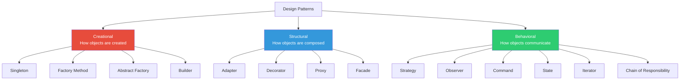
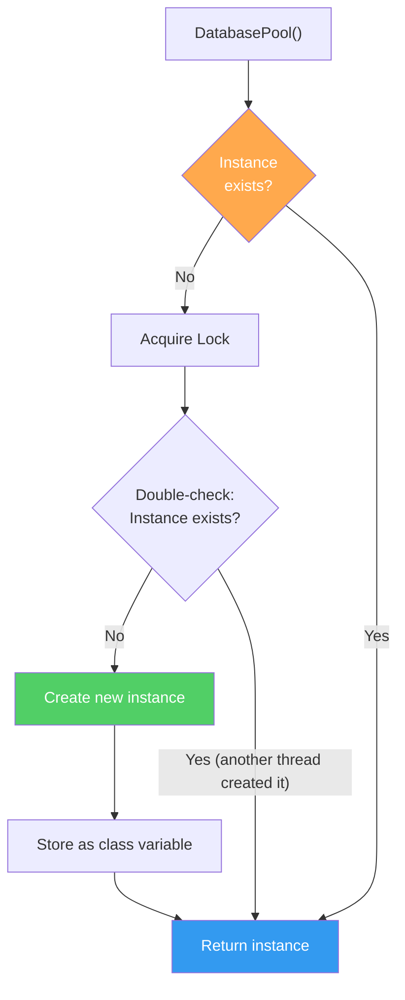
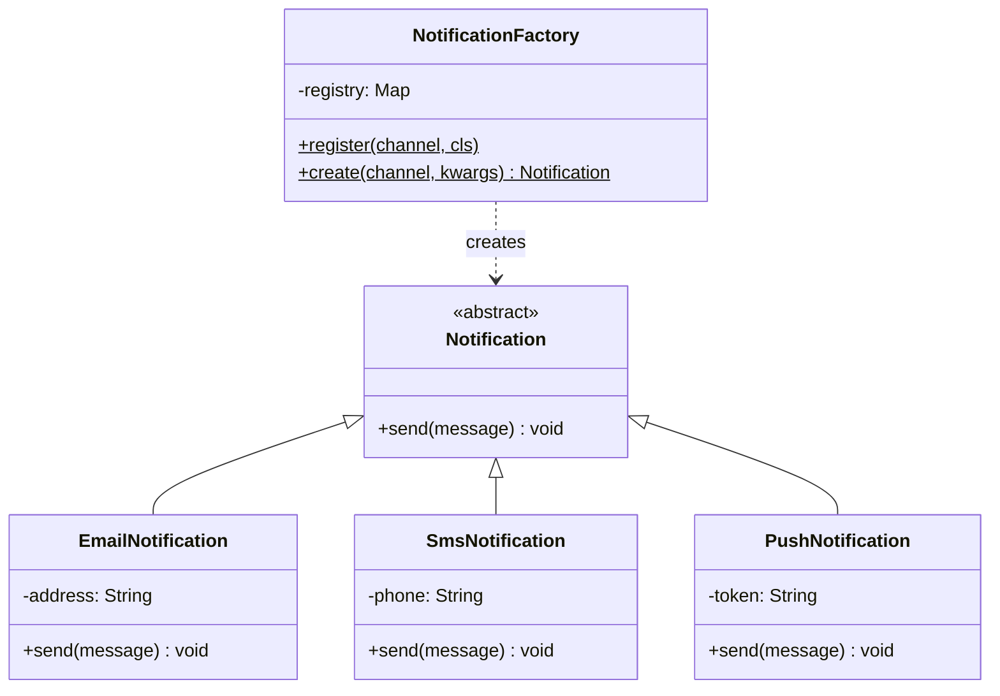
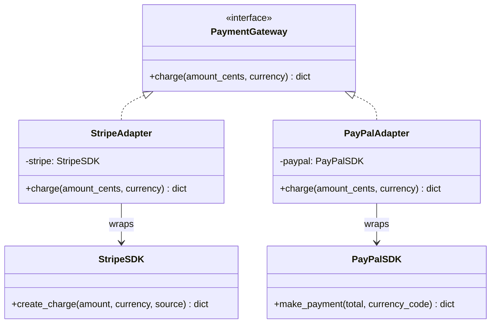
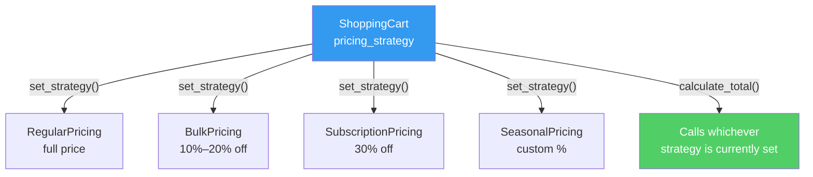
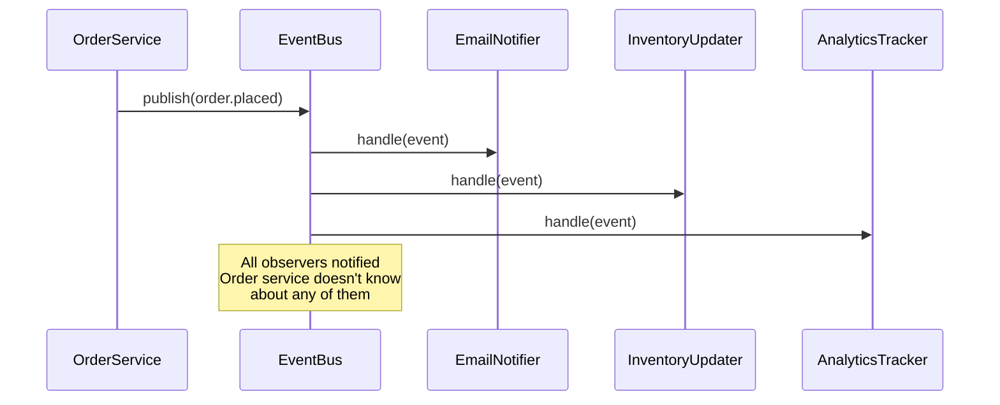
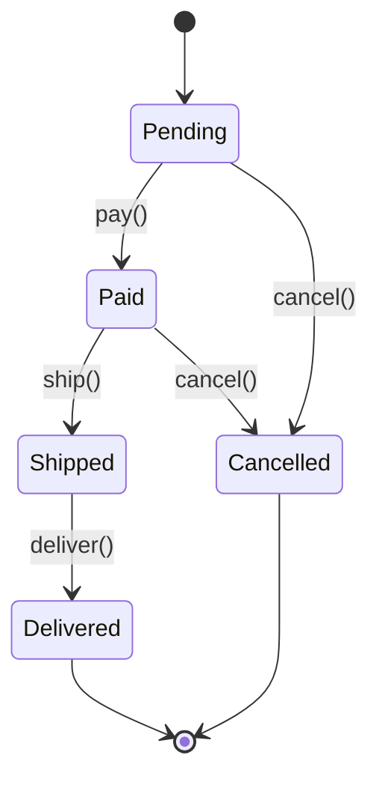
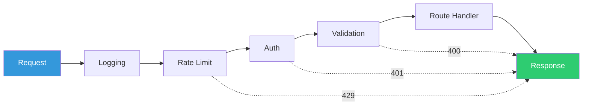

# Chapter 7: Design Patterns

> "Design patterns are not about specific implementations. They're about communicating intent." — The Gang of Four

Design patterns are **reusable solutions to recurring design problems**. The original 23 patterns were catalogued by Gamma, Helm, Johnson, and Vlissides (the "Gang of Four" / GoF) in 1994. You don't need all 23 — interviews and real systems use about 10 heavily.

---

## 7.1 Pattern Categories



### Interview Frequency

| Pattern | Interview Frequency | Real-World Frequency |
|---------|:------------------:|:-------------------:|
| **Strategy** | ★★★★★ | ★★★★★ |
| **Observer** | ★★★★★ | ★★★★★ |
| **Factory** | ★★★★★ | ★★★★★ |
| **Singleton** | ★★★★☆ | ★★★☆☆ |
| **Builder** | ★★★★☆ | ★★★★★ |
| **Decorator** | ★★★★☆ | ★★★★☆ |
| **Adapter** | ★★★☆☆ | ★★★★★ |
| **Command** | ★★★☆☆ | ★★★☆☆ |
| **State** | ★★★☆☆ | ★★★★☆ |
| **Chain of Responsibility** | ★★☆☆☆ | ★★★★☆ |

---

## 7.2 Creational Patterns

### Singleton

**Intent**: Ensure a class has exactly one instance with a global access point.

**When**: Database connection pools, configuration managers, loggers, thread pools.

```python
import threading

class DatabasePool:
    _instance = None
    _lock = threading.Lock()

    def __new__(cls, *args, **kwargs):
        if cls._instance is None:
            with cls._lock:  # Thread-safe double-checked locking
                if cls._instance is None:
                    cls._instance = super().__new__(cls)
        return cls._instance

    def __init__(self, max_connections: int = 10):
        if not hasattr(self, '_initialized'):
            self._max = max_connections
            self._pool: list = []
            self._initialized = True

    def get_connection(self):
        # Return or create connection from pool
        ...

# Both variables point to the same instance
pool1 = DatabasePool(10)
pool2 = DatabasePool(20)
assert pool1 is pool2
```

```java
// Java: Thread-safe singleton with enum (recommended by Joshua Bloch)
public enum DatabasePool {
    INSTANCE;

    private final List<Connection> pool = new ArrayList<>();
    private int maxConnections = 10;

    public Connection getConnection() {
        // Return or create connection
        return null;
    }
}

// Usage
DatabasePool.INSTANCE.getConnection();
```

**Warning**: Singletons are often overused. They introduce **global state** and make testing harder. Prefer dependency injection when possible:



```python
# Better: Inject the pool, don't use Singleton
class UserRepository:
    def __init__(self, pool: DatabasePool):  # DI, not Singleton
        self._pool = pool
```

---

### Factory Method

**Intent**: Define an interface for creating objects, letting subclasses decide which class to instantiate.

**When**: The exact type to create depends on runtime conditions or configuration.

```python
from abc import ABC, abstractmethod
from dataclasses import dataclass

# Product hierarchy
class Notification(ABC):
    @abstractmethod
    def send(self, message: str) -> None: ...

class EmailNotification(Notification):
    def __init__(self, address: str):
        self.address = address

    def send(self, message: str) -> None:
        print(f"Email to {self.address}: {message}")

class SmsNotification(Notification):
    def __init__(self, phone: str):
        self.phone = phone

    def send(self, message: str) -> None:
        print(f"SMS to {self.phone}: {message}")

class PushNotification(Notification):
    def __init__(self, device_token: str):
        self.token = device_token

    def send(self, message: str) -> None:
        print(f"Push to {self.token}: {message}")


# Factory
class NotificationFactory:
    """Simple Factory — maps type string to concrete class"""

    _registry: dict[str, type[Notification]] = {}

    @classmethod
    def register(cls, channel: str, notification_cls: type[Notification]):
        cls._registry[channel] = notification_cls

    @classmethod
    def create(cls, channel: str, **kwargs) -> Notification:
        if channel not in cls._registry:
            raise ValueError(f"Unknown channel: {channel}")
        return cls._registry[channel](**kwargs)


# Register implementations
NotificationFactory.register("email", EmailNotification)
NotificationFactory.register("sms", SmsNotification)
NotificationFactory.register("push", PushNotification)

# Usage — client doesn't know concrete types
notif = NotificationFactory.create("email", address="user@example.com")
notif.send("Welcome!")

# Adding a new channel requires ZERO changes to factory or clients:
# NotificationFactory.register("slack", SlackNotification)
```

```java
// Java equivalent
public class NotificationFactory {
    private static final Map<String, Function<Map<String, String>, Notification>> registry
        = new HashMap<>();

    public static void register(String type, Function<Map<String, String>, Notification> creator) {
        registry.put(type, creator);
    }

    public static Notification create(String type, Map<String, String> params) {
        var creator = registry.get(type);
        if (creator == null) throw new IllegalArgumentException("Unknown: " + type);
        return creator.apply(params);
    }
}
```



---

### Builder

**Intent**: Construct complex objects step by step, separating construction from representation.

**When**: Objects with many optional parameters, configuration objects, query builders.


```python
from dataclasses import dataclass, field
from typing import Optional

@dataclass
class HttpRequest:
    method: str
    url: str
    headers: dict[str, str] = field(default_factory=dict)
    query_params: dict[str, str] = field(default_factory=dict)
    body: Optional[str] = None
    timeout: int = 30
    retries: int = 3
    auth_token: Optional[str] = None


class HttpRequestBuilder:
    def __init__(self, method: str, url: str):
        self._method = method
        self._url = url
        self._headers: dict[str, str] = {}
        self._query_params: dict[str, str] = {}
        self._body: Optional[str] = None
        self._timeout: int = 30
        self._retries: int = 3
        self._auth_token: Optional[str] = None

    def header(self, key: str, value: str) -> "HttpRequestBuilder":
        self._headers[key] = value
        return self  # Fluent interface — enables chaining

    def query(self, key: str, value: str) -> "HttpRequestBuilder":
        self._query_params[key] = value
        return self

    def body(self, body: str) -> "HttpRequestBuilder":
        self._body = body
        return self

    def timeout(self, seconds: int) -> "HttpRequestBuilder":
        self._timeout = seconds
        return self

    def retries(self, count: int) -> "HttpRequestBuilder":
        self._retries = count
        return self

    def auth(self, token: str) -> "HttpRequestBuilder":
        self._auth_token = token
        return self

    def build(self) -> HttpRequest:
        return HttpRequest(
            method=self._method,
            url=self._url,
            headers=self._headers,
            query_params=self._query_params,
            body=self._body,
            timeout=self._timeout,
            retries=self._retries,
            auth_token=self._auth_token,
        )


# Clean, readable construction
request = (
    HttpRequestBuilder("POST", "https://api.example.com/users")
    .header("Content-Type", "application/json")
    .header("Accept", "application/json")
    .auth("Bearer eyJ...")
    .body('{"name": "Alice"}')
    .timeout(10)
    .retries(5)
    .build()
)
```

```java
// Java Builder (Lombok @Builder does this automatically)
public class HttpRequest {
    private final String method;
    private final String url;
    private final Map<String, String> headers;
    private final String body;
    private final int timeout;

    private HttpRequest(Builder builder) {
        this.method = builder.method;
        this.url = builder.url;
        this.headers = Map.copyOf(builder.headers);
        this.body = builder.body;
        this.timeout = builder.timeout;
    }

    public static Builder builder(String method, String url) {
        return new Builder(method, url);
    }

    public static class Builder {
        private final String method;
        private final String url;
        private Map<String, String> headers = new HashMap<>();
        private String body;
        private int timeout = 30;

        private Builder(String method, String url) {
            this.method = method;
            this.url = url;
        }

        public Builder header(String key, String value) {
            headers.put(key, value);
            return this;
        }

        public Builder body(String body) {
            this.body = body;
            return this;
        }

        public Builder timeout(int seconds) {
            this.timeout = seconds;
            return this;
        }

        public HttpRequest build() {
            return new HttpRequest(this);
        }
    }
}

// Usage
var request = HttpRequest.builder("GET", "https://api.example.com")
    .header("Accept", "application/json")
    .timeout(10)
    .build();
```

---

## 7.3 Structural Patterns

### Adapter

**Intent**: Convert the interface of a class into another interface clients expect. Makes incompatible interfaces work together.

**When**: Integrating third-party libraries, legacy code wrappers, API compatibility layers.

```python
from abc import ABC, abstractmethod

# What our system expects
class PaymentGateway(ABC):
    @abstractmethod
    def charge(self, amount_cents: int, currency: str) -> dict:
        ...

# Third-party library with incompatible interface
class StripeSDK:
    """We can't modify this — it's a third-party library"""
    def create_charge(self, amount: float, currency: str, source: str) -> dict:
        return {"id": "ch_123", "status": "succeeded", "amount": amount}

class PayPalSDK:
    """Different third-party, different interface"""
    def make_payment(self, total: str, currency_code: str) -> dict:
        return {"paymentId": "PAY-456", "state": "approved"}


# Adapters — bridge the gap
class StripeAdapter(PaymentGateway):
    def __init__(self, stripe: StripeSDK, default_source: str = "tok_visa"):
        self._stripe = stripe
        self._source = default_source

    def charge(self, amount_cents: int, currency: str) -> dict:
        result = self._stripe.create_charge(
            amount=amount_cents / 100,  # Stripe uses dollars
            currency=currency,
            source=self._source,
        )
        return {"id": result["id"], "success": result["status"] == "succeeded"}


class PayPalAdapter(PaymentGateway):
    def __init__(self, paypal: PayPalSDK):
        self._paypal = paypal

    def charge(self, amount_cents: int, currency: str) -> dict:
        result = self._paypal.make_payment(
            total=f"{amount_cents / 100:.2f}",  # PayPal uses string dollars
            currency_code=currency.upper(),
        )
        return {"id": result["paymentId"], "success": result["state"] == "approved"}


# Client code works with ANY payment gateway
class CheckoutService:
    def __init__(self, gateway: PaymentGateway):
        self._gateway = gateway

    def process(self, amount_cents: int) -> dict:
        return self._gateway.charge(amount_cents, "usd")
```



---

### Decorator

**Intent**: Attach additional behavior to an object dynamically, without modifying its class.

**When**: Logging, caching, authentication, compression — cross-cutting concerns that layer on top.

```python
from abc import ABC, abstractmethod
import time
import json
import functools

# Base interface
class DataSource(ABC):
    @abstractmethod
    def read(self, key: str) -> str: ...

    @abstractmethod
    def write(self, key: str, value: str) -> None: ...


# Concrete implementation
class FileDataSource(DataSource):
    def __init__(self, directory: str):
        self._dir = directory

    def read(self, key: str) -> str:
        with open(f"{self._dir}/{key}.txt") as f:
            return f.read()

    def write(self, key: str, value: str) -> None:
        with open(f"{self._dir}/{key}.txt", "w") as f:
            f.write(value)


# Decorator base
class DataSourceDecorator(DataSource):
    def __init__(self, wrapped: DataSource):
        self._wrapped = wrapped

    def read(self, key: str) -> str:
        return self._wrapped.read(key)

    def write(self, key: str, value: str) -> None:
        self._wrapped.write(key, value)


# Concrete decorators — each adds one behavior
class LoggingDecorator(DataSourceDecorator):
    def read(self, key: str) -> str:
        print(f"[LOG] Reading key: {key}")
        result = self._wrapped.read(key)
        print(f"[LOG] Read {len(result)} bytes")
        return result

    def write(self, key: str, value: str) -> None:
        print(f"[LOG] Writing key: {key}, {len(value)} bytes")
        self._wrapped.write(key, value)


class CachingDecorator(DataSourceDecorator):
    def __init__(self, wrapped: DataSource, ttl: int = 60):
        super().__init__(wrapped)
        self._cache: dict[str, tuple[str, float]] = {}
        self._ttl = ttl

    def read(self, key: str) -> str:
        if key in self._cache:
            value, timestamp = self._cache[key]
            if time.time() - timestamp < self._ttl:
                return value  # Cache hit
        value = self._wrapped.read(key)
        self._cache[key] = (value, time.time())
        return value

    def write(self, key: str, value: str) -> None:
        self._cache.pop(key, None)  # Invalidate cache
        self._wrapped.write(key, value)


class EncryptionDecorator(DataSourceDecorator):
    def __init__(self, wrapped: DataSource, key: bytes):
        super().__init__(wrapped)
        self._key = key

    def read(self, key: str) -> str:
        encrypted = self._wrapped.read(key)
        return self._decrypt(encrypted)

    def write(self, key: str, value: str) -> None:
        encrypted = self._encrypt(value)
        self._wrapped.write(key, encrypted)

    def _encrypt(self, data: str) -> str:
        # Real encryption here (Fernet, AES, etc.)
        return f"ENC({data})"

    def _decrypt(self, data: str) -> str:
        return data[4:-1]  # Strip ENC()


# Stack decorators like layers
source = FileDataSource("/data")
source = EncryptionDecorator(source, key=b"secret")  # Layer 1: encrypt
source = CachingDecorator(source, ttl=300)            # Layer 2: cache
source = LoggingDecorator(source)                     # Layer 3: log

# Reads: Log → Cache check → (miss) → Decrypt → File
# Writes: Log → Cache invalidate → Encrypt → File
source.write("user:1", '{"name": "Alice"}')
source.read("user:1")
```


### Python's Built-in Decorator Syntax

Python has first-class support for the decorator pattern via `@` syntax:

```python
def retry(max_attempts: int = 3, delay: float = 1.0):
    """Decorator that retries a function on failure"""
    def decorator(func):
        @functools.wraps(func)
        def wrapper(*args, **kwargs):
            last_error = None
            for attempt in range(max_attempts):
                try:
                    return func(*args, **kwargs)
                except Exception as e:
                    last_error = e
                    time.sleep(delay * (2 ** attempt))  # Exponential backoff
            raise last_error
        return wrapper
    return decorator

def log_calls(func):
    """Decorator that logs function calls"""
    @functools.wraps(func)
    def wrapper(*args, **kwargs):
        print(f"Calling {func.__name__}({args}, {kwargs})")
        result = func(*args, **kwargs)
        print(f"{func.__name__} returned {result}")
        return result
    return wrapper

# Stack decorators
@log_calls
@retry(max_attempts=3, delay=0.5)
def fetch_user(user_id: int) -> dict:
    # API call that might fail
    ...
```

---

### Facade

**Intent**: Provide a simplified interface to a complex subsystem.

**When**: Simplifying library APIs, hiding multi-step workflows, creating convenient entry points.

```python
# Complex subsystem classes
class VideoDecoder:
    def decode(self, filename: str) -> bytes: ...

class AudioDecoder:
    def decode(self, filename: str) -> bytes: ...

class CodecFactory:
    def get_codec(self, format: str): ...

class BitrateReader:
    def read(self, filename: str) -> int: ...

class AudioMixer:
    def mix(self, audio: bytes, volume: float) -> bytes: ...

class VideoBuffer:
    def allocate(self, size: int) -> None: ...


# Facade — simple interface for the complex subsystem
class VideoConverter:
    """One method hides the entire conversion pipeline"""

    def convert(self, filename: str, target_format: str) -> str:
        # Client doesn't need to know about any of these steps
        video = VideoDecoder().decode(filename)
        audio = AudioDecoder().decode(filename)
        codec = CodecFactory().get_codec(target_format)
        bitrate = BitrateReader().read(filename)
        mixed_audio = AudioMixer().mix(audio, volume=1.0)

        output = f"{filename.rsplit('.', 1)[0]}.{target_format}"
        # ... encode with codec, write to output ...
        return output


# Client code is dead simple
converter = VideoConverter()
converter.convert("vacation.avi", "mp4")
```

---

### Proxy

**Intent**: Provide a surrogate or placeholder that controls access to another object.

**When**: Lazy loading, access control, logging, caching remote calls, rate limiting.

```python
from abc import ABC, abstractmethod
from datetime import datetime, timedelta

class ExternalApi(ABC):
    @abstractmethod
    def fetch_data(self, query: str) -> dict: ...

class RealExternalApi(ExternalApi):
    """Expensive: each call costs $0.01 and takes 2 seconds"""
    def fetch_data(self, query: str) -> dict:
        # HTTP call to external service
        return {"data": f"results for {query}", "timestamp": str(datetime.utcnow())}


class CachingProxy(ExternalApi):
    """Caches results to reduce cost and latency"""
    def __init__(self, real_api: RealExternalApi, cache_ttl: int = 300):
        self._api = real_api
        self._cache: dict[str, tuple[dict, datetime]] = {}
        self._ttl = timedelta(seconds=cache_ttl)

    def fetch_data(self, query: str) -> dict:
        if query in self._cache:
            data, cached_at = self._cache[query]
            if datetime.utcnow() - cached_at < self._ttl:
                return data
        result = self._api.fetch_data(query)
        self._cache[query] = (result, datetime.utcnow())
        return result


class RateLimitProxy(ExternalApi):
    """Prevents exceeding API rate limits"""
    def __init__(self, real_api: ExternalApi, max_per_second: int = 10):
        self._api = real_api
        self._max = max_per_second
        self._calls: list[datetime] = []

    def fetch_data(self, query: str) -> dict:
        now = datetime.utcnow()
        cutoff = now - timedelta(seconds=1)
        self._calls = [t for t in self._calls if t > cutoff]

        if len(self._calls) >= self._max:
            raise RuntimeError("Rate limit exceeded")

        self._calls.append(now)
        return self._api.fetch_data(query)


# Stack proxies
api = RealExternalApi()
api = CachingProxy(api, cache_ttl=60)
api = RateLimitProxy(api, max_per_second=5)
```

---

## 7.4 Behavioral Patterns

### Strategy

**Intent**: Define a family of algorithms, encapsulate each one, and make them interchangeable.

**When**: Multiple algorithms for the same task, runtime algorithm selection, replacing conditional logic.



> The context delegates the algorithm to whichever strategy is injected — **no if/else chains**.

```python
from abc import ABC, abstractmethod
from dataclasses import dataclass
from decimal import Decimal

# Strategy interface
class PricingStrategy(ABC):
    @abstractmethod
    def calculate(self, base_price: Decimal, quantity: int) -> Decimal:
        ...

# Concrete strategies
class RegularPricing(PricingStrategy):
    def calculate(self, base_price: Decimal, quantity: int) -> Decimal:
        return base_price * quantity

class BulkPricing(PricingStrategy):
    """10% off for orders of 10+, 20% off for 100+"""
    def calculate(self, base_price: Decimal, quantity: int) -> Decimal:
        if quantity >= 100:
            return base_price * quantity * Decimal("0.80")
        elif quantity >= 10:
            return base_price * quantity * Decimal("0.90")
        return base_price * quantity

class SubscriptionPricing(PricingStrategy):
    """Flat 30% discount for subscribers"""
    def calculate(self, base_price: Decimal, quantity: int) -> Decimal:
        return base_price * quantity * Decimal("0.70")

class SeasonalPricing(PricingStrategy):
    def __init__(self, discount_pct: Decimal):
        self._multiplier = Decimal("1") - discount_pct / Decimal("100")

    def calculate(self, base_price: Decimal, quantity: int) -> Decimal:
        return base_price * quantity * self._multiplier


# Context
class ShoppingCart:
    def __init__(self, pricing: PricingStrategy):
        self._pricing = pricing
        self._items: list[tuple[str, Decimal, int]] = []

    def set_pricing(self, pricing: PricingStrategy) -> None:
        """Switch strategy at runtime"""
        self._pricing = pricing

    def add_item(self, name: str, price: Decimal, qty: int) -> None:
        self._items.append((name, price, qty))

    def total(self) -> Decimal:
        return sum(
            self._pricing.calculate(price, qty)
            for _, price, qty in self._items
        )


# Usage — swap strategies without changing ShoppingCart
cart = ShoppingCart(RegularPricing())
cart.add_item("Widget", Decimal("9.99"), 5)
print(cart.total())  # 49.95

cart.set_pricing(BulkPricing())
cart.add_item("Gadget", Decimal("19.99"), 50)

cart.set_pricing(SeasonalPricing(discount_pct=Decimal("25")))
```

```java
// Java equivalent using functional interfaces
@FunctionalInterface
public interface PricingStrategy {
    BigDecimal calculate(BigDecimal basePrice, int quantity);
}

public class ShoppingCart {
    private PricingStrategy pricing;

    public ShoppingCart(PricingStrategy pricing) {
        this.pricing = pricing;
    }

    // Lambda strategies — no need for separate classes
    public static final PricingStrategy REGULAR =
        (price, qty) -> price.multiply(BigDecimal.valueOf(qty));

    public static final PricingStrategy BULK =
        (price, qty) -> {
            var multiplier = qty >= 100 ? "0.80" : qty >= 10 ? "0.90" : "1.00";
            return price.multiply(BigDecimal.valueOf(qty))
                       .multiply(new BigDecimal(multiplier));
        };
}
```

---

### Observer

**Intent**: Define a one-to-many dependency so that when one object changes state, all dependents are notified.

**When**: Event systems, UI updates, pub/sub, reactive programming, webhooks.

```python
from abc import ABC, abstractmethod
from dataclasses import dataclass, field
from typing import Any

# Event types
@dataclass
class Event:
    type: str
    data: dict[str, Any]

# Observer interface
class EventListener(ABC):
    @abstractmethod
    def handle(self, event: Event) -> None:
        ...

# Event emitter (Subject)
class EventBus:
    def __init__(self):
        self._listeners: dict[str, list[EventListener]] = {}

    def subscribe(self, event_type: str, listener: EventListener) -> None:
        if event_type not in self._listeners:
            self._listeners[event_type] = []
        self._listeners[event_type].append(listener)

    def unsubscribe(self, event_type: str, listener: EventListener) -> None:
        if event_type in self._listeners:
            self._listeners[event_type].remove(listener)

    def publish(self, event: Event) -> None:
        for listener in self._listeners.get(event.type, []):
            listener.handle(event)
        # Also notify wildcard listeners
        for listener in self._listeners.get("*", []):
            listener.handle(event)


# Concrete observers
class EmailNotifier(EventListener):
    def handle(self, event: Event) -> None:
        if event.type == "order.placed":
            print(f"📧 Sending confirmation email for order {event.data['order_id']}")

class InventoryUpdater(EventListener):
    def handle(self, event: Event) -> None:
        if event.type == "order.placed":
            for item in event.data.get("items", []):
                print(f"📦 Reducing stock for {item['name']} by {item['qty']}")

class AnalyticsTracker(EventListener):
    def handle(self, event: Event) -> None:
        print(f"📊 Tracking event: {event.type}")

class AuditLogger(EventListener):
    def handle(self, event: Event) -> None:
        print(f"📝 Audit log: {event.type} at {event.data}")


# Wiring
bus = EventBus()
bus.subscribe("order.placed", EmailNotifier())
bus.subscribe("order.placed", InventoryUpdater())
bus.subscribe("order.placed", AnalyticsTracker())
bus.subscribe("*", AuditLogger())  # Logs everything

# Publishing an event triggers all relevant observers
bus.publish(Event(
    type="order.placed",
    data={
        "order_id": "ORD-001",
        "items": [{"name": "Widget", "qty": 3}],
        "total": 29.97,
    }
))
```



---

### Command

**Intent**: Encapsulate a request as an object, allowing parameterization, queueing, logging, and undo.

**When**: Undo/redo, transaction logs, task queues, macro recording, remote execution.

```python
from abc import ABC, abstractmethod
from dataclasses import dataclass, field
from typing import Any

class Command(ABC):
    @abstractmethod
    def execute(self) -> None: ...

    @abstractmethod
    def undo(self) -> None: ...

    @abstractmethod
    def description(self) -> str: ...


# Receiver
class TextDocument:
    def __init__(self):
        self.content: str = ""
        self.cursor: int = 0

    def insert(self, position: int, text: str) -> None:
        self.content = self.content[:position] + text + self.content[position:]

    def delete(self, position: int, length: int) -> str:
        deleted = self.content[position:position + length]
        self.content = self.content[:position] + self.content[position + length:]
        return deleted

    def __str__(self) -> str:
        return self.content


# Concrete commands
class InsertCommand(Command):
    def __init__(self, doc: TextDocument, position: int, text: str):
        self._doc = doc
        self._position = position
        self._text = text

    def execute(self) -> None:
        self._doc.insert(self._position, self._text)

    def undo(self) -> None:
        self._doc.delete(self._position, len(self._text))

    def description(self) -> str:
        return f"Insert '{self._text}' at {self._position}"


class DeleteCommand(Command):
    def __init__(self, doc: TextDocument, position: int, length: int):
        self._doc = doc
        self._position = position
        self._length = length
        self._deleted_text: str = ""

    def execute(self) -> None:
        self._deleted_text = self._doc.delete(self._position, self._length)

    def undo(self) -> None:
        self._doc.insert(self._position, self._deleted_text)

    def description(self) -> str:
        return f"Delete {self._length} chars at {self._position}"


# Invoker with undo/redo
class CommandHistory:
    def __init__(self):
        self._history: list[Command] = []
        self._redo_stack: list[Command] = []

    def execute(self, command: Command) -> None:
        command.execute()
        self._history.append(command)
        self._redo_stack.clear()  # New command invalidates redo

    def undo(self) -> None:
        if not self._history:
            return
        command = self._history.pop()
        command.undo()
        self._redo_stack.append(command)

    def redo(self) -> None:
        if not self._redo_stack:
            return
        command = self._redo_stack.pop()
        command.execute()
        self._history.append(command)


# Usage
doc = TextDocument()
history = CommandHistory()

history.execute(InsertCommand(doc, 0, "Hello"))
history.execute(InsertCommand(doc, 5, " World"))
print(doc)  # "Hello World"

history.undo()
print(doc)  # "Hello"

history.redo()
print(doc)  # "Hello World"
```

---

### State

**Intent**: Allow an object to alter its behavior when its internal state changes. The object appears to change its class.

**When**: Finite state machines, workflow engines, connection handlers, game states.

```python
from abc import ABC, abstractmethod

class OrderState(ABC):
    @abstractmethod
    def pay(self, order: "Order") -> None: ...

    @abstractmethod
    def ship(self, order: "Order") -> None: ...

    @abstractmethod
    def deliver(self, order: "Order") -> None: ...

    @abstractmethod
    def cancel(self, order: "Order") -> None: ...

    @abstractmethod
    def status(self) -> str: ...


class PendingState(OrderState):
    def pay(self, order: "Order") -> None:
        print("Payment processed!")
        order._state = PaidState()

    def ship(self, order: "Order") -> None:
        raise InvalidTransitionError("Cannot ship unpaid order")

    def deliver(self, order: "Order") -> None:
        raise InvalidTransitionError("Cannot deliver unpaid order")

    def cancel(self, order: "Order") -> None:
        print("Order cancelled.")
        order._state = CancelledState()

    def status(self) -> str:
        return "PENDING"


class PaidState(OrderState):
    def pay(self, order: "Order") -> None:
        raise InvalidTransitionError("Already paid")

    def ship(self, order: "Order") -> None:
        print("Order shipped!")
        order._state = ShippedState()

    def deliver(self, order: "Order") -> None:
        raise InvalidTransitionError("Must ship before delivering")

    def cancel(self, order: "Order") -> None:
        print("Order cancelled. Refund initiated.")
        order._state = CancelledState()

    def status(self) -> str:
        return "PAID"


class ShippedState(OrderState):
    def pay(self, order: "Order") -> None:
        raise InvalidTransitionError("Already paid")

    def ship(self, order: "Order") -> None:
        raise InvalidTransitionError("Already shipped")

    def deliver(self, order: "Order") -> None:
        print("Order delivered!")
        order._state = DeliveredState()

    def cancel(self, order: "Order") -> None:
        raise InvalidTransitionError("Cannot cancel shipped order")

    def status(self) -> str:
        return "SHIPPED"


class DeliveredState(OrderState):
    def pay(self, order): raise InvalidTransitionError("Order completed")
    def ship(self, order): raise InvalidTransitionError("Order completed")
    def deliver(self, order): raise InvalidTransitionError("Already delivered")
    def cancel(self, order): raise InvalidTransitionError("Cannot cancel delivered order")
    def status(self) -> str: return "DELIVERED"


class CancelledState(OrderState):
    def pay(self, order): raise InvalidTransitionError("Order cancelled")
    def ship(self, order): raise InvalidTransitionError("Order cancelled")
    def deliver(self, order): raise InvalidTransitionError("Order cancelled")
    def cancel(self, order): raise InvalidTransitionError("Already cancelled")
    def status(self) -> str: return "CANCELLED"


class InvalidTransitionError(Exception):
    pass


class Order:
    def __init__(self, order_id: str):
        self.order_id = order_id
        self._state: OrderState = PendingState()

    @property
    def status(self) -> str:
        return self._state.status()

    def pay(self) -> None:
        self._state.pay(self)

    def ship(self) -> None:
        self._state.ship(self)

    def deliver(self) -> None:
        self._state.deliver(self)

    def cancel(self) -> None:
        self._state.cancel(self)


# Usage
order = Order("ORD-001")
print(order.status)   # PENDING
order.pay()           # Payment processed!
print(order.status)   # PAID
order.ship()          # Order shipped!
print(order.status)   # SHIPPED
order.deliver()       # Order delivered!
print(order.status)   # DELIVERED
```



---

### Chain of Responsibility

**Intent**: Pass a request along a chain of handlers. Each handler decides to process the request or pass it to the next handler.

**When**: Middleware pipelines, logging levels, approval workflows, request validation.

```python
from abc import ABC, abstractmethod
from dataclasses import dataclass
from typing import Optional

@dataclass
class HttpRequest:
    path: str
    method: str
    headers: dict[str, str]
    body: Optional[str] = None
    user: Optional[str] = None  # Set by auth middleware

@dataclass
class HttpResponse:
    status: int
    body: str
    headers: dict[str, str] = None


class Middleware(ABC):
    def __init__(self):
        self._next: Optional[Middleware] = None

    def set_next(self, middleware: "Middleware") -> "Middleware":
        self._next = middleware
        return middleware  # Enable chaining

    @abstractmethod
    def handle(self, request: HttpRequest) -> HttpResponse:
        ...

    def pass_to_next(self, request: HttpRequest) -> HttpResponse:
        if self._next:
            return self._next.handle(request)
        return HttpResponse(404, "Not Found")


class LoggingMiddleware(Middleware):
    def handle(self, request: HttpRequest) -> HttpResponse:
        print(f"[LOG] {request.method} {request.path}")
        response = self.pass_to_next(request)
        print(f"[LOG] Response: {response.status}")
        return response


class AuthMiddleware(Middleware):
    def handle(self, request: HttpRequest) -> HttpResponse:
        token = request.headers.get("Authorization")
        if not token:
            return HttpResponse(401, "Unauthorized")

        if not token.startswith("Bearer "):
            return HttpResponse(401, "Invalid token format")

        # Validate token and set user
        request.user = "authenticated_user"
        return self.pass_to_next(request)


class RateLimitMiddleware(Middleware):
    def __init__(self, max_requests: int = 100):
        super().__init__()
        self._max = max_requests
        self._counts: dict[str, int] = {}

    def handle(self, request: HttpRequest) -> HttpResponse:
        client = request.headers.get("X-Client-ID", "anonymous")
        self._counts[client] = self._counts.get(client, 0) + 1

        if self._counts[client] > self._max:
            return HttpResponse(429, "Too Many Requests")

        return self.pass_to_next(request)


class ValidationMiddleware(Middleware):
    def handle(self, request: HttpRequest) -> HttpResponse:
        if request.method == "POST" and not request.body:
            return HttpResponse(400, "Request body required")
        return self.pass_to_next(request)


class RouteHandler(Middleware):
    def handle(self, request: HttpRequest) -> HttpResponse:
        return HttpResponse(200, f"Hello {request.user}!")


# Build the chain
logging = LoggingMiddleware()
rate_limit = RateLimitMiddleware(max_requests=100)
auth = AuthMiddleware()
validation = ValidationMiddleware()
handler = RouteHandler()

logging.set_next(rate_limit).set_next(auth).set_next(validation).set_next(handler)

# Process request through the chain
request = HttpRequest(
    path="/api/users",
    method="GET",
    headers={"Authorization": "Bearer token123", "X-Client-ID": "client-1"},
)
response = logging.handle(request)
```



---

## 7.5 Pattern Relationships

Patterns often work together. Knowing which ones compose well is as important as knowing individual patterns.

| Combination | Example |
|------------|---------|
| **Factory + Strategy** | Factory creates the right Strategy based on config |
| **Observer + Command** | Commands published as events, observers execute them |
| **Decorator + Proxy** | Both wrap objects, but Proxy controls access while Decorator adds behavior |
| **State + Strategy** | State is Strategy applied to an object's lifecycle |
| **Builder + Factory** | Factory chooses which Builder to use |
| **Chain of Responsibility + Decorator** | Both chain behavior, but CoR can short-circuit |

### When to Use What

```
Need to create objects?
├── One type, complex config → Builder
├── Multiple types, same interface → Factory
└── One instance globally → Singleton (use sparingly)

Need to structure objects?
├── Wrap with extra behavior → Decorator
├── Simplify a complex API → Facade
├── Convert interface → Adapter
└── Control access → Proxy

Need to manage behavior?
├── Swap algorithms → Strategy
├── React to changes → Observer
├── Undo/redo operations → Command
├── Manage lifecycle transitions → State
└── Pipeline processing → Chain of Responsibility
```

---

## Key Takeaways

| # | Takeaway |
|---|----------|
| 1 | Patterns are communication tools — naming them speeds up team discussions |
| 2 | Strategy eliminates `if/elif` chains by making algorithms interchangeable |
| 3 | Observer decouples event producers from consumers (foundation of event-driven systems) |
| 4 | Factory centralizes creation logic — add new types without changing clients |
| 5 | Decorator composes behavior by wrapping objects in layers |
| 6 | State pattern makes state machines explicit and prevents invalid transitions |
| 7 | Don't force patterns where they don't fit — solve the problem first, name the pattern later |

---

## Practice Questions

1. **Strategy in practice**: Design a `CompressionService` that supports gzip, bzip2, and zstd compression. New algorithms should be addable without modifying existing code. How does this use both Strategy and OCP?

2. **Observer design**: Design a stock price monitoring system where multiple displays (chart, alert, portfolio) update when a stock price changes. What happens if an observer throws an exception? How do you handle it?

3. **Decorator vs Proxy**: You need to add caching and logging to a `UserRepository`. Should you use Decorator or Proxy? What if you also need authentication checks before queries — does the answer change?

4. **State machine**: Design the states for a `VendingMachine` (NoCoin, HasCoin, Dispensing, OutOfStock). Draw the state diagram and implement using the State pattern. What happens if someone inserts a coin when the machine is out of stock?

5. **Pattern combination**: You're building a plugin system. Users can register plugins that process documents in sequence (Chain of Responsibility), some plugins need configuration (Builder), and the system needs to notify monitoring when a plugin fails (Observer). Sketch the class diagram showing how these three patterns work together.

---

[← Chapter 6: SOLID Principles](../part2-lld/ch06-solid-principles.md) | [Chapter 8: LLD Case Studies — Part 1 →](../part2-lld/ch08-lld-case-studies-1.md)
