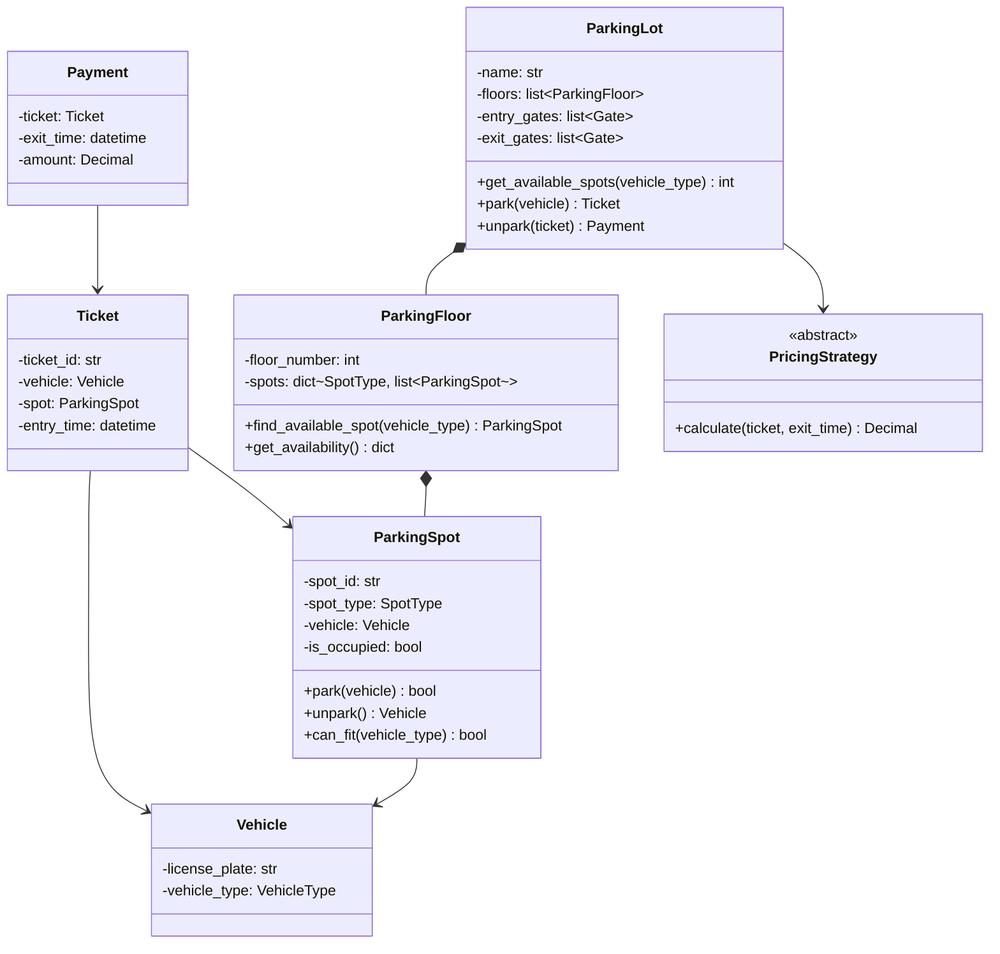
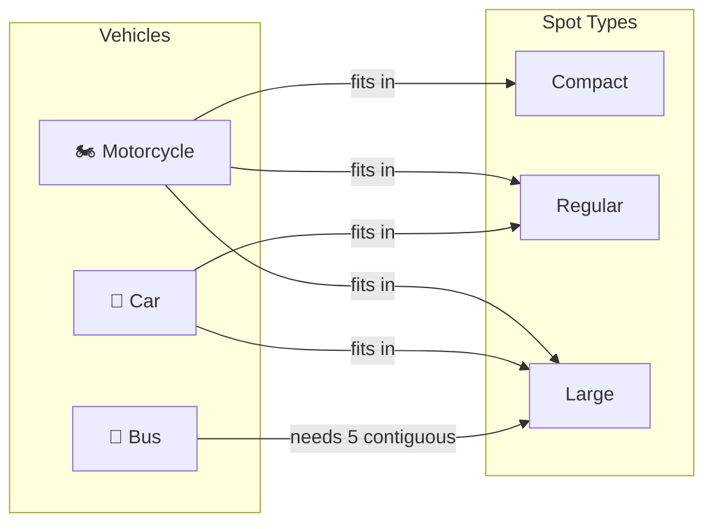
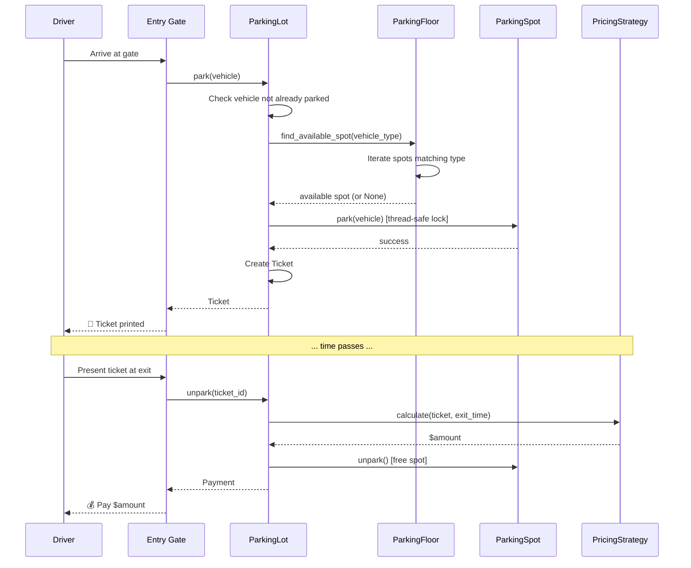
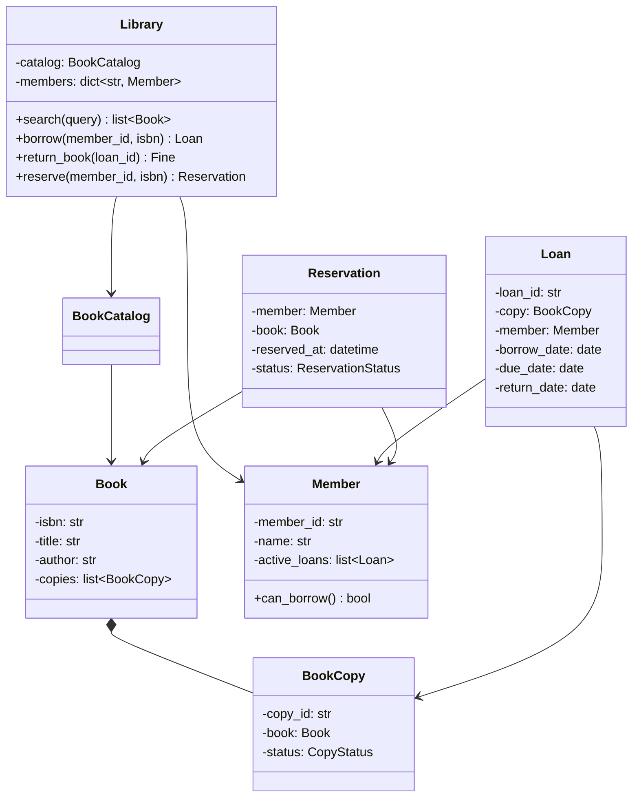
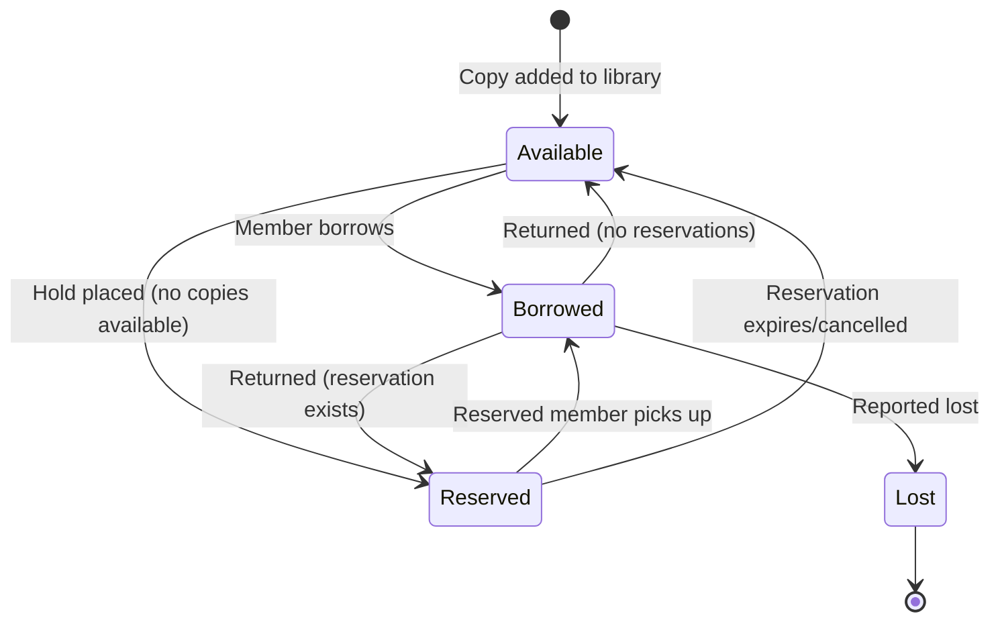
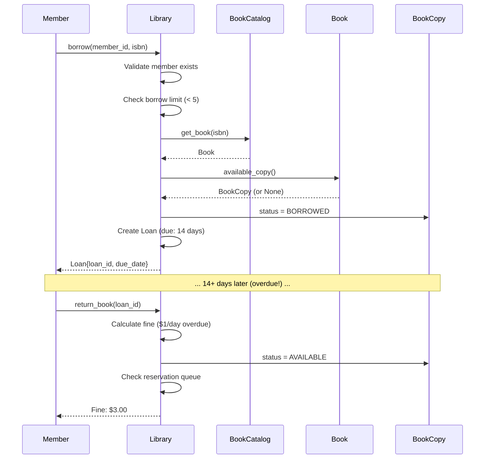
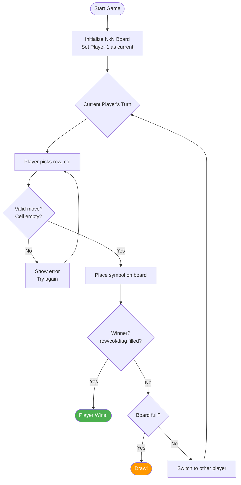
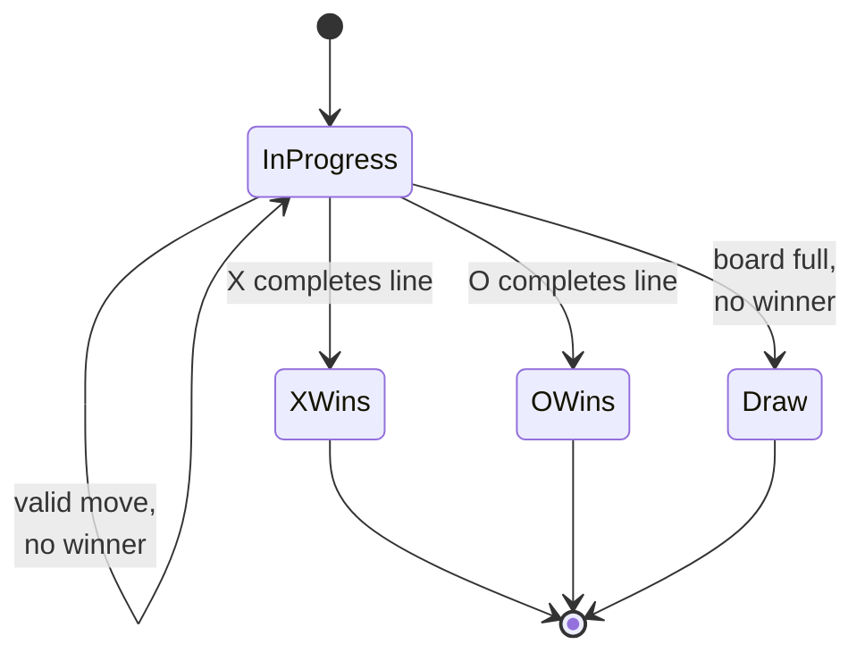

# Chapter 8: LLD Case Studies — Part 1

> "The best way to learn design is to design." — Frederick Brooks

This chapter walks through three classic LLD interview problems end-to-end: requirements → class diagram → implementation → extensibility analysis.

---

## 8.1 Parking Lot System

### Requirements

**Functional:**
- Multi-floor parking lot with different spot sizes (Compact, Regular, Large)
- Vehicles: Motorcycle, Car, Bus (bus needs multiple contiguous large spots)
- Entry/exit gates with ticket generation
- Hourly pricing with different rates per vehicle type
- Display board showing available spots per floor

**Non-Functional:**
- Thread-safe (concurrent entry/exit)
- Extensible (new vehicle types, pricing strategies)

### Class Diagram



### Vehicle-to-Spot Mapping



### Entry → Park → Exit Flow



### Implementation

```python
from abc import ABC, abstractmethod
from dataclasses import dataclass, field
from datetime import datetime
from decimal import Decimal
from enum import Enum
from typing import Optional
import threading
import uuid


# === Enums ===

class VehicleType(Enum):
    MOTORCYCLE = "motorcycle"
    CAR = "car"
    BUS = "bus"

class SpotType(Enum):
    COMPACT = "compact"
    REGULAR = "regular"
    LARGE = "large"

# Which spots can fit which vehicles
VEHICLE_TO_SPOT: dict[VehicleType, list[SpotType]] = {
    VehicleType.MOTORCYCLE: [SpotType.COMPACT, SpotType.REGULAR, SpotType.LARGE],
    VehicleType.CAR: [SpotType.REGULAR, SpotType.LARGE],
    VehicleType.BUS: [SpotType.LARGE],  # Needs multiple
}

BUS_SPOTS_REQUIRED = 5


# === Domain Models ===

@dataclass
class Vehicle:
    license_plate: str
    vehicle_type: VehicleType


@dataclass
class ParkingSpot:
    spot_id: str
    spot_type: SpotType
    floor: int
    _vehicle: Optional[Vehicle] = field(default=None, repr=False)
    _lock: threading.Lock = field(default_factory=threading.Lock, repr=False)

    @property
    def is_occupied(self) -> bool:
        return self._vehicle is not None

    def can_fit(self, vehicle_type: VehicleType) -> bool:
        return self.spot_type in VEHICLE_TO_SPOT.get(vehicle_type, [])

    def park(self, vehicle: Vehicle) -> bool:
        with self._lock:
            if self._vehicle is not None:
                return False
            self._vehicle = vehicle
            return True

    def unpark(self) -> Optional[Vehicle]:
        with self._lock:
            vehicle = self._vehicle
            self._vehicle = None
            return vehicle


@dataclass
class Ticket:
    ticket_id: str
    vehicle: Vehicle
    spots: list[ParkingSpot]  # Multiple spots for buses
    entry_time: datetime

    @staticmethod
    def create(vehicle: Vehicle, spots: list[ParkingSpot]) -> "Ticket":
        return Ticket(
            ticket_id=str(uuid.uuid4())[:8].upper(),
            vehicle=vehicle,
            spots=spots,
            entry_time=datetime.utcnow(),
        )


@dataclass
class Payment:
    ticket: Ticket
    exit_time: datetime
    amount: Decimal


# === Pricing (Strategy Pattern) ===

class PricingStrategy(ABC):
    @abstractmethod
    def calculate(self, ticket: Ticket, exit_time: datetime) -> Decimal:
        ...

class HourlyPricing(PricingStrategy):
    RATES = {
        VehicleType.MOTORCYCLE: Decimal("1.00"),
        VehicleType.CAR: Decimal("2.00"),
        VehicleType.BUS: Decimal("5.00"),
    }

    def calculate(self, ticket: Ticket, exit_time: datetime) -> Decimal:
        duration = exit_time - ticket.entry_time
        hours = Decimal(str(max(1, -(-duration.seconds // 3600))))  # Ceiling division
        rate = self.RATES.get(ticket.vehicle.vehicle_type, Decimal("2.00"))
        return hours * rate


# === Parking Floor ===

class ParkingFloor:
    def __init__(self, floor_number: int, spots_config: dict[SpotType, int]):
        self.floor_number = floor_number
        self._spots: list[ParkingSpot] = []
        for spot_type, count in spots_config.items():
            for i in range(count):
                self._spots.append(ParkingSpot(
                    spot_id=f"F{floor_number}-{spot_type.value[0].upper()}{i+1}",
                    spot_type=spot_type,
                    floor=floor_number,
                ))

    def find_available_spot(self, vehicle_type: VehicleType) -> Optional[ParkingSpot]:
        """Find first available spot that fits the vehicle"""
        for spot in self._spots:
            if not spot.is_occupied and spot.can_fit(vehicle_type):
                return spot
        return None

    def find_contiguous_spots(self, spot_type: SpotType, count: int) -> list[ParkingSpot]:
        """Find contiguous spots (for buses)"""
        typed_spots = [s for s in self._spots if s.spot_type == spot_type]
        for i in range(len(typed_spots) - count + 1):
            window = typed_spots[i:i + count]
            if all(not s.is_occupied for s in window):
                return window
        return []

    def get_availability(self) -> dict[SpotType, tuple[int, int]]:
        """Returns {SpotType: (available, total)}"""
        result = {}
        for spot_type in SpotType:
            typed = [s for s in self._spots if s.spot_type == spot_type]
            available = sum(1 for s in typed if not s.is_occupied)
            result[spot_type] = (available, len(typed))
        return result


# === Parking Lot (Facade) ===

class ParkingLot:
    _instance = None
    _lock = threading.Lock()

    def __init__(self, name: str, floors: list[ParkingFloor],
                 pricing: PricingStrategy):
        self.name = name
        self._floors = floors
        self._pricing = pricing
        self._active_tickets: dict[str, Ticket] = {}  # ticket_id -> Ticket
        self._vehicle_tickets: dict[str, str] = {}     # license_plate -> ticket_id

    def park(self, vehicle: Vehicle) -> Optional[Ticket]:
        """Assign spot(s) and generate ticket"""
        with self._lock:
            if vehicle.license_plate in self._vehicle_tickets:
                raise ValueError(f"Vehicle {vehicle.license_plate} already parked")

            spots = self._find_spots(vehicle)
            if not spots:
                return None  # Lot full for this vehicle type

            # Park in all assigned spots
            for spot in spots:
                spot.park(vehicle)

            ticket = Ticket.create(vehicle, spots)
            self._active_tickets[ticket.ticket_id] = ticket
            self._vehicle_tickets[vehicle.license_plate] = ticket.ticket_id
            return ticket

    def unpark(self, ticket_id: str) -> Optional[Payment]:
        """Process exit: calculate payment, free spots"""
        with self._lock:
            ticket = self._active_tickets.get(ticket_id)
            if not ticket:
                raise ValueError(f"Invalid ticket: {ticket_id}")

            exit_time = datetime.utcnow()
            amount = self._pricing.calculate(ticket, exit_time)

            # Free all spots
            for spot in ticket.spots:
                spot.unpark()

            del self._active_tickets[ticket_id]
            del self._vehicle_tickets[ticket.vehicle.license_plate]

            return Payment(ticket=ticket, exit_time=exit_time, amount=amount)

    def get_availability(self) -> dict[int, dict[SpotType, tuple[int, int]]]:
        """Get availability per floor"""
        return {
            floor.floor_number: floor.get_availability()
            for floor in self._floors
        }

    def _find_spots(self, vehicle: Vehicle) -> list[ParkingSpot]:
        if vehicle.vehicle_type == VehicleType.BUS:
            for floor in self._floors:
                spots = floor.find_contiguous_spots(SpotType.LARGE, BUS_SPOTS_REQUIRED)
                if spots:
                    return spots
            return []

        for floor in self._floors:
            spot = floor.find_available_spot(vehicle.vehicle_type)
            if spot:
                return [spot]
        return []


# === Usage ===

def main():
    floors = [
        ParkingFloor(1, {SpotType.COMPACT: 20, SpotType.REGULAR: 50, SpotType.LARGE: 10}),
        ParkingFloor(2, {SpotType.COMPACT: 20, SpotType.REGULAR: 50, SpotType.LARGE: 10}),
    ]
    lot = ParkingLot("Downtown Garage", floors, HourlyPricing())

    # Park a car
    car = Vehicle("ABC-123", VehicleType.CAR)
    ticket = lot.park(car)
    print(f"Parked: {ticket.ticket_id} at {ticket.spots[0].spot_id}")

    # Check availability
    avail = lot.get_availability()
    for floor_num, spots in avail.items():
        print(f"Floor {floor_num}: {spots}")

    # Exit
    payment = lot.unpark(ticket.ticket_id)
    print(f"Payment: ${payment.amount}")
```

### Design Decisions & Extensions

| Decision | Rationale |
|----------|-----------|
| Spot-per-vehicle mapping table | OCP: new vehicle types don't change ParkingSpot |
| Strategy for pricing | Easy to swap: hourly, flat, time-of-day, weekend rates |
| Thread locks at spot + lot level | Prevent double-booking in concurrent environments |
| Multiple spots per ticket | Enables bus parking (5 contiguous large spots) |

---

## 8.2 Library Management System

### Requirements

**Functional:**
- Members can search, borrow, return, and reserve books
- Books have multiple copies; each copy tracked individually
- Borrowing limits: max 5 books, 14-day lending period
- Late fees: $1/day
- Librarians can add/remove books and manage members

### Class Diagram



### Book Lifecycle State Diagram



### Borrow → Return → Reserve Flow



### Implementation

```python
from dataclasses import dataclass, field
from datetime import date, datetime, timedelta
from decimal import Decimal
from enum import Enum
from typing import Optional
import uuid


class CopyStatus(Enum):
    AVAILABLE = "available"
    BORROWED = "borrowed"
    RESERVED = "reserved"
    LOST = "lost"

class ReservationStatus(Enum):
    ACTIVE = "active"
    FULFILLED = "fulfilled"
    CANCELLED = "cancelled"
    EXPIRED = "expired"

MAX_BOOKS_PER_MEMBER = 5
LOAN_PERIOD_DAYS = 14
LATE_FEE_PER_DAY = Decimal("1.00")


@dataclass
class Book:
    isbn: str
    title: str
    author: str
    genre: str
    copies: list["BookCopy"] = field(default_factory=list)

    def available_copy(self) -> Optional["BookCopy"]:
        for copy in self.copies:
            if copy.status == CopyStatus.AVAILABLE:
                return copy
        return None

    @property
    def available_count(self) -> int:
        return sum(1 for c in self.copies if c.status == CopyStatus.AVAILABLE)


@dataclass
class BookCopy:
    copy_id: str
    book: Book
    status: CopyStatus = CopyStatus.AVAILABLE

    @staticmethod
    def create(book: Book) -> "BookCopy":
        copy = BookCopy(copy_id=str(uuid.uuid4())[:8], book=book)
        book.copies.append(copy)
        return copy


@dataclass
class Member:
    member_id: str
    name: str
    email: str
    active_loans: list["Loan"] = field(default_factory=list)
    total_fines: Decimal = Decimal("0")

    def can_borrow(self) -> bool:
        return len(self.active_loans) < MAX_BOOKS_PER_MEMBER

    @property
    def books_borrowed(self) -> int:
        return len(self.active_loans)


@dataclass
class Loan:
    loan_id: str
    copy: BookCopy
    member: Member
    borrow_date: date
    due_date: date
    return_date: Optional[date] = None

    @property
    def is_overdue(self) -> bool:
        check_date = self.return_date or date.today()
        return check_date > self.due_date

    @property
    def days_overdue(self) -> int:
        if not self.is_overdue:
            return 0
        check_date = self.return_date or date.today()
        return (check_date - self.due_date).days

    @property
    def fine(self) -> Decimal:
        return LATE_FEE_PER_DAY * self.days_overdue

    @staticmethod
    def create(copy: BookCopy, member: Member) -> "Loan":
        today = date.today()
        return Loan(
            loan_id=str(uuid.uuid4())[:8],
            copy=copy,
            member=member,
            borrow_date=today,
            due_date=today + timedelta(days=LOAN_PERIOD_DAYS),
        )


@dataclass
class Reservation:
    reservation_id: str
    member: Member
    book: Book
    reserved_at: datetime
    status: ReservationStatus = ReservationStatus.ACTIVE


# === Search (Strategy Pattern for different search modes) ===

class BookCatalog:
    def __init__(self):
        self._books: dict[str, Book] = {}  # isbn -> Book

    def add_book(self, book: Book) -> None:
        self._books[book.isbn] = book

    def get_book(self, isbn: str) -> Optional[Book]:
        return self._books.get(isbn)

    def search_by_title(self, query: str) -> list[Book]:
        q = query.lower()
        return [b for b in self._books.values() if q in b.title.lower()]

    def search_by_author(self, query: str) -> list[Book]:
        q = query.lower()
        return [b for b in self._books.values() if q in b.author.lower()]

    def search_by_genre(self, query: str) -> list[Book]:
        q = query.lower()
        return [b for b in self._books.values() if q in b.genre.lower()]


# === Library Facade ===

class Library:
    def __init__(self):
        self.catalog = BookCatalog()
        self._members: dict[str, Member] = {}
        self._loans: dict[str, Loan] = {}
        self._reservations: dict[str, list[Reservation]] = {}  # isbn -> queue

    def register_member(self, name: str, email: str) -> Member:
        member = Member(
            member_id=str(uuid.uuid4())[:8],
            name=name,
            email=email,
        )
        self._members[member.member_id] = member
        return member

    def add_book(self, isbn: str, title: str, author: str,
                 genre: str, num_copies: int = 1) -> Book:
        book = self.catalog.get_book(isbn)
        if not book:
            book = Book(isbn=isbn, title=title, author=author, genre=genre)
            self.catalog.add_book(book)
        for _ in range(num_copies):
            BookCopy.create(book)
        return book

    def borrow(self, member_id: str, isbn: str) -> Loan:
        member = self._members.get(member_id)
        if not member:
            raise ValueError(f"Unknown member: {member_id}")

        if not member.can_borrow():
            raise ValueError(f"Borrow limit reached ({MAX_BOOKS_PER_MEMBER})")

        book = self.catalog.get_book(isbn)
        if not book:
            raise ValueError(f"Book not found: {isbn}")

        copy = book.available_copy()
        if not copy:
            raise ValueError(f"No copies available for '{book.title}'")

        # Create loan
        copy.status = CopyStatus.BORROWED
        loan = Loan.create(copy, member)
        member.active_loans.append(loan)
        self._loans[loan.loan_id] = loan
        return loan

    def return_book(self, loan_id: str) -> Decimal:
        loan = self._loans.get(loan_id)
        if not loan:
            raise ValueError(f"Unknown loan: {loan_id}")

        loan.return_date = date.today()
        loan.copy.status = CopyStatus.AVAILABLE
        loan.member.active_loans.remove(loan)

        fine = loan.fine
        if fine > 0:
            loan.member.total_fines += fine

        # Check if anyone reserved this book
        self._fulfill_reservation(loan.copy.book)

        del self._loans[loan_id]
        return fine

    def reserve(self, member_id: str, isbn: str) -> Reservation:
        member = self._members.get(member_id)
        book = self.catalog.get_book(isbn)

        if not member or not book:
            raise ValueError("Invalid member or book")

        if book.available_copy():
            raise ValueError("Book is available — borrow it instead")

        reservation = Reservation(
            reservation_id=str(uuid.uuid4())[:8],
            member=member,
            book=book,
            reserved_at=datetime.utcnow(),
        )

        if isbn not in self._reservations:
            self._reservations[isbn] = []
        self._reservations[isbn].append(reservation)
        return reservation

    def _fulfill_reservation(self, book: Book) -> None:
        """When a book is returned, check reservation queue"""
        queue = self._reservations.get(book.isbn, [])
        while queue:
            reservation = queue[0]
            if reservation.status != ReservationStatus.ACTIVE:
                queue.pop(0)
                continue
            copy = book.available_copy()
            if copy:
                copy.status = CopyStatus.RESERVED
                reservation.status = ReservationStatus.FULFILLED
                # Notify member (Observer pattern in production)
                print(f"Notifying {reservation.member.name}: "
                      f"'{book.title}' is ready for pickup")
                queue.pop(0)
            break


# === Usage ===
def main():
    lib = Library()

    # Setup
    book = lib.add_book("978-0-13-468599-1", "Clean Code", "Robert C. Martin",
                        "Software Engineering", num_copies=3)
    alice = lib.register_member("Alice", "alice@example.com")
    bob = lib.register_member("Bob", "bob@example.com")

    # Borrow
    loan = lib.borrow(alice.member_id, "978-0-13-468599-1")
    print(f"Loan: {loan.loan_id}, Due: {loan.due_date}")

    # Search
    results = lib.catalog.search_by_author("Martin")
    print(f"Found {len(results)} books by Martin")

    # Return (with fine calculation)
    fine = lib.return_book(loan.loan_id)
    print(f"Fine: ${fine}")
```

### Key Design Points

| Pattern Used | Where |
|-------------|-------|
| **Facade** | `Library` class simplifies all operations |
| **State** | `CopyStatus` / `ReservationStatus` enums control allowed transitions |
| **Observer** | Reservation notification (shown as print, would be event-based in production) |
| **Strategy** | Multiple search modes in catalog |

---

## 8.3 Tic-Tac-Toe

### Requirements

**Functional:**
- 2-player game on N×N board (default 3×3)
- Players alternate turns placing their symbol (X or O)
- Win detection: row, column, or diagonal filled
- Draw detection: board full with no winner
- Support for human vs human

**Extensibility:**
- Configurable board size
- Pluggable win-condition strategies (for variants)

### Game Architecture

```mermaid
graph TD
    subgraph "Core Components"
        G[Game<br/>- orchestrates turns<br/>- tracks status]
        B[Board<br/>- NxN grid<br/>- place/validate moves]
        WC[WinChecker<br/>- Strategy interface<br/>- pluggable algorithms]
    end
    
    subgraph "Players"
        P1[Player 1: X]
        P2[Player 2: O]
    end
    
    subgraph "Win Checkers (Strategy)"
        SW[StandardWinChecker<br/>O(N) per check]
        OW[OptimizedWinChecker<br/>O(1) per check]
    end
    
    G --> B
    G --> WC
    G --> P1
    G --> P2
    WC -.->|implements| SW
    WC -.->|implements| OW
```

### Game Flow



### Implementation

```python
from abc import ABC, abstractmethod
from dataclasses import dataclass
from enum import Enum
from typing import Optional


class Symbol(Enum):
    X = "X"
    O = "O"
    EMPTY = "."


class GameStatus(Enum):
    IN_PROGRESS = "in_progress"
    X_WINS = "x_wins"
    O_WINS = "o_wins"
    DRAW = "draw"


@dataclass
class Move:
    row: int
    col: int
    symbol: Symbol


class Board:
    def __init__(self, size: int = 3):
        self.size = size
        self._grid: list[list[Symbol]] = [
            [Symbol.EMPTY] * size for _ in range(size)
        ]
        self._move_count = 0

    def place(self, row: int, col: int, symbol: Symbol) -> bool:
        if not self._is_valid(row, col):
            return False
        if self._grid[row][col] != Symbol.EMPTY:
            return False
        self._grid[row][col] = symbol
        self._move_count += 1
        return True

    def get(self, row: int, col: int) -> Symbol:
        return self._grid[row][col]

    def is_full(self) -> bool:
        return self._move_count == self.size * self.size

    def get_row(self, row: int) -> list[Symbol]:
        return list(self._grid[row])

    def get_col(self, col: int) -> list[Symbol]:
        return [self._grid[row][col] for row in range(self.size)]

    def get_diagonal(self) -> list[Symbol]:
        return [self._grid[i][i] for i in range(self.size)]

    def get_anti_diagonal(self) -> list[Symbol]:
        return [self._grid[i][self.size - 1 - i] for i in range(self.size)]

    def _is_valid(self, row: int, col: int) -> bool:
        return 0 <= row < self.size and 0 <= col < self.size

    def display(self) -> str:
        lines = []
        for row in self._grid:
            lines.append(" | ".join(s.value for s in row))
        separator = "-" * (self.size * 4 - 3)
        return f"\n{separator}\n".join(lines)


class WinChecker(ABC):
    """Strategy for checking win conditions (OCP for game variants)"""
    @abstractmethod
    def check(self, board: Board) -> Optional[Symbol]:
        """Returns winning symbol or None"""
        ...


class StandardWinChecker(WinChecker):
    """Standard tic-tac-toe: complete row, column, or diagonal"""
    def check(self, board: Board) -> Optional[Symbol]:
        size = board.size

        # Check rows
        for r in range(size):
            if self._all_same(board.get_row(r)):
                return board.get_row(r)[0]

        # Check columns
        for c in range(size):
            if self._all_same(board.get_col(c)):
                return board.get_col(c)[0]

        # Check diagonals
        if self._all_same(board.get_diagonal()):
            return board.get_diagonal()[0]
        if self._all_same(board.get_anti_diagonal()):
            return board.get_anti_diagonal()[0]

        return None

    def _all_same(self, line: list[Symbol]) -> bool:
        return line[0] != Symbol.EMPTY and all(s == line[0] for s in line)


@dataclass
class Player:
    name: str
    symbol: Symbol


class Game:
    def __init__(self, player1: Player, player2: Player,
                 board_size: int = 3,
                 win_checker: Optional[WinChecker] = None):
        if player1.symbol == player2.symbol:
            raise ValueError("Players must have different symbols")

        self._players = [player1, player2]
        self._board = Board(board_size)
        self._win_checker = win_checker or StandardWinChecker()
        self._current_turn = 0  # Index into _players
        self._status = GameStatus.IN_PROGRESS
        self._moves: list[Move] = []

    @property
    def current_player(self) -> Player:
        return self._players[self._current_turn]

    @property
    def status(self) -> GameStatus:
        return self._status

    @property
    def board(self) -> Board:
        return self._board

    def make_move(self, row: int, col: int) -> GameStatus:
        if self._status != GameStatus.IN_PROGRESS:
            raise ValueError(f"Game already over: {self._status.value}")

        player = self.current_player
        if not self._board.place(row, col, player.symbol):
            raise ValueError(f"Invalid move: ({row}, {col})")

        self._moves.append(Move(row, col, player.symbol))

        # Check for winner
        winner = self._win_checker.check(self._board)
        if winner:
            self._status = (GameStatus.X_WINS if winner == Symbol.X
                           else GameStatus.O_WINS)
            return self._status

        # Check for draw
        if self._board.is_full():
            self._status = GameStatus.DRAW
            return self._status

        # Next player's turn
        self._current_turn = 1 - self._current_turn
        return GameStatus.IN_PROGRESS


# === Usage ===

def play_demo():
    p1 = Player("Alice", Symbol.X)
    p2 = Player("Bob", Symbol.O)
    game = Game(p1, p2)

    moves = [(0, 0), (1, 1), (0, 1), (1, 0), (0, 2)]  # X wins top row

    for row, col in moves:
        player = game.current_player
        status = game.make_move(row, col)
        print(f"{player.name} ({player.symbol.value}) -> ({row},{col})")
        print(game.board.display())
        print()

        if status != GameStatus.IN_PROGRESS:
            print(f"Result: {status.value}")
            break

play_demo()
```

**Output:**
```
Alice (X) -> (0,0)
X | . | .
---------
. | . | .
---------
. | . | .

Bob (O) -> (1,1)
X | . | .
---------
. | O | .
---------
. | . | .

Alice (X) -> (0,1)
X | X | .
---------
. | O | .
---------
. | . | .

Bob (O) -> (1,0)
X | X | .
---------
O | O | .
---------
. | . | .

Alice (X) -> (0,2)
X | X | X
---------
O | O | .
---------
. | . | .

Result: x_wins
```

### Optimized Win Checking (O(1) per move)

For interviews, the O(N²) scan above is fine. But the interviewer might ask: "Can you check for a winner in O(1)?"

```python
class OptimizedWinChecker(WinChecker):
    """O(1) win check per move using running counts"""
    def __init__(self, size: int):
        self._size = size
        # Track count of each symbol per row, col, diagonal
        self._rows: dict[Symbol, list[int]] = {
            Symbol.X: [0] * size, Symbol.O: [0] * size
        }
        self._cols: dict[Symbol, list[int]] = {
            Symbol.X: [0] * size, Symbol.O: [0] * size
        }
        self._diag: dict[Symbol, int] = {Symbol.X: 0, Symbol.O: 0}
        self._anti_diag: dict[Symbol, int] = {Symbol.X: 0, Symbol.O: 0}
        self._last_move: Optional[Move] = None

    def record_move(self, move: Move) -> None:
        """Call this after each move"""
        self._last_move = move
        s = move.symbol
        self._rows[s][move.row] += 1
        self._cols[s][move.col] += 1
        if move.row == move.col:
            self._diag[s] += 1
        if move.row + move.col == self._size - 1:
            self._anti_diag[s] += 1

    def check(self, board: Board) -> Optional[Symbol]:
        """O(1) — only checks the last move's row/col/diag"""
        if not self._last_move:
            return None
        m = self._last_move
        s = m.symbol
        n = self._size

        if (self._rows[s][m.row] == n or
            self._cols[s][m.col] == n or
            self._diag[s] == n or
            self._anti_diag[s] == n):
            return s
        return None
```



---

## Design Patterns Summary Across Case Studies

| Pattern | Parking Lot | Library | Tic-Tac-Toe |
|---------|:-----------:|:-------:|:-----------:|
| **Strategy** | PricingStrategy | Search modes | WinChecker |
| **Facade** | ParkingLot | Library | Game |
| **State** | SpotType status | CopyStatus | GameStatus |
| **Observer** | Display board | Reservation notify | — |
| **Factory** | — | BookCopy.create | — |
| **Singleton** | ParkingLot (optional) | — | — |

---

## Key Takeaways

| # | Takeaway |
|---|----------|
| 1 | Start with requirements → identify entities → define relationships → then code |
| 2 | Enums for fixed categories (SpotType, CopyStatus, Symbol) prevent invalid states |
| 3 | Facade pattern simplifies complex subsystems into clean public APIs |
| 4 | Strategy pattern lets you swap algorithms (pricing, search, win-checking) without changing core logic |
| 5 | Thread safety matters in shared-resource problems (parking spots, book copies) |
| 6 | Separate data models from business logic — keeps classes focused (SRP) |

---

## Practice Questions

1. **Extend Parking Lot**: Add electric vehicle charging spots. How does the design change? What if charging spots have time limits?

2. **Library Notification**: Implement an Observer pattern so members get notified when a reserved book becomes available. Support email and SMS notifications.

3. **Tic-Tac-Toe AI**: Add a computer player using the Minimax algorithm. How does the Player abstraction support this without changing the Game class?

4. **Parking Lot Payment**: Add support for multiple payment methods (cash, credit card, mobile). Which design pattern fits best?

5. **Library Fine System**: Implement a configurable fine strategy — flat rate, progressive (increases after 7 days), and capped maximum. Use the Strategy pattern.

---

[← Chapter 7: Design Patterns](../part2-lld/ch07-design-patterns.md) | [Chapter 9: LLD Case Studies — Part 2 →](../part2-lld/ch09-lld-case-studies-2.md)
