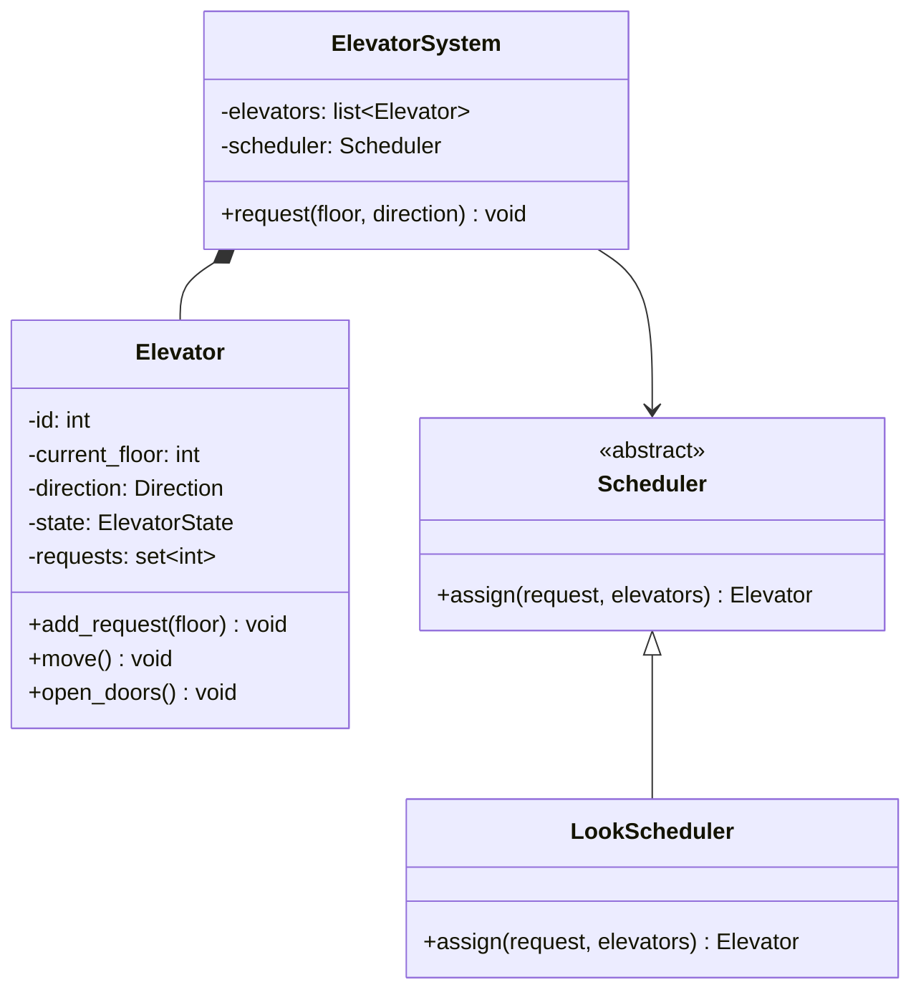
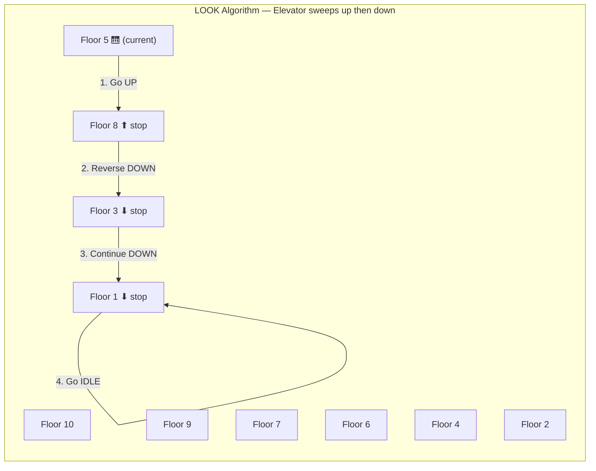
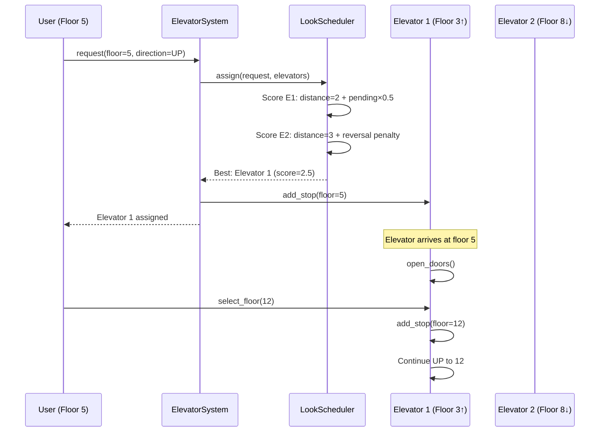
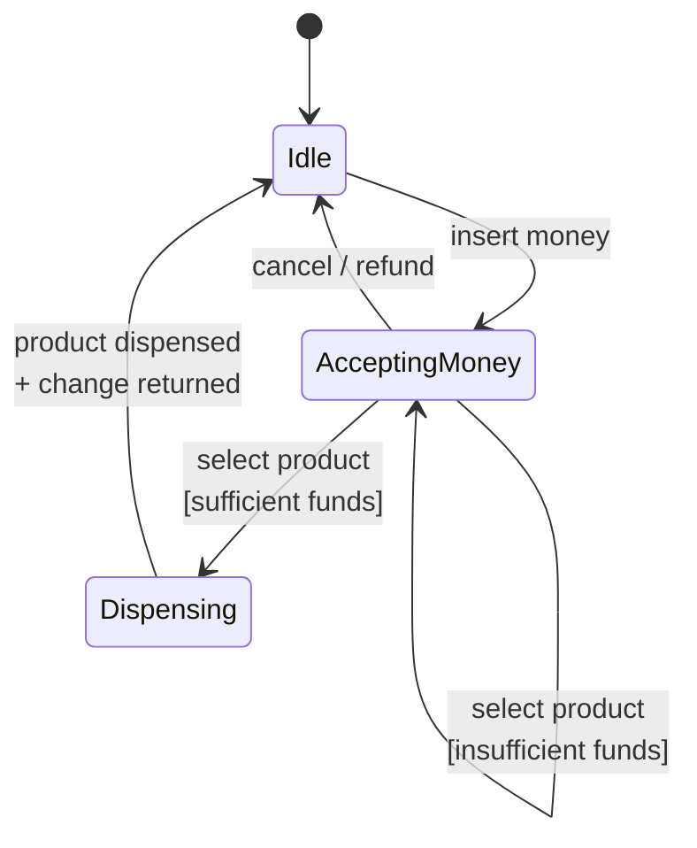
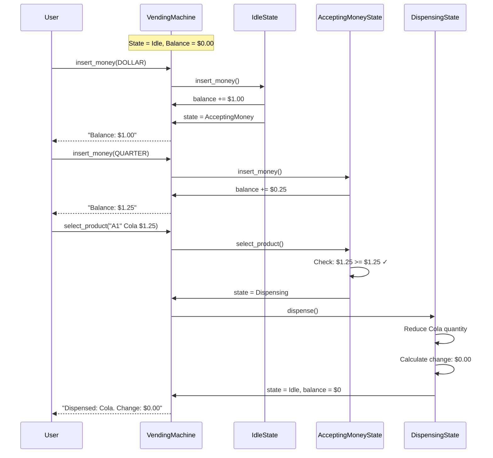
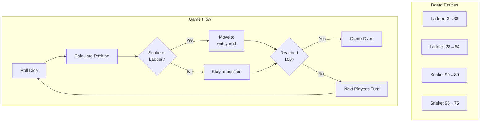
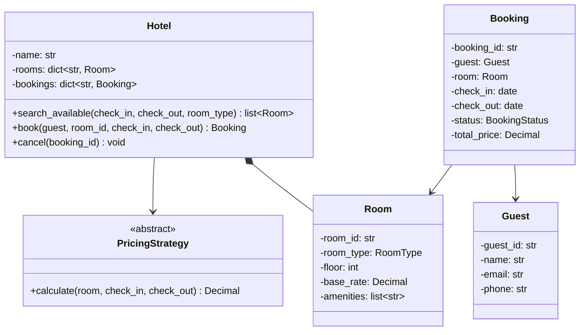
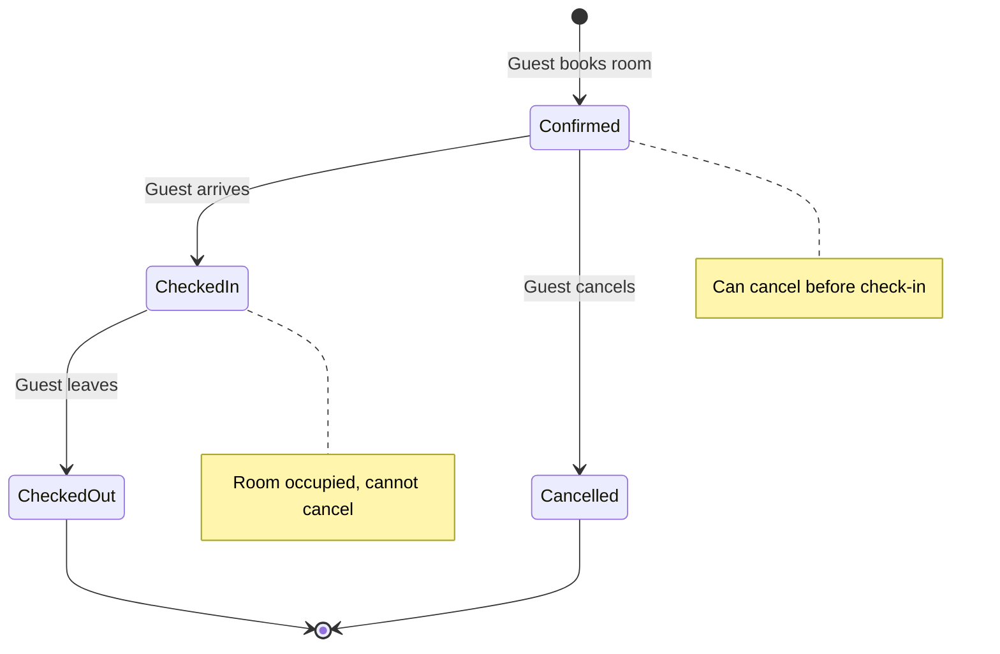
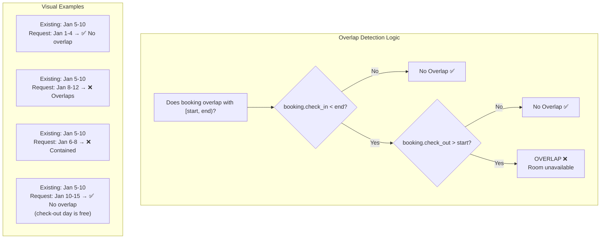

# Chapter 9: LLD Case Studies — Part 2

This chapter tackles four more classic LLD problems, each highlighting different patterns and design challenges.

---

## 9.1 Elevator System

### Requirements

**Functional:**
- Building with N floors and M elevators
- Users press Up/Down buttons on each floor
- Users select destination floor inside the elevator
- Elevator scheduling: minimize wait time
- Display current floor and direction

### Class Diagram



### LOOK Scheduling Algorithm Visualization



### Elevator Request Flow



### Implementation

```python
from abc import ABC, abstractmethod
from dataclasses import dataclass, field
from enum import Enum
from typing import Optional
import heapq


class Direction(Enum):
    UP = "up"
    DOWN = "down"
    IDLE = "idle"

class ElevatorState(Enum):
    MOVING = "moving"
    STOPPED = "stopped"
    DOORS_OPEN = "doors_open"
    MAINTENANCE = "maintenance"


@dataclass
class FloorRequest:
    floor: int
    direction: Direction
    timestamp: float = 0.0


class Elevator:
    def __init__(self, elevator_id: int, min_floor: int = 0, max_floor: int = 20):
        self.id = elevator_id
        self.current_floor = 0
        self.direction = Direction.IDLE
        self.state = ElevatorState.STOPPED
        self.min_floor = min_floor
        self.max_floor = max_floor
        self._up_stops: set[int] = set()    # Floors to stop at going up
        self._down_stops: set[int] = set()  # Floors to stop at going down

    @property
    def is_idle(self) -> bool:
        return self.direction == Direction.IDLE

    @property
    def pending_stops(self) -> int:
        return len(self._up_stops) + len(self._down_stops)

    def add_stop(self, floor: int) -> None:
        """Add a destination floor"""
        if floor > self.current_floor:
            self._up_stops.add(floor)
        elif floor < self.current_floor:
            self._down_stops.add(floor)
        # If floor == current_floor, open doors immediately

        if self.direction == Direction.IDLE:
            self.direction = (Direction.UP if floor > self.current_floor
                            else Direction.DOWN)

    def step(self) -> Optional[int]:
        """Move one floor in current direction. Returns floor if stopping."""
        if self.direction == Direction.IDLE:
            return None

        # Move one floor
        if self.direction == Direction.UP:
            self.current_floor += 1
            if self.current_floor in self._up_stops:
                self._up_stops.discard(self.current_floor)
                return self.current_floor
            # Reached top of up requests — switch direction
            if not self._up_stops or self.current_floor >= self.max_floor:
                if self._down_stops:
                    self.direction = Direction.DOWN
                else:
                    self.direction = Direction.IDLE
                return self.current_floor if self.current_floor in self._down_stops else None

        elif self.direction == Direction.DOWN:
            self.current_floor -= 1
            if self.current_floor in self._down_stops:
                self._down_stops.discard(self.current_floor)
                return self.current_floor
            if not self._down_stops or self.current_floor <= self.min_floor:
                if self._up_stops:
                    self.direction = Direction.UP
                else:
                    self.direction = Direction.IDLE
                return self.current_floor if self.current_floor in self._up_stops else None

        return None

    def distance_to(self, floor: int, direction: Direction) -> int:
        """Estimate stops before reaching target floor"""
        if self.direction == Direction.IDLE:
            return abs(self.current_floor - floor)

        # LOOK algorithm: if going same direction and target is ahead, distance is direct
        if self.direction == Direction.UP and direction == Direction.UP:
            if floor >= self.current_floor:
                return floor - self.current_floor
        if self.direction == Direction.DOWN and direction == Direction.DOWN:
            if floor <= self.current_floor:
                return self.current_floor - floor

        # Otherwise, elevator must reverse — penalize with full travel
        return abs(self.current_floor - floor) + self.max_floor


# === Scheduling (Strategy Pattern) ===

class Scheduler(ABC):
    @abstractmethod
    def assign(self, request: FloorRequest,
               elevators: list[Elevator]) -> Elevator:
        ...

class NearestIdleScheduler(Scheduler):
    """Assign to closest idle elevator, fallback to closest moving"""
    def assign(self, request: FloorRequest,
               elevators: list[Elevator]) -> Elevator:
        idle = [e for e in elevators if e.is_idle]
        if idle:
            return min(idle, key=lambda e: abs(e.current_floor - request.floor))
        return min(elevators, key=lambda e: e.distance_to(request.floor, request.direction))

class LookScheduler(Scheduler):
    """LOOK algorithm — prefer elevators already heading toward the floor"""
    def assign(self, request: FloorRequest,
               elevators: list[Elevator]) -> Elevator:
        best = None
        best_score = float('inf')

        for elevator in elevators:
            if elevator.state == ElevatorState.MAINTENANCE:
                continue
            score = elevator.distance_to(request.floor, request.direction)
            # Bonus: prefer elevators with fewer pending stops
            score += elevator.pending_stops * 0.5
            if score < best_score:
                best = elevator
                best_score = score

        return best or elevators[0]


# === Elevator System (Facade) ===

class ElevatorSystem:
    def __init__(self, num_elevators: int, num_floors: int,
                 scheduler: Optional[Scheduler] = None):
        self._elevators = [
            Elevator(i, min_floor=0, max_floor=num_floors)
            for i in range(num_elevators)
        ]
        self._scheduler = scheduler or LookScheduler()
        self._num_floors = num_floors

    def request_elevator(self, floor: int, direction: Direction) -> Elevator:
        """User presses Up/Down button on a floor"""
        request = FloorRequest(floor=floor, direction=direction)
        elevator = self._scheduler.assign(request, self._elevators)
        elevator.add_stop(floor)
        print(f"Elevator {elevator.id} assigned to floor {floor} ({direction.value})")
        return elevator

    def select_floor(self, elevator_id: int, floor: int) -> None:
        """User presses floor button inside elevator"""
        self._elevators[elevator_id].add_stop(floor)

    def simulate_step(self) -> None:
        """Advance all elevators one step"""
        for elevator in self._elevators:
            stopped_at = elevator.step()
            if stopped_at is not None:
                print(f"Elevator {elevator.id} stopped at floor {stopped_at}")

    def status(self) -> list[dict]:
        return [
            {
                "id": e.id,
                "floor": e.current_floor,
                "direction": e.direction.value,
                "pending": e.pending_stops,
            }
            for e in self._elevators
        ]


# === Usage ===
system = ElevatorSystem(num_elevators=3, num_floors=20)

# Person on floor 5 wants to go up
elevator = system.request_elevator(5, Direction.UP)
system.select_floor(elevator.id, 12)  # Going to floor 12

# Person on floor 3 wants to go down
system.request_elevator(3, Direction.DOWN)
```

### Scheduling Algorithm Comparison

| Algorithm | How It Works | Pros | Cons |
|-----------|-------------|------|------|
| **FCFS** | First request, first served | Simple | Long waits, inefficient |
| **Nearest** | Closest idle elevator | Low wait for individual | Can starve far floors |
| **LOOK/SCAN** | Sweep up then down | Fair, efficient | Slight delay for direction changes |
| **Destination Dispatch** | Group by destination | Best throughput | Complex, needs keypads per floor |

---

## 9.2 Vending Machine

### Requirements

**Functional:**
- Display products with prices and quantities
- Accept coins (1¢, 5¢, 10¢, 25¢) and bills ($1, $5)
- Dispense product when sufficient money inserted
- Return change using fewest coins
- Refund if user cancels

### State Machine



### Complete Vending Transaction



### Implementation

```python
from abc import ABC, abstractmethod
from dataclasses import dataclass, field
from decimal import Decimal
from enum import Enum
from typing import Optional


class Coin(Enum):
    PENNY = Decimal("0.01")
    NICKEL = Decimal("0.05")
    DIME = Decimal("0.10")
    QUARTER = Decimal("0.25")
    DOLLAR = Decimal("1.00")
    FIVE = Decimal("5.00")


@dataclass
class Product:
    code: str
    name: str
    price: Decimal
    quantity: int

    @property
    def is_available(self) -> bool:
        return self.quantity > 0


# === State Pattern ===

class VendingState(ABC):
    @abstractmethod
    def insert_money(self, machine: "VendingMachine", amount: Coin) -> str: ...

    @abstractmethod
    def select_product(self, machine: "VendingMachine", code: str) -> str: ...

    @abstractmethod
    def cancel(self, machine: "VendingMachine") -> str: ...

    @abstractmethod
    def dispense(self, machine: "VendingMachine") -> str: ...


class IdleState(VendingState):
    def insert_money(self, machine: "VendingMachine", amount: Coin) -> str:
        machine._balance += amount.value
        machine._state = AcceptingMoneyState()
        return f"Inserted {amount.name}. Balance: ${machine._balance}"

    def select_product(self, machine: "VendingMachine", code: str) -> str:
        return "Please insert money first"

    def cancel(self, machine: "VendingMachine") -> str:
        return "Nothing to cancel"

    def dispense(self, machine: "VendingMachine") -> str:
        return "Insert money and select a product"


class AcceptingMoneyState(VendingState):
    def insert_money(self, machine: "VendingMachine", amount: Coin) -> str:
        machine._balance += amount.value
        return f"Inserted {amount.name}. Balance: ${machine._balance}"

    def select_product(self, machine: "VendingMachine", code: str) -> str:
        product = machine._inventory.get(code)
        if not product:
            return f"Invalid product code: {code}"
        if not product.is_available:
            return f"{product.name} is out of stock"
        if machine._balance < product.price:
            diff = product.price - machine._balance
            return f"Insufficient funds. Need ${diff} more"

        machine._selected = product
        machine._state = DispensingState()
        return machine._state.dispense(machine)

    def cancel(self, machine: "VendingMachine") -> str:
        refund = machine._balance
        machine._balance = Decimal("0")
        machine._state = IdleState()
        return f"Cancelled. Refunded: ${refund}"

    def dispense(self, machine: "VendingMachine") -> str:
        return "Please select a product first"


class DispensingState(VendingState):
    def insert_money(self, machine: "VendingMachine", amount: Coin) -> str:
        return "Please wait, dispensing..."

    def select_product(self, machine: "VendingMachine", code: str) -> str:
        return "Please wait, dispensing..."

    def cancel(self, machine: "VendingMachine") -> str:
        return "Cannot cancel during dispensing"

    def dispense(self, machine: "VendingMachine") -> str:
        product = machine._selected
        change = machine._balance - product.price

        # Dispense product
        product.quantity -= 1
        machine._balance = Decimal("0")
        machine._selected = None
        machine._state = IdleState()

        change_coins = machine._make_change(change) if change > 0 else []
        change_str = ", ".join(f"{c.name}" for c in change_coins) if change_coins else "none"

        return (f"Dispensed: {product.name}. "
                f"Change: ${change} ({change_str})")


class VendingMachine:
    def __init__(self):
        self._state: VendingState = IdleState()
        self._balance: Decimal = Decimal("0")
        self._selected: Optional[Product] = None
        self._inventory: dict[str, Product] = {}
        self._coin_stock: dict[Coin, int] = {c: 100 for c in Coin}

    def add_product(self, code: str, name: str, price: Decimal, qty: int) -> None:
        self._inventory[code] = Product(code, name, price, qty)

    def insert_money(self, coin: Coin) -> str:
        return self._state.insert_money(self, coin)

    def select_product(self, code: str) -> str:
        return self._state.select_product(self, code)

    def cancel(self) -> str:
        return self._state.cancel(self)

    def display(self) -> str:
        lines = ["=== VENDING MACHINE ==="]
        for code, product in sorted(self._inventory.items()):
            status = f"${product.price}" if product.is_available else "SOLD OUT"
            lines.append(f"  [{code}] {product.name:<20} {status}")
        lines.append(f"  Balance: ${self._balance}")
        return "\n".join(lines)

    def _make_change(self, amount: Decimal) -> list[Coin]:
        """Greedy change-making with largest coins first"""
        coins_used = []
        remaining = amount
        for coin in sorted(Coin, key=lambda c: c.value, reverse=True):
            while remaining >= coin.value and self._coin_stock[coin] > 0:
                remaining -= coin.value
                self._coin_stock[coin] -= 1
                coins_used.append(coin)
        return coins_used


# === Usage ===
vm = VendingMachine()
vm.add_product("A1", "Cola", Decimal("1.25"), 10)
vm.add_product("A2", "Chips", Decimal("1.50"), 5)
vm.add_product("B1", "Water", Decimal("1.00"), 20)

print(vm.display())
print(vm.insert_money(Coin.DOLLAR))    # Inserted DOLLAR. Balance: $1.00
print(vm.insert_money(Coin.QUARTER))   # Inserted QUARTER. Balance: $1.25
print(vm.select_product("A1"))          # Dispensed: Cola. Change: $0.00
```

---

## 9.3 Snake & Ladder

### Requirements

**Functional:**
- N×N board (default 100 squares)
- Players take turns rolling a die (1-6)
- Snakes: move player down (head → tail)
- Ladders: move player up (bottom → top)
- First to reach/exceed square 100 wins
- Support 2-4 players

### Implementation

```python
from dataclasses import dataclass, field
from enum import Enum
import random
from typing import Optional


class GameStatus(Enum):
    NOT_STARTED = "not_started"
    IN_PROGRESS = "in_progress"
    FINISHED = "finished"


@dataclass
class BoardEntity:
    """Represents a snake or ladder"""
    start: int
    end: int

    @property
    def is_snake(self) -> bool:
        return self.end < self.start

    @property
    def is_ladder(self) -> bool:
        return self.end > self.start

    def __str__(self) -> str:
        kind = "Snake" if self.is_snake else "Ladder"
        return f"{kind}({self.start} → {self.end})"


class Board:
    def __init__(self, size: int = 100):
        self.size = size
        self._entities: dict[int, BoardEntity] = {}

    def add_snake(self, head: int, tail: int) -> None:
        assert head > tail, "Snake head must be above tail"
        assert 1 <= tail and head <= self.size
        self._entities[head] = BoardEntity(head, tail)

    def add_ladder(self, bottom: int, top: int) -> None:
        assert top > bottom, "Ladder top must be above bottom"
        assert 1 <= bottom and top <= self.size
        self._entities[bottom] = BoardEntity(bottom, top)

    def get_final_position(self, position: int) -> int:
        """Apply snake/ladder if present at position"""
        if position in self._entities:
            return self._entities[position].end
        return position

    def entity_at(self, position: int) -> Optional[BoardEntity]:
        return self._entities.get(position)


class Dice:
    def __init__(self, num_dice: int = 1, faces: int = 6):
        self._num_dice = num_dice
        self._faces = faces

    def roll(self) -> int:
        return sum(random.randint(1, self._faces) for _ in range(self._num_dice))


@dataclass
class Player:
    name: str
    position: int = 0  # 0 = not on board yet

    @property
    def has_started(self) -> bool:
        return self.position > 0


class SnakeLadderGame:
    def __init__(self, board: Board, players: list[Player],
                 dice: Optional[Dice] = None):
        if len(players) < 2:
            raise ValueError("Need at least 2 players")
        if len(players) > 4:
            raise ValueError("Maximum 4 players")

        self._board = board
        self._players = players
        self._dice = dice or Dice()
        self._current_turn = 0
        self._status = GameStatus.NOT_STARTED
        self._winner: Optional[Player] = None
        self._move_log: list[str] = []

    @property
    def current_player(self) -> Player:
        return self._players[self._current_turn]

    @property
    def winner(self) -> Optional[Player]:
        return self._winner

    def start(self) -> None:
        self._status = GameStatus.IN_PROGRESS

    def play_turn(self) -> str:
        """Execute one turn. Returns description of what happened."""
        if self._status != GameStatus.IN_PROGRESS:
            raise ValueError(f"Game is {self._status.value}")

        player = self.current_player
        roll = self._dice.roll()
        old_pos = player.position
        new_pos = old_pos + roll

        # Can't go beyond the board
        if new_pos > self._board.size:
            msg = f"{player.name} rolled {roll} (at {old_pos}) — can't move past {self._board.size}, stays."
            self._advance_turn()
            self._move_log.append(msg)
            return msg

        # Check for snake or ladder
        final_pos = self._board.get_final_position(new_pos)
        entity = self._board.entity_at(new_pos)

        player.position = final_pos

        if entity:
            entity_desc = f"{'🐍 Snake' if entity.is_snake else '🪜 Ladder'} {new_pos}→{final_pos}"
            msg = f"{player.name} rolled {roll}: {old_pos} → {new_pos} → {entity_desc}"
        else:
            msg = f"{player.name} rolled {roll}: {old_pos} → {final_pos}"

        # Check for win
        if final_pos == self._board.size:
            self._status = GameStatus.FINISHED
            self._winner = player
            msg += f" — {player.name} WINS!"
        else:
            self._advance_turn()

        self._move_log.append(msg)
        return msg

    def _advance_turn(self) -> None:
        self._current_turn = (self._current_turn + 1) % len(self._players)

    def play_full_game(self) -> Player:
        """Auto-play until someone wins"""
        self.start()
        while self._status == GameStatus.IN_PROGRESS:
            result = self.play_turn()
            print(result)
        return self._winner


# === Setup & Play ===
def create_standard_game() -> SnakeLadderGame:
    board = Board(100)

    # Ladders
    for bottom, top in [(2, 38), (7, 14), (8, 31), (15, 26),
                        (21, 42), (28, 84), (36, 44), (51, 67),
                        (71, 91), (78, 98)]:
        board.add_ladder(bottom, top)

    # Snakes
    for head, tail in [(16, 6), (46, 25), (49, 11), (62, 19),
                       (64, 60), (74, 53), (89, 68), (92, 88),
                       (95, 75), (99, 80)]:
        board.add_snake(head, tail)

    players = [Player("Alice"), Player("Bob")]
    return SnakeLadderGame(board, players)

game = create_standard_game()
winner = game.play_full_game()
```



---

## 9.4 Hotel Booking System

### Requirements

**Functional:**
- Rooms of different types (Single, Double, Suite) with different rates
- Search available rooms by date range and type
- Book, cancel, check-in, check-out
- Pricing: base rate × nights, seasonal surcharges
- No double-booking

### Class Diagram



### Booking Lifecycle



### Date Overlap Detection (Critical for Booking Systems)



### Implementation

```python
from abc import ABC, abstractmethod
from dataclasses import dataclass, field
from datetime import date, timedelta
from decimal import Decimal
from enum import Enum
from typing import Optional
import uuid


class RoomType(Enum):
    SINGLE = "single"
    DOUBLE = "double"
    DELUXE = "deluxe"
    SUITE = "suite"

class BookingStatus(Enum):
    CONFIRMED = "confirmed"
    CHECKED_IN = "checked_in"
    CHECKED_OUT = "checked_out"
    CANCELLED = "cancelled"


@dataclass
class Room:
    room_id: str
    room_type: RoomType
    floor: int
    base_rate: Decimal
    amenities: list[str] = field(default_factory=list)

    def __str__(self) -> str:
        return f"Room {self.room_id} ({self.room_type.value}) - ${self.base_rate}/night"


@dataclass
class Guest:
    guest_id: str
    name: str
    email: str
    phone: str

    @staticmethod
    def create(name: str, email: str, phone: str) -> "Guest":
        return Guest(str(uuid.uuid4())[:8], name, email, phone)


@dataclass
class Booking:
    booking_id: str
    guest: Guest
    room: Room
    check_in: date
    check_out: date
    status: BookingStatus
    total_price: Decimal

    @property
    def nights(self) -> int:
        return (self.check_out - self.check_in).days

    def can_cancel(self) -> bool:
        return self.status == BookingStatus.CONFIRMED

    def overlaps(self, start: date, end: date) -> bool:
        """Check if this booking overlaps with a date range"""
        return (self.check_in < end and self.check_out > start
                and self.status in (BookingStatus.CONFIRMED, BookingStatus.CHECKED_IN))


# === Pricing (Strategy Pattern) ===

class PricingStrategy(ABC):
    @abstractmethod
    def calculate(self, room: Room, check_in: date, check_out: date) -> Decimal:
        ...

class StandardPricing(PricingStrategy):
    def calculate(self, room: Room, check_in: date, check_out: date) -> Decimal:
        nights = (check_out - check_in).days
        return room.base_rate * nights

class SeasonalPricing(PricingStrategy):
    """Higher rates during peak seasons"""
    PEAK_MONTHS = {6, 7, 8, 12}  # Summer + December
    PEAK_MULTIPLIER = Decimal("1.5")

    def calculate(self, room: Room, check_in: date, check_out: date) -> Decimal:
        total = Decimal("0")
        current = check_in
        while current < check_out:
            rate = room.base_rate
            if current.month in self.PEAK_MONTHS:
                rate *= self.PEAK_MULTIPLIER
            total += rate
            current += timedelta(days=1)
        return total

class WeekendPricing(PricingStrategy):
    """Weekend surcharge"""
    WEEKEND_MULTIPLIER = Decimal("1.25")

    def calculate(self, room: Room, check_in: date, check_out: date) -> Decimal:
        total = Decimal("0")
        current = check_in
        while current < check_out:
            rate = room.base_rate
            if current.weekday() >= 5:  # Saturday=5, Sunday=6
                rate *= self.WEEKEND_MULTIPLIER
            total += rate
            current += timedelta(days=1)
        return total


# === Hotel (Facade) ===

class Hotel:
    def __init__(self, name: str, pricing: Optional[PricingStrategy] = None):
        self.name = name
        self._rooms: dict[str, Room] = {}
        self._bookings: dict[str, Booking] = {}
        self._pricing = pricing or StandardPricing()

    def add_room(self, room_id: str, room_type: RoomType, floor: int,
                 base_rate: Decimal, amenities: list[str] = None) -> Room:
        room = Room(room_id, room_type, floor, base_rate, amenities or [])
        self._rooms[room_id] = room
        return room

    def search_available(self, check_in: date, check_out: date,
                         room_type: Optional[RoomType] = None) -> list[Room]:
        """Find rooms available for the given date range"""
        available = []
        for room in self._rooms.values():
            if room_type and room.room_type != room_type:
                continue
            if self._is_room_available(room.room_id, check_in, check_out):
                available.append(room)
        return available

    def book(self, guest: Guest, room_id: str,
             check_in: date, check_out: date) -> Booking:
        """Book a room for a guest"""
        if check_in >= check_out:
            raise ValueError("Check-out must be after check-in")

        room = self._rooms.get(room_id)
        if not room:
            raise ValueError(f"Room not found: {room_id}")

        if not self._is_room_available(room_id, check_in, check_out):
            raise ValueError(f"Room {room_id} not available for those dates")

        total = self._pricing.calculate(room, check_in, check_out)
        booking = Booking(
            booking_id=str(uuid.uuid4())[:8].upper(),
            guest=guest,
            room=room,
            check_in=check_in,
            check_out=check_out,
            status=BookingStatus.CONFIRMED,
            total_price=total,
        )
        self._bookings[booking.booking_id] = booking
        return booking

    def cancel(self, booking_id: str) -> None:
        booking = self._bookings.get(booking_id)
        if not booking:
            raise ValueError(f"Booking not found: {booking_id}")
        if not booking.can_cancel():
            raise ValueError(f"Cannot cancel booking in state: {booking.status.value}")
        booking.status = BookingStatus.CANCELLED

    def check_in(self, booking_id: str) -> None:
        booking = self._bookings.get(booking_id)
        if not booking:
            raise ValueError(f"Booking not found: {booking_id}")
        if booking.status != BookingStatus.CONFIRMED:
            raise ValueError(f"Cannot check in: {booking.status.value}")
        booking.status = BookingStatus.CHECKED_IN

    def check_out(self, booking_id: str) -> Decimal:
        booking = self._bookings.get(booking_id)
        if not booking:
            raise ValueError(f"Booking not found: {booking_id}")
        if booking.status != BookingStatus.CHECKED_IN:
            raise ValueError(f"Cannot check out: {booking.status.value}")
        booking.status = BookingStatus.CHECKED_OUT
        return booking.total_price

    def _is_room_available(self, room_id: str, check_in: date, check_out: date) -> bool:
        for booking in self._bookings.values():
            if booking.room.room_id == room_id and booking.overlaps(check_in, check_out):
                return False
        return True


# === Usage ===
hotel = Hotel("Grand Hotel", SeasonalPricing())

# Add rooms
hotel.add_room("101", RoomType.SINGLE, 1, Decimal("100"), ["WiFi", "TV"])
hotel.add_room("201", RoomType.DOUBLE, 2, Decimal("150"), ["WiFi", "TV", "Minibar"])
hotel.add_room("301", RoomType.SUITE, 3, Decimal("300"), ["WiFi", "TV", "Minibar", "Jacuzzi"])

# Search & book
guest = Guest.create("Alice Smith", "alice@example.com", "+1234567890")
check_in = date(2025, 7, 15)
check_out = date(2025, 7, 18)

available = hotel.search_available(check_in, check_out, RoomType.DOUBLE)
print(f"Available: {[str(r) for r in available]}")

if available:
    booking = hotel.book(guest, available[0].room_id, check_in, check_out)
    print(f"Booked: {booking.booking_id}, Total: ${booking.total_price}")

    hotel.check_in(booking.booking_id)
    total = hotel.check_out(booking.booking_id)
    print(f"Checked out. Final bill: ${total}")
```

---

## Design Pattern Summary Across All Case Studies

| Pattern | Elevator | Vending Machine | Snake & Ladder | Hotel Booking |
|---------|:--------:|:---------------:|:--------------:|:-------------:|
| **Strategy** | Scheduler | — | Dice (configurable) | PricingStrategy |
| **State** | ElevatorState | VendingState (core) | GameStatus | BookingStatus |
| **Facade** | ElevatorSystem | VendingMachine | SnakeLadderGame | Hotel |
| **Observer** | Display updates | — | — | Notification (extension) |
| **Factory** | — | — | Board entity creation | Guest.create |
| **Command** | Floor requests | — | Move log | — |

---

## Key Takeaways

| # | Takeaway |
|---|----------|
| 1 | State pattern shines in systems with clear lifecycle transitions (vending machine, booking) |
| 2 | Strategy pattern lets you plug in different algorithms without changing core logic (scheduling, pricing) |
| 3 | Always validate state transitions — reject invalid operations (cancel shipped order, dispense without money) |
| 4 | Overlap detection is critical for booking/scheduling systems — always check `start < end AND other_start < other_end` |
| 5 | Separate game rules (Board) from game flow (Game) from player logic (Player) — each changes independently |
| 6 | Design for extensibility: new room types, new board entities, new scheduling algorithms should not require modifying existing code |

---

## Practice Questions

1. **Elevator extension**: Add priority floors (e.g., lobby, emergency floor). How does the Scheduler interface change?

2. **Vending Machine**: Add support for card payments and mobile payments alongside coins. What patterns help?

3. **Snake & Ladder variants**: Support a "teleporter" entity that moves a player to a random empty square. How does the Board class change?

4. **Hotel overbooking**: Airlines overbook by 5-10%. Design a waitlist system for the hotel that auto-assigns rooms when cancellations occur.

5. **Combined**: Design a movie ticket booking system combining elements from the vending machine (payment) and hotel booking (seat reservation with time slots). Draw the class diagram.

---

[← Chapter 8: LLD Case Studies — Part 1](../part2-lld/ch08-lld-case-studies-1.md) | [Chapter 10: Scalability & Performance →](../part3-hld/ch10-scalability-performance.md)
