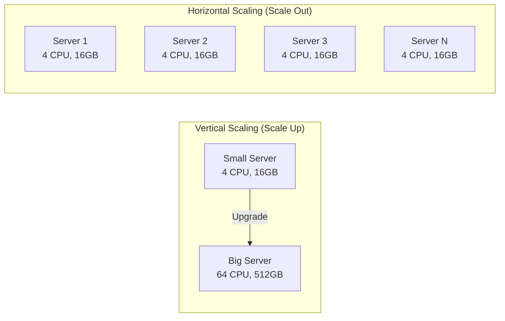
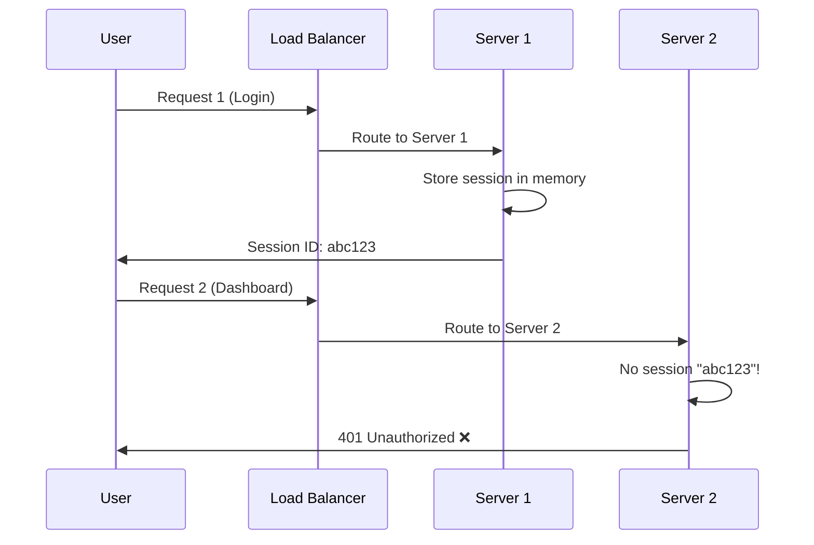
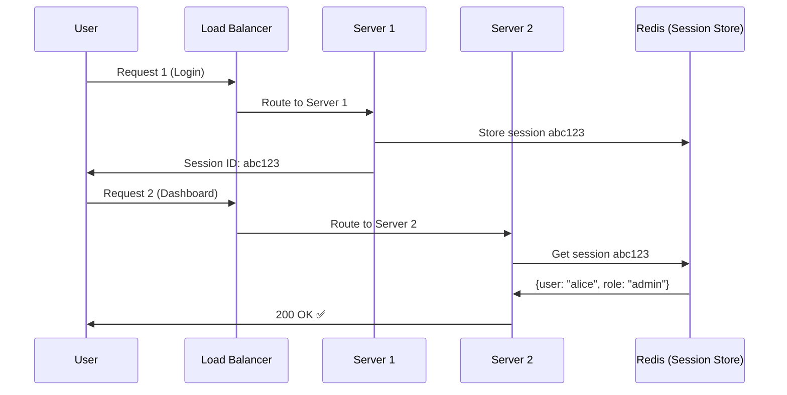
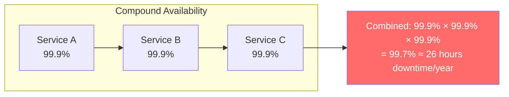
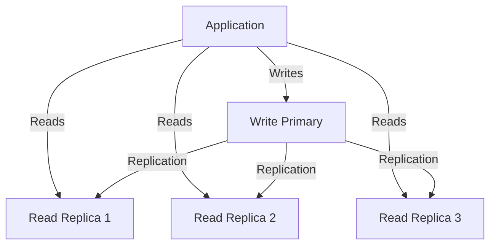
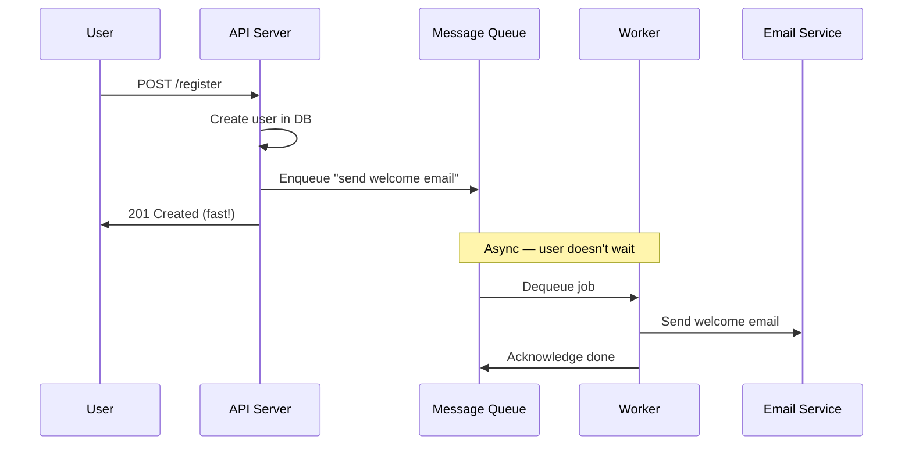
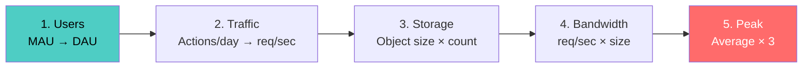
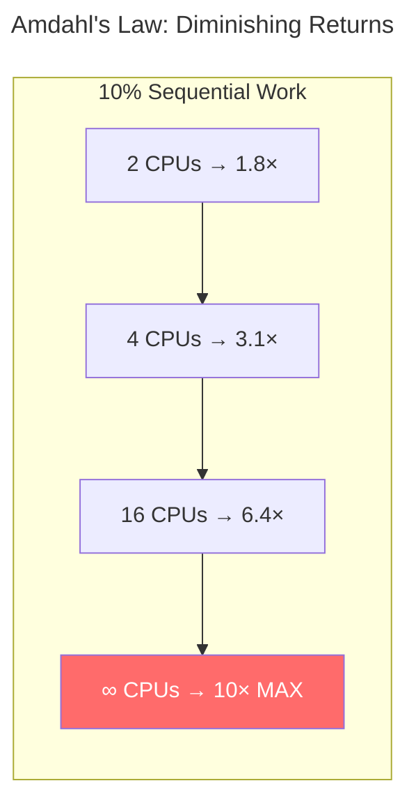
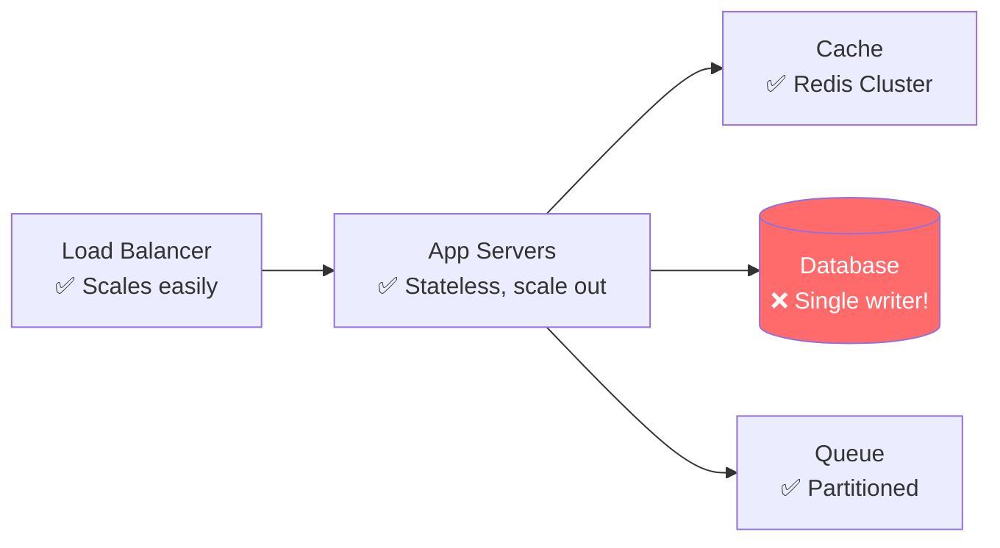
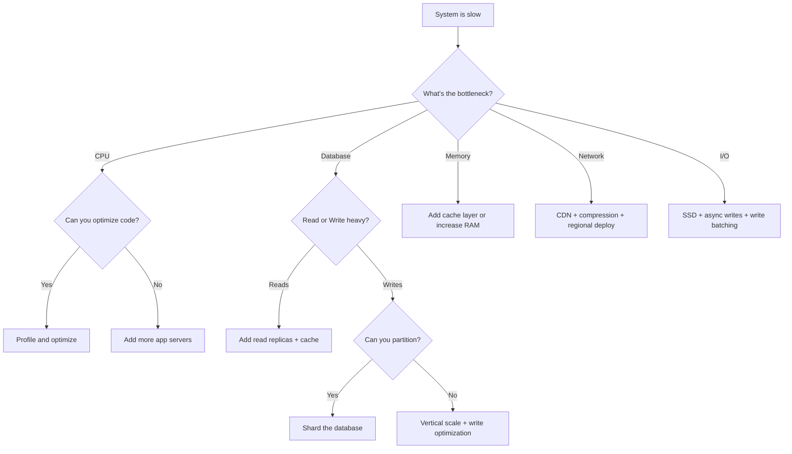

# Chapter 10: Scalability & Performance

[← Chapter 9: LLD Case Studies 2](../part2-lld/ch09-lld-case-studies-2.md) | [Chapter 11: Load Balancing, Caching & CDN →](ch11-load-balancing-caching-cdn.md)

---

## 10.1 What Is Scalability?

Scalability is a system's ability to handle increased load by adding resources. It's not about being fast — a system can be fast but not scalable, and vice versa.

**The key question**: If traffic doubles tomorrow, what breaks?

### Dimensions of Scalability

| Dimension | Question | Example |
|-----------|----------|---------|
| **Request scalability** | Can we handle more concurrent requests? | 1K → 100K requests/sec |
| **Data scalability** | Can we store and query more data? | 1GB → 100TB |
| **Geographic scalability** | Can we serve users across regions? | US-only → global |
| **Organizational scalability** | Can more teams work on the system? | Monolith → microservices |

### Vertical vs Horizontal Scaling



| Aspect | Vertical (Scale Up) | Horizontal (Scale Out) |
|--------|---------------------|----------------------|
| **Approach** | Bigger machine | More machines |
| **Limit** | Hardware ceiling (~few TB RAM) | Near-infinite |
| **Cost** | Exponential at high end | Linear |
| **Downtime** | Usually required | Zero-downtime possible |
| **Complexity** | Simple (same code) | Complex (distribution) |
| **Failure** | Single point of failure | Fault tolerant |
| **Data consistency** | Trivial (single machine) | Hard (distributed state) |

**Real-world**: Most systems use both. Scale vertically until it's insufficient, then scale horizontally. Instagram ran on a single server longer than you'd expect.

---

## 10.2 Stateless vs Stateful Architecture

The single most important enabler for horizontal scaling is **statelessness**.

### The Problem with State



**Stateful servers** store user data in local memory. If a subsequent request hits a different server, the session is lost.

### Solution: Externalize State



### Stateless Design Principles

```python
# ❌ STATEFUL: Server stores request count in memory
class StatefulHandler:
    def __init__(self):
        self.request_counts = {}  # Lost if server restarts!
    
    def handle(self, user_id: str):
        self.request_counts[user_id] = self.request_counts.get(user_id, 0) + 1
        return f"Request #{self.request_counts[user_id]}"


# ✅ STATELESS: Every request carries all needed context
class StatelessHandler:
    def __init__(self, redis_client):
        self.redis = redis_client
    
    def handle(self, user_id: str):
        count = self.redis.incr(f"req_count:{user_id}")
        return f"Request #{count}"
```

```java
// ✅ STATELESS: Using JWT — server doesn't store sessions
@RestController
public class ApiController {
    
    @GetMapping("/dashboard")
    public ResponseEntity<Dashboard> getDashboard(
            @RequestHeader("Authorization") String token) {
        // Token carries all user info — no server-side session needed
        Claims claims = Jwts.parserBuilder()
            .setSigningKey(secretKey)
            .build()
            .parseClaimsJws(token.replace("Bearer ", ""))
            .getBody();
        
        String userId = claims.getSubject();
        String role = claims.get("role", String.class);
        
        return ResponseEntity.ok(dashboardService.getFor(userId, role));
    }
}
```

### Where to Store Externalized State

| Store | Best For | Latency | Durability |
|-------|----------|---------|------------|
| **Redis** | Sessions, rate limits, feature flags | ~1ms | Configurable (AOF/RDB) |
| **Memcached** | Simple caching, ephemeral data | ~1ms | None (memory only) |
| **Database** | Long-lived state, audit trails | ~5-10ms | Full ACID |
| **Cookie/JWT** | Auth tokens, user preferences | 0ms (client) | Client-side |

---

## 10.3 Performance Metrics

You can't improve what you can't measure. These are the metrics that matter.

### Latency vs Throughput

- **Latency**: Time to complete one request (e.g., 50ms)
- **Throughput**: Requests completed per unit time (e.g., 10,000 req/s)
- **Bandwidth**: Data transferred per unit time (e.g., 1 Gbps)

They're related but not interchangeable. You can have low latency but low throughput (a single fast server) or high throughput but high latency (batch processing).

### Percentile Latencies (The Real Story)

Average latency is misleading. A system with 50ms average might have 5% of users waiting 2 seconds.

```
Request latencies: [10, 12, 11, 15, 13, 14, 12, 500, 11, 13] ms

Average: 61.1 ms  ← Misleading! Pulled up by one outlier
Median (p50): 13 ms  ← Half of users see ≤13ms
p90: 15 ms  ← 90% of users see ≤15ms
p95: 500 ms ← 5% of users see ≤500ms (the painful tail)
p99: 500 ms ← 1% worst case
```

```python
import numpy as np

def compute_percentiles(latencies: list[float]) -> dict:
    """Compute standard SLA percentiles."""
    return {
        "p50": np.percentile(latencies, 50),
        "p90": np.percentile(latencies, 90),
        "p95": np.percentile(latencies, 95),
        "p99": np.percentile(latencies, 99),
        "p999": np.percentile(latencies, 99.9),
        "max": max(latencies),
    }

# Why tail latencies matter:
# At 100 req/sec with p99=2s, 1 user per second waits 2+ seconds
# At 10,000 req/sec with p99=2s, 100 users per second wait 2+ seconds
# At scale, tail latencies affect MANY users
```

### SLAs, SLOs, and SLIs

| Term | Definition | Example |
|------|-----------|---------|
| **SLI** (Service Level Indicator) | What you measure | p99 latency = 120ms |
| **SLO** (Service Level Objective) | Internal target | p99 latency < 200ms |
| **SLA** (Service Level Agreement) | External contract | 99.9% uptime or refund |

### The Nines of Availability

| Availability | Downtime/Year | Downtime/Month | Downtime/Week |
|-------------|---------------|----------------|---------------|
| 99% ("two nines") | 3.65 days | 7.3 hours | 1.68 hours |
| 99.9% ("three nines") | 8.76 hours | 43.8 minutes | 10.1 minutes |
| 99.99% ("four nines") | 52.6 minutes | 4.38 minutes | 1.01 minutes |
| 99.999% ("five nines") | 5.26 minutes | 26.3 seconds | 6.05 seconds |



**Compound availability**: If service A (99.9%) depends on service B (99.9%), combined availability ≈ 99.9% × 99.9% = 99.8%. Dependencies multiply failure probability.

---

## 10.4 Scaling Patterns

### Pattern 1: Read Replicas

Most applications are read-heavy (90-99% reads). Replicate the database and send reads to replicas.



**Trade-off**: Replication lag means reads might return stale data. This is eventual consistency — acceptable for most use cases (timelines, product catalogs) but not for others (account balances).

### Pattern 2: Command Query Responsibility Segregation (CQRS)

Separate the write model from the read model entirely.

```python
# Write side: Normalized, optimized for correctness
class OrderService:
    def place_order(self, user_id: str, items: list[Item]) -> str:
        order = Order(user_id=user_id, items=items)
        self.order_repo.save(order)  # Write to normalized DB
        
        # Publish event for read side to consume
        self.event_bus.publish(OrderPlacedEvent(
            order_id=order.id,
            user_id=user_id,
            total=order.total,
            item_count=len(items),
        ))
        return order.id


# Read side: Denormalized, optimized for query speed
class OrderQueryService:
    def get_user_dashboard(self, user_id: str) -> Dashboard:
        # Read from pre-computed, denormalized view
        return self.dashboard_store.get(user_id)
    
    def handle_order_placed(self, event: OrderPlacedEvent):
        # Update the read model when events arrive
        dashboard = self.dashboard_store.get(event.user_id)
        dashboard.total_orders += 1
        dashboard.total_spent += event.total
        dashboard.recent_orders.insert(0, event.order_id)
        self.dashboard_store.save(dashboard)
```

### Pattern 3: Sharding (Horizontal Partitioning)

Split data across multiple databases by a shard key.

```python
class ShardRouter:
    def __init__(self, shard_count: int):
        self.shard_count = shard_count
    
    def get_shard(self, user_id: str) -> int:
        """Consistent mapping: same user always goes to same shard."""
        return hash(user_id) % self.shard_count
    
    def route_query(self, user_id: str, query: str):
        shard_id = self.get_shard(user_id)
        connection = self.get_connection(shard_id)
        return connection.execute(query)

# Problem: What if you need to query across shards?
# SELECT * FROM orders WHERE created_at > '2024-01-01'
# → Must scatter to ALL shards and gather results (expensive!)
```

### Pattern 4: Async Processing

Move non-critical work off the request path.



```java
// Synchronous: User waits for everything
@PostMapping("/register")
public ResponseEntity<User> registerSync(@RequestBody RegisterRequest req) {
    User user = userService.create(req);       // 50ms
    emailService.sendWelcome(user);            // 500ms — user waits!
    analyticsService.trackSignup(user);        // 200ms — user waits!
    return ResponseEntity.ok(user);            // Total: 750ms
}

// Asynchronous: User gets instant response
@PostMapping("/register")
public ResponseEntity<User> registerAsync(@RequestBody RegisterRequest req) {
    User user = userService.create(req);       // 50ms
    messageQueue.publish("user.registered", new UserEvent(user)); // 5ms
    return ResponseEntity.ok(user);            // Total: 55ms
}

// Workers process events independently
@RabbitListener(queues = "user.registered")
public void onUserRegistered(UserEvent event) {
    emailService.sendWelcome(event.getUser());
    analyticsService.trackSignup(event.getUser());
}
```

---

## 10.5 Back-of-Envelope Estimation

Every system design interview expects you to estimate scale. Here's the framework.



### Step 1: Estimate Users and Traffic

```
Given: Social media app, 500M monthly active users (MAU)

Daily Active Users (DAU) = MAU × 0.5 = 250M
(typical DAU/MAU ratio: 0.2-0.6)

Actions per user per day: ~10 posts viewed, 2 interactions
Total daily reads:  250M × 10 = 2.5B reads/day
Total daily writes: 250M × 2  = 500M writes/day
```

### Step 2: Convert to Per-Second

```
Reads per second:  2.5B / 86,400 ≈ 29,000 reads/sec
Writes per second: 500M / 86,400 ≈ 5,800 writes/sec

Peak multiplier: 2-5× average (use 3×)
Peak reads:  29,000 × 3 = 87,000 reads/sec
Peak writes: 5,800 × 3  = 17,400 writes/sec
```

### Step 3: Estimate Storage

```
Average post size: 
  - Text: 280 chars × 2 bytes = 560 bytes
  - Metadata (user_id, timestamp, etc.): 200 bytes
  - Total per post: ~760 bytes ≈ 1KB

New posts per day: 500M writes × 0.1 (10% are new posts) = 50M
Daily storage: 50M × 1KB = 50GB/day
Yearly storage: 50GB × 365 = ~18TB/year

With 3× replication: 54TB/year
Over 5 years: 270TB — sharding required
```

### Step 4: Estimate Bandwidth

```
Incoming (ingress):
  Writes: 5,800/sec × 1KB = 5.8 MB/s

Outgoing (egress):
  Reads: 29,000/sec × 1KB (text) + images
  If 20% have images (average 200KB):
  Text: 29,000 × 1KB = 29 MB/s
  Images: 29,000 × 0.2 × 200KB = 1.16 GB/s
  Total egress: ~1.2 GB/s → CDN is essential
```

### Quick Reference: Powers of 2

| Power | Exact | Approx | Name |
|-------|-------|--------|------|
| 2^10 | 1,024 | ~1 thousand | 1 KB |
| 2^20 | 1,048,576 | ~1 million | 1 MB |
| 2^30 | 1,073,741,824 | ~1 billion | 1 GB |
| 2^40 | ~1.1 trillion | ~1 trillion | 1 TB |

### Quick Reference: Time Conversions

| Period | Seconds |
|--------|---------|
| 1 day | 86,400 ≈ 10^5 |
| 1 month | 2.6M ≈ 2.5 × 10^6 |
| 1 year | 31.5M ≈ 3 × 10^7 |

---

## 10.6 Amdahl's Law and Bottlenecks

**Amdahl's Law**: The speedup from parallelizing a system is limited by the sequential portion.

```
Speedup = 1 / (S + P/N)

Where:
  S = fraction that is sequential (cannot be parallelized)
  P = fraction that is parallel (1 - S)
  N = number of processors
```

```python
def amdahls_speedup(sequential_fraction: float, num_processors: int) -> float:
    """
    If 10% of work is sequential and 90% is parallel:
    - 2 processors:  1 / (0.1 + 0.9/2)  = 1.82x speedup
    - 10 processors: 1 / (0.1 + 0.9/10) = 5.26x speedup
    - 100 processors: 1 / (0.1 + 0.9/100) = 9.17x speedup
    - ∞ processors:  1 / 0.1 = 10x max speedup!
    """
    parallel_fraction = 1 - sequential_fraction
    return 1 / (sequential_fraction + parallel_fraction / num_processors)
```

**The lesson**: Identify the sequential bottleneck. Throwing more servers at a system with a single-database bottleneck won't help past a point.



### Finding Bottlenecks



Common bottlenecks:
1. **Database**: Single-writer primary, slow queries, lock contention
2. **Network**: Bandwidth limits, cross-region latency
3. **CPU**: Computation-heavy operations (encoding, ML inference)
4. **Memory**: In-memory data structures exceeding capacity
5. **Disk I/O**: Write-heavy workloads on spinning disks

### The Universal Scalability Law (USL)

Beyond Amdahl's, USL accounts for **coherence overhead** — the cost of keeping distributed nodes in sync.

```
Throughput(N) = N / (1 + σ(N-1) + κN(N-1))

Where:
  σ = contention parameter (serialization)
  κ = coherence parameter (crosstalk between nodes)
  N = number of nodes
```

When κ > 0, throughput actually **decreases** after adding too many nodes — the coordination overhead exceeds the parallelism benefit. This is why you can't just "add more servers" indefinitely.

---

## 10.7 Scalability Anti-Patterns

### 1. Premature Optimization

```python
# ❌ Don't build for 1M users on day one
class OverEngineeredStartup:
    def __init__(self):
        self.kafka_cluster = KafkaCluster(brokers=12)
        self.redis_cluster = RedisCluster(shards=6)
        self.db_shards = [PostgreSQL() for _ in range(16)]
        self.cdn = MultiRegionCDN(regions=["us", "eu", "asia"])
        # You have 50 users.

# ✅ Start simple, measure, then scale what's needed
class PragmaticStartup:
    def __init__(self):
        self.db = PostgreSQL()  # Single instance handles a LOT
        self.cache = Redis()    # Add when you see repeated queries
        # Scale when metrics tell you to, not when fear tells you to
```

### 2. Distributed Monolith

Microservices that are tightly coupled, deployed together, and share databases. You get all the complexity of distributed systems with none of the benefits.

### 3. N+1 Query Problem at Scale

```python
# ❌ N+1: 1 query for posts + N queries for authors
def get_feed_naive(user_id: str) -> list[dict]:
    posts = db.query("SELECT * FROM posts WHERE feed_id = %s LIMIT 20", user_id)
    result = []
    for post in posts:  # 20 iterations = 20 additional queries!
        author = db.query("SELECT * FROM users WHERE id = %s", post.author_id)
        result.append({"post": post, "author": author})
    return result  # 21 total queries

# ✅ JOIN or batch fetch
def get_feed_optimized(user_id: str) -> list[dict]:
    return db.query("""
        SELECT p.*, u.name, u.avatar 
        FROM posts p 
        JOIN users u ON p.author_id = u.id 
        WHERE p.feed_id = %s 
        LIMIT 20
    """, user_id)  # 1 query
```

### 4. Synchronous Chains

```
User → Service A → Service B → Service C → Service D → Database
                                                          ↑
                                            Total latency: sum of all!
                                            Any failure: cascading failure!
```

**Fix**: Async where possible, circuit breakers for synchronous calls, timeout budgets.

---

## 10.8 Capacity Planning Framework

### The Three Questions

1. **What's the current load?** (Measure, don't guess)
2. **How fast is load growing?** (Linear? Exponential?)
3. **What's the capacity of each component?** (Test, don't assume)

### Load Testing Types

| Type | Purpose | Example |
|------|---------|---------|
| **Stress test** | Find breaking point | Ramp up until errors |
| **Load test** | Verify expected capacity | Simulate peak traffic |
| **Soak test** | Find slow leaks | Run for 24-72 hours |
| **Spike test** | Test sudden bursts | 0 → 10× traffic instantly |

### Scaling Decision Tree



---

## 10.9 Real-World Scaling Stories

### Twitter's Fan-Out Problem

**Early approach (pull model)**: When Alice opens her timeline, query all people she follows, get their recent tweets, merge, sort. With 500 follows, this is 500 queries per timeline load.

**Scaled approach (push model)**: When Bob tweets, write it to all followers' timelines (precomputed). Alice's timeline read is now a single query from her inbox.

**But**: When a celebrity (50M followers) tweets, that's 50M writes. Solution: Hybrid — push for regular users, pull for celebrities.

### Slack's Channel Architecture

**Problem**: A workspace can have thousands of channels. Loading all messages for all channels is impossible.

**Solution**: Load channel list (metadata only), fetch messages only for the active channel, WebSocket for real-time updates only on subscribed channels. Pagination for history.

---

## Key Takeaways

| Concept | Key Point |
|---------|-----------|
| **Scaling** | Vertical (bigger) is simpler; horizontal (more) is more resilient |
| **Stateless** | Externalize state to enable horizontal scaling |
| **Percentiles** | p50 = typical experience, p99 = tail pain at scale |
| **Availability** | Each 9 is 10× harder; dependencies multiply failure |
| **Estimation** | DAU → req/sec → storage → bandwidth; always peak-adjust |
| **Amdahl's Law** | Sequential bottleneck limits parallelism benefit |
| **Anti-patterns** | Premature optimization, N+1 queries, sync chains |
| **Scaling order** | Measure → cache → read replicas → shard → async |

---

## Practice Questions

1. **Your API has p50=30ms, p99=3s. What's your investigation strategy?** Think about what causes tail latency (GC pauses, slow queries, cold caches, downstream timeouts).

2. **Estimate the storage needs for a WhatsApp-like service** with 2B users, 100B messages/day, average message 100 bytes. How much per year? Where do you store it?

3. **Your single-server application handles 5K req/sec. You add a second server behind a load balancer but only get 7K req/sec total, not 10K. Why?** Think about shared state, database bottleneck, and contention.

4. **Design the scaling strategy for a startup**: Day 1 (100 users) → Month 6 (10K users) → Year 2 (1M users). What changes at each stage?

5. **A system has 95% parallelizable work and 5% sequential work. Using Amdahl's Law, calculate the max speedup with 4, 16, and infinite processors.** Then explain why throwing more servers doesn't always help.

---

[← Chapter 9: LLD Case Studies 2](../part2-lld/ch09-lld-case-studies-2.md) | [Chapter 11: Load Balancing, Caching & CDN →](ch11-load-balancing-caching-cdn.md)
