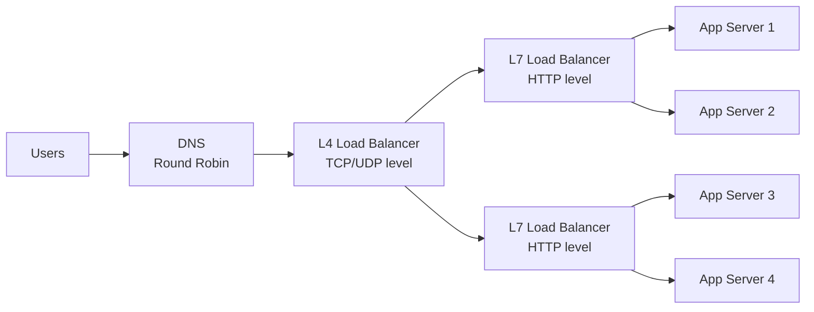
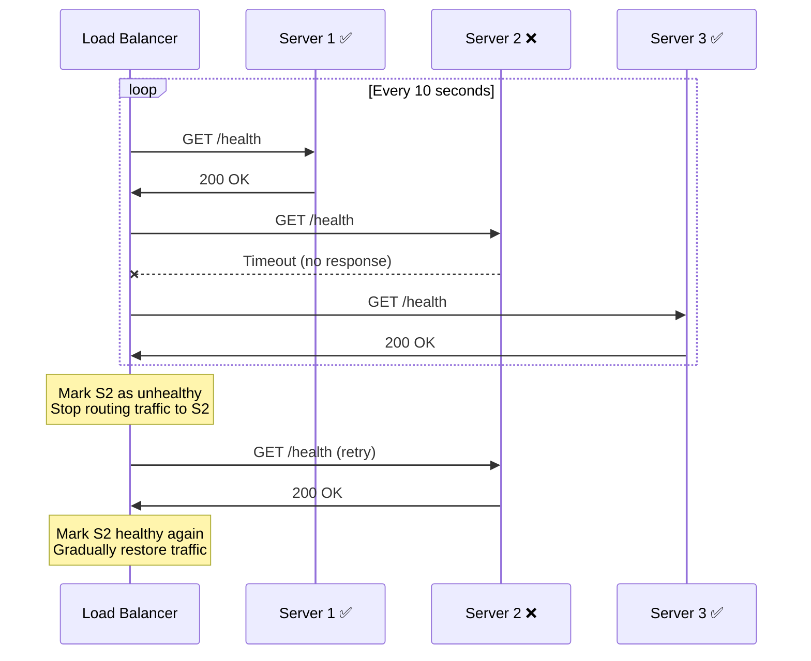
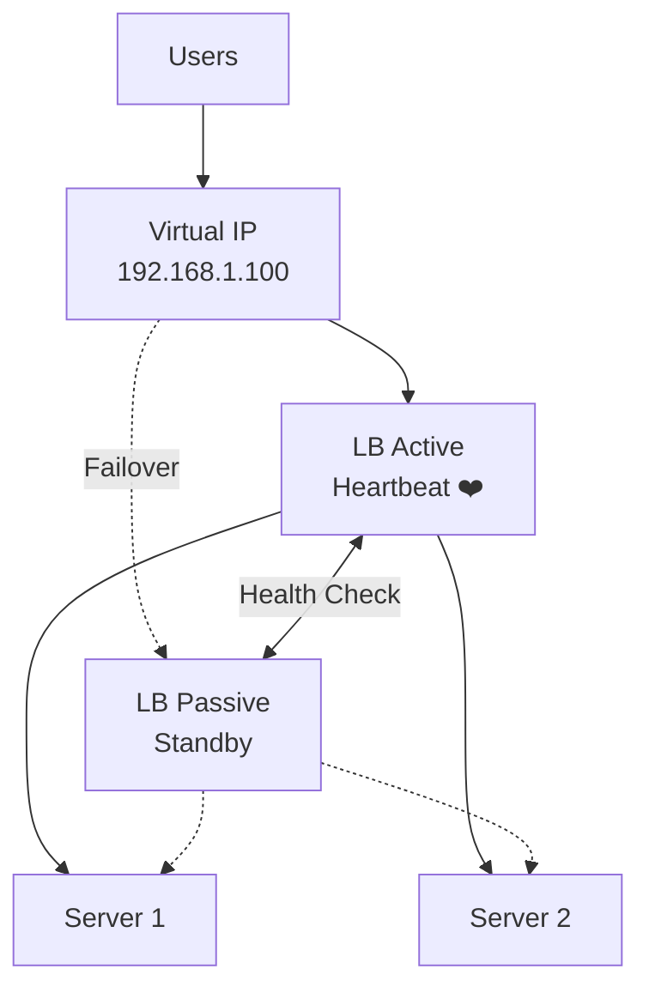
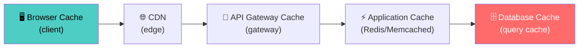
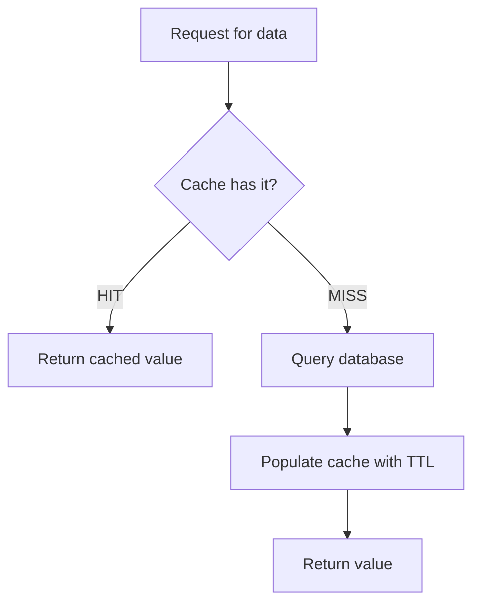
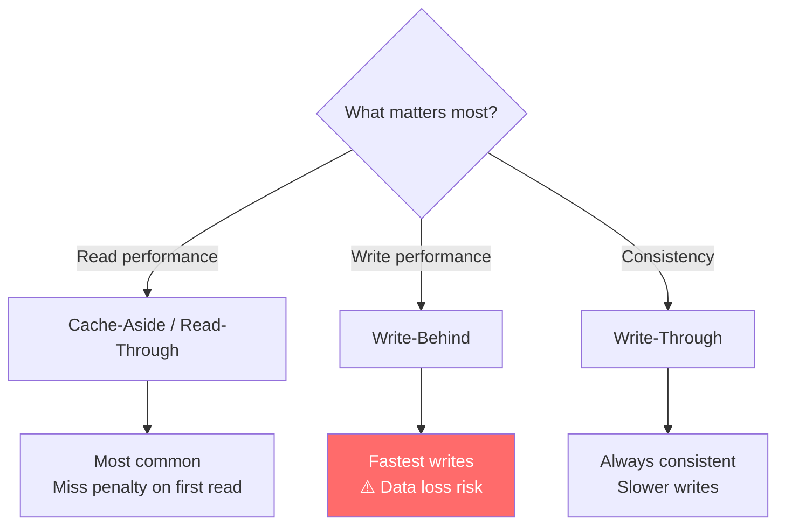
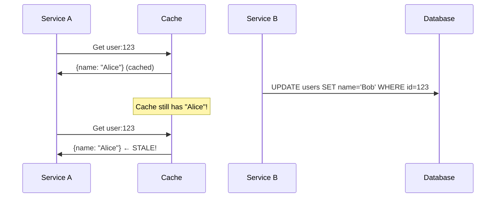
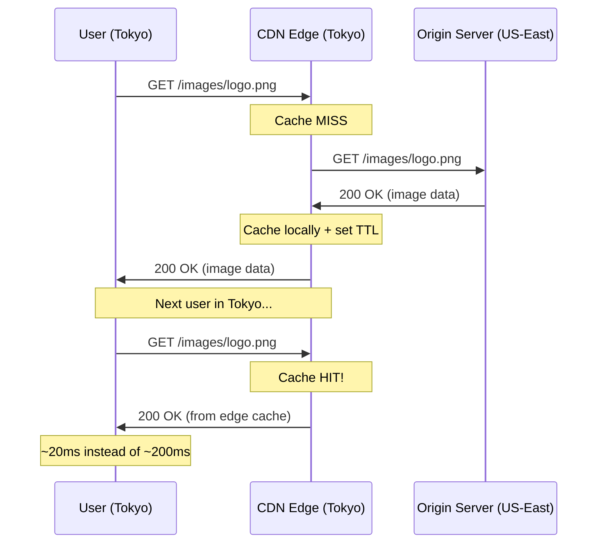
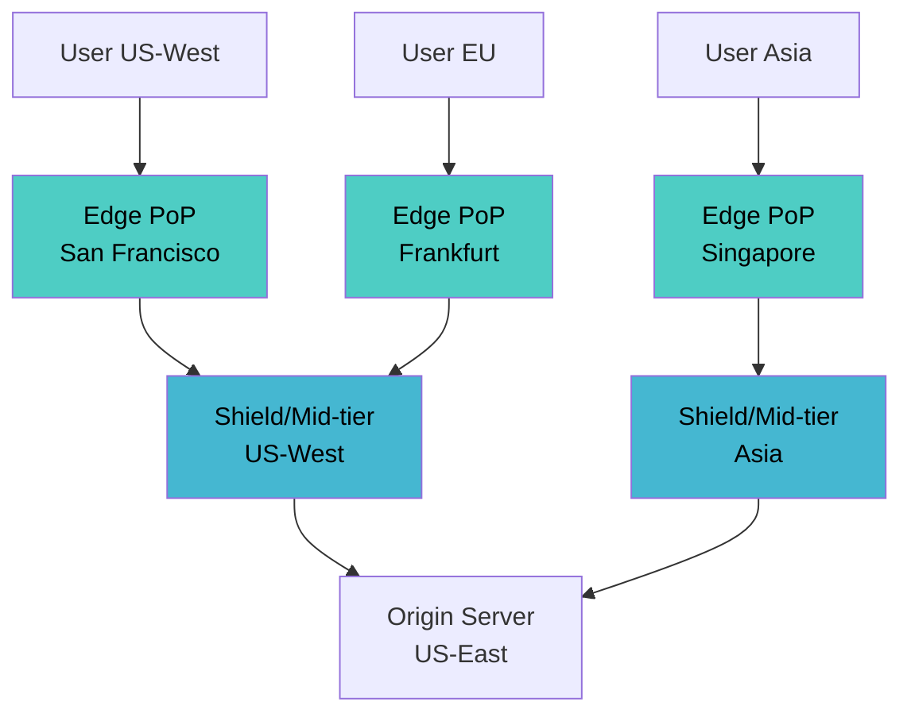
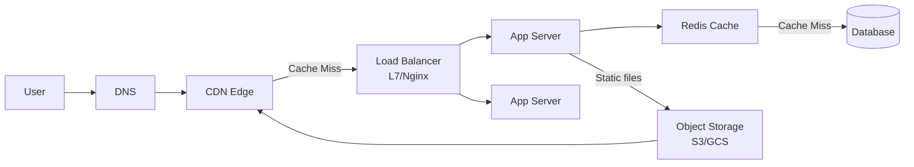

# Chapter 11: Load Balancing, Caching & CDN

[← Chapter 10: Scalability & Performance](ch10-scalability-and-performance.md) | [Chapter 12: Database Scaling →](ch12-database-scaling.md)

---

## 11.1 Load Balancing

A load balancer distributes incoming traffic across multiple servers to improve availability, throughput, and reliability.

### Where Load Balancers Live



### L4 vs L7 Load Balancing

| Aspect | Layer 4 (Transport) | Layer 7 (Application) |
|--------|---------------------|----------------------|
| **Operates on** | TCP/UDP packets | HTTP requests |
| **Sees** | IP address, port | URL, headers, cookies, body |
| **Speed** | Very fast (no parsing) | Slower (must parse HTTP) |
| **Routing** | By connection | By content |
| **Use case** | High throughput, simple routing | Path-based, header-based routing |
| **Examples** | AWS NLB, HAProxy (TCP mode) | Nginx, AWS ALB, Envoy |
| **SSL termination** | Pass-through or terminate | Typically terminates |

### Load Balancing Algorithms

```python
from abc import ABC, abstractmethod
import random
import hashlib
import itertools

class LoadBalancer(ABC):
    def __init__(self, servers: list[str]):
        self.servers = servers
    
    @abstractmethod
    def next_server(self, request: dict = None) -> str:
        pass


class RoundRobin(LoadBalancer):
    """Even distribution. Simple. Ignores server health/load."""
    def __init__(self, servers):
        super().__init__(servers)
        self._cycle = itertools.cycle(servers)
    
    def next_server(self, request=None) -> str:
        return next(self._cycle)


class WeightedRoundRobin(LoadBalancer):
    """Servers with more capacity get more traffic."""
    def __init__(self, servers_with_weights: list[tuple[str, int]]):
        # [("s1", 3), ("s2", 1)] → s1 gets 75%, s2 gets 25%
        expanded = []
        for server, weight in servers_with_weights:
            expanded.extend([server] * weight)
        super().__init__(expanded)
        self._cycle = itertools.cycle(self.servers)
    
    def next_server(self, request=None) -> str:
        return next(self._cycle)


class LeastConnections(LoadBalancer):
    """Route to server with fewest active connections."""
    def __init__(self, servers):
        super().__init__(servers)
        self.active_connections = {s: 0 for s in servers}
    
    def next_server(self, request=None) -> str:
        server = min(self.active_connections, key=self.active_connections.get)
        self.active_connections[server] += 1
        return server
    
    def release(self, server: str):
        self.active_connections[server] -= 1


class IPHash(LoadBalancer):
    """Same client IP always goes to same server (session affinity)."""
    def next_server(self, request=None) -> str:
        client_ip = request.get("client_ip", "0.0.0.0")
        index = int(hashlib.md5(client_ip.encode()).hexdigest(), 16) % len(self.servers)
        return self.servers[index]
```

### Algorithm Selection Guide

| Algorithm | Best For | Weakness |
|-----------|----------|----------|
| **Round Robin** | Homogeneous servers, stateless | Ignores server load |
| **Weighted RR** | Mixed-capacity servers | Static weights, no adaptivity |
| **Least Connections** | Varying request durations | Overhead tracking connections |
| **IP Hash** | Session affinity needed | Uneven distribution, failover breaks sessions |
| **Random** | Large server pools | Less even than round robin |
| **Least Response Time** | Performance-sensitive | Requires health monitoring |

### Health Checks



```java
// Health check endpoint — not just "is the server up" but "is it functioning?"
@RestController
public class HealthController {
    
    @Autowired private DataSource dataSource;
    @Autowired private RedisTemplate<String, String> redis;
    
    @GetMapping("/health")
    public ResponseEntity<Map<String, Object>> health() {
        Map<String, Object> status = new HashMap<>();
        boolean healthy = true;
        
        // Check database connectivity
        try {
            dataSource.getConnection().isValid(2);
            status.put("database", "up");
        } catch (Exception e) {
            status.put("database", "down");
            healthy = false;
        }
        
        // Check cache connectivity
        try {
            redis.opsForValue().get("health-check");
            status.put("cache", "up");
        } catch (Exception e) {
            status.put("cache", "down");
            healthy = false;
        }
        
        status.put("status", healthy ? "healthy" : "degraded");
        return ResponseEntity
            .status(healthy ? 200 : 503)
            .body(status);
    }
}
```

### High Availability for Load Balancers

The load balancer itself is a single point of failure. Solution: Active-passive pair with VRRP (Virtual Router Redundancy Protocol) or floating IP.



---

## 11.2 Caching

Caching stores copies of frequently accessed data closer to the consumer, reducing latency and load on downstream services.

### Cache at Every Layer



Each layer reduces load on the next — a request served by CDN never reaches your servers.

### Caching Strategies

#### 1. Cache-Aside (Lazy Loading)

Application manages the cache explicitly. Most common pattern.



```python
class CacheAsideService:
    def __init__(self, cache, database):
        self.cache = cache
        self.db = database
    
    def get_user(self, user_id: str) -> dict:
        # 1. Check cache first
        cached = self.cache.get(f"user:{user_id}")
        if cached:
            return cached  # Cache HIT
        
        # 2. Cache MISS → query database
        user = self.db.query("SELECT * FROM users WHERE id = %s", user_id)
        
        # 3. Populate cache for next time
        self.cache.set(f"user:{user_id}", user, ttl=3600)
        
        return user
    
    def update_user(self, user_id: str, data: dict):
        # Update database
        self.db.update("UPDATE users SET ... WHERE id = %s", user_id, data)
        
        # Invalidate cache (don't update — delete and let next read repopulate)
        self.cache.delete(f"user:{user_id}")
```

**Pros**: Only caches data that's actually requested. Cache failure = slower, not broken.
**Cons**: Cache miss penalty (3 round trips: check cache, query DB, populate cache). Stale data between write and invalidation.

#### 2. Write-Through

Every write goes through the cache to the database.

```python
class WriteThroughService:
    def get_user(self, user_id: str) -> dict:
        # Always read from cache (it's always up-to-date)
        return self.cache.get(f"user:{user_id}")
    
    def update_user(self, user_id: str, data: dict):
        # Write to both cache AND database atomically
        user = {**self.db.get_user(user_id), **data}
        self.cache.set(f"user:{user_id}", user)
        self.db.update("UPDATE users SET ... WHERE id = %s", user_id, data)
```

**Pros**: Cache always consistent with database.
**Cons**: Write latency penalty (2 writes per operation). Caches data that might never be read.

#### 3. Write-Behind (Write-Back)

Write to cache immediately, async flush to database.

```python
class WriteBehindService:
    def update_user(self, user_id: str, data: dict):
        # Write to cache immediately (fast!)
        self.cache.set(f"user:{user_id}", data)
        
        # Queue database write for later
        self.write_queue.enqueue({
            "table": "users",
            "id": user_id,
            "data": data,
        })
    
    # Background worker flushes writes to DB
    def flush_worker(self):
        batch = self.write_queue.dequeue_batch(100)
        self.db.bulk_update(batch)
```

**Pros**: Extremely fast writes. Can batch database writes.
**Cons**: Data loss risk if cache crashes before flush. Complex consistency.

#### 4. Read-Through

Cache itself is responsible for loading from the database on misses.

```java
// Using Caffeine cache with a CacheLoader (read-through)
LoadingCache<String, User> userCache = Caffeine.newBuilder()
    .maximumSize(10_000)
    .expireAfterWrite(Duration.ofMinutes(30))
    .build(userId -> {
        // This runs automatically on cache miss
        return userRepository.findById(userId);
    });

// Usage — caller doesn't know about the database
User user = userCache.get("user:123"); // Transparent loading
```

### Caching Strategy Comparison



| Strategy | Read Performance | Write Performance | Consistency | Complexity |
|----------|-----------------|-------------------|-------------|------------|
| **Cache-Aside** | Miss penalty | N/A (app writes DB) | Eventually | Low |
| **Read-Through** | Miss penalty | N/A | Eventually | Medium |
| **Write-Through** | Always hit | Slower (2 writes) | Strong | Medium |
| **Write-Behind** | Always hit | Very fast | Weak | High |

### Cache Eviction Policies

When the cache is full, which items do you remove?

```python
from collections import OrderedDict

class LRUCache:
    """Least Recently Used — evict the item not accessed longest."""
    def __init__(self, capacity: int):
        self.capacity = capacity
        self.cache = OrderedDict()
    
    def get(self, key: str):
        if key not in self.cache:
            return None
        self.cache.move_to_end(key)  # Mark as recently used
        return self.cache[key]
    
    def put(self, key: str, value):
        if key in self.cache:
            self.cache.move_to_end(key)
        self.cache[key] = value
        if len(self.cache) > self.capacity:
            self.cache.popitem(last=False)  # Evict least recently used
```

| Policy | Evicts | Best For |
|--------|--------|----------|
| **LRU** | Least recently used | General purpose, temporal locality |
| **LFU** | Least frequently used | Stable popularity (product catalog) |
| **FIFO** | Oldest entry | Simple, when age = irrelevance |
| **TTL** | Expired entries | Time-sensitive data (sessions, tokens) |
| **Random** | Random entry | Large caches where precision doesn't matter |

### The Two Hard Problems in Caching

#### Problem 1: Cache Invalidation



**Solutions**:
- **TTL (Time-to-Live)**: Accept eventual consistency. Set expiry.
- **Event-driven invalidation**: Database change → publish event → invalidate cache.
- **Version stamps**: Include version in cache key. New version = cache miss.

#### Problem 2: Thundering Herd (Cache Stampede)

When a popular cached item expires, hundreds of concurrent requests all miss the cache and hit the database simultaneously.

```python
import threading

class ThunderingHerdProtection:
    def __init__(self, cache, db):
        self.cache = cache
        self.db = db
        self.locks = {}
    
    def get_with_lock(self, key: str) -> dict:
        # Check cache
        value = self.cache.get(key)
        if value:
            return value
        
        # Acquire per-key lock — only one thread fetches from DB
        if key not in self.locks:
            self.locks[key] = threading.Lock()
        
        with self.locks[key]:
            # Double-check after acquiring lock
            value = self.cache.get(key)
            if value:
                return value
            
            # Only ONE thread reaches here
            value = self.db.query(key)
            self.cache.set(key, value, ttl=3600)
            return value
```

Alternative: **Stale-while-revalidate** — serve stale data while refreshing in the background.

---

## 11.3 Content Delivery Network (CDN)

A CDN is a globally distributed network of servers that caches content closer to users.

### How CDN Works



### Push vs Pull CDN

| Aspect | Push CDN | Pull CDN |
|--------|----------|----------|
| **How** | You upload content to CDN | CDN fetches on first request |
| **Control** | Full control over what's cached | Automatic, based on demand |
| **Best for** | Static assets, known content | Dynamic content, long tail |
| **Examples** | Pre-deploy assets, video encoding | Most web CDNs (CloudFront, Cloudflare) |
| **Invalidation** | Upload new version | Purge + TTL |

### CDN Cache-Control Headers

```
# Static assets (long cache, versioned filenames)
Cache-Control: public, max-age=31536000, immutable
# File: /static/app.a3b2c1.js (hash in filename = cache bust on change)

# API responses (short cache)
Cache-Control: public, max-age=60, s-maxage=300
# Browser caches 60s, CDN caches 300s

# Private data (never cache on CDN)
Cache-Control: private, no-store
# Session data, user-specific pages

# Stale-while-revalidate
Cache-Control: public, max-age=60, stale-while-revalidate=300
# Serve stale for 300s while fetching fresh in background
```

### What to Cache on a CDN

| Content Type | Cache? | TTL | Strategy |
|-------------|--------|-----|----------|
| Static assets (JS, CSS, images) | ✅ Always | Long (1 year) | Content-hash in filename |
| Public API responses | ✅ Often | Short (1-5 min) | Vary header for API versioning |
| HTML pages | ⚠️ Depends | Short (30-60s) | Edge-side includes for personalization |
| User-specific data | ❌ Never | N/A | `Cache-Control: private` |
| Real-time data | ❌ Never | N/A | WebSocket, SSE |

### Multi-Tier CDN Architecture



The shield/mid-tier layer protects the origin from thundering herds when multiple edge PoPs have simultaneous cache misses.

---

## 11.4 Putting It All Together

### Complete Request Flow



### Example: Building a Fast Product Page

```python
class ProductPageService:
    """Multi-layer caching for a product page."""
    
    def __init__(self, cache, db, cdn_client):
        self.cache = cache
        self.db = db
        self.cdn = cdn_client
    
    def get_product(self, product_id: str) -> dict:
        # Layer 1: Application cache (Redis, ~1ms)
        product = self.cache.get(f"product:{product_id}")
        if product:
            return product
        
        # Layer 2: Database query (~5-10ms)
        product = self.db.query(
            "SELECT * FROM products WHERE id = %s", product_id
        )
        
        # Populate application cache
        self.cache.set(f"product:{product_id}", product, ttl=300)
        
        return product
    
    def update_product(self, product_id: str, data: dict):
        # 1. Update database (source of truth)
        self.db.update("UPDATE products SET ... WHERE id = %s", product_id, data)
        
        # 2. Invalidate application cache
        self.cache.delete(f"product:{product_id}")
        
        # 3. Purge CDN cache for this product's page
        self.cdn.purge(f"/products/{product_id}")
```

```java
@Service
public class ProductService {
    
    @Autowired private RedisTemplate<String, Product> redis;
    @Autowired private ProductRepository repository;
    
    // Multi-level caching with Spring
    @Cacheable(value = "products", key = "#productId")  // L1: JVM cache
    public Product getProduct(String productId) {
        // L2: Redis
        Product cached = redis.opsForValue().get("product:" + productId);
        if (cached != null) return cached;
        
        // L3: Database
        Product product = repository.findById(productId)
            .orElseThrow(() -> new NotFoundException("Product not found"));
        
        redis.opsForValue().set(
            "product:" + productId,
            product,
            Duration.ofMinutes(5)
        );
        
        return product;
    }
}
```

---

## Key Takeaways

| Concept | Key Point |
|---------|-----------|
| **L4 vs L7 LB** | L4 is faster (TCP level), L7 is smarter (HTTP routing) |
| **LB algorithm** | Round Robin for simple, Least Connections for variable-duration requests |
| **Cache-Aside** | Most common: check cache → miss → query DB → populate cache |
| **Write-Behind** | Fastest writes but risk data loss on cache failure |
| **Cache invalidation** | TTL for simplicity, events for accuracy |
| **Thundering herd** | Use locks, stale-while-revalidate, or request coalescing |
| **CDN** | Cache static content at edge; use content-hash filenames for cache busting |
| **Multi-tier** | Browser → CDN → App cache → DB cache; each layer reduces load on the next |

---

## Practice Questions

1. **You have 10 servers behind a load balancer. Server 3 is twice as powerful as the others. Which algorithm do you choose and why?** What changes if requests have highly variable processing times?

2. **Your cache hit rate is 60%. How would you improve it?** Think about key design, TTL tuning, cache warming, and what data is actually cache-worthy.

3. **A popular product page is updated, but users still see the old version for up to 5 minutes. Explain the full invalidation chain** from database update to user seeing fresh content (app cache, CDN, browser cache).

4. **Design a caching strategy for a news feed** where posts are personalized per user. Can you cache individual posts? Can you cache the feed? How do you handle a post being deleted?

5. **Your CDN bill doubled last month. What investigation steps would you take?** Think about cache hit ratio, origin shield, unnecessary cache-busting, and hot content.

---

[← Chapter 10: Scalability & Performance](ch10-scalability-and-performance.md) | [Chapter 12: Database Scaling →](ch12-database-scaling.md)
