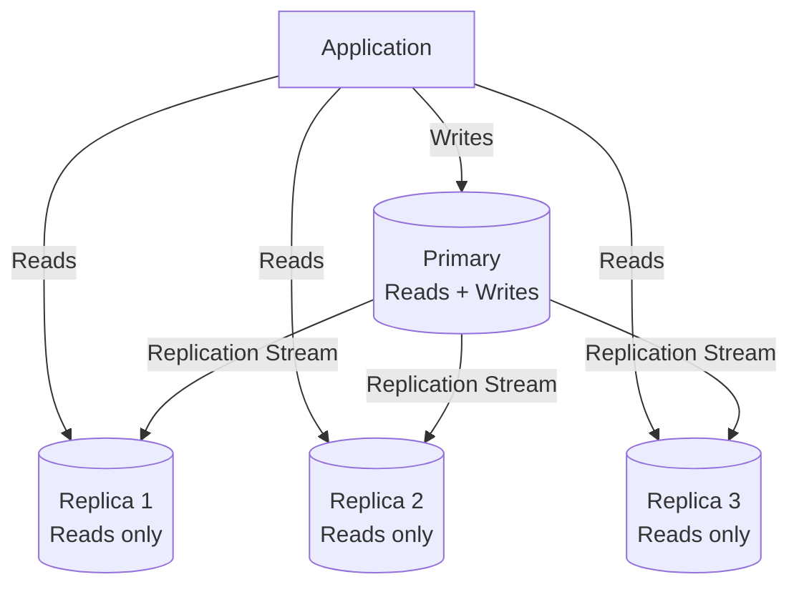
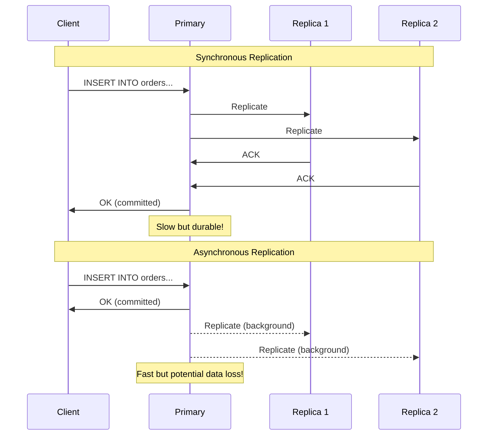
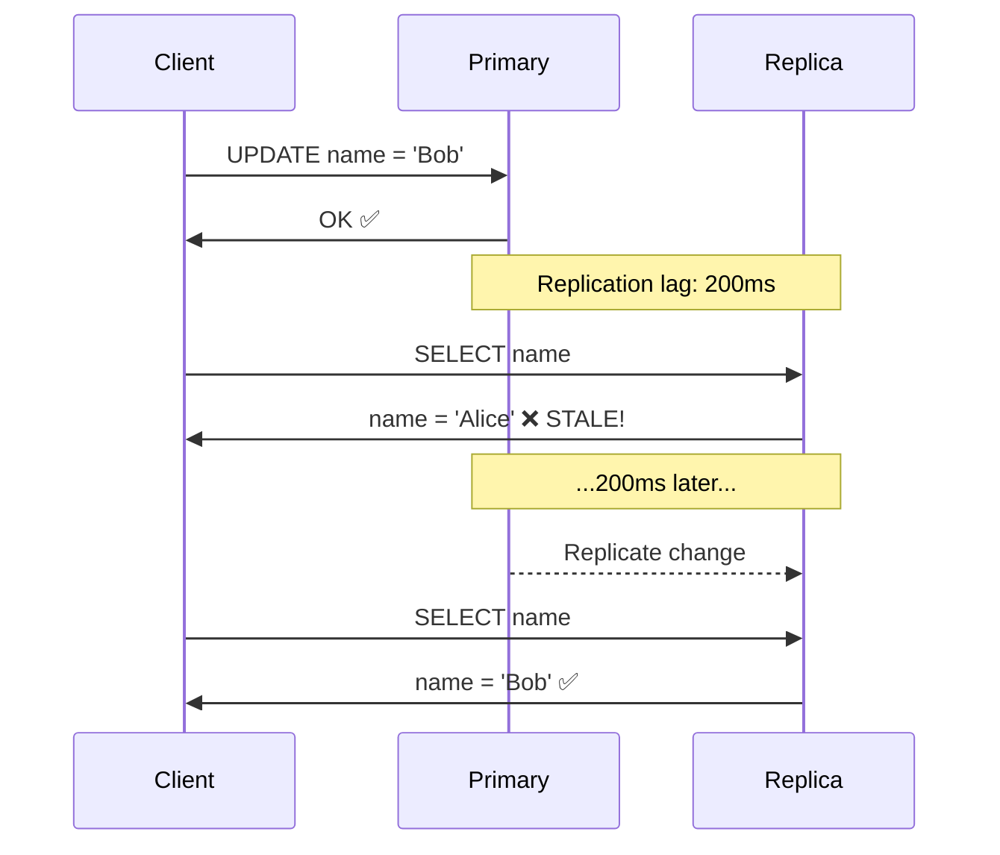
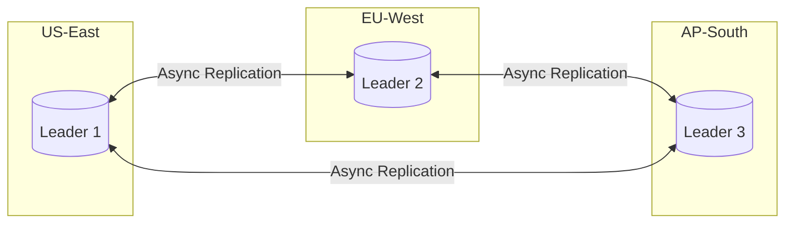
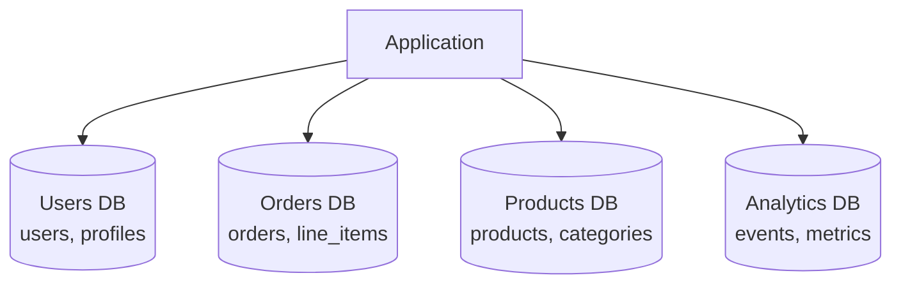
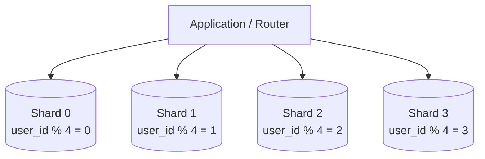
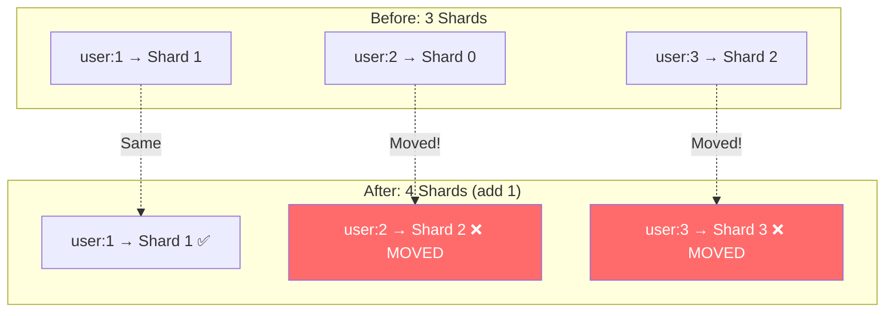
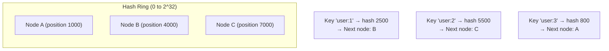
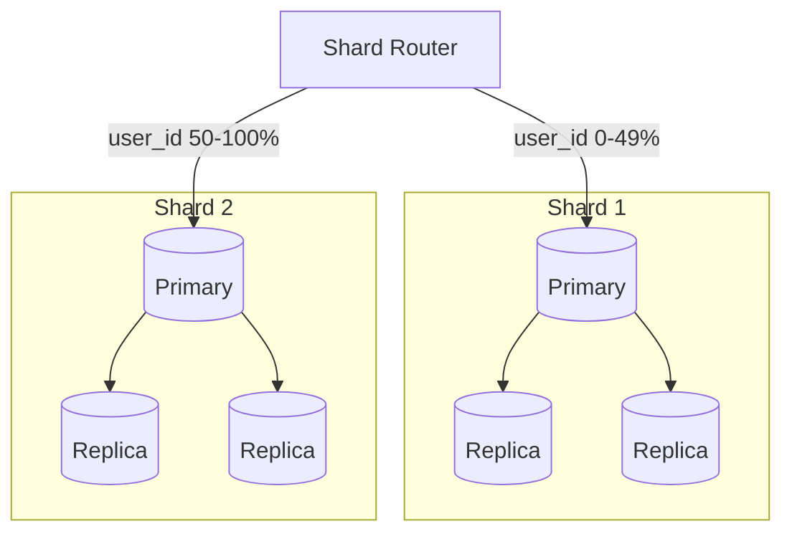
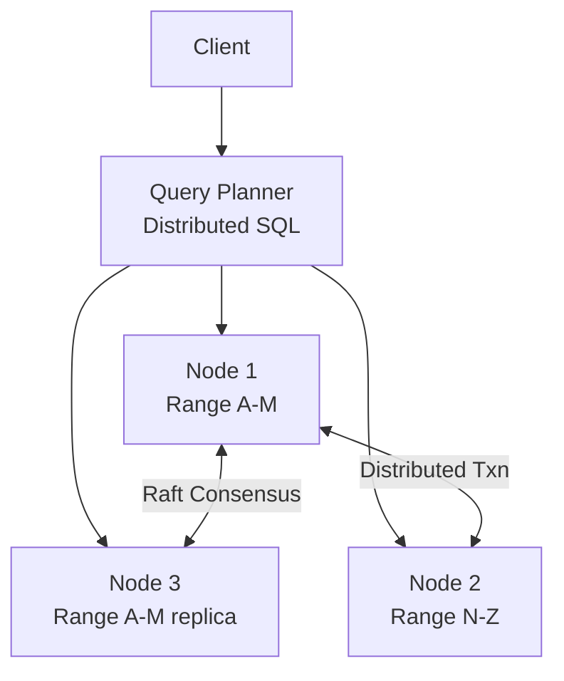

# Chapter 12: Database Scaling

[← Chapter 11: Load Balancing, Caching & CDN](ch11-load-balancing-caching-cdn.md) | [Chapter 13: Message Queues & Async Processing →](ch13-message-queues-async.md)

---

## 12.1 Why Databases Are the Hardest to Scale

Applications are stateless — add more servers and you're done. Databases are stateful — every copy must agree on what the data "is." This fundamental challenge makes database scaling the bottleneck in most systems.

### The Scaling Spectrum


Each step adds complexity. Only move to the next when you've exhausted the current level.

---

## 12.2 Replication

Replication creates copies of data across multiple servers.

### Single-Leader Replication

One server (primary/leader) accepts writes. Replicas receive a stream of changes.



### Synchronous vs Asynchronous Replication



| Aspect | Synchronous | Asynchronous | Semi-Synchronous |
|--------|------------|--------------|------------------|
| **Commit waits for** | All replicas | None | 1 replica |
| **Durability** | No data loss | Up to seconds lost | ≤ 1 replica behind |
| **Latency** | High (slowest replica) | Low | Moderate |
| **Availability** | Replica failure blocks writes | No impact | 1 failure tolerated |
| **Use case** | Financial transactions | Most applications | Good compromise |

### Replication Lag Problems



```python
# Problem: Read-after-write inconsistency
class UserService:
    def update_profile(self, user_id, new_name):
        self.primary.execute(
            "UPDATE users SET name = %s WHERE id = %s", new_name, user_id
        )
    
    def get_profile(self, user_id):
        # Reads from replica — might not have the update yet!
        return self.replica.execute(
            "SELECT * FROM users WHERE id = %s", user_id
        )
    
    # Fix 1: Read-your-writes consistency
    def get_profile_consistent(self, user_id, just_updated=False):
        if just_updated:
            return self.primary.execute(  # Read from primary after writes
                "SELECT * FROM users WHERE id = %s", user_id
            )
        return self.replica.execute(
            "SELECT * FROM users WHERE id = %s", user_id
        )
    
    # Fix 2: Monotonic reads — always read from the same replica
    def get_profile_monotonic(self, user_id, session_replica_id=None):
        replica = self.get_replica(session_replica_id)  # Sticky replica
        return replica.execute(
            "SELECT * FROM users WHERE id = %s", user_id
        )
```

### Multi-Leader Replication

Multiple servers accept writes. Used for multi-datacenter setups.



**The write conflict problem**: User A updates row in US-East, User B updates same row in EU-West simultaneously. Both succeed locally. During replication — conflict!

**Conflict resolution strategies**:
- **Last-Write-Wins (LWW)**: Highest timestamp wins. Simple but loses data.
- **Application-level resolution**: Return both versions, let app merge (e.g., Google Docs).
- **CRDTs**: Conflict-free Replicated Data Types — mathematically guaranteed to converge.

---

## 12.3 Partitioning (Sharding)

When a single database can't hold or process all data, split it across multiple databases.

### Vertical Partitioning (Functional Split)

Split by feature/table — each service gets its own database.



**Pros**: Natural boundary, independent scaling, different DB types per use case.
**Cons**: Cross-partition joins impossible, distributed transactions needed.

### Horizontal Partitioning (Sharding)

Split rows of the same table across multiple databases using a shard key.



### Shard Key Selection (Critical Decision)

```python
class ShardKeyAnalysis:
    """The shard key determines EVERYTHING about your data distribution."""
    
    # ✅ GOOD: User ID — even distribution, user queries are single-shard
    def shard_by_user(self, user_id: int, num_shards: int) -> int:
        return hash(user_id) % num_shards
    
    # ⚠️ RISKY: Timestamp — all recent writes go to one shard (hot shard)
    def shard_by_time(self, created_at: datetime, num_shards: int) -> int:
        return created_at.month % num_shards  # Dec: all writes to shard 11!
    
    # ❌ BAD: Country — USA shard has 10× more data than others
    def shard_by_country(self, country: str, num_shards: int) -> int:
        return hash(country) % num_shards  # Extreme skew!
    
    # ✅ BETTER: Compound key for balanced distribution
    def shard_compound(self, user_id: int, timestamp: int, num_shards: int) -> int:
        return hash(f"{user_id}:{timestamp // 86400}") % num_shards
```

### Shard Key Properties

| Property | Why It Matters | Example |
|----------|---------------|---------|
| **High cardinality** | More unique values = more even distribution | user_id ✅, country ❌ |
| **Even distribution** | No hot shards | hash(key) ✅, raw timestamp ❌ |
| **Query isolation** | Single-shard queries are fast | user queries by user_id ✅ |
| **Write distribution** | No single shard bottleneck | random ✅, auto-increment ❌ |

### Cross-Shard Queries (The Pain)

```python
class ShardedQueryService:
    def __init__(self, shards: list):
        self.shards = shards
    
    # ✅ Single-shard query — fast
    def get_user_orders(self, user_id: str) -> list:
        shard = self.get_shard(user_id)
        return shard.query("SELECT * FROM orders WHERE user_id = %s", user_id)
    
    # ❌ Cross-shard query — scatter-gather, SLOW
    def get_recent_orders_globally(self, limit: int = 20) -> list:
        all_orders = []
        for shard in self.shards:  # Query ALL shards
            orders = shard.query(
                "SELECT * FROM orders ORDER BY created_at DESC LIMIT %s", limit
            )
            all_orders.extend(orders)
        
        # Merge and re-sort (expensive!)
        all_orders.sort(key=lambda o: o["created_at"], reverse=True)
        return all_orders[:limit]
    
    # ❌ Cross-shard JOIN — extremely painful
    def get_order_with_product_details(self, order_id: str):
        # Order is on user shard, product is on product shard
        # Can't JOIN across shards — must do application-level join
        order = self.order_shard.query("SELECT * FROM orders WHERE id = %s", order_id)
        product_ids = [item["product_id"] for item in order["items"]]
        products = self.product_shard.query(
            "SELECT * FROM products WHERE id IN (%s)", product_ids
        )
        # Assemble in application code
        return self.merge(order, products)
```

---

## 12.4 Consistent Hashing

When you add or remove shards with modulo hashing (`hash(key) % N`), almost all keys get reassigned. Consistent hashing minimizes this.

### The Problem with Modulo Hashing



```
With 3 shards: hash("user:1") % 3 = 1 → Shard 1
               hash("user:2") % 3 = 0 → Shard 0
               hash("user:3") % 3 = 2 → Shard 2

Add shard 4:   hash("user:1") % 4 = 1 → Shard 1 ✅ (same)
               hash("user:2") % 4 = 2 → Shard 2 ❌ (MOVED from 0!)
               hash("user:3") % 4 = 3 → Shard 3 ❌ (MOVED from 2!)

~75% of keys move when adding 1 shard out of 3!
```

### Consistent Hashing Solution



```python
import hashlib
from bisect import bisect_right

class ConsistentHashRing:
    def __init__(self, virtual_nodes: int = 150):
        self.virtual_nodes = virtual_nodes
        self.ring = {}       # hash_value → real node
        self.sorted_keys = []  # sorted hash positions
    
    def _hash(self, key: str) -> int:
        return int(hashlib.md5(key.encode()).hexdigest(), 16)
    
    def add_node(self, node: str):
        """Add a node with virtual nodes for better distribution."""
        for i in range(self.virtual_nodes):
            virtual_key = f"{node}:vn{i}"
            hash_val = self._hash(virtual_key)
            self.ring[hash_val] = node
            self.sorted_keys.append(hash_val)
        self.sorted_keys.sort()
    
    def remove_node(self, node: str):
        """Remove node — only keys on this node get reassigned."""
        for i in range(self.virtual_nodes):
            virtual_key = f"{node}:vn{i}"
            hash_val = self._hash(virtual_key)
            del self.ring[hash_val]
            self.sorted_keys.remove(hash_val)
    
    def get_node(self, key: str) -> str:
        """Find which node a key belongs to."""
        if not self.ring:
            return None
        hash_val = self._hash(key)
        # Find the next node clockwise on the ring
        idx = bisect_right(self.sorted_keys, hash_val)
        if idx == len(self.sorted_keys):
            idx = 0  # Wrap around
        return self.ring[self.sorted_keys[idx]]

# When adding a new node, only ~1/N of keys move (not ~N-1/N)
ring = ConsistentHashRing()
ring.add_node("db-server-1")
ring.add_node("db-server-2")
ring.add_node("db-server-3")

print(ring.get_node("user:alice"))  # → "db-server-2"
print(ring.get_node("user:bob"))    # → "db-server-1"

# Add a 4th server — only ~25% of keys move, not ~75%
ring.add_node("db-server-4")
```

### Why Virtual Nodes?

Without virtual nodes, if you have 3 physical nodes, they might land unevenly on the ring (one node handles 60% of keys). Virtual nodes (100-200 per physical node) ensure each physical node has many points on the ring, averaging out to ~1/N of the key space.

---

## 12.5 Partitioning Strategies

### Range-Based Partitioning

```python
class RangePartitioner:
    """Split by key ranges. Good for range queries, bad for hot spots."""
    
    def __init__(self):
        self.ranges = [
            ("A", "G", "shard-1"),   # Users A-F
            ("G", "N", "shard-2"),   # Users G-M
            ("N", "T", "shard-3"),   # Users N-S
            ("T", "ZZZ", "shard-4"), # Users T-Z
        ]
    
    def get_shard(self, key: str) -> str:
        for start, end, shard in self.ranges:
            if start <= key < end:
                return shard
        return self.ranges[-1][2]  # Default to last shard
    
    # ✅ Advantage: Range queries are efficient
    def get_users_in_range(self, start: str, end: str):
        # Only need to query 1-2 shards for "users A-D"
        pass
    
    # ❌ Disadvantage: Hot spots
    # If most users have names starting with "S", shard-3 is overloaded
```

### Hash-Based Partitioning

```python
class HashPartitioner:
    """Split by hash(key). Even distribution, but no range queries."""
    
    def __init__(self, num_shards: int):
        self.num_shards = num_shards
    
    def get_shard(self, key: str) -> int:
        return hash(key) % self.num_shards
    
    # ✅ Advantage: Even distribution regardless of key patterns
    
    # ❌ Disadvantage: Range queries scatter across all shards
    def get_users_in_range(self, start: str, end: str):
        # Must query ALL shards — hash destroys ordering
        pass
```

### Directory-Based Partitioning

```python
class DirectoryPartitioner:
    """Lookup table maps each key to its shard. Maximum flexibility."""
    
    def __init__(self, lookup_store):
        self.lookup = lookup_store  # Redis or similar
    
    def get_shard(self, key: str) -> str:
        return self.lookup.get(f"shard_map:{key}")
    
    def move_key(self, key: str, from_shard: str, to_shard: str):
        """Can rebalance individual keys — maximum flexibility."""
        data = from_shard.read(key)
        to_shard.write(key, data)
        self.lookup.set(f"shard_map:{key}", to_shard.name)
        from_shard.delete(key)
    
    # ✅ Advantage: Can rebalance without rehashing
    # ❌ Disadvantage: Lookup table is a single point of failure + extra latency
```

### Comparison

| Strategy | Distribution | Range Queries | Rebalancing | Complexity |
|----------|-------------|---------------|-------------|------------|
| **Range** | Uneven (skew risk) | Efficient | Move ranges | Low |
| **Hash** | Even | Scatter-gather | Rehash + migrate | Medium |
| **Consistent Hash** | Even | Scatter-gather | Minimal migration | Medium |
| **Directory** | Flexible | Depends | Per-key control | High |

---

## 12.6 Scaling Patterns in Practice

### Pattern: Shard + Replicate

Each shard has its own replicas for read scaling and fault tolerance.



### Pattern: Read Replicas + Cache

For read-heavy workloads, combine replicas with caching.

```java
@Service
public class UserService {
    @Autowired private JdbcTemplate primaryDb;    // Writes
    @Autowired private JdbcTemplate replicaDb;    // Reads
    @Autowired private RedisTemplate<String, User> cache;
    
    public User getUser(String userId) {
        // Level 1: Redis cache (~1ms)
        User cached = cache.opsForValue().get("user:" + userId);
        if (cached != null) return cached;
        
        // Level 2: Read replica (~5ms)
        User user = replicaDb.queryForObject(
            "SELECT * FROM users WHERE id = ?",
            new UserRowMapper(), userId
        );
        
        // Populate cache
        cache.opsForValue().set("user:" + userId, user, Duration.ofMinutes(10));
        return user;
    }
    
    public void updateUser(String userId, UserUpdate update) {
        // Write to primary
        primaryDb.update("UPDATE users SET name = ? WHERE id = ?",
            update.getName(), userId);
        
        // Invalidate cache immediately
        cache.delete("user:" + userId);
        
        // Note: Replica will catch up via replication (async)
    }
}
```

### Pattern: CQRS with Separate Read Store

```python
class WriteService:
    """Writes go to normalized relational database."""
    def create_order(self, order: Order):
        self.primary_db.insert("orders", order.to_dict())
        self.primary_db.insert_many("order_items", 
            [item.to_dict() for item in order.items])
        
        # Publish event
        self.event_bus.publish("order.created", order)


class ReadProjection:
    """Listens to events, builds denormalized read models."""
    def on_order_created(self, event: OrderCreated):
        # Build a read-optimized view in Elasticsearch or MongoDB
        self.read_store.upsert("user_orders", {
            "user_id": event.user_id,
            "order_id": event.order_id,
            "total": event.total,
            "status": "created",
            "item_count": len(event.items),
            "created_at": event.timestamp,
        })
        
        # Update aggregated stats
        self.read_store.increment(
            f"user_stats:{event.user_id}",
            {"total_orders": 1, "total_spent": event.total}
        )


class ReadService:
    """Reads from denormalized store — no JOINs, no sharding pain."""
    def get_user_orders(self, user_id: str) -> list:
        return self.read_store.query("user_orders", {"user_id": user_id})
```

---

## 12.7 NewSQL and Distributed SQL

NewSQL databases (CockroachDB, Google Spanner, YugabyteDB, TiDB) offer the best of both worlds: SQL semantics with horizontal scalability.

### How They Work



| Feature | Traditional SQL | NoSQL | NewSQL |
|---------|----------------|-------|--------|
| SQL support | Full | Limited/None | Full |
| ACID transactions | Single-node | No | Distributed |
| Horizontal scaling | Manual sharding | Built-in | Built-in |
| Schema | Fixed | Flexible | Fixed |
| Latency | Low (single node) | Low | Higher (consensus) |
| Complexity | Low (ops = you shard) | Low | Medium (built-in) |

**Trade-off**: NewSQL adds latency per write (due to consensus protocol) but eliminates the massive operational burden of manual sharding.

---

## Key Takeaways

| Concept | Key Point |
|---------|-----------|
| **Replication** | Read scaling + fault tolerance; async is fast but risks data loss |
| **Replication lag** | Causes stale reads; fix with read-your-writes or sticky sessions |
| **Sharding** | Split by shard key; bad key = hot shards + cross-shard pain |
| **Shard key** | High cardinality, even distribution, query-aligned |
| **Consistent hashing** | Add/remove nodes with minimal key movement; virtual nodes for balance |
| **Cross-shard queries** | Scatter-gather is expensive; design to avoid them |
| **Scaling order** | Cache → read replicas → vertical partition → horizontal shard |
| **NewSQL** | SQL + horizontal scale, but higher write latency |

---

## Practice Questions

1. **Your MySQL primary handles 5K writes/sec and 50K reads/sec. CPU is at 90%. What's your first scaling move?** Consider: read replicas (offload reads) vs vertical scale vs cache layer.

2. **You're sharding a social media database by user_id. How do you handle "get all posts from the last hour across all users"?** Consider CQRS, secondary indexes, or a separate analytics store.

3. **Explain what happens when you add a 4th shard to a 3-shard consistent hash ring.** How many keys move? Why are virtual nodes important?

4. **Your multi-leader setup in US and EU has a write conflict: User updates their email to `a@b.com` in US, and `c@d.com` in EU simultaneously.** What are your resolution options? What are the trade-offs?

5. **Design the database scaling architecture for an e-commerce platform** handling 100K orders/day, 10M products, 50M users. What do you shard by? What stays un-sharded? Where do you use caching?

---

[← Chapter 11: Load Balancing, Caching & CDN](ch11-load-balancing-caching-cdn.md) | [Chapter 13: Message Queues & Async Processing →](ch13-message-queues-async.md)
