# Chapter 13: Message Queues & Async Processing

[← Chapter 12: Database Scaling](ch12-database-scaling.md) | [Chapter 14: Microservices & API Design →](ch14-microservices-api-design.md)

---

## 13.1 Why Async?

Synchronous systems are simple but fragile: if any downstream service is slow or down, the entire request chain suffers.

### The Synchronous Problem

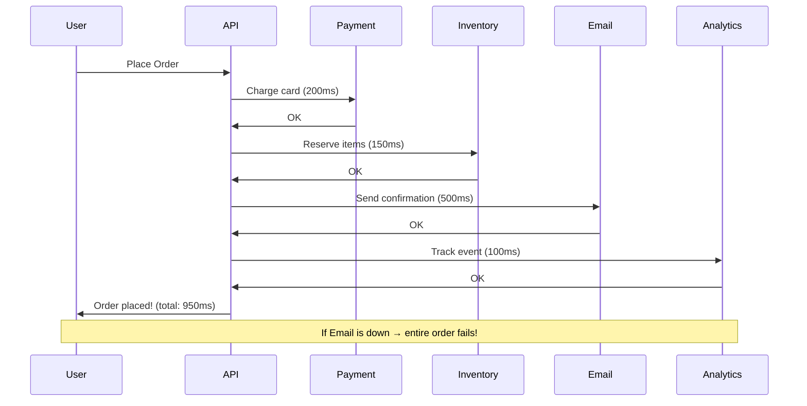

### The Async Solution

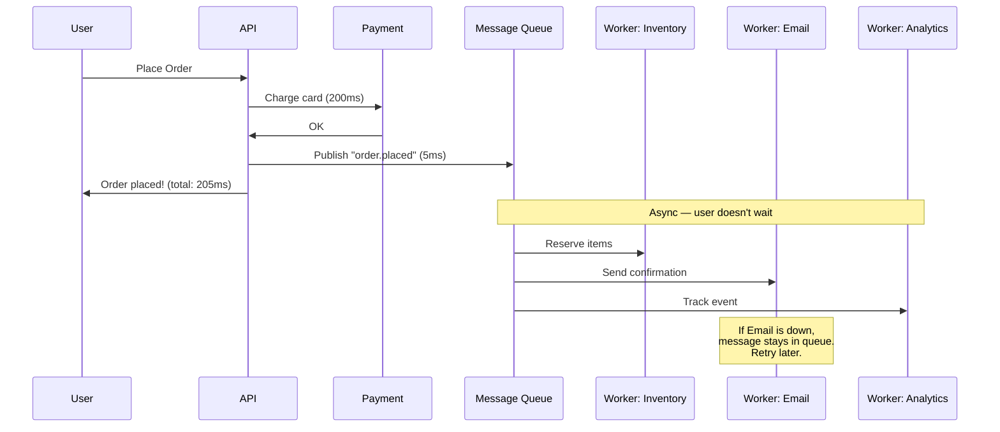

### When to Use Async

| Scenario | Sync or Async? | Why |
|----------|---------------|-----|
| User login/auth | Sync | User needs immediate response |
| Payment processing | Sync | Must know if it succeeded |
| Send welcome email | Async | User doesn't need to wait |
| Generate PDF report | Async | Takes seconds to minutes |
| Update search index | Async | Eventual consistency OK |
| Real-time chat message | Depends | Delivery can be async, display must feel real-time |

---

## 13.2 Message Queue Fundamentals

### Point-to-Point Queue

One producer, one consumer (or competing consumers). Each message is processed once.

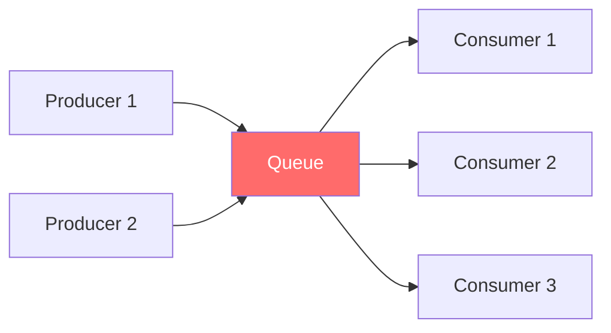

**Competing consumers**: Multiple consumers pull from the same queue. Each message goes to exactly one consumer, enabling parallel processing.

### Publish-Subscribe (Pub/Sub)

One producer, multiple subscriber groups. Each subscriber group gets every message.

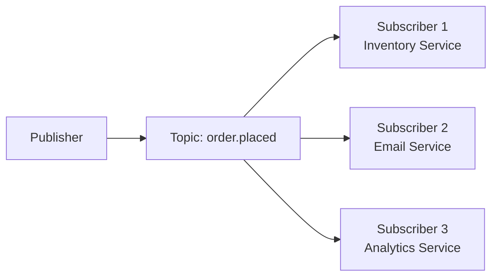

### Queue vs Pub/Sub

| Aspect | Queue | Pub/Sub |
|--------|-------|---------|
| **Consumers** | Competing (one gets message) | All subscribers get message |
| **Use case** | Task distribution | Event broadcasting |
| **Analogy** | Work queue — divide labor | Radio broadcast — everyone hears |
| **Examples** | Job processing, email sending | Event notification, data replication |

---

## 13.3 Delivery Guarantees

### At-Most-Once

Fire and forget. Message might be lost, never delivered twice.

```python
# At-most-once: Don't retry, accept loss
def send_at_most_once(queue, message):
    try:
        queue.send(message)
    except Exception:
        pass  # Lost message — acceptable for metrics, logs
```

### At-Least-Once

Retry until acknowledged. Message might be delivered multiple times.

```python
# At-least-once: Retry on failure
def send_at_least_once(queue, message, max_retries=3):
    for attempt in range(max_retries):
        try:
            queue.send(message)
            return  # Success
        except Exception:
            if attempt == max_retries - 1:
                dead_letter_queue.send(message)  # Give up → DLQ
            time.sleep(2 ** attempt)  # Exponential backoff
```

### Exactly-Once (The Holy Grail)

Impossible in a distributed system without trade-offs. Achieved via **idempotent consumers**.

```python
class IdempotentOrderProcessor:
    """Exactly-once PROCESSING via idempotency key."""
    
    def __init__(self, db, cache):
        self.db = db
        self.cache = cache
    
    def process_order(self, message: dict):
        idempotency_key = message["message_id"]
        
        # Check if already processed
        if self.cache.exists(f"processed:{idempotency_key}"):
            return  # Already done — skip (deduplication)
        
        # Process the order
        with self.db.transaction():
            self.db.insert("orders", message["order"])
            self.db.update("inventory", deduct=message["items"])
            
            # Mark as processed WITHIN the transaction
            self.db.insert("processed_messages", {
                "message_id": idempotency_key,
                "processed_at": datetime.utcnow(),
            })
        
        # Also cache for fast dedup of immediate retries
        self.cache.set(f"processed:{idempotency_key}", "1", ttl=86400)
```

```java
@Service
public class PaymentProcessor {
    
    @Autowired private PaymentRepository paymentRepo;
    
    /**
     * Idempotent payment processing.
     * Same idempotency key = same result, even if called multiple times.
     */
    @Transactional
    public PaymentResult processPayment(String idempotencyKey, PaymentRequest req) {
        // Check if already processed
        Optional<Payment> existing = paymentRepo.findByIdempotencyKey(idempotencyKey);
        if (existing.isPresent()) {
            return existing.get().toResult(); // Return cached result
        }
        
        // Process payment
        PaymentResult result = paymentGateway.charge(req);
        
        // Store with idempotency key
        Payment payment = Payment.builder()
            .idempotencyKey(idempotencyKey)
            .amount(req.getAmount())
            .status(result.getStatus())
            .build();
        paymentRepo.save(payment);
        
        return result;
    }
}
```

### Delivery Guarantee Comparison

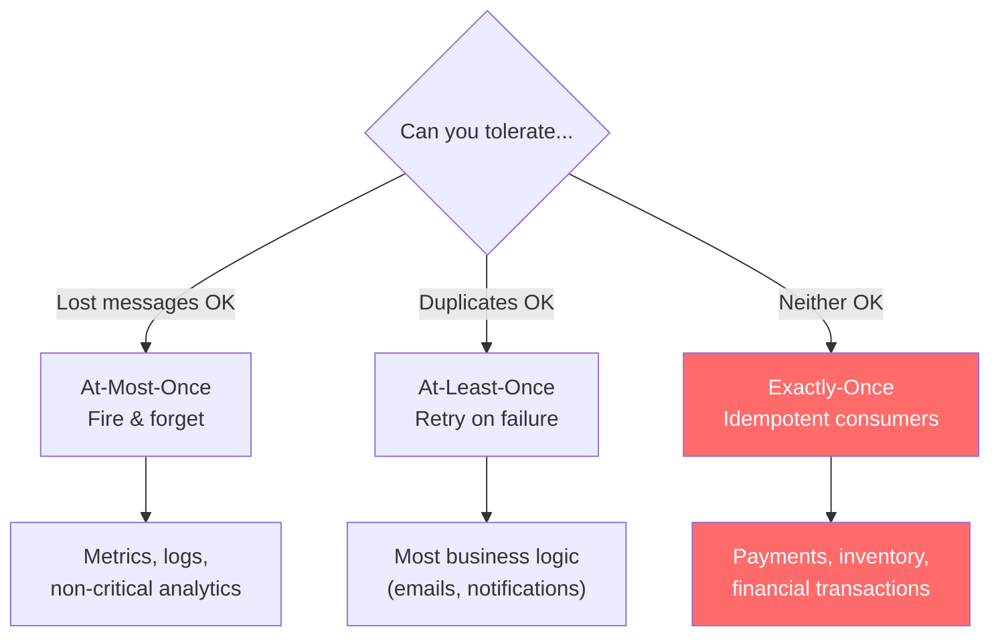

| Guarantee | Data Loss | Duplicates | Complexity | Use Case |
|-----------|-----------|------------|------------|----------|
| **At-most-once** | Possible | Never | Low | Metrics, logs |
| **At-least-once** | Never | Possible | Medium | Most business logic |
| **Exactly-once** | Never | Never | High | Payments, inventory |

---

## 13.4 Message Queue Patterns

### Dead Letter Queue (DLQ)

Messages that fail processing after max retries go to a DLQ for investigation.

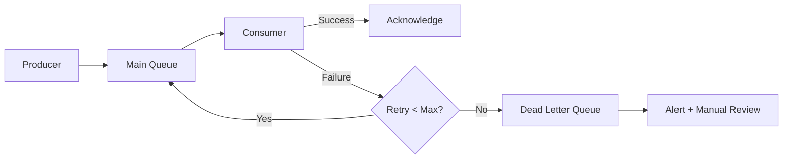

```python
class ReliableConsumer:
    def __init__(self, queue, dlq, max_retries=3):
        self.queue = queue
        self.dlq = dlq
        self.max_retries = max_retries
    
    def consume(self):
        while True:
            message = self.queue.receive()
            retry_count = message.attributes.get("retry_count", 0)
            
            try:
                self.process(message)
                self.queue.acknowledge(message)
            except TransientError:
                # Retryable error — put back with delay
                if retry_count < self.max_retries:
                    message.attributes["retry_count"] = retry_count + 1
                    delay = min(2 ** retry_count * 1000, 30000)  # Max 30s
                    self.queue.send(message, delay_ms=delay)
                else:
                    self.dlq.send(message, reason="max_retries_exceeded")
                    self.queue.acknowledge(message)
            except PermanentError as e:
                # Non-retryable — straight to DLQ
                self.dlq.send(message, reason=str(e))
                self.queue.acknowledge(message)
```

### Request-Reply Pattern

Async request that waits for a response via a reply queue.

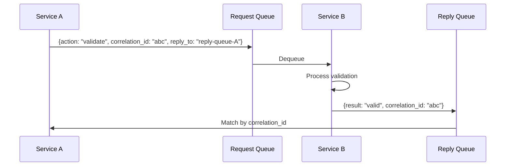

### Fan-Out Pattern

One event triggers multiple independent actions.

```python
class EventFanOut:
    """One event → multiple consumers, each doing different work."""
    
    def __init__(self, event_bus):
        self.event_bus = event_bus
    
    def publish_order_placed(self, order: Order):
        event = {
            "type": "order.placed",
            "data": order.to_dict(),
            "timestamp": datetime.utcnow().isoformat(),
        }
        
        # Publish to topic — all subscribers receive
        self.event_bus.publish("order.placed", event)
        
        # Subscribers (independent, parallel):
        # 1. Inventory service → reserve items
        # 2. Payment service → capture payment
        # 3. Email service → send confirmation
        # 4. Analytics → track conversion
        # 5. Recommendation engine → update model
```

### Saga Pattern (Distributed Transactions)

Coordinate multi-step business processes across services.

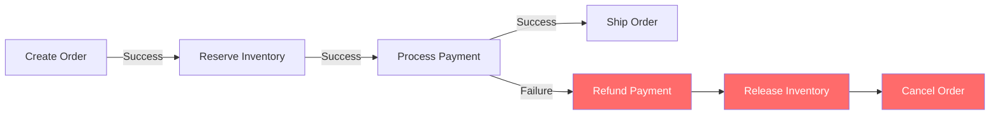

```python
class OrderSaga:
    """Choreography-based saga using events."""
    
    def __init__(self, event_bus):
        self.event_bus = event_bus
        
        # Each service listens for events and emits new ones
        self.event_bus.subscribe("order.created", self.on_order_created)
        self.event_bus.subscribe("inventory.reserved", self.on_inventory_reserved)
        self.event_bus.subscribe("payment.captured", self.on_payment_captured)
        self.event_bus.subscribe("payment.failed", self.on_payment_failed)
    
    def on_order_created(self, event):
        # Step 1 → trigger step 2
        self.event_bus.publish("inventory.reserve", {
            "order_id": event["order_id"],
            "items": event["items"],
        })
    
    def on_inventory_reserved(self, event):
        # Step 2 success → trigger step 3
        self.event_bus.publish("payment.capture", {
            "order_id": event["order_id"],
            "amount": event["total"],
        })
    
    def on_payment_captured(self, event):
        # Step 3 success → order complete
        self.event_bus.publish("order.confirmed", {
            "order_id": event["order_id"],
        })
    
    def on_payment_failed(self, event):
        # Step 3 failed → compensate step 2
        self.event_bus.publish("inventory.release", {
            "order_id": event["order_id"],
            "items": event["items"],
            "reason": "payment_failed",
        })
```

---

## 13.5 Kafka Deep Dive

Apache Kafka is the dominant event streaming platform for high-throughput, distributed messaging.

### Kafka Architecture

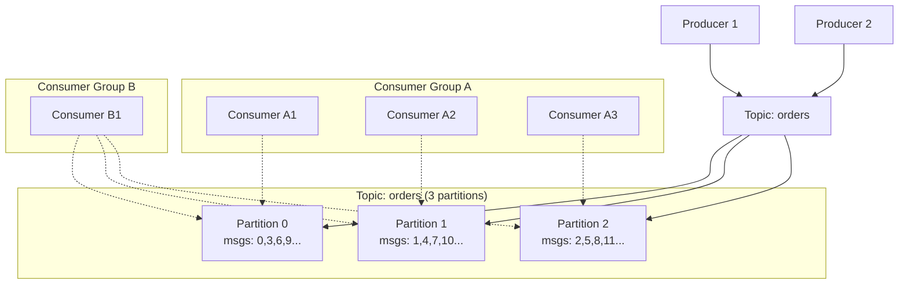

### Key Kafka Concepts

| Concept | Description |
|---------|-------------|
| **Topic** | Named category/feed of messages |
| **Partition** | Ordered, immutable sequence of messages within a topic |
| **Offset** | Position of a message within a partition |
| **Consumer Group** | Set of consumers that divide partition ownership |
| **Broker** | A Kafka server that stores partitions |
| **Replication Factor** | Number of copies per partition (typically 3) |

### Ordering Guarantee

Kafka guarantees ordering **within a partition**, not across partitions.

```python
from confluent_kafka import Producer

producer = Producer({"bootstrap.servers": "kafka:9092"})

def publish_order_event(order_id: str, event_type: str, data: dict):
    """
    Use order_id as partition key to guarantee ordering per order.
    All events for order "ORD-123" go to the same partition,
    so they're consumed in order.
    """
    producer.produce(
        topic="order-events",
        key=order_id.encode(),      # Partition key
        value=json.dumps({
            "type": event_type,
            "order_id": order_id,
            "data": data,
            "timestamp": datetime.utcnow().isoformat(),
        }).encode(),
    )
    producer.flush()

# These events for the same order are guaranteed to be in order:
publish_order_event("ORD-123", "created", {"items": [...]})
publish_order_event("ORD-123", "paid", {"amount": 99.99})
publish_order_event("ORD-123", "shipped", {"tracking": "1Z..."})
```

### Consumer Group Scaling

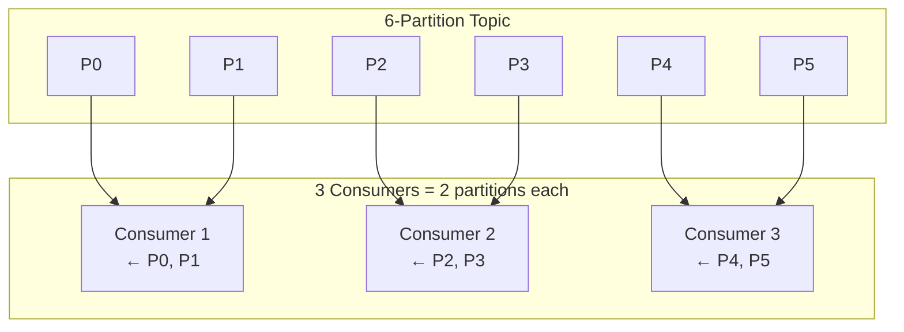

```
Topic with 6 partitions:

1 consumer:    C1 reads [P0, P1, P2, P3, P4, P5]  — all partitions
2 consumers:   C1 reads [P0, P1, P2], C2 reads [P3, P4, P5]
3 consumers:   C1 reads [P0, P1], C2 reads [P2, P3], C3 reads [P4, P5]
6 consumers:   Each reads 1 partition — max parallelism!
7 consumers:   One consumer is idle — can't split partitions further
```

**Rule**: Max parallelism = number of partitions. Plan partition count carefully.

---

## 13.6 Choosing a Message System

| System | Type | Throughput | Ordering | Persistence | Best For |
|--------|------|-----------|----------|-------------|----------|
| **RabbitMQ** | Queue/Pub-Sub | Medium | Per-queue | Optional | Task queues, RPC |
| **Kafka** | Event log | Very high | Per-partition | Yes (append-only) | Event streaming, replay |
| **AWS SQS** | Queue | High | No (FIFO option) | Yes | Simple cloud queuing |
| **AWS SNS** | Pub-Sub | High | No | No | Fan-out notifications |
| **Redis Streams** | Event log | High | Per-stream | Configurable | Lightweight streaming |
| **Google Pub/Sub** | Pub-Sub | Very high | Per-key | Yes | Cloud-native events |

### Decision Guide

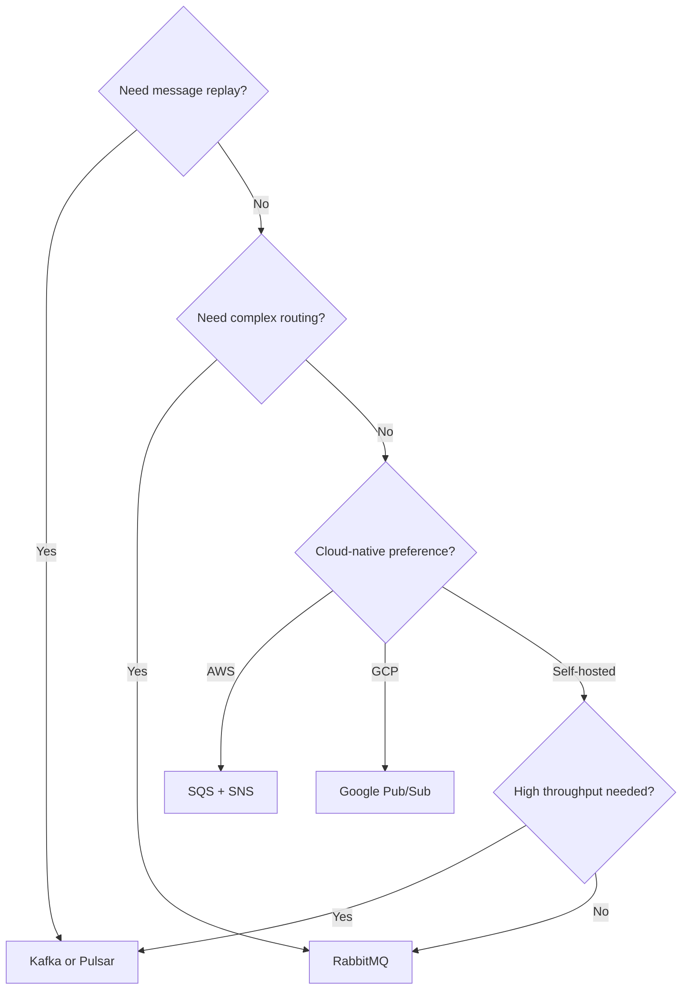

---

## 13.7 Backpressure and Flow Control

When producers outpace consumers, the queue grows unboundedly. This is backpressure.

```python
class BackpressureAwareProducer:
    def __init__(self, queue, max_queue_size: int = 100_000):
        self.queue = queue
        self.max_size = max_queue_size
    
    def publish(self, message: dict):
        current_size = self.queue.size()
        
        if current_size > self.max_size:
            # Option 1: Reject (fail fast)
            raise QueueFullError("Queue at capacity")
        
        if current_size > self.max_size * 0.8:
            # Option 2: Slow down (adaptive backpressure)
            delay = (current_size / self.max_size) * 5  # 0-5 seconds
            time.sleep(delay)
        
        self.queue.send(message)


class AutoScalingConsumer:
    """Scale consumers based on queue depth."""
    
    def monitor_and_scale(self):
        queue_depth = self.queue.size()
        consumer_count = self.get_consumer_count()
        
        messages_per_consumer = queue_depth / max(consumer_count, 1)
        
        if messages_per_consumer > 10_000:
            self.scale_up(count=min(consumer_count * 2, self.max_consumers))
        elif messages_per_consumer < 100 and consumer_count > self.min_consumers:
            self.scale_down(count=max(consumer_count // 2, self.min_consumers))
```

---

## Key Takeaways

| Concept | Key Point |
|---------|-----------|
| **Async** | Decouple services, absorb spikes, enable resilience |
| **Queue vs Pub/Sub** | Queue: one consumer per message. Pub/Sub: all subscribers get all messages |
| **At-least-once** | Default choice; combine with idempotent consumers for safety |
| **Exactly-once** | Impossible natively; achieve via idempotency keys + dedup |
| **DLQ** | Never lose messages; failed messages go to DLQ for investigation |
| **Kafka** | High-throughput event log; ordering per partition; replay capability |
| **Saga** | Distributed transactions via compensating actions |
| **Backpressure** | Monitor queue depth; scale consumers or slow producers |

---

## Practice Questions

1. **An order placement currently calls 5 services synchronously (payment, inventory, email, analytics, fraud check). Which should stay synchronous and which should be async?** Justify each decision.

2. **Your Kafka consumer is processing messages slower than they arrive. Queue depth is growing. What are your options?** Think about adding consumers, partitions, batching, and processing optimization.

3. **Design the event flow for an e-commerce return/refund.** What events are published? What services subscribe? How do you handle partial refunds? What's the compensating action if refund fails?

4. **You process credit card charges using a queue. The same charge message is delivered twice.** Without idempotency, the customer is charged double. Design the idempotent processing system.

5. **RabbitMQ vs Kafka for a notification system** that sends push notifications, emails, and SMS. 1M notifications/day, messages don't need replay. Which do you choose and why?

---

[← Chapter 12: Database Scaling](ch12-database-scaling.md) | [Chapter 14: Microservices & API Design →](ch14-microservices-api-design.md)
