# Chapter 14: Microservices & API Design

[← Chapter 13: Message Queues & Async Processing](ch13-message-queues-async.md) | [Chapter 15: URL Shortener & Pastebin →](../part4-hld-case-studies/ch15-url-shortener.md)

---

## 14.1 Monolith vs Microservices

### The Monolith

All functionality in a single deployable unit.

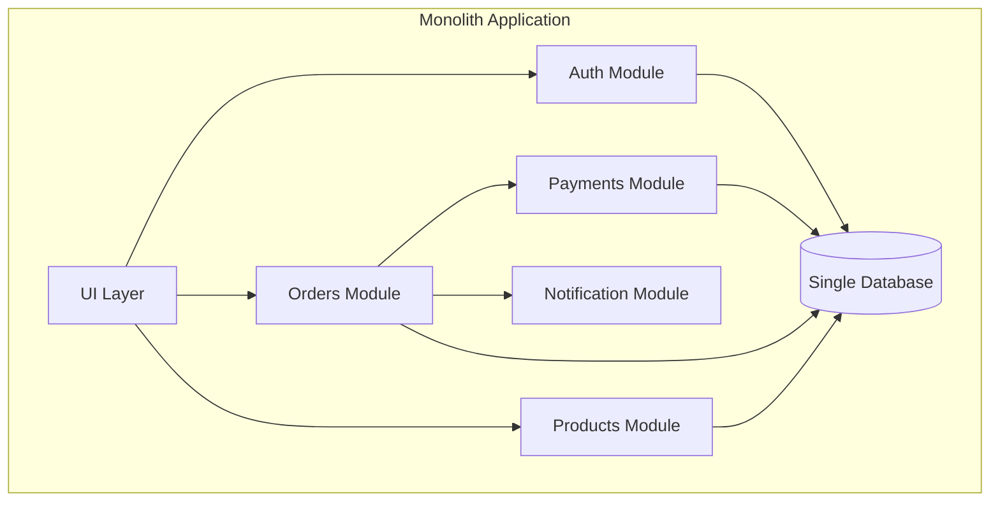

### Microservices

Each service is independently deployable, owns its own data, and communicates over the network.

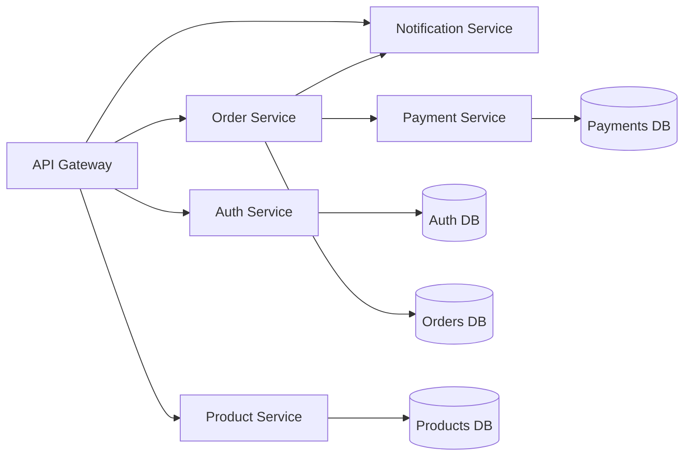

### Honest Comparison

| Aspect | Monolith | Microservices |
|--------|----------|---------------|
| **Development speed** (small team) | ✅ Fast | ❌ Overhead |
| **Development speed** (large org) | ❌ Stepping on toes | ✅ Team independence |
| **Deployment** | All or nothing | Independent per service |
| **Debugging** | ✅ Stack trace | ❌ Distributed tracing needed |
| **Data consistency** | ✅ ACID transactions | ❌ Eventual consistency, sagas |
| **Performance** | ✅ In-process calls | ❌ Network latency per call |
| **Operations** | ✅ One thing to deploy | ❌ N services to monitor |
| **Scaling** | Scale everything | Scale independently |
| **Technology** | One stack | Polyglot (mix languages/DBs) |
| **Failure** | One failure = total outage | Partial failures (with circuit breakers) |

### When to Use What

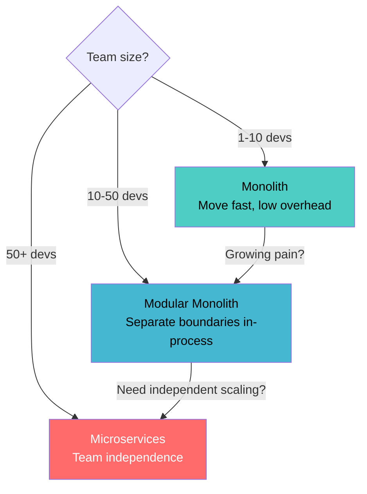

| Stage | Recommendation | Why |
|-------|---------------|-----|
| **Startup (1-10 devs)** | Monolith | Move fast, low overhead, easy debugging |
| **Growing (10-50 devs)** | Modular monolith | Start separating boundaries in-process |
| **Scale (50+ devs)** | Microservices | Team independence, independent scaling |
| **Never** | Nano-services | One function per service = distributed mess |

**The Modular Monolith** is the sweet spot for most teams: clear module boundaries, separate data access per module, deployable as one unit but extractable into services when needed.

---

## 14.2 Service Boundaries

The hardest part of microservices is deciding where to split.

### Domain-Driven Design (DDD) Approach

Each service aligns with a **bounded context** — a business domain with clear ownership.

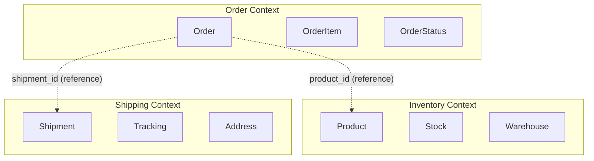

### Boundary Heuristics

| Signal | Split Into Separate Service |
|--------|---------------------------|
| Different team owns it | ✅ Yes |
| Different scaling requirements | ✅ Yes |
| Different data storage needs | ✅ Yes (SQL vs NoSQL vs search) |
| Frequently changes independently | ✅ Yes |
| Shares the same database table | ❌ No — keep together |
| Frequent synchronous calls between them | ❌ No — too coupled |
| Deployed together 90% of the time | ❌ No — not worth the overhead |

### Anti-Pattern: Distributed Monolith

```
❌ "Microservices" that:
  - Share a database
  - Must be deployed together
  - Make synchronous calls for every operation
  - Break when any service goes down

This is worse than a monolith — all the complexity, none of the benefits.
```

---

## 14.3 API Design

### REST Best Practices

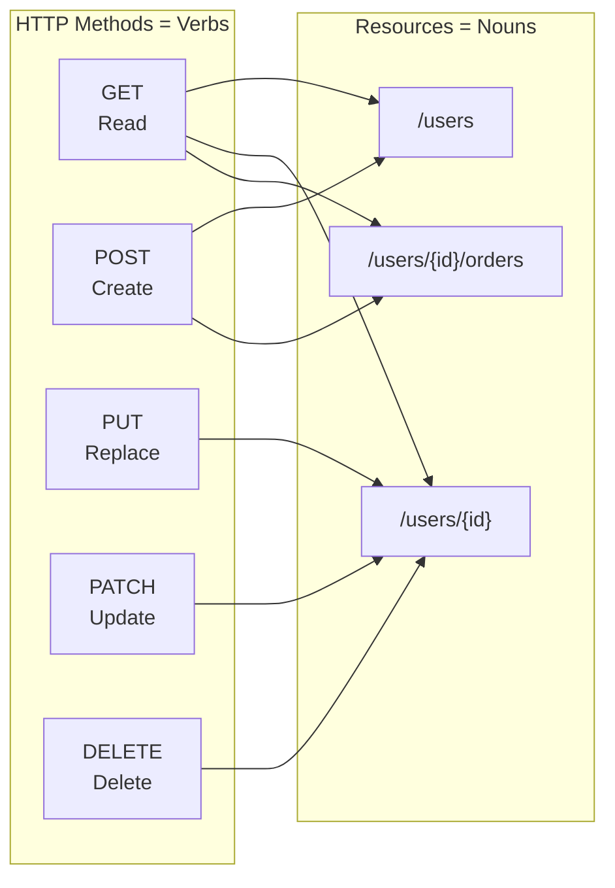

```python
# Resources are nouns, HTTP methods are verbs
# POST   /users          → Create user
# GET    /users          → List users
# GET    /users/{id}     → Get user
# PUT    /users/{id}     → Replace user
# PATCH  /users/{id}     → Partial update
# DELETE /users/{id}     → Delete user

# Nested resources for relationships
# GET    /users/{id}/orders        → User's orders
# POST   /users/{id}/orders        → Create order for user

# Filtering, sorting, pagination via query params
# GET    /products?category=electronics&sort=-price&page=2&limit=20
```

### API Response Design

```python
# Consistent response envelope
class ApiResponse:
    """Every response follows the same structure."""
    
    @staticmethod
    def success(data, meta=None):
        return {
            "data": data,
            "meta": meta,  # Pagination, counts
            "error": None,
        }
    
    @staticmethod
    def error(code: str, message: str, details=None, status=400):
        return {
            "data": None,
            "meta": None,
            "error": {
                "code": code,              # Machine-readable: "VALIDATION_ERROR"
                "message": message,        # Human-readable: "Email is invalid"
                "details": details,        # Field-level errors
            },
        }

# Pagination response
{
    "data": [{"id": 1, "name": "Widget"}, ...],
    "meta": {
        "page": 2,
        "per_page": 20,
        "total": 342,
        "total_pages": 18,
        "next_cursor": "eyJpZCI6NDB9"  # Cursor-based: better for large datasets
    }
}

# Error response
{
    "data": null,
    "error": {
        "code": "VALIDATION_ERROR",
        "message": "Invalid request body",
        "details": [
            {"field": "email", "message": "Must be a valid email"},
            {"field": "age", "message": "Must be 18 or older"}
        ]
    }
}
```

### API Versioning

```python
# Option 1: URL path versioning (most common)
# GET /api/v1/users
# GET /api/v2/users

# Option 2: Header versioning
# GET /api/users
# Accept: application/vnd.myapi.v2+json

# Option 3: Query parameter
# GET /api/users?version=2

# URL versioning is simplest and most widely used
```

### gRPC for Internal Services

```protobuf
// order_service.proto
syntax = "proto3";

service OrderService {
    rpc CreateOrder (CreateOrderRequest) returns (Order);
    rpc GetOrder (GetOrderRequest) returns (Order);
    rpc ListOrders (ListOrdersRequest) returns (stream Order); // Streaming!
}

message CreateOrderRequest {
    string user_id = 1;
    repeated OrderItem items = 2;
}

message Order {
    string id = 1;
    string user_id = 2;
    repeated OrderItem items = 3;
    OrderStatus status = 4;
    google.protobuf.Timestamp created_at = 5;
}

enum OrderStatus {
    PENDING = 0;
    CONFIRMED = 1;
    SHIPPED = 2;
    DELIVERED = 3;
}
```

### REST vs gRPC vs GraphQL

| Aspect | REST | gRPC | GraphQL |
|--------|------|------|---------|
| **Protocol** | HTTP/1.1+ JSON | HTTP/2 + Protobuf | HTTP + JSON |
| **Contract** | OpenAPI (optional) | `.proto` (required) | Schema (required) |
| **Performance** | Good | Excellent (binary, streaming) | Varies |
| **Browser support** | ✅ Native | ⚠️ Requires proxy | ✅ Native |
| **Streaming** | SSE, WebSocket | Bidirectional native | Subscriptions |
| **Best for** | Public APIs, CRUD | Service-to-service, low-latency | Frontend flexibility, mobile |
| **Learning curve** | Low | Medium | Medium |
| **Over/under-fetching** | Common problem | N/A (defined messages) | Solved by design |

---

## 14.4 API Gateway

A single entry point for all client requests. Routes, authenticates, rate-limits, and transforms.

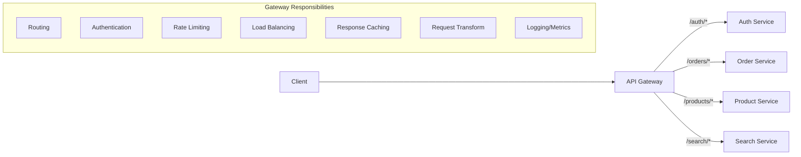

### Gateway Functions

```python
class APIGateway:
    def handle_request(self, request):
        # 1. Rate limiting
        if self.rate_limiter.is_exceeded(request.client_ip):
            return Response(429, "Too Many Requests")
        
        # 2. Authentication
        user = self.auth.validate_token(request.headers.get("Authorization"))
        if not user:
            return Response(401, "Unauthorized")
        
        # 3. Route to appropriate service
        service = self.router.match(request.path)
        if not service:
            return Response(404, "Not Found")
        
        # 4. Forward request with enriched headers
        response = service.forward(request, headers={
            "X-User-Id": user.id,
            "X-User-Role": user.role,
            "X-Request-Id": generate_request_id(),
        })
        
        # 5. Response transformation (strip internal headers, etc.)
        return self.transform_response(response)
```

### Rate Limiting Algorithms

```python
import time
from collections import defaultdict

class TokenBucket:
    """
    Allow bursts up to bucket size, then steady rate.
    Used by: AWS API Gateway, Stripe
    """
    def __init__(self, rate: float, capacity: int):
        self.rate = rate        # Tokens per second
        self.capacity = capacity  # Max burst size
        self.tokens = capacity
        self.last_refill = time.time()
    
    def allow_request(self) -> bool:
        now = time.time()
        # Refill tokens based on elapsed time
        elapsed = now - self.last_refill
        self.tokens = min(self.capacity, self.tokens + elapsed * self.rate)
        self.last_refill = now
        
        if self.tokens >= 1:
            self.tokens -= 1
            return True
        return False


class SlidingWindowCounter:
    """
    Count requests in a rolling time window.
    More accurate than fixed window, less memory than sliding log.
    """
    def __init__(self, window_size: int, max_requests: int):
        self.window_size = window_size  # seconds
        self.max_requests = max_requests
        self.counters = defaultdict(lambda: {"current": 0, "previous": 0})
    
    def allow_request(self, client_id: str) -> bool:
        now = time.time()
        window_start = int(now // self.window_size)
        window_progress = (now % self.window_size) / self.window_size
        
        counter = self.counters[client_id]
        # Weighted count: fraction of previous window + current window
        estimated = counter["previous"] * (1 - window_progress) + counter["current"]
        
        if estimated >= self.max_requests:
            return False
        
        counter["current"] += 1
        return True
```

### Backend-for-Frontend (BFF) Pattern

Different clients (web, mobile, IoT) have different data needs. A BFF acts as a specialized gateway per client type.

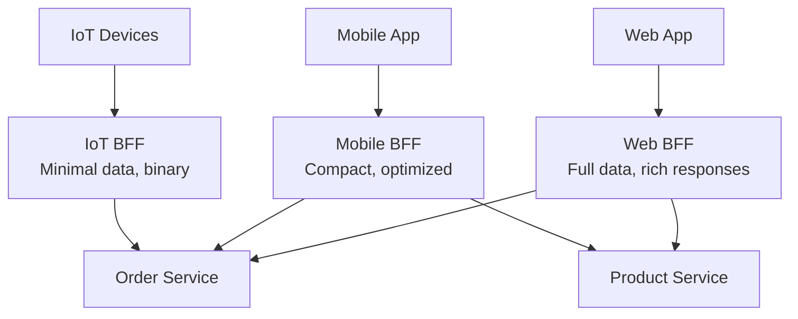

---

## 14.5 Inter-Service Communication

### Synchronous: HTTP/gRPC

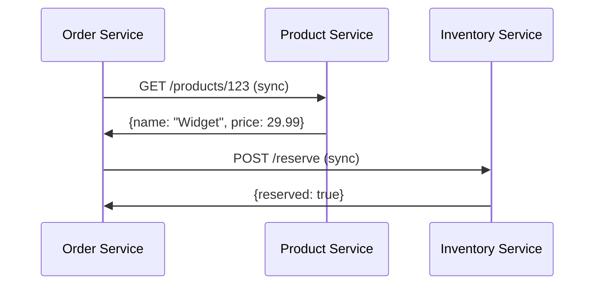

**Problem**: Tight coupling. If Product Service is slow or down, Order Service is impacted.

### Circuit Breaker Pattern

Prevent cascading failures when a downstream service is unhealthy.

```python
import time
from enum import Enum

class CircuitState(Enum):
    CLOSED = "closed"       # Normal operation, requests flow through
    OPEN = "open"           # Service is down, fail fast
    HALF_OPEN = "half_open" # Testing if service recovered

class CircuitBreaker:
    def __init__(self, failure_threshold=5, recovery_timeout=30):
        self.failure_threshold = failure_threshold
        self.recovery_timeout = recovery_timeout
        self.state = CircuitState.CLOSED
        self.failure_count = 0
        self.last_failure_time = 0
    
    def call(self, func, *args, **kwargs):
        if self.state == CircuitState.OPEN:
            if time.time() - self.last_failure_time > self.recovery_timeout:
                self.state = CircuitState.HALF_OPEN
            else:
                raise CircuitOpenError("Service unavailable, failing fast")
        
        try:
            result = func(*args, **kwargs)
            self._on_success()
            return result
        except Exception as e:
            self._on_failure()
            raise
    
    def _on_success(self):
        self.failure_count = 0
        self.state = CircuitState.CLOSED
    
    def _on_failure(self):
        self.failure_count += 1
        self.last_failure_time = time.time()
        if self.failure_count >= self.failure_threshold:
            self.state = CircuitState.OPEN


# Usage
product_breaker = CircuitBreaker(failure_threshold=5, recovery_timeout=30)

def get_product(product_id):
    return product_breaker.call(
        requests.get, f"http://product-service/products/{product_id}", timeout=2
    )
```

```java
// Using Resilience4j
@Service
public class ProductClient {
    
    @CircuitBreaker(name = "productService", fallbackMethod = "getProductFallback")
    @Retry(name = "productService")
    @TimeLimiter(name = "productService")
    public CompletableFuture<Product> getProduct(String productId) {
        return CompletableFuture.supplyAsync(() -> 
            restTemplate.getForObject(
                "http://product-service/products/" + productId,
                Product.class
            )
        );
    }
    
    // Fallback when circuit is open
    public CompletableFuture<Product> getProductFallback(String productId, Throwable t) {
        // Return cached/default product or graceful degradation
        return CompletableFuture.completedFuture(
            cachedProductStore.get(productId)
        );
    }
}
```

### Circuit Breaker State Machine

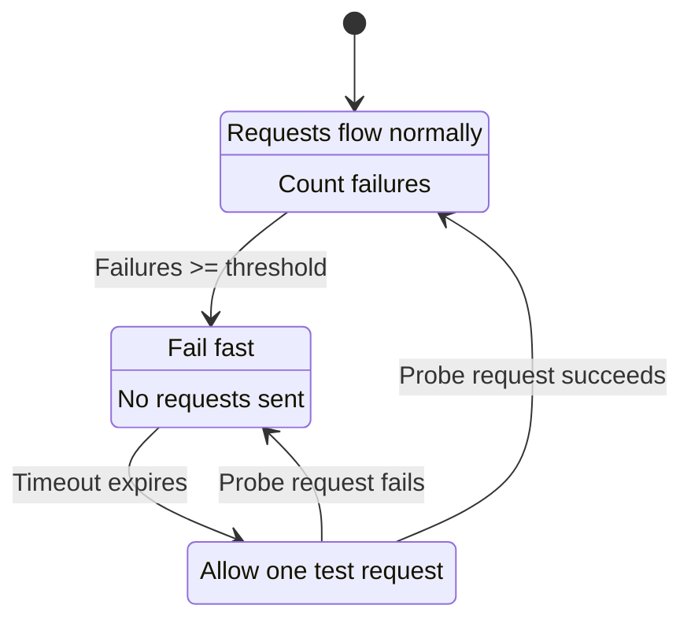

### Service Discovery

In microservices, services need to find each other. IPs change as instances scale up/down.

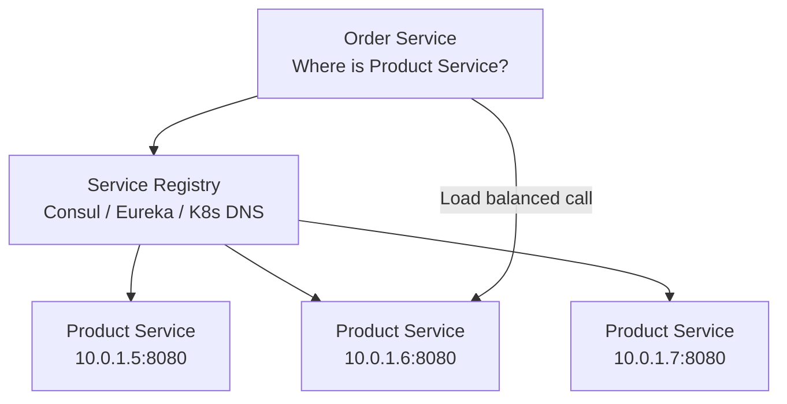

**Client-side discovery**: Service queries registry, picks an instance, calls directly.
**Server-side discovery**: Service calls a load balancer, which queries registry.
**DNS-based** (Kubernetes): `product-service.default.svc.cluster.local` resolves to healthy instances.

---

## 14.6 Distributed Tracing

With microservices, a single user request might hit 10+ services. How do you debug?

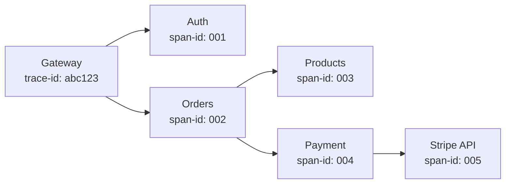

```python
# Propagate trace context through all service calls
class TracingMiddleware:
    def process_request(self, request):
        # Extract or create trace context
        trace_id = request.headers.get("X-Trace-Id") or generate_trace_id()
        span_id = generate_span_id()
        parent_span = request.headers.get("X-Span-Id")
        
        # Add to thread-local context
        context.trace_id = trace_id
        context.span_id = span_id
        context.parent_span_id = parent_span
        
        # Log with trace context
        logger.info("Processing request", extra={
            "trace_id": trace_id,
            "span_id": span_id,
            "service": "order-service",
            "method": request.method,
            "path": request.path,
        })
    
    def forward_request(self, url, **kwargs):
        """Propagate trace headers to downstream calls."""
        headers = kwargs.get("headers", {})
        headers["X-Trace-Id"] = context.trace_id
        headers["X-Span-Id"] = context.span_id
        return requests.get(url, headers=headers, **kwargs)
```

Tools: **Jaeger**, **Zipkin**, **AWS X-Ray**, **OpenTelemetry** (standard).

---

## 14.7 API Design Checklist

| Category | Check |
|----------|-------|
| **Naming** | Resources are nouns (`/users`, not `/getUsers`) |
| **HTTP methods** | GET (read), POST (create), PUT (replace), PATCH (update), DELETE |
| **Status codes** | 200 OK, 201 Created, 400 Bad Request, 401 Unauthorized, 404 Not Found, 429 Rate Limited, 500 Server Error |
| **Versioning** | URL path (`/v1/`) or header-based |
| **Pagination** | Cursor-based for large datasets, offset for simple cases |
| **Filtering** | Query params (`?status=active&sort=-created_at`) |
| **Error format** | Consistent envelope with code + message + details |
| **Rate limiting** | Token bucket or sliding window; return `Retry-After` header |
| **Idempotency** | POST/PUT with `Idempotency-Key` header for safe retries |
| **Auth** | OAuth2/JWT; API keys for server-to-server |
| **CORS** | Configure for web clients |
| **Documentation** | OpenAPI/Swagger spec auto-generated from code |

---

## Key Takeaways

| Concept | Key Point |
|---------|-----------|
| **Monolith first** | Start monolith, extract services when needed |
| **Service boundaries** | Align with business domains (DDD bounded contexts) |
| **API design** | Consistent naming, proper HTTP methods, error envelopes |
| **gRPC** | For internal service-to-service; Protobuf for strong contracts |
| **API Gateway** | Single entry: routing, auth, rate limiting, transformation |
| **Circuit breaker** | Prevent cascading failures; fail fast when downstream is unhealthy |
| **Distributed tracing** | Propagate trace IDs across all services for debugging |
| **BFF** | Backend-for-Frontend: tailored APIs per client type |

---

## Practice Questions

1. **Your monolith has grown to 500K lines of code with 30 developers. How would you plan the migration to microservices?** What do you extract first? How do you handle the shared database?

2. **Design the API for a ride-sharing service** (like Uber). What endpoints for riders, drivers, and trips? What data formats? How do you handle real-time location updates?

3. **Service A calls Service B, which calls Service C. Service C is having intermittent 500 errors.** How does this cascade? Design the resilience strategy (circuit breakers, retries, fallbacks, timeouts).

4. **You're choosing between REST and gRPC for communication between 15 internal microservices.** What factors influence your decision? Can you use both? How?

5. **Your API gets 10K requests/second. You need rate limiting at 100 requests/minute per user.** Design the rate limiting system. Where does it live? How do you handle distributed rate limiting across multiple API gateway instances?

---

[← Chapter 13: Message Queues & Async Processing](ch13-message-queues-async.md) | [Chapter 15: URL Shortener & Pastebin →](../part4-hld-case-studies/ch15-url-shortener.md)
