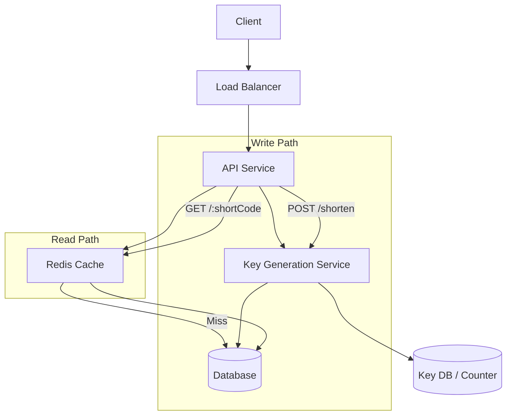
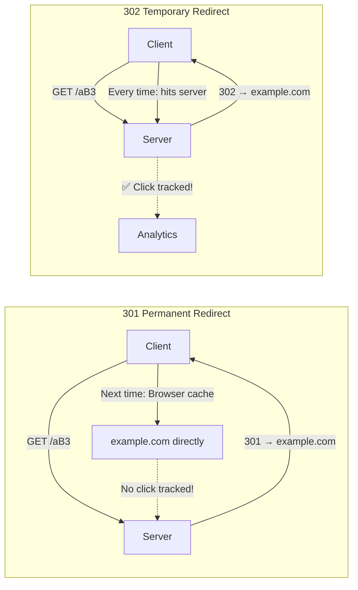
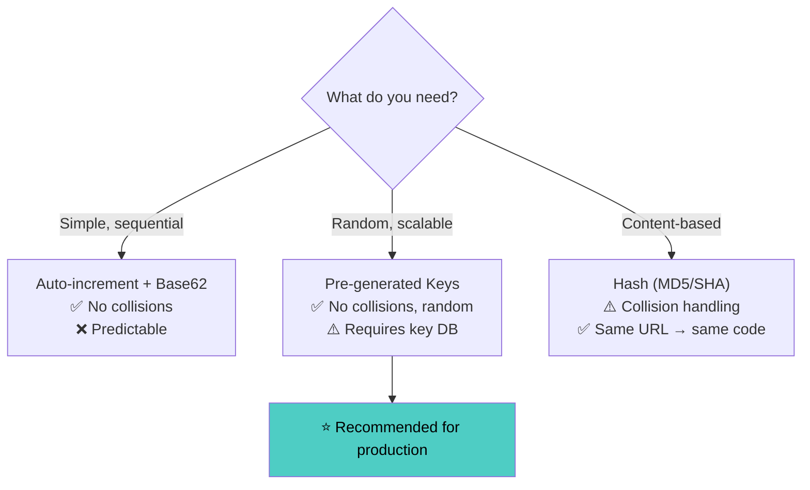
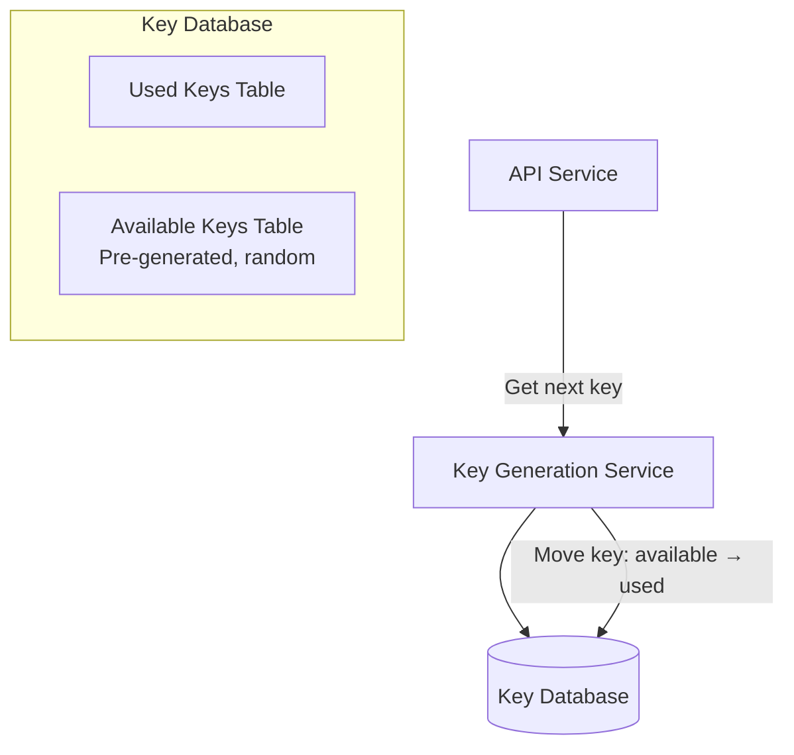
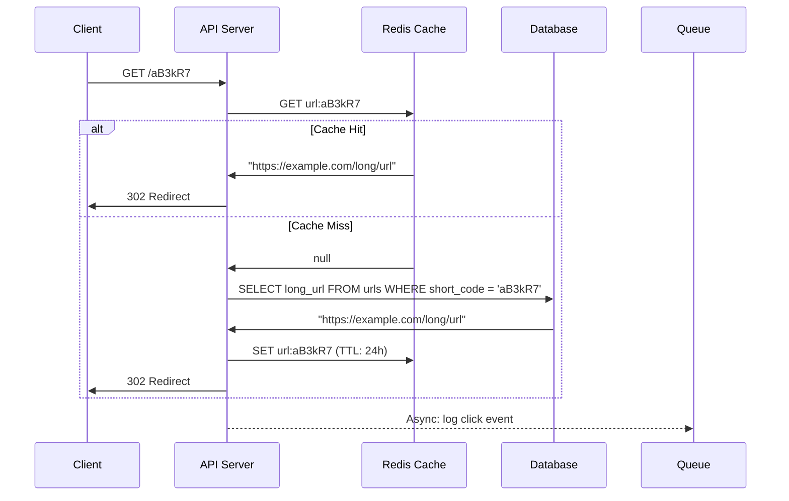
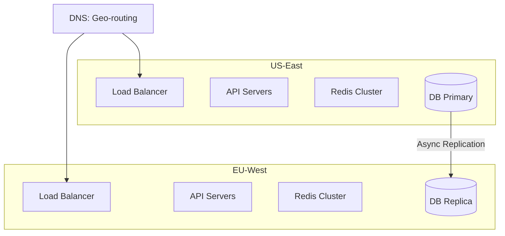
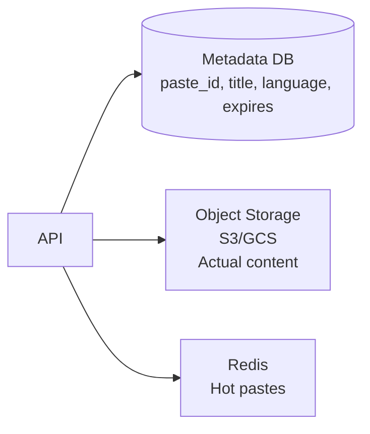

# Chapter 15: Design a URL Shortener & Pastebin

[← Chapter 14: Microservices & API Design](../part3-hld/ch14-microservices-api-design.md) | [Chapter 16: Twitter & News Feed →](ch16-twitter-news-feed.md)

---

This is the classic "warm-up" system design question. Simple enough to cover in 30 minutes, deep enough to show your thinking.

## 15.1 Requirements Gathering

### Functional Requirements

1. Given a long URL, generate a short URL
2. Given a short URL, redirect to the original URL
3. Optional: Custom short URLs
4. Optional: URL expiration
5. Optional: Analytics (click count, referrer, geo)

### Non-Functional Requirements

| Requirement | Target |
|-------------|--------|
| Read:Write ratio | 100:1 (read-heavy) |
| URL shortening latency | < 100ms |
| Redirect latency | < 50ms |
| Availability | 99.99% |
| Shortened URLs | Should be as short as possible |
| URL lifetime | Default 5 years, configurable |

### Back-of-Envelope Estimation

```
New URLs created: 100M per month
  → Per day: 100M / 30 ≈ 3.3M
  → Per second: 3.3M / 86400 ≈ 40 writes/sec

Redirects: 100:1 ratio
  → 40 × 100 = 4,000 reads/sec
  → Peak (3×): 12,000 reads/sec

Storage (5 years):
  100M/month × 12 × 5 = 6B URLs
  Average URL: 500 bytes (original URL + metadata)
  Total: 6B × 500 bytes = 3TB

Cache: 80/20 rule — 20% of URLs generate 80% of traffic
  Daily requests: 4,000/sec × 86,400 = ~346M
  Cache 20% of daily unique URLs: ~70M × 500 bytes ≈ 35GB → fits in memory
```

---

## 15.2 High-Level Design



### API Design

```
POST /api/v1/shorten
Body: {
    "long_url": "https://example.com/very/long/path?query=params",
    "custom_alias": "my-link",     // optional
    "expires_at": "2025-12-31"     // optional
}
Response: {
    "short_url": "https://short.ly/aB3kR7",
    "long_url": "https://example.com/very/long/path?query=params",
    "expires_at": "2025-12-31T00:00:00Z"
}

GET /:shortCode
→ 301 Redirect (permanent) or 302 Redirect (temporary)
  Location: https://example.com/very/long/path?query=params

GET /api/v1/stats/:shortCode
Response: {
    "total_clicks": 15234,
    "clicks_by_day": [...],
    "top_referrers": [...],
    "geo_distribution": {...}
}
```

**301 vs 302**: 301 (permanent) is cached by browser — less load on our server but we can't track clicks. 302 (temporary) forces every request through us — better analytics. Use 302 if analytics matter.



---

## 15.3 Short URL Encoding

The core problem: generate a short, unique string for each URL.



### Approach 1: Base62 Encoding

Use characters `[a-zA-Z0-9]` = 62 characters.

```
Length 6: 62^6 = 56.8 billion combinations
Length 7: 62^7 = 3.5 trillion combinations

For 6B URLs over 5 years → 7 characters is plenty.
```

```python
import string

BASE62 = string.ascii_letters + string.digits  # a-zA-Z0-9

def encode_base62(number: int) -> str:
    """Convert integer to base62 string."""
    if number == 0:
        return BASE62[0]
    
    result = []
    while number > 0:
        result.append(BASE62[number % 62])
        number //= 62
    
    return ''.join(reversed(result))

def decode_base62(short_code: str) -> int:
    """Convert base62 string back to integer."""
    number = 0
    for char in short_code:
        number = number * 62 + BASE62.index(char)
    return number

# Example:
# encode_base62(123456789) → "8m0Kx"
# decode_base62("8m0Kx") → 123456789
```

### Approach 2: Auto-Increment ID + Base62

```python
class URLShortener:
    """Use database auto-increment ID, convert to base62."""
    
    def shorten(self, long_url: str) -> str:
        # Insert into DB → get auto-increment ID
        url_id = self.db.insert("INSERT INTO urls (long_url) VALUES (%s)", long_url)
        
        # Convert ID to base62
        short_code = encode_base62(url_id)
        
        return f"https://short.ly/{short_code}"
```

**Pros**: Simple, guaranteed unique, sequential.
**Cons**: Predictable (can enumerate URLs), single point of failure (counter), sequential IDs reveal volume.

### Approach 3: Pre-Generated Key Service (Recommended)



```python
class KeyGenerationService:
    """Pre-generate random keys. Eliminates collision risk."""
    
    def __init__(self, db):
        self.db = db
        self.local_cache = []  # Buffer of pre-fetched keys
        self.cache_size = 1000
    
    def get_key(self) -> str:
        if not self.local_cache:
            self._refill_cache()
        return self.local_cache.pop()
    
    def _refill_cache(self):
        """Fetch a batch of keys from DB (atomic operation)."""
        keys = self.db.execute("""
            DELETE FROM available_keys 
            WHERE key IN (
                SELECT key FROM available_keys LIMIT %s FOR UPDATE SKIP LOCKED
            )
            RETURNING key
        """, self.cache_size)
        self.local_cache = [row["key"] for row in keys]
    
    @staticmethod
    def generate_keys(count: int) -> list[str]:
        """Offline job: generate random unique keys."""
        keys = set()
        while len(keys) < count:
            key = ''.join(random.choices(BASE62, k=7))
            keys.add(key)
        return list(keys)
```

**Pros**: No collisions, keys are random (not guessable), scales horizontally.
**Cons**: Requires pre-generation, key DB is a dependency.

### Approach 4: MD5/SHA256 Hash

```python
import hashlib

def hash_to_short_code(long_url: str) -> str:
    """Hash URL and take first 7 characters."""
    hash_hex = hashlib.md5(long_url.encode()).hexdigest()
    # Convert first 43 bits to base62 (gives ~7 chars)
    number = int(hash_hex[:11], 16)
    return encode_base62(number)[:7]

# Problem: Collisions! Different URLs can produce same 7-char prefix.
# Solution: Check DB for collision, append counter if exists.
```

### Encoding Comparison

| Approach | Collisions | Predictable | Scalability | Complexity |
|----------|-----------|-------------|-------------|------------|
| Auto-increment + Base62 | None | Yes | Single counter | Low |
| Pre-generated keys | None | No | Horizontal | Medium |
| Hash + collision check | Possible | No | Horizontal | Medium |
| Random + retry | Possible | No | Horizontal | Low |

---

## 15.4 Database Design

```python
# URL table
"""
CREATE TABLE urls (
    id            BIGINT PRIMARY KEY,
    short_code    VARCHAR(10) UNIQUE NOT NULL,
    long_url      TEXT NOT NULL,
    user_id       BIGINT,
    created_at    TIMESTAMP DEFAULT NOW(),
    expires_at    TIMESTAMP,
    click_count   BIGINT DEFAULT 0
);

CREATE INDEX idx_short_code ON urls(short_code);
CREATE INDEX idx_expires_at ON urls(expires_at) WHERE expires_at IS NOT NULL;
"""

# Analytics table (separate for write performance)
"""
CREATE TABLE click_events (
    id          BIGINT PRIMARY KEY,
    short_code  VARCHAR(10) NOT NULL,
    clicked_at  TIMESTAMP DEFAULT NOW(),
    referrer    TEXT,
    user_agent  TEXT,
    ip_address  INET,
    country     VARCHAR(2)
);

CREATE INDEX idx_click_short_code ON click_events(short_code, clicked_at);
"""
```

### Database Choice

| Option | Pros | Cons |
|--------|------|------|
| **PostgreSQL** | ACID, rich queries for analytics | Sharding complexity at scale |
| **DynamoDB/Cassandra** | Horizontal scaling, key-value access | Limited analytics queries |
| **Hybrid** | Postgres for URL metadata, Cassandra for click analytics | Operational overhead |

For a URL shortener, **NoSQL (DynamoDB/Cassandra)** is a natural fit: the access pattern is simple key-value lookup by short code.

---

## 15.5 Read Path (Redirect)



```python
class RedirectService:
    def redirect(self, short_code: str, request) -> str:
        # 1. Check cache
        long_url = self.cache.get(f"url:{short_code}")
        
        if not long_url:
            # 2. Check database
            result = self.db.query(
                "SELECT long_url, expires_at FROM urls WHERE short_code = %s",
                short_code
            )
            if not result:
                raise NotFoundError("URL not found")
            
            if result.expires_at and result.expires_at < datetime.utcnow():
                raise GoneError("URL has expired")
            
            long_url = result.long_url
            self.cache.set(f"url:{short_code}", long_url, ttl=86400)
        
        # 3. Async analytics (don't slow down redirect)
        self.event_queue.publish("click", {
            "short_code": short_code,
            "timestamp": datetime.utcnow().isoformat(),
            "ip": request.remote_addr,
            "referrer": request.headers.get("Referer"),
            "user_agent": request.headers.get("User-Agent"),
        })
        
        return long_url
```

---

## 15.6 Scaling Considerations

### Database Scaling

```
Partition key: short_code (hash-based)
  → Even distribution
  → Single-key lookups (no scatter-gather)
  → Easy to add shards

Alternative: Range-based on short_code first character
  → Shard A-I, J-R, S-Z, 0-9
  → Simple but potentially uneven
```

### Caching Strategy

```python
# Cache hot URLs aggressively
# Most URL shorteners follow power law: tiny fraction gets most traffic

# Bloom filter for non-existent URLs (optional optimization)
from pybloom_live import BloomFilter

class URLLookup:
    def __init__(self):
        # Bloom filter: quickly reject non-existent codes
        self.bloom = BloomFilter(capacity=1_000_000_000, error_rate=0.001)
    
    def exists(self, short_code: str) -> bool:
        if short_code not in self.bloom:
            return False  # Definitely doesn't exist
        # Might exist — check cache/DB
        return self.cache.get(f"url:{short_code}") is not None \
            or self.db.exists(short_code)
```

### High Availability



---

## 15.7 Pastebin Extension

Pastebin is a URL shortener for text content rather than URLs.

### Additional Requirements

- Store text content (up to 10MB)
- Syntax highlighting
- Expiration (1 hour, 1 day, 1 week, never)
- Public/private/unlisted

### Storage Architecture



```python
class PastebinService:
    def create_paste(self, content: str, language: str = "text",
                     expires_in: int = 86400) -> dict:
        paste_id = self.key_service.get_key()
        
        # Store content in object storage (S3/GCS)
        self.object_store.put(
            key=f"pastes/{paste_id}",
            body=content.encode(),
            content_type="text/plain",
        )
        
        # Store metadata in database
        self.db.insert("pastes", {
            "id": paste_id,
            "language": language,
            "size_bytes": len(content.encode()),
            "created_at": datetime.utcnow(),
            "expires_at": datetime.utcnow() + timedelta(seconds=expires_in),
        })
        
        return {"paste_id": paste_id, "url": f"https://paste.ly/{paste_id}"}
    
    def get_paste(self, paste_id: str) -> dict:
        # Check cache first
        cached = self.cache.get(f"paste:{paste_id}")
        if cached:
            return cached
        
        metadata = self.db.get("pastes", paste_id)
        if not metadata or metadata["expires_at"] < datetime.utcnow():
            raise NotFoundError()
        
        content = self.object_store.get(f"pastes/{paste_id}").decode()
        
        result = {**metadata, "content": content}
        self.cache.set(f"paste:{paste_id}", result, ttl=3600)
        return result
```

---

## Key Takeaways

| Concept | Key Point |
|---------|-----------|
| **Encoding** | Base62 with 7 chars = 3.5T combinations; pre-generate keys for scale |
| **Read path** | Cache-first → DB fallback; async analytics logging |
| **301 vs 302** | 301 for performance, 302 for analytics |
| **Scaling** | Hash-based sharding on short_code; cache top 20% |
| **Key generation** | Pre-generated service avoids collisions and is horizontally scalable |
| **Analytics** | Async event logging to avoid slowing redirects |

---

## Practice Questions

1. **How would you handle the same long URL being shortened multiple times?** Should they get the same or different short codes? What are the trade-offs?

2. **Design the cleanup system for expired URLs.** How do you find and delete them efficiently without scanning the entire table?

3. **A celebrity tweets a short URL and you get 100K redirects/second for that single URL.** How does your caching strategy handle this? What if the cache key expires at that moment?

4. **How would you prevent abuse** (spam URLs, phishing links, URL enumeration attacks)?

5. **Extend the design to support link previews** (title, description, image of the destination page). Where and when do you fetch this metadata?

---

[← Chapter 14: Microservices & API Design](../part3-hld/ch14-microservices-api-design.md) | [Chapter 16: Twitter & News Feed →](ch16-twitter-news-feed.md)
