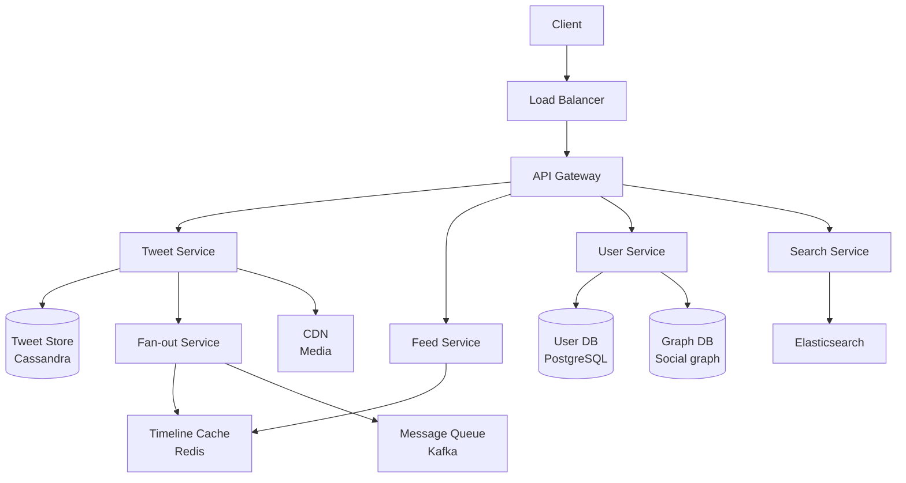
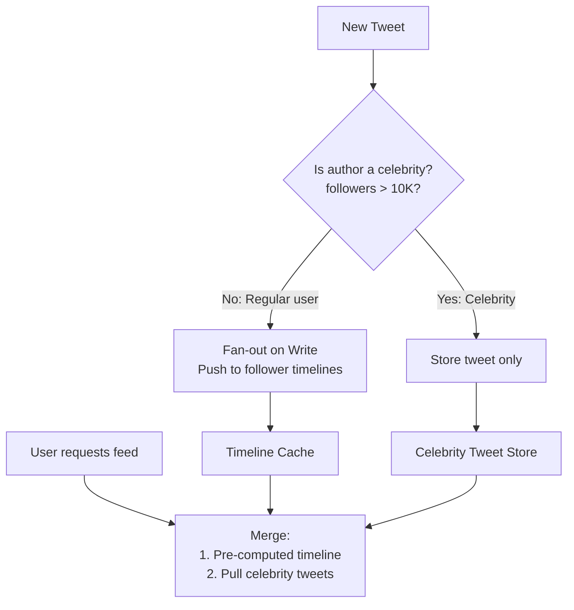
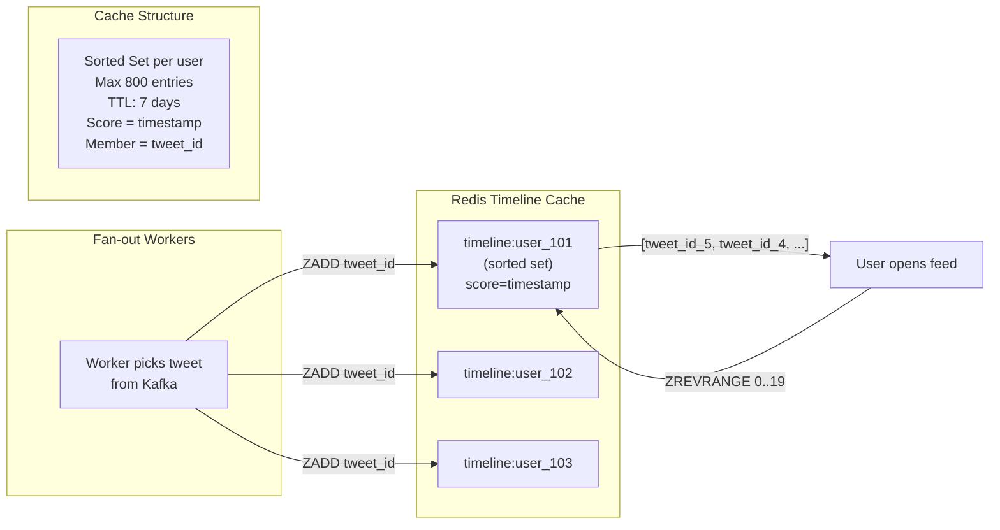
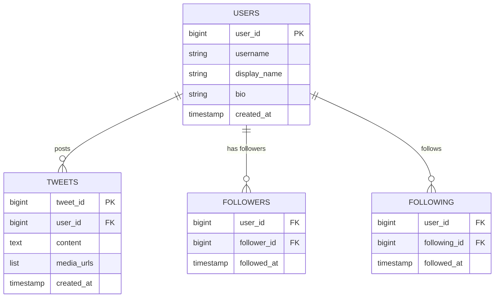
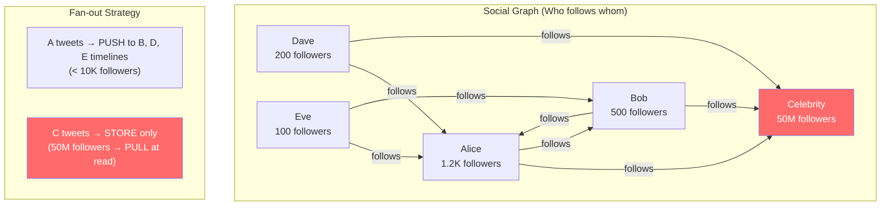
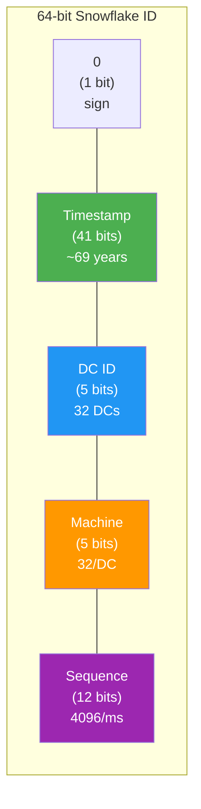
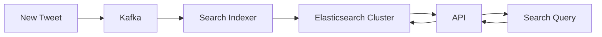
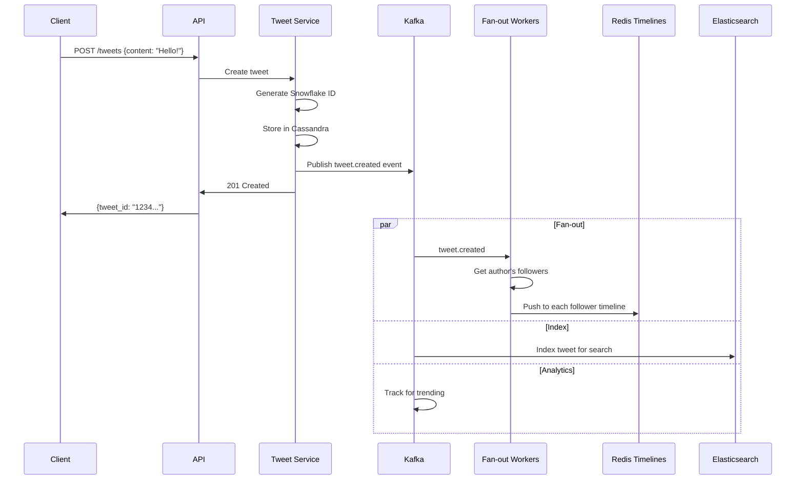

# Chapter 16: Design Twitter & News Feed

[← Chapter 15: URL Shortener & Pastebin](ch15-url-shortener.md) | [Chapter 17: WhatsApp & Chat System →](ch17-whatsapp-chat.md)

---

## 16.1 Requirements

### Functional Requirements

1. **Post tweets** (text, images, links — 280 chars)
2. **Follow/unfollow** users
3. **News feed** — see tweets from people you follow, sorted by time
4. **Search** tweets
5. **Trending** topics

### Non-Functional Requirements

| Metric | Target |
|--------|--------|
| DAU | 300M |
| Tweets/day | 500M |
| Average follows per user | 200 |
| Feed read:write ratio | 1000:1 |
| Feed latency | < 200ms |
| Availability | 99.99% |

### Estimation

```
Tweets/sec: 500M / 86400 ≈ 5,800 writes/sec (peak: ~17K)
Feed reads/sec: 300M users × 10 reads/day / 86400 ≈ 35K reads/sec (peak: ~100K)

Tweet storage: 500M/day × 280 bytes avg ≈ 140GB/day
  With metadata + media references: ~500GB/day
  5 years: ~900TB

Fan-out: 1 tweet → average 200 followers' timelines
  5,800 tweets/sec × 200 = 1.16M timeline writes/sec
```

---

## 16.2 High-Level Architecture



---

## 16.3 The Fan-Out Problem

This is the core challenge. When a user posts a tweet, how do their followers see it?

### Approach 1: Fan-Out on Read (Pull Model)

When a user opens their feed, query all followed users' tweets in real-time.

```python
class PullFeedService:
    def get_feed(self, user_id: str, limit: int = 50) -> list:
        # Get who this user follows
        following = self.graph.get_following(user_id)  # e.g., 200 users
        
        # Query each followed user's recent tweets
        tweets = []
        for followed_id in following:
            user_tweets = self.tweet_store.get_recent(followed_id, limit=10)
            tweets.extend(user_tweets)
        
        # Sort by timestamp and return top N
        tweets.sort(key=lambda t: t.created_at, reverse=True)
        return tweets[:limit]
```

**Pros**: Simple write path, no wasted work for inactive followers.
**Cons**: Slow reads (200+ queries per feed load). Unacceptable at scale.

### Approach 2: Fan-Out on Write (Push Model)

When a tweet is posted, pre-compute and write it to every follower's timeline cache.

```python
class PushFeedService:
    def post_tweet(self, user_id: str, content: str):
        # 1. Store the tweet
        tweet = self.tweet_store.save(Tweet(user_id=user_id, content=content))
        
        # 2. Get all followers
        followers = self.graph.get_followers(user_id)
        
        # 3. Push to each follower's timeline (async via queue)
        for batch in chunk(followers, 1000):
            self.queue.publish("fanout", {
                "tweet_id": tweet.id,
                "follower_ids": batch,
            })
    
    def get_feed(self, user_id: str, limit: int = 50) -> list:
        # Simply read pre-computed timeline from cache
        tweet_ids = self.timeline_cache.get_range(
            f"timeline:{user_id}", 0, limit - 1
        )
        return self.tweet_store.multi_get(tweet_ids)
```

**Pros**: Extremely fast reads (single Redis lookup).
**Cons**: Celebrity problem — a user with 50M followers triggers 50M writes per tweet. Wasted work for inactive users.

### Approach 3: Hybrid (What Twitter Actually Does)



```python
class HybridFeedService:
    CELEBRITY_THRESHOLD = 10_000
    
    def post_tweet(self, user_id: str, content: str):
        tweet = self.tweet_store.save(Tweet(user_id=user_id, content=content))
        
        follower_count = self.graph.get_follower_count(user_id)
        
        if follower_count < self.CELEBRITY_THRESHOLD:
            # Regular user: fan-out on write
            self._fanout_write(user_id, tweet)
        else:
            # Celebrity: just store, pull at read time
            self.celebrity_tweets.add(user_id, tweet.id)
    
    def get_feed(self, user_id: str, limit: int = 50) -> list:
        # 1. Get pre-computed timeline (regular users' tweets)
        timeline_ids = self.timeline_cache.get_range(
            f"timeline:{user_id}", 0, limit * 2
        )
        
        # 2. Get celebrity tweets this user follows
        celebrity_followings = self.graph.get_celebrity_followings(user_id)
        celebrity_tweets = []
        for celeb_id in celebrity_followings:
            recent = self.celebrity_tweets.get_recent(celeb_id, 10)
            celebrity_tweets.extend(recent)
        
        # 3. Merge and sort
        all_tweet_ids = timeline_ids + [t.id for t in celebrity_tweets]
        tweets = self.tweet_store.multi_get(all_tweet_ids)
        tweets.sort(key=lambda t: t.created_at, reverse=True)
        return tweets[:limit]
```

---

## 16.4 Timeline Cache Design

### How the Timeline Cache Works



```python
# Redis sorted set: score = timestamp, member = tweet_id
# Each user has a timeline in Redis

class TimelineCache:
    def __init__(self, redis):
        self.redis = redis
        self.MAX_TIMELINE_SIZE = 800  # Keep last 800 tweets per user
    
    def add_tweet(self, user_id: str, tweet_id: str, timestamp: float):
        key = f"timeline:{user_id}"
        pipe = self.redis.pipeline()
        pipe.zadd(key, {tweet_id: timestamp})
        pipe.zremrangebyrank(key, 0, -(self.MAX_TIMELINE_SIZE + 1))  # Trim
        pipe.expire(key, 7 * 86400)  # TTL: 7 days
        pipe.execute()
    
    def get_feed(self, user_id: str, offset: int = 0, limit: int = 20) -> list:
        """Get paginated feed — newest first."""
        return self.redis.zrevrange(
            f"timeline:{user_id}", offset, offset + limit - 1
        )
    
    def remove_tweet(self, user_id: str, tweet_id: str):
        """When a tweet is deleted, remove from all timelines."""
        self.redis.zrem(f"timeline:{user_id}", tweet_id)
```

### Memory Estimation for Timeline Cache

```
300M DAU
Timeline per user: 800 tweet IDs × 8 bytes = 6.4KB
Active timelines in cache: 300M × 6.4KB = ~1.9TB

Redis cluster with 3× replication: ~6TB
→ Feasible with a large Redis cluster (e.g., 100 nodes × 64GB each)
```

---

## 16.5 Data Models

### Entity Relationships



### Social Graph Visualization



### Tweet Store (Cassandra)

```sql
-- Cassandra: Optimized for write-heavy, time-series data
CREATE TABLE tweets (
    tweet_id    BIGINT,          -- Snowflake ID (time-sortable)
    user_id     BIGINT,
    content     TEXT,
    media_urls  LIST<TEXT>,
    created_at  TIMESTAMP,
    like_count  COUNTER,
    retweet_count COUNTER,
    PRIMARY KEY (tweet_id)
);

-- User's tweets (for profile page)
CREATE TABLE user_tweets (
    user_id     BIGINT,
    created_at  TIMESTAMP,
    tweet_id    BIGINT,
    PRIMARY KEY (user_id, created_at)
) WITH CLUSTERING ORDER BY (created_at DESC);
```

### Social Graph

```python
# Option 1: Adjacency list in Cassandra
"""
CREATE TABLE followers (
    user_id     BIGINT,
    follower_id BIGINT,
    followed_at TIMESTAMP,
    PRIMARY KEY (user_id, follower_id)
);

CREATE TABLE following (
    user_id       BIGINT,
    following_id  BIGINT,
    followed_at   TIMESTAMP,
    PRIMARY KEY (user_id, following_id)
);
"""

# Option 2: Graph database (Neo4j, JanusGraph) for complex queries
# "Friends of friends who also follow X" — hard with adjacency lists
```

### Unique ID Generation: Snowflake



```python
import time
import threading

class SnowflakeIDGenerator:
    """
    Twitter's Snowflake: 64-bit ID = timestamp + datacenter + machine + sequence
    
    Bit layout:
    0 | 41 bits timestamp | 5 bits DC | 5 bits machine | 12 bits sequence
    
    Benefits:
    - Time-sortable (newer tweets have larger IDs)
    - No coordination needed (each machine generates independently)
    - ~4096 IDs per millisecond per machine
    """
    
    EPOCH = 1288834974657  # Twitter epoch (Nov 2010)
    
    def __init__(self, datacenter_id: int, machine_id: int):
        self.datacenter_id = datacenter_id
        self.machine_id = machine_id
        self.sequence = 0
        self.last_timestamp = -1
        self.lock = threading.Lock()
    
    def next_id(self) -> int:
        with self.lock:
            timestamp = int(time.time() * 1000) - self.EPOCH
            
            if timestamp == self.last_timestamp:
                self.sequence = (self.sequence + 1) & 0xFFF  # 12 bits
                if self.sequence == 0:
                    # Exhausted sequence for this ms — wait
                    while timestamp <= self.last_timestamp:
                        timestamp = int(time.time() * 1000) - self.EPOCH
            else:
                self.sequence = 0
            
            self.last_timestamp = timestamp
            
            return (
                (timestamp << 22) |
                (self.datacenter_id << 17) |
                (self.machine_id << 12) |
                self.sequence
            )
```

---

## 16.6 Search and Trending

### Tweet Search



### Trending Topics

```python
class TrendingService:
    """Detect trending topics using sliding window counts."""
    
    def __init__(self, redis):
        self.redis = redis
    
    def record_hashtag(self, hashtag: str, timestamp: float):
        """Called for every tweet with a hashtag."""
        window_key = f"trending:{int(timestamp // 300)}"  # 5-min windows
        self.redis.zincrby(window_key, 1, hashtag)
        self.redis.expire(window_key, 3600)  # Keep 1 hour of windows
    
    def get_trending(self, num_windows: int = 12, limit: int = 10) -> list:
        """Aggregate last N windows (e.g., last hour) for trending."""
        now = int(time.time() // 300)
        keys = [f"trending:{now - i}" for i in range(num_windows)]
        
        # Union all windows into a temp key
        self.redis.zunionstore("trending:current", keys)
        
        # Get top hashtags
        return self.redis.zrevrange("trending:current", 0, limit - 1, withscores=True)
```

---

## 16.7 Complete Request Flow

### Post a Tweet



---

## Key Takeaways

| Concept | Key Point |
|---------|-----------|
| **Fan-out on write** | Pre-compute timelines; fast reads, expensive for celebrities |
| **Fan-out on read** | Compute at read time; slow reads, no wasted writes |
| **Hybrid** | Push for regular users, pull for celebrities (>10K followers) |
| **Timeline cache** | Redis sorted sets; ~2TB for 300M DAU |
| **Snowflake IDs** | Time-sortable, distributed, no coordination |
| **Trending** | Sliding window counts with Redis sorted sets |
| **Search** | Async indexing to Elasticsearch via Kafka |

---

## Practice Questions

1. **A user with 50M followers tweets. How long does fan-out take and how do you handle it?** Calculate the time and discuss prioritization (active users first).

2. **A user deletes a tweet. How do you remove it from 50M timelines?** Is immediate consistency required? How would you batch this?

3. **Design the "algorithmic feed"** that shows relevant tweets instead of pure chronological. What signals do you use? Where does the ranking happen?

4. **A user blocks another user.** What happens to existing tweets in their timeline? How do you prevent future tweets from appearing?

5. **How would you handle a viral tweet** getting 1M likes/second? Think about the counter update strategy (exact vs approximate counts).

---

[← Chapter 15: URL Shortener & Pastebin](ch15-url-shortener.md) | [Chapter 17: WhatsApp & Chat System →](ch17-whatsapp-chat.md)
