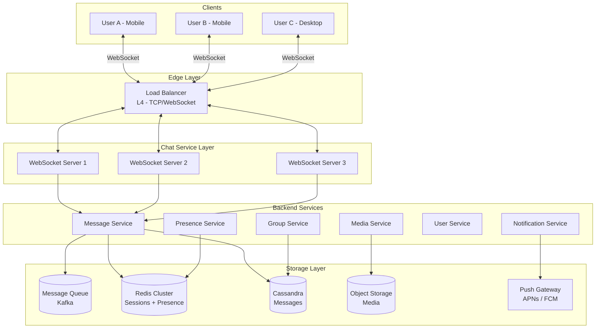
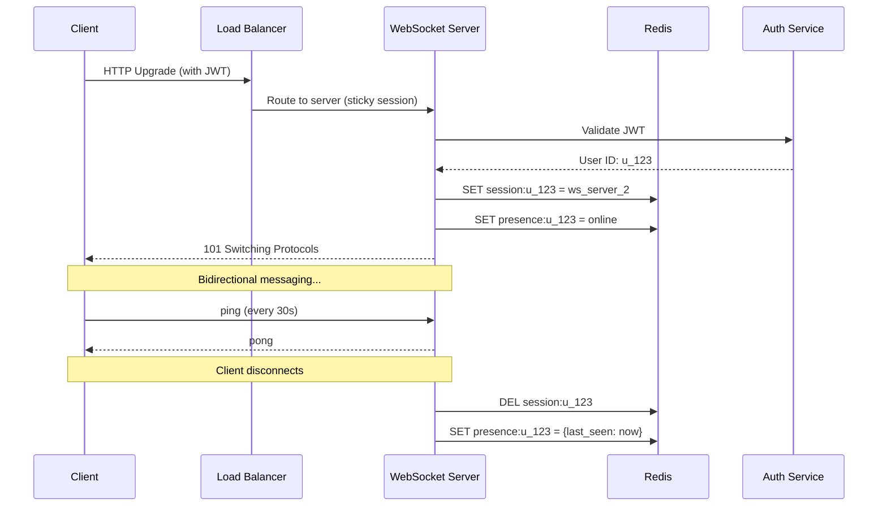
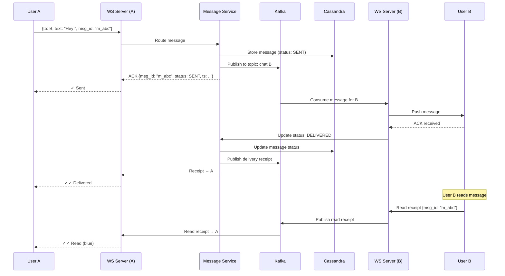
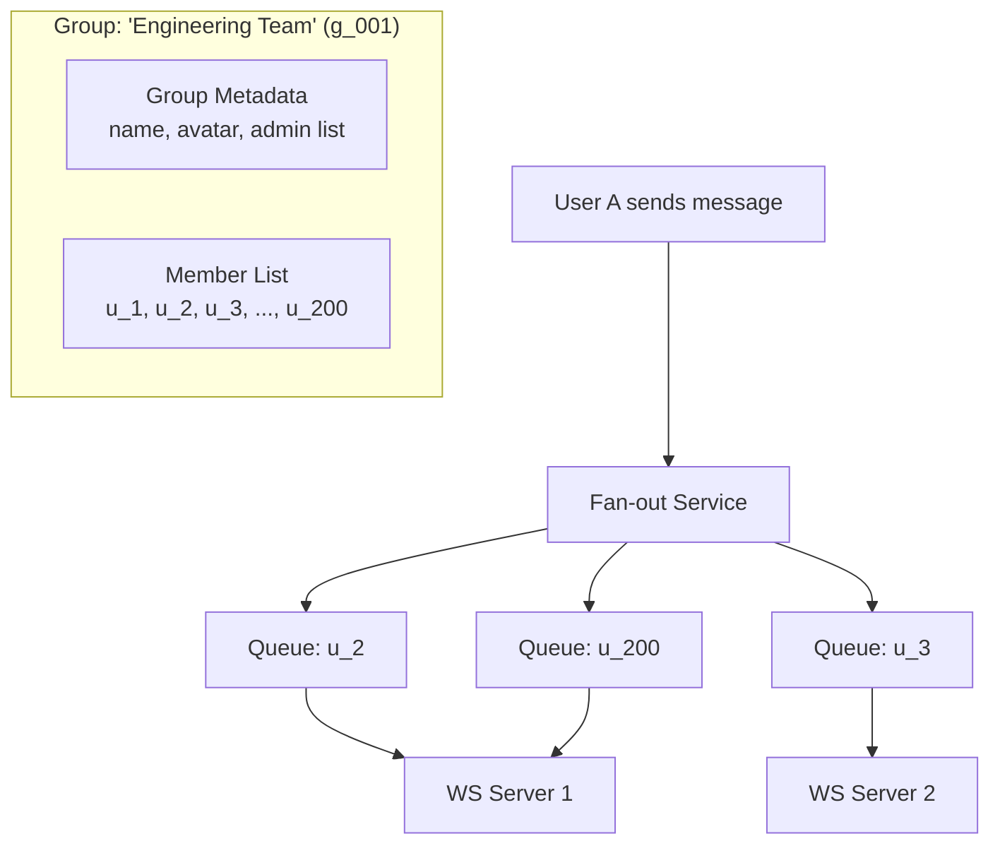
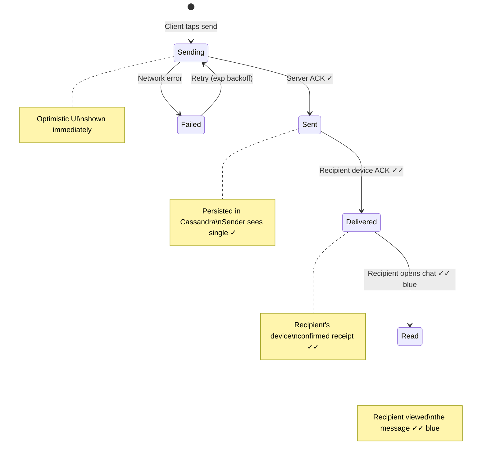
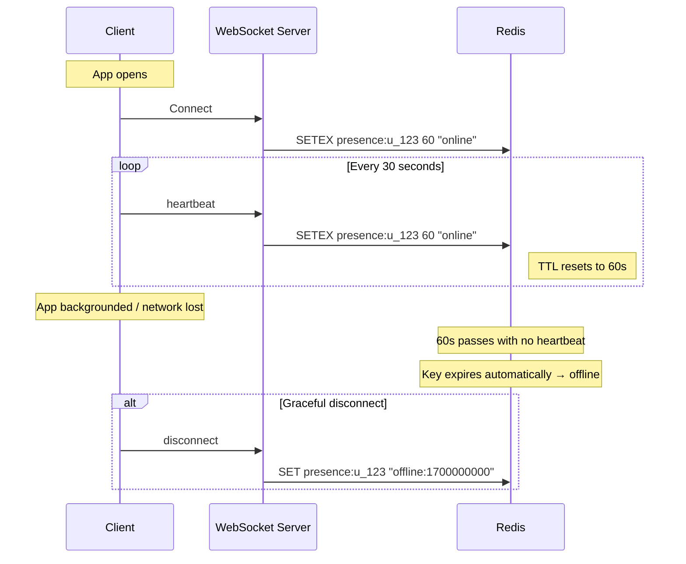
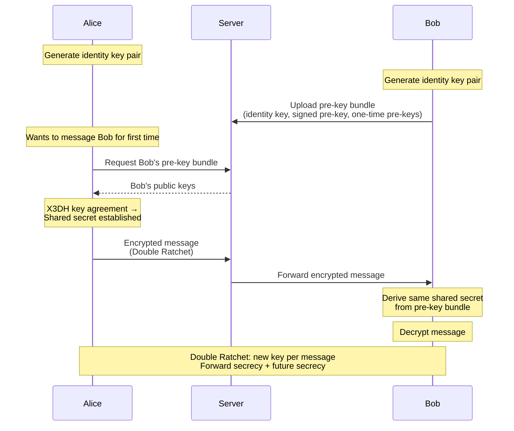
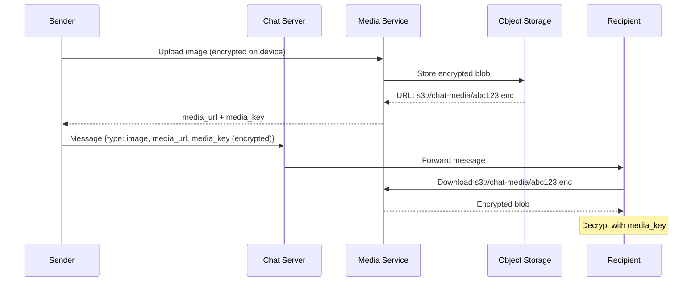
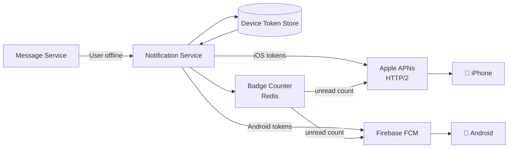
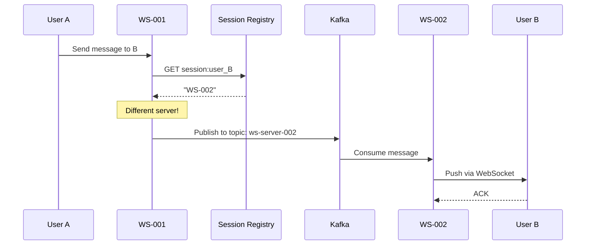

# Chapter 17: WhatsApp & Chat System Design

> *"The hard part of messaging isn't sending a message — it's making sure it arrives exactly once, in order, even when the network is lying to you."*

A messaging system like WhatsApp handles **100 billion messages per day** across 2 billion users. It must feel instant, never lose a message, and work even on flaky 2G connections. This is one of the most asked system design problems because it touches real-time communication, presence, storage, and encryption — all at scale.

---

## 17.1 Requirements & Estimation

### Functional Requirements

| Requirement | Details |
|---|---|
| 1:1 chat | Send/receive text messages between two users |
| Group chat | Up to 256 members (WhatsApp) or 200K (Discord/Slack) |
| Delivery receipts | Sent ✓, Delivered ✓✓, Read (blue ✓✓) |
| Online/offline presence | Show last seen, typing indicators |
| Media sharing | Images, video, documents, voice messages |
| Message history | Persistent storage, sync across devices |
| Push notifications | Notify offline users |

### Non-Functional Requirements

- **Latency**: < 100ms for message delivery (online users)
- **Reliability**: Zero message loss — messages MUST be delivered eventually
- **Ordering**: Messages within a conversation appear in order
- **Availability**: 99.99% — chat is a primary communication tool
- **Scale**: 500M DAU, 100B messages/day

### Back-of-Envelope Estimation

```
Users:           500M DAU
Messages/day:    100B → ~1.15M messages/sec
Avg message:     100 bytes text (metadata: ~200 bytes total)

Storage:
  Messages/day:  100B × 200 bytes = 20 TB/day
  Per year:       ~7.3 PB
  5-year:         ~36.5 PB

Connections:
  Concurrent:    500M DAU × 30% online = 150M WebSocket connections
  Per server:    ~50K connections per server
  Servers:       150M / 50K = 3,000 WebSocket servers

Bandwidth:
  Incoming:      1.15M msg/sec × 200 bytes = ~230 MB/sec = ~1.84 Gbps
  With media:    10× = ~18 Gbps
```

---

## 17.2 High-Level Architecture



### Key Architectural Decisions

| Decision | Choice | Why |
|---|---|---|
| Client-server protocol | WebSocket | Full-duplex, low overhead for real-time |
| Message storage | Cassandra | Write-heavy, partitioned by conversation |
| Session/presence store | Redis | In-memory speed for ephemeral data |
| Message bus | Kafka | Reliable delivery, replay capability |
| Media storage | S3/Object Storage | Cost-effective blob storage |
| Push notifications | APNs + FCM | Platform-native delivery |

---

## 17.3 WebSocket Connection Management

### Why WebSockets?

| Approach | Latency | Server Load | Battery | Use Case |
|---|---|---|---|---|
| HTTP Polling | High (interval) | Very High | Bad | Legacy fallback |
| Long Polling | Medium | High | Medium | Simple chat |
| Server-Sent Events | Low (one-way) | Medium | Good | Notifications |
| **WebSocket** | **Low (bidirectional)** | **Low** | **Good** | **Chat systems** |

### Connection Lifecycle



### Session Registry

Every connected user maps to a WebSocket server. This lets us **route messages to the right server**.

```python
class SessionRegistry:
    """
    Maps user_id -> websocket_server_id.
    Stored in Redis for shared access across all WS servers.
    """

    def __init__(self, redis_client):
        self.redis = redis_client

    def register(self, user_id: str, server_id: str):
        """User connected to a WebSocket server."""
        self.redis.hset("sessions", user_id, server_id)
        self.redis.hset("presence", user_id, "online")

    def unregister(self, user_id: str):
        """User disconnected."""
        self.redis.hdel("sessions", user_id)
        self.redis.hset("presence", user_id, str(int(time.time())))

    def get_server(self, user_id: str) -> str | None:
        """Which server is this user connected to?"""
        return self.redis.hget("sessions", user_id)

    def is_online(self, user_id: str) -> bool:
        return self.redis.hget("presence", user_id) == "online"
```

```java
// Java equivalent
@Service
public class SessionRegistry {
    private final RedisTemplate<String, String> redis;

    public void register(String userId, String serverId) {
        redis.opsForHash().put("sessions", userId, serverId);
        redis.opsForHash().put("presence", userId, "online");
    }

    public void unregister(String userId) {
        redis.opsForHash().delete("sessions", userId);
        redis.opsForHash().put("presence", userId,
            String.valueOf(Instant.now().getEpochSecond()));
    }

    public Optional<String> getServer(String userId) {
        Object server = redis.opsForHash().get("sessions", userId);
        return Optional.ofNullable((String) server);
    }
}
```

### Handling Multiple Devices

WhatsApp Web, Desktop, and Mobile can all be connected simultaneously:

```
sessions:u_123 → {
    "mobile":  "ws_server_2",
    "desktop": "ws_server_5",
    "web":     "ws_server_1"
}
```

When routing a message, send to **all active devices** for the recipient.

---

## 17.4 Message Flow — 1:1 Chat

### The Happy Path (Both Online)



### Message When Recipient is Offline

```python
class MessageService:
    def send_message(self, sender_id: str, recipient_id: str, message: Message):
        # 1. Always persist first — never lose a message
        message.status = MessageStatus.SENT
        message.timestamp = self.clock.now()
        self.message_store.save(message)

        # 2. ACK sender immediately
        self.notify_sender(sender_id, MessageAck(
            msg_id=message.id,
            status=MessageStatus.SENT,
            timestamp=message.timestamp
        ))

        # 3. Try to deliver
        server = self.session_registry.get_server(recipient_id)

        if server:
            # Online: push through WebSocket
            self.route_to_server(server, recipient_id, message)
        else:
            # Offline: queue for later + push notification
            self.offline_queue.enqueue(recipient_id, message)
            self.push_service.send_notification(
                recipient_id,
                title=self.get_display_name(sender_id),
                body=self.truncate(message.text, 100)
            )

    def on_user_online(self, user_id: str):
        """Drain offline queue when user reconnects."""
        pending = self.offline_queue.drain(user_id)
        for message in pending:
            self.route_to_server(
                self.session_registry.get_server(user_id),
                user_id,
                message
            )
```

### Offline Message Queue

```
offline_queue:u_456 → [
    {msg_id: "m_abc", from: "u_123", text: "Hey!", ts: 1700000001},
    {msg_id: "m_def", from: "u_789", text: "Meeting?", ts: 1700000042},
    ...
]
```

When User B comes online → drain queue → deliver all pending → send delivery receipts back.

---

## 17.5 Message Storage — Cassandra Design

### Why Cassandra?

| Requirement | Why Cassandra |
|---|---|
| Write-heavy (100B/day) | LSM-tree optimized for writes |
| Time-series access pattern | Partition by conversation, cluster by time |
| Horizontal scaling | Consistent hashing, auto-sharding |
| High availability | Replication factor 3, tunable consistency |

### Data Model

```sql
-- Messages table: partitioned by conversation, ordered by time
CREATE TABLE messages (
    conversation_id TEXT,         -- Sorted pair: "u_123:u_456"
    message_id      TIMEUUID,    -- Time-based UUID (natural ordering)
    sender_id       TEXT,
    message_type    TEXT,         -- text, image, video, audio
    content         TEXT,         -- Encrypted message body
    media_url       TEXT,         -- S3 URL for media
    status          TEXT,         -- sent, delivered, read
    created_at      TIMESTAMP,
    PRIMARY KEY (conversation_id, message_id)
) WITH CLUSTERING ORDER BY (message_id DESC);
-- Latest messages first for pagination

-- Conversation index: which conversations does a user have?
CREATE TABLE user_conversations (
    user_id             TEXT,
    last_message_time   TIMESTAMP,
    conversation_id     TEXT,
    other_user_id       TEXT,
    last_message_preview TEXT,
    unread_count        INT,
    PRIMARY KEY (user_id, last_message_time)
) WITH CLUSTERING ORDER BY (last_message_time DESC);
```

### Conversation ID Generation

```python
def get_conversation_id(user_a: str, user_b: str) -> str:
    """
    Deterministic conversation ID for 1:1 chats.
    Sorted to ensure both users map to the same partition.
    """
    return ":".join(sorted([user_a, user_b]))

# get_conversation_id("u_456", "u_123") → "u_123:u_456"
# get_conversation_id("u_123", "u_456") → "u_123:u_456"  ← Same!
```

### Pagination (Loading Chat History)

```python
def get_messages(conversation_id: str, before: UUID = None, limit: int = 50):
    """
    Cursor-based pagination — load 50 messages older than cursor.
    """
    if before:
        query = """
            SELECT * FROM messages
            WHERE conversation_id = %s AND message_id < %s
            ORDER BY message_id DESC
            LIMIT %s
        """
        return session.execute(query, [conversation_id, before, limit])
    else:
        query = """
            SELECT * FROM messages
            WHERE conversation_id = %s
            ORDER BY message_id DESC
            LIMIT %s
        """
        return session.execute(query, [conversation_id, limit])
```

---

## 17.6 Group Chat

### Group Architecture



### Group Message Fan-out

```python
class GroupMessageService:
    MAX_GROUP_SIZE = 256  # WhatsApp limit

    def send_group_message(self, sender_id: str, group_id: str, message: Message):
        # 1. Validate sender is member
        group = self.group_store.get(group_id)
        if sender_id not in group.members:
            raise PermissionError("Not a group member")

        # 2. Store message once (group partition)
        message.conversation_id = group_id
        message.sender_id = sender_id
        message.timestamp = self.clock.now()
        self.message_store.save(message)

        # 3. Fan-out to all members except sender
        recipients = [m for m in group.members if m != sender_id]

        for recipient_id in recipients:
            server = self.session_registry.get_server(recipient_id)
            if server:
                self.route_to_server(server, recipient_id, message)
            else:
                self.offline_queue.enqueue(recipient_id, message)

        # 4. Push notification for offline members
        offline = [r for r in recipients
                   if not self.session_registry.is_online(r)]
        if offline:
            self.push_service.send_group_notification(
                user_ids=offline,
                group_name=group.name,
                sender_name=self.get_display_name(sender_id),
                preview=self.truncate(message.text, 100)
            )
```

```java
// Java equivalent
@Service
public class GroupMessageService {
    private static final int MAX_GROUP_SIZE = 256;

    public void sendGroupMessage(String senderId, String groupId, Message message) {
        Group group = groupStore.get(groupId);
        if (!group.getMembers().contains(senderId)) {
            throw new ForbiddenException("Not a group member");
        }

        message.setConversationId(groupId);
        message.setSenderId(senderId);
        message.setTimestamp(Instant.now());
        messageStore.save(message);

        List<String> recipients = group.getMembers().stream()
            .filter(m -> !m.equals(senderId))
            .toList();

        for (String recipientId : recipients) {
            Optional<String> server = sessionRegistry.getServer(recipientId);
            server.ifPresentOrElse(
                s -> routeToServer(s, recipientId, message),
                () -> offlineQueue.enqueue(recipientId, message)
            );
        }
    }
}
```

### Group vs 1:1 Storage

| Aspect | 1:1 Chat | Group Chat |
|---|---|---|
| Partition key | `"u_123:u_456"` | `"g_001"` |
| Message stored | Once | Once (shared partition) |
| Fan-out | 1 recipient | N-1 recipients |
| Read receipts | Per message | Per member per message |
| Delivery | Direct route | Fan-out service |

### Scaling Large Groups (Discord/Slack style)

For groups > 256 members (channels with 200K+ members):

1. **Don't fan-out writes** — too expensive for 200K members
2. **Pull model**: Members fetch new messages when they open the channel
3. **Presence**: Only track active viewers, not all members
4. **Notifications**: Only notify @mentions, not every message

---

## 17.7 Delivery Guarantees & Message Ordering

### Message Delivery State Machine



### The Three Guarantees

| Guarantee | Meaning | How We Achieve It |
|---|---|---|
| **At-least-once delivery** | Message reaches recipient eventually | Persist first, retry on failure, offline queue |
| **Ordering within conversation** | Messages appear in send order | TIMEUUID clustering in Cassandra + sequence numbers |
| **Exactly-once display** | No duplicates shown to user | Client-side dedup by `msg_id` |

### Message ID & Ordering

```python
import uuid
import time

class MessageIdGenerator:
    """
    Generates time-ordered unique message IDs.
    Combines timestamp + server_id + sequence for uniqueness.
    """
    def __init__(self, server_id: int):
        self.server_id = server_id
        self.sequence = 0
        self.last_ts = 0

    def next_id(self) -> str:
        ts = int(time.time() * 1000)  # Millisecond precision
        if ts == self.last_ts:
            self.sequence += 1
        else:
            self.sequence = 0
            self.last_ts = ts

        # 42 bits: timestamp, 10 bits: server_id, 12 bits: sequence
        msg_id = (ts << 22) | (self.server_id << 12) | self.sequence
        return f"m_{msg_id}"
```

### Client-Side Deduplication

```python
class ChatClient:
    def __init__(self):
        self.seen_messages: set[str] = set()  # Track by msg_id
        self.pending_acks: dict[str, Message] = {}

    def on_message_received(self, message: Message):
        # Dedup: ignore if already processed
        if message.id in self.seen_messages:
            return

        self.seen_messages.add(message.id)
        self.display_message(message)
        self.send_delivery_receipt(message.id)

    def send_message(self, text: str, recipient: str) -> str:
        msg_id = self.generate_client_id()  # Client generates ID
        message = Message(id=msg_id, text=text, to=recipient)

        # Optimistic UI: show immediately with "sending..." status
        self.display_message(message, status="sending")
        self.pending_acks[msg_id] = message

        self.websocket.send(message)

        # Retry with exponential backoff if no ACK
        self.schedule_retry(msg_id, delay=1.0)
        return msg_id

    def on_ack_received(self, ack: MessageAck):
        if ack.msg_id in self.pending_acks:
            del self.pending_acks[ack.msg_id]
            self.update_message_status(ack.msg_id, ack.status)
```

---

## 17.8 Presence & Typing Indicators

### Presence Heartbeat Flow



### Presence Architecture

Presence is **ephemeral** — it doesn't need persistence. Use Redis with TTL.

```python
class PresenceService:
    ONLINE_TTL = 60  # Seconds — must heartbeat to stay "online"

    def heartbeat(self, user_id: str):
        """Called every 30 seconds by connected clients."""
        self.redis.setex(f"presence:{user_id}", self.ONLINE_TTL, "online")

    def set_offline(self, user_id: str):
        """Called on disconnect."""
        last_seen = int(time.time())
        self.redis.set(f"presence:{user_id}", f"offline:{last_seen}")

    def get_status(self, user_id: str) -> dict:
        value = self.redis.get(f"presence:{user_id}")
        if value is None or value.startswith("offline:"):
            ts = int(value.split(":")[1]) if value else 0
            return {"status": "offline", "last_seen": ts}
        return {"status": "online"}

    def get_bulk_status(self, user_ids: list[str]) -> dict:
        """Batch presence check for contact list."""
        pipe = self.redis.pipeline()
        for uid in user_ids:
            pipe.get(f"presence:{uid}")
        results = pipe.execute()
        return {uid: self._parse(r) for uid, r in zip(user_ids, results)}
```

### Typing Indicators

Typing indicators are **fire-and-forget** — no persistence, no reliability guarantees.

```python
class TypingIndicatorService:
    TYPING_TTL = 5  # Auto-expire after 5 seconds

    def start_typing(self, user_id: str, conversation_id: str):
        # Set typing flag with auto-expiry
        self.redis.setex(
            f"typing:{conversation_id}:{user_id}",
            self.TYPING_TTL,
            "1"
        )
        # Notify other participants immediately (skip Kafka — latency matters)
        self._broadcast_typing(conversation_id, user_id, is_typing=True)

    def stop_typing(self, user_id: str, conversation_id: str):
        self.redis.delete(f"typing:{conversation_id}:{user_id}")
        self._broadcast_typing(conversation_id, user_id, is_typing=False)

    def _broadcast_typing(self, conversation_id: str, user_id: str, is_typing: bool):
        """Direct WebSocket push — not through Kafka (too slow for typing)."""
        participants = self.get_other_participants(conversation_id, user_id)
        for p in participants:
            server = self.session_registry.get_server(p)
            if server:
                self.ws_router.send(server, p, {
                    "type": "typing",
                    "conversation_id": conversation_id,
                    "user_id": user_id,
                    "is_typing": is_typing
                })
```

### Privacy Controls

```python
class PresencePrivacy:
    """WhatsApp-style privacy settings."""

    EVERYONE = "everyone"
    CONTACTS = "contacts"
    NOBODY = "nobody"

    def can_see_presence(self, viewer_id: str, target_id: str) -> bool:
        setting = self.get_privacy_setting(target_id, "last_seen")

        if setting == self.NOBODY:
            return False
        elif setting == self.CONTACTS:
            return self.contact_service.are_contacts(viewer_id, target_id)
        else:  # EVERYONE
            return True
```

---

## 17.9 End-to-End Encryption (E2E)

### Signal Protocol Overview

WhatsApp uses the **Signal Protocol** for E2E encryption. The server **never** sees plaintext.



### Key Concepts

| Concept | Purpose |
|---|---|
| **Identity Key** | Long-term key pair (device identity) |
| **Signed Pre-Key** | Medium-term, rotated periodically |
| **One-Time Pre-Key** | Single use, consumed per new conversation |
| **X3DH** | Extended Triple Diffie-Hellman — initial key agreement |
| **Double Ratchet** | Derives new encryption key per message |
| **Forward Secrecy** | Compromised key can't decrypt past messages |
| **Future Secrecy** | Compromised key can't decrypt future messages |

### What the Server Sees

```python
# The server handles ONLY encrypted blobs:
class EncryptedMessage:
    msg_id: str
    sender_id: str
    recipient_id: str
    conversation_id: str
    ciphertext: bytes        # Server cannot read this
    timestamp: int           # Server knows WHEN
    # Server knows WHO is talking to WHOM and WHEN
    # Server does NOT know WHAT they're saying
```

### Group E2E Encryption

For group chats, WhatsApp uses **Sender Keys**:

1. Each member generates a **Sender Key** for the group
2. Sender Key is distributed to all members (encrypted per-member with Signal Protocol)
3. Messages encrypted once with Sender Key (not N times)
4. When a member leaves → new Sender Key generated and distributed

---

## 17.10 Media Sharing

### Media Upload Flow



### Media Optimization

```python
class MediaService:
    MAX_IMAGE_SIZE = 16 * 1024 * 1024   # 16 MB
    MAX_VIDEO_SIZE = 100 * 1024 * 1024   # 100 MB

    def upload(self, user_id: str, file: bytes, media_type: str) -> MediaMetadata:
        # 1. Validate
        self._validate_size(file, media_type)
        self._validate_content_type(file, media_type)

        # 2. Generate thumbnail (for preview before download)
        thumbnail = self._generate_thumbnail(file, media_type)

        # 3. Upload to object storage
        key = f"{media_type}/{uuid.uuid4()}"
        self.s3.put_object(
            Bucket="chat-media",
            Key=key,
            Body=file,
            ContentType=self._get_content_type(media_type)
        )

        # 4. Upload thumbnail
        thumb_key = f"thumbnails/{key}"
        self.s3.put_object(Bucket="chat-media", Key=thumb_key, Body=thumbnail)

        return MediaMetadata(
            url=f"https://media.chat.com/{key}",
            thumbnail_url=f"https://media.chat.com/{thumb_key}",
            size=len(file),
            media_type=media_type
        )
```

---

## 17.11 Push Notifications

### Push Notification Architecture



### Notification Flow for Offline Users

```python
class PushNotificationService:
    def send_notification(self, user_id: str, title: str, body: str):
        # Get user's registered device tokens
        tokens = self.device_store.get_tokens(user_id)

        for token in tokens:
            if token.platform == "ios":
                self._send_apns(token.value, title, body)
            elif token.platform == "android":
                self._send_fcm(token.value, title, body)

    def _send_fcm(self, token: str, title: str, body: str):
        """Firebase Cloud Messaging for Android."""
        message = {
            "to": token,
            "notification": {
                "title": title,
                "body": body,
            },
            "data": {
                "type": "new_message",
                "conversation_id": "...",
            },
            "priority": "high",
        }
        requests.post("https://fcm.googleapis.com/fcm/send",
                       json=message, headers=self.fcm_headers)

    def _send_apns(self, token: str, title: str, body: str):
        """Apple Push Notification Service."""
        payload = {
            "aps": {
                "alert": {"title": title, "body": body},
                "badge": self._get_unread_count(token),
                "sound": "default",
            }
        }
        # Send via HTTP/2 to APNs
        self.apns_client.send(token, payload)
```

### Badge Count Management

```
# Redis: unread count per user per conversation
unread:u_456:conv_123 → 3
unread:u_456:conv_789 → 1
unread:u_456:total     → 4  # Sum for badge
```

---

## 17.12 Scaling the System

### Connection Layer Scaling

```
Problem:  150M concurrent WebSocket connections
Solution: Horizontal scaling with session registry

┌─────────────────────────────────────────┐
│        Load Balancer (L4 - TCP)         │
│    Sticky sessions by connection ID     │
└──────────┬──────────┬──────────┬────────┘
           │          │          │
    ┌──────▼──┐ ┌─────▼───┐ ┌───▼──────┐
    │ WS-001  │ │ WS-002  │ │ WS-3000  │
    │ 50K conn│ │ 50K conn│ │ 50K conn │
    └────┬────┘ └────┬────┘ └────┬─────┘
         │           │           │
         └───────────┴───────────┘
                     │
              ┌──────▼──────┐
              │   Redis     │
              │  Session    │
              │  Registry   │
              └─────────────┘
```

### Cross-Server Message Routing

When User A (on WS-001) messages User B (on WS-002):



```python
class MessageRouter:
    def route(self, recipient_id: str, message: Message):
        target_server = self.session_registry.get_server(recipient_id)

        if target_server == self.current_server:
            # Same server — deliver directly
            self.local_connections[recipient_id].send(message)
        elif target_server:
            # Different server — publish to server-specific Kafka topic
            self.kafka.send(
                topic=f"ws-server-{target_server}",
                key=recipient_id,
                value=message.serialize()
            )
        else:
            # Offline — queue for later
            self.offline_queue.enqueue(recipient_id, message)
```

### Database Scaling

```
Cassandra Ring (Messages):
  - Partition key: conversation_id
  - 20 TB/day write throughput
  - Replication factor: 3
  - Consistency: LOCAL_QUORUM for writes, LOCAL_ONE for reads
  - TTL: 30 days (or configurable per conversation)

Redis Cluster (Sessions + Presence):
  - 150M keys (active sessions)
  - ~16 bytes per key → ~2.4 GB for sessions
  - Cluster mode: 6 nodes (3 primary + 3 replica)
```

### Multi-Region Deployment

```
┌──────────────┐     ┌──────────────┐
│  US-East     │     │  EU-West     │
│  ┌────────┐  │     │  ┌────────┐  │
│  │ WS Pool│  │     │  │ WS Pool│  │
│  └───┬────┘  │     │  └───┬────┘  │
│  ┌───▼────┐  │     │  ┌───▼────┐  │
│  │Cassandra│◄─┼─────┼─►│Cassandra│  │
│  │(local) │  │ async│  │(local) │  │
│  └────────┘  │ repl │  └────────┘  │
└──────────────┘     └──────────────┘
```

Cross-region messages: User in US sends to user in EU → message goes through Kafka cross-region bridge → delivered to EU WS servers.

---

## 17.13 Interview Tips — Chat System

### Common Follow-Up Questions

| Question | Key Points |
|---|---|
| "How do you handle message ordering?" | TIMEUUID in Cassandra, sequence numbers per conversation, client-side reordering |
| "What if a WS server crashes?" | Session registry detects via heartbeat, clients reconnect to another server, drain offline queue |
| "How does E2E encryption work in groups?" | Sender Keys — encrypt once, distribute key to all members |
| "How do you scale to 1B users?" | Horizontal WS servers, Cassandra auto-sharding, multi-region deployment |
| "Read receipts in groups?" | Store per-member read pointer, aggregate for sender |
| "How to prevent spam?" | Rate limiting per connection, content filtering, phone verification |

### Architecture Checklist

```
✅ WebSocket for real-time bidirectional communication
✅ Session registry (Redis) for connection tracking
✅ Persist-first: store message before attempting delivery
✅ Offline queue: guaranteed delivery for disconnected users
✅ Cassandra: write-optimized, partitioned by conversation
✅ Fan-out for group messages
✅ Client-side dedup by message ID
✅ Presence with heartbeat + TTL
✅ E2E encryption (Signal Protocol)
✅ Push notifications for offline users
✅ Multi-device support
```

---

## Key Takeaways

| Concept | Key Insight |
|---|---|
| WebSocket | Full-duplex persistent connection — essential for real-time chat |
| Session Registry | Redis mapping of user → WS server enables cross-server routing |
| Persist-First | Always store before delivering — never lose a message |
| Offline Queue | Messages queued for offline users, drained on reconnect |
| Cassandra | Write-optimized, partition by conversation_id for locality |
| Fan-out | 1:1 is trivial; groups need explicit fan-out to each member |
| Message Ordering | TIMEUUID + sequence numbers + client reorder buffer |
| Deduplication | Client tracks seen msg_ids to prevent duplicate display |
| Presence | Heartbeat with TTL in Redis — ephemeral by design |
| E2E Encryption | Signal Protocol — server sees only ciphertext, not plaintext |
| Push Notifications | APNs/FCM for offline users — complement, not replacement |

---

## Practice Questions

1. **Ordering**: If two users send messages to each other at the exact same millisecond, how do you determine display order? What happens if clocks are slightly out of sync?

2. **Scale**: WhatsApp handles 100B messages/day with only ~50 engineers. What architectural choices enable this small-team scalability?

3. **Group scaling**: How would you redesign group chat for Discord-style channels with 200K+ members? What changes from the WhatsApp approach?

4. **Media**: A user sends a 50MB video in a group of 100 people. How do you ensure efficient delivery without storing 100 copies?

5. **Disaster recovery**: A Cassandra node holding message partitions goes down. How do you ensure zero message loss and how quickly can you recover?

---

[← Chapter 16: Twitter & News Feed](ch16-twitter-news-feed.md) | [Chapter 18: YouTube & Netflix →](ch18-youtube-netflix.md)
