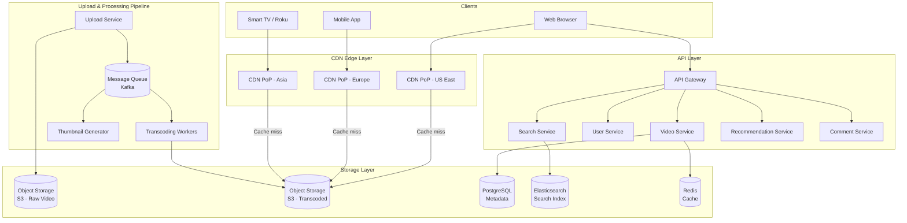
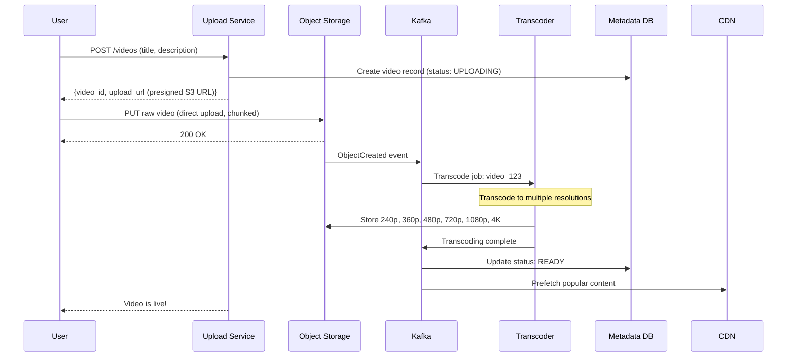
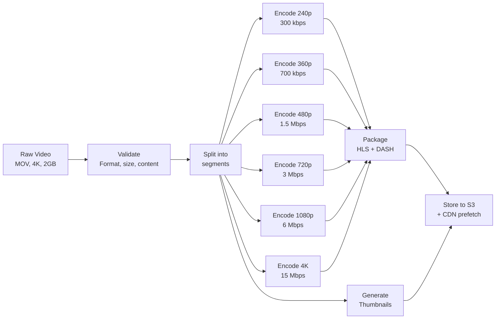
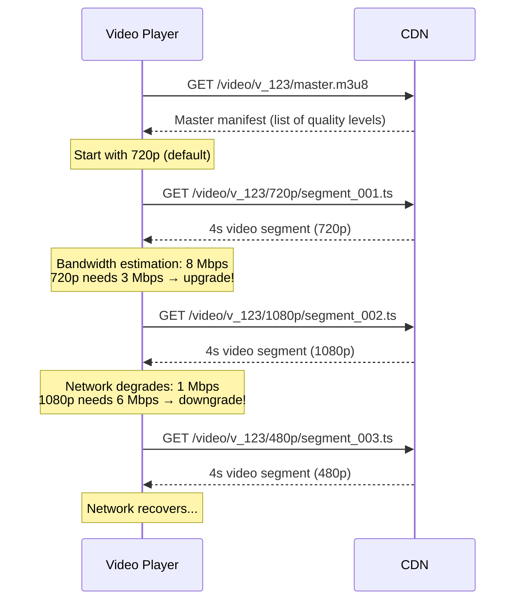
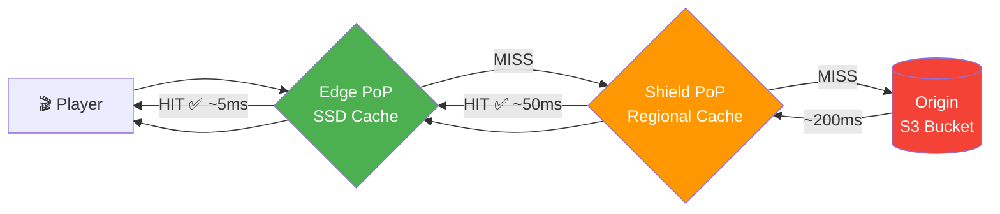
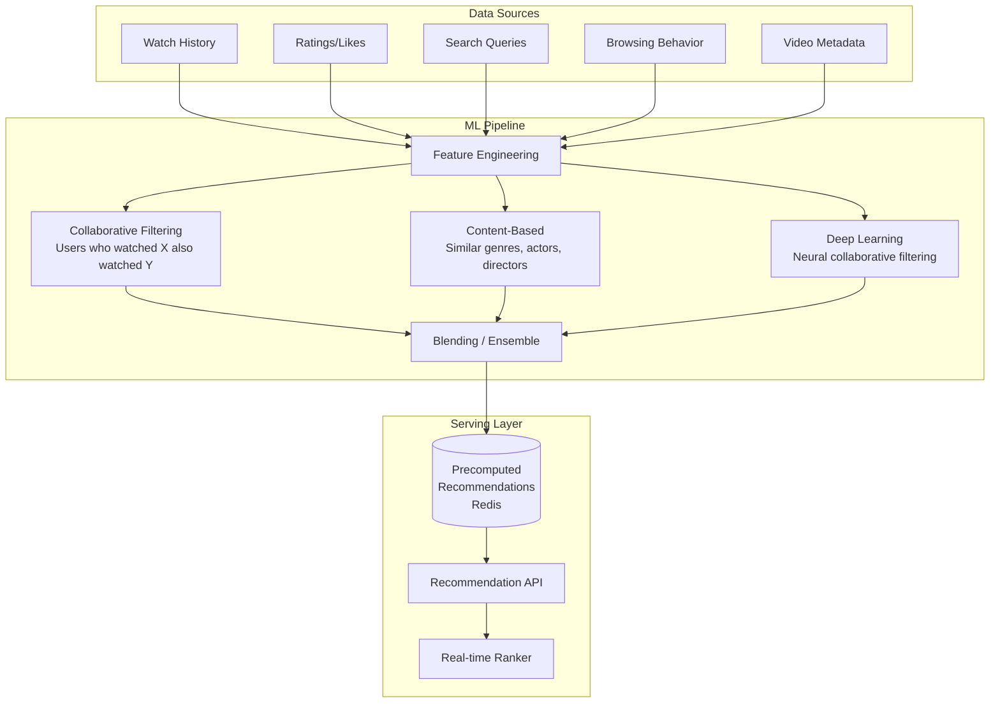
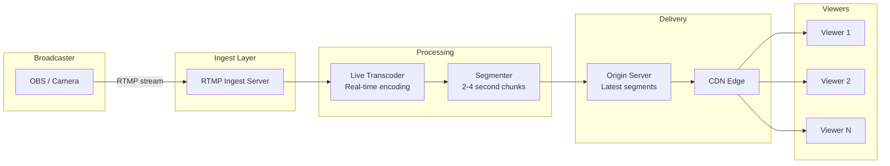
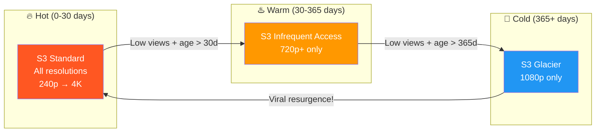

# Chapter 18: YouTube & Netflix — Video Streaming Platform

> *"YouTube serves over 1 billion hours of video per day. That's more video watched daily than the entire history of television combined."*

Video streaming is among the most data-intensive applications on the internet. Netflix alone accounts for **~15% of global internet bandwidth**. Designing a system like this tests your understanding of large-scale storage, content delivery, encoding pipelines, and recommendation systems.

---

## 18.1 Requirements & Estimation

### Functional Requirements

| Requirement | YouTube Style | Netflix Style |
|---|---|---|
| Video upload | Users upload any video | Studio uploads curated content |
| Video playback | Stream on demand | Stream on demand |
| Search | Full-text + tags | Title/genre/actor search |
| Recommendation | Personalized home feed | Personalized rows & categories |
| Comments/Likes | User-generated social | Minimal (ratings) |
| Channels/Subscriptions | Yes | Profiles within account |
| Live streaming | Yes (YouTube Live) | Limited (sports events) |
| Adaptive quality | Based on bandwidth | Based on bandwidth + plan |

### Non-Functional Requirements

- **Availability**: 99.99% — streaming is primary entertainment for many users
- **Latency**: Video playback starts within 2 seconds
- **Throughput**: Millions of concurrent streams
- **Durability**: Uploaded videos never lost
- **Global**: Low-latency delivery worldwide via CDN

### Back-of-Envelope Estimation (YouTube Scale)

```
Users:              2B monthly, 500M DAU
Videos:             800M total, 500 hours uploaded per minute
Watch time:         1B hours/day

Storage:
  New video/minute:  500 hours = 30,000 minutes of raw footage
  Raw size:          30,000 min × 200 MB/min (1080p) = 6 TB/min raw
  After encoding:    Multiple resolutions → ~3× raw ≈ 18 TB/min
  Per day:           ~26 PB/day (all resolutions)
  Total stored:      ~1 EB (exabyte) estimated

Bandwidth:
  1B hours/day = ~11.5M concurrent streams (avg session 50min)
  Avg bitrate:       5 Mbps (mix of qualities)
  Peak bandwidth:    11.5M × 5 Mbps = 57.5 Pbps
  (Served mostly from CDN edge, not origin)

Upload:
  500 hours/min = 30K videos/hour
  Upload processing:  ~30K transcoding jobs/hour
```

---

## 18.2 High-Level Architecture



---

## 18.3 Video Upload Pipeline

### Upload Flow



### Chunked Upload (Resumable)

Large videos (multi-GB) need resumable uploads. If the connection drops at 90%, you don't restart from zero.

```python
class ChunkedUploadService:
    CHUNK_SIZE = 5 * 1024 * 1024  # 5 MB chunks

    def initiate_upload(self, user_id: str, metadata: VideoMetadata) -> str:
        """Start a new resumable upload session."""
        video_id = str(uuid.uuid4())
        upload_session = UploadSession(
            video_id=video_id,
            user_id=user_id,
            total_size=metadata.file_size,
            chunk_size=self.CHUNK_SIZE,
            uploaded_chunks=set(),
            status="uploading",
        )
        self.session_store.save(upload_session)

        # Create multipart upload in S3
        s3_upload_id = self.s3.create_multipart_upload(
            Bucket="raw-videos",
            Key=f"{video_id}/original"
        )["UploadId"]

        upload_session.s3_upload_id = s3_upload_id
        self.session_store.save(upload_session)

        return video_id

    def upload_chunk(self, video_id: str, chunk_number: int, data: bytes) -> dict:
        """Upload a single chunk. Idempotent — safe to retry."""
        session = self.session_store.get(video_id)

        # Upload chunk to S3
        response = self.s3.upload_part(
            Bucket="raw-videos",
            Key=f"{video_id}/original",
            PartNumber=chunk_number,
            UploadId=session.s3_upload_id,
            Body=data,
        )

        session.uploaded_chunks.add(chunk_number)
        session.etags[chunk_number] = response["ETag"]
        self.session_store.save(session)

        total_chunks = math.ceil(session.total_size / self.CHUNK_SIZE)
        if len(session.uploaded_chunks) == total_chunks:
            self._complete_upload(session)

        return {
            "chunk": chunk_number,
            "progress": len(session.uploaded_chunks) / total_chunks
        }

    def _complete_upload(self, session: UploadSession):
        """All chunks received — finalize the upload."""
        parts = [{"PartNumber": n, "ETag": session.etags[n]}
                 for n in sorted(session.etags.keys())]

        self.s3.complete_multipart_upload(
            Bucket="raw-videos",
            Key=f"{session.video_id}/original",
            UploadId=session.s3_upload_id,
            MultipartUpload={"Parts": parts},
        )

        # Trigger transcoding pipeline
        self.kafka.send("video-uploaded", {
            "video_id": session.video_id,
            "s3_key": f"{session.video_id}/original",
            "user_id": session.user_id,
        })
```

```java
// Java equivalent
@Service
public class ChunkedUploadService {
    private static final int CHUNK_SIZE = 5 * 1024 * 1024;

    public String initiateUpload(String userId, VideoMetadata metadata) {
        String videoId = UUID.randomUUID().toString();

        CreateMultipartUploadResponse s3Response = s3Client
            .createMultipartUpload(CreateMultipartUploadRequest.builder()
                .bucket("raw-videos")
                .key(videoId + "/original")
                .build());

        UploadSession session = new UploadSession(
            videoId, userId, metadata.getFileSize(),
            s3Response.uploadId(), new ConcurrentHashMap<>()
        );
        sessionStore.save(session);
        return videoId;
    }

    public UploadProgress uploadChunk(String videoId, int chunkNumber, byte[] data) {
        UploadSession session = sessionStore.get(videoId);

        UploadPartResponse response = s3Client.uploadPart(
            UploadPartRequest.builder()
                .bucket("raw-videos")
                .key(videoId + "/original")
                .partNumber(chunkNumber)
                .uploadId(session.getS3UploadId())
                .build(),
            RequestBody.fromBytes(data)
        );

        session.getEtags().put(chunkNumber, response.eTag());
        sessionStore.save(session);

        int totalChunks = (int) Math.ceil(
            (double) session.getTotalSize() / CHUNK_SIZE);
        if (session.getEtags().size() == totalChunks) {
            completeUpload(session);
        }

        return new UploadProgress(chunkNumber,
            (double) session.getEtags().size() / totalChunks);
    }
}
```

---

## 18.4 Video Transcoding

### Why Transcode?

Users upload videos in countless formats (MP4, MOV, AVI, MKV) and resolutions. We need to:

1. **Normalize format** → Standard container (MP4) + codec (H.264/H.265)
2. **Multiple resolutions** → 240p, 360p, 480p, 720p, 1080p, 4K
3. **Adaptive bitrate** → Multiple bitrates per resolution for ABR streaming
4. **Segment** → Split into small chunks (2-10 seconds) for HLS/DASH

### Transcoding Pipeline



### Resolution Ladder

| Resolution | Bitrate (H.264) | Bitrate (H.265/HEVC) | Target Device |
|---|---|---|---|
| 240p | 300 kbps | 150 kbps | Feature phones, 2G |
| 360p | 700 kbps | 350 kbps | Low-end mobile |
| 480p | 1.5 Mbps | 750 kbps | Standard mobile |
| 720p | 3 Mbps | 1.5 Mbps | Tablet, laptop |
| 1080p | 6 Mbps | 3 Mbps | Desktop, smart TV |
| 4K | 15 Mbps | 8 Mbps | 4K TV |

### Transcoding Worker

```python
class TranscodingWorker:
    """Consumes from Kafka, transcodes video, stores results."""

    RESOLUTIONS = [
        {"name": "240p",  "width": 426,  "height": 240,  "bitrate": "300k"},
        {"name": "360p",  "width": 640,  "height": 360,  "bitrate": "700k"},
        {"name": "480p",  "width": 854,  "height": 480,  "bitrate": "1500k"},
        {"name": "720p",  "width": 1280, "height": 720,  "bitrate": "3000k"},
        {"name": "1080p", "width": 1920, "height": 1080, "bitrate": "6000k"},
        {"name": "4K",    "width": 3840, "height": 2160, "bitrate": "15000k"},
    ]

    def process(self, job: TranscodeJob):
        # 1. Download raw video from S3
        raw_path = self.download(job.s3_key)

        # 2. Probe video metadata
        probe = self.ffprobe(raw_path)
        original_height = probe["streams"][0]["height"]

        # 3. Transcode to each resolution ≤ original
        manifests = []
        for res in self.RESOLUTIONS:
            if res["height"] > original_height:
                continue  # Don't upscale

            output_dir = f"/tmp/{job.video_id}/{res['name']}"
            os.makedirs(output_dir, exist_ok=True)

            # FFmpeg: encode + segment for HLS
            self.ffmpeg(
                input_path=raw_path,
                output_dir=output_dir,
                width=res["width"],
                height=res["height"],
                bitrate=res["bitrate"],
                segment_duration=4,  # 4-second segments
            )

            # Upload segments to S3
            self.upload_segments(job.video_id, res["name"], output_dir)
            manifests.append(res["name"])

        # 4. Generate master manifest
        self.generate_master_manifest(job.video_id, manifests)

        # 5. Generate thumbnails (every 10 seconds for preview)
        self.generate_thumbnails(raw_path, job.video_id)

        # 6. Update metadata DB
        self.kafka.send("transcoding-complete", {
            "video_id": job.video_id,
            "resolutions": manifests,
            "duration": probe["format"]["duration"],
        })

    def ffmpeg(self, input_path, output_dir, width, height, bitrate, segment_duration):
        """Shell out to FFmpeg for actual encoding."""
        cmd = [
            "ffmpeg", "-i", input_path,
            "-vf", f"scale={width}:{height}",
            "-b:v", bitrate,
            "-c:v", "libx264", "-preset", "medium",
            "-c:a", "aac", "-b:a", "128k",
            "-hls_time", str(segment_duration),
            "-hls_list_size", "0",
            "-hls_segment_filename", f"{output_dir}/segment_%04d.ts",
            f"{output_dir}/playlist.m3u8"
        ]
        subprocess.run(cmd, check=True)
```

### Parallel & Distributed Transcoding

A single 4K video → 6+ encoding jobs. Each resolution can run independently.

```
Transcoding cluster:
  - 1000+ worker instances (GPU-accelerated)
  - Each worker handles one resolution of one video
  - Kafka distributes work with competing consumers
  - Average transcoding time: 0.5× real-time (10-min video → 5 min)
  - GPU encoding (NVENC): 5-10× faster than CPU
```

---

## 18.5 Adaptive Bitrate Streaming (ABR)

### How ABR Works

The client monitors its download speed and switches quality levels dynamically — no buffering, no manual quality selection needed.



### HLS Master Manifest

```
#EXTM3U
#EXT-X-VERSION:3

#EXT-X-STREAM-INF:BANDWIDTH=300000,RESOLUTION=426x240
/video/v_123/240p/playlist.m3u8

#EXT-X-STREAM-INF:BANDWIDTH=700000,RESOLUTION=640x360
/video/v_123/360p/playlist.m3u8

#EXT-X-STREAM-INF:BANDWIDTH=1500000,RESOLUTION=854x480
/video/v_123/480p/playlist.m3u8

#EXT-X-STREAM-INF:BANDWIDTH=3000000,RESOLUTION=1280x720
/video/v_123/720p/playlist.m3u8

#EXT-X-STREAM-INF:BANDWIDTH=6000000,RESOLUTION=1920x1080
/video/v_123/1080p/playlist.m3u8

#EXT-X-STREAM-INF:BANDWIDTH=15000000,RESOLUTION=3840x2160
/video/v_123/4K/playlist.m3u8
```

### Quality-Level Playlist

```
#EXTM3U
#EXT-X-VERSION:3
#EXT-X-TARGETDURATION:4
#EXT-X-MEDIA-SEQUENCE:0

#EXTINF:4.000,
segment_0000.ts
#EXTINF:4.000,
segment_0001.ts
#EXTINF:4.000,
segment_0002.ts
...
#EXT-X-ENDLIST
```

### HLS vs DASH

| Feature | HLS (Apple) | DASH (MPEG) |
|---|---|---|
| Container | MPEG-TS (.ts) or fMP4 | fMP4 |
| Manifest | .m3u8 (text) | .mpd (XML) |
| Apple devices | Native support | Requires JS player |
| DRM | FairPlay | Widevine, PlayReady |
| Industry adoption | YouTube, Twitch, Netflix | Netflix, YouTube (also) |
| Segment size | 2-10 seconds | 2-10 seconds |

**Netflix uses DASH; YouTube uses both HLS and DASH.**

---

## 18.6 Content Delivery Network (CDN)

### CDN Multi-Tier Cache Flow



### CDN Architecture for Video

```
                    ┌─────────────┐
                    │   Origin    │
                    │  (S3 bucket)│
                    └──────┬──────┘
                           │
              ┌────────────┼────────────┐
              │            │            │
        ┌─────▼─────┐ ┌───▼────┐ ┌────▼────┐
        │ Shield PoP│ │ Shield │ │ Shield  │
        │ US-East   │ │ EU     │ │ Asia    │
        └─────┬─────┘ └───┬────┘ └────┬────┘
              │            │            │
        ┌─────┼─────┐  ┌──┼────┐  ┌───┼────┐
        │     │     │  │  │    │  │   │    │
       PoP  PoP  PoP  PoP PoP  PoP  PoP  PoP
       NYC  ATL  MIA  LDN FRA  TKY  SIN  SYD
```

### Cache Strategy

```python
class VideoCDNStrategy:
    """
    Multi-tier caching for video segments.
    """

    def get_segment(self, video_id: str, quality: str, segment: int) -> bytes:
        key = f"{video_id}/{quality}/segment_{segment:04d}.ts"

        # Tier 1: Edge PoP (local SSD cache)
        cached = self.edge_cache.get(key)
        if cached:
            return cached  # Cache hit — served in <10ms

        # Tier 2: Regional shield (shared among PoPs)
        cached = self.shield_cache.get(key)
        if cached:
            self.edge_cache.put(key, cached, ttl=3600)
            return cached  # Shield hit — served in ~50ms

        # Tier 3: Origin fetch (S3)
        data = self.origin.get(key)  # ~200ms
        self.shield_cache.put(key, data, ttl=86400)
        self.edge_cache.put(key, data, ttl=3600)
        return data
```

### Predictive Prefetching

```python
class PrefetchService:
    """
    Prefetch upcoming segments before the player requests them.
    """

    def on_segment_requested(self, video_id: str, quality: str, segment_num: int):
        # Prefetch next 3 segments at the same quality
        for i in range(1, 4):
            next_seg = segment_num + i
            key = f"{video_id}/{quality}/segment_{next_seg:04d}.ts"
            if not self.edge_cache.exists(key):
                self.background_fetch(key)
```

### Netflix Open Connect

Netflix doesn't use traditional CDNs. They run **Open Connect Appliances (OCAs)** — custom hardware embedded in ISP data centers.

```
Traditional CDN:     User → ISP → CDN PoP → Origin
Netflix OCA:         User → ISP (OCA inside!) → done

Benefits:
  - Zero transit cost (video never leaves ISP network)
  - Sub-millisecond latency to content
  - ISPs get reduced upstream bandwidth
  - Netflix controls the hardware and software
```

---

## 18.7 Video Metadata & Database Design

### Data Model

```sql
-- Videos table
CREATE TABLE videos (
    id              UUID PRIMARY KEY,
    user_id         UUID NOT NULL REFERENCES users(id),
    title           VARCHAR(200) NOT NULL,
    description     TEXT,
    duration_secs   INTEGER,
    status          VARCHAR(20) DEFAULT 'uploading',
    -- uploading → transcoding → ready → published
    visibility      VARCHAR(20) DEFAULT 'public',
    -- public, unlisted, private
    view_count      BIGINT DEFAULT 0,
    like_count      INTEGER DEFAULT 0,
    dislike_count   INTEGER DEFAULT 0,
    thumbnail_url   TEXT,
    created_at      TIMESTAMPTZ DEFAULT NOW(),
    published_at    TIMESTAMPTZ
);

-- Video resolutions available after transcoding
CREATE TABLE video_resolutions (
    video_id    UUID REFERENCES videos(id),
    resolution  VARCHAR(10),  -- '240p', '720p', '1080p', '4K'
    bitrate     INTEGER,      -- kbps
    codec       VARCHAR(20),  -- 'h264', 'h265'
    manifest_url TEXT,
    PRIMARY KEY (video_id, resolution)
);

-- Denormalized view counts (avoid write contention on videos table)
CREATE TABLE video_stats (
    video_id    UUID,
    date        DATE,
    views       BIGINT DEFAULT 0,
    watch_time_secs BIGINT DEFAULT 0,
    likes       INTEGER DEFAULT 0,
    shares      INTEGER DEFAULT 0,
    PRIMARY KEY (video_id, date)
);

-- User watch history (for recommendations)
CREATE TABLE watch_history (
    user_id     UUID,
    watched_at  TIMESTAMPTZ,
    video_id    UUID,
    watch_duration_secs INTEGER,
    completed   BOOLEAN,
    PRIMARY KEY (user_id, watched_at)
) -- In Cassandra: CLUSTERING ORDER BY (watched_at DESC)
;
```

### View Count at Scale

View counting at YouTube scale (billions/day) can't be a simple `UPDATE videos SET view_count = view_count + 1`. That would cause massive write contention.

```python
class ViewCountService:
    """
    Approximate real-time counts with batch reconciliation.
    """

    def record_view(self, video_id: str, user_id: str):
        # 1. Deduplicate (same user within window = 1 view)
        dedup_key = f"viewed:{video_id}:{user_id}"
        if self.redis.exists(dedup_key):
            return  # Already counted
        self.redis.setex(dedup_key, 3600, "1")  # 1-hour dedup window

        # 2. Increment in-memory counter (Redis)
        self.redis.incr(f"views:{video_id}")

        # 3. Publish to analytics pipeline (async)
        self.kafka.send("video-views", {
            "video_id": video_id,
            "user_id": user_id,
            "timestamp": int(time.time()),
        })

    # Background job: flush Redis counters to DB periodically
    def flush_view_counts(self):
        """Run every 5 minutes — batch update DB."""
        cursor = "0"
        while cursor != 0:
            cursor, keys = self.redis.scan(cursor, match="views:*", count=100)
            pipe = self.redis.pipeline()
            for key in keys:
                pipe.getdel(key)  # Atomic get-and-delete
            counts = pipe.execute()

            # Batch update PostgreSQL
            updates = []
            for key, count in zip(keys, counts):
                if count:
                    video_id = key.split(":")[1]
                    updates.append((int(count), video_id))

            self.db.executemany(
                "UPDATE videos SET view_count = view_count + %s WHERE id = %s",
                updates
            )
```

---

## 18.8 Recommendation System

### Netflix-Style Recommendation Architecture



### Simplified Recommendation Pipeline

```python
class RecommendationService:
    def get_home_feed(self, user_id: str) -> list[VideoRow]:
        """
        Generate personalized home feed.
        Returns rows like: "Because you watched X", "Trending", "Top Picks for You"
        """
        # 1. Check precomputed cache first
        cached = self.redis.get(f"recs:{user_id}")
        if cached:
            return self.deserialize(cached)

        # 2. Get user profile & history
        history = self.watch_history.get_recent(user_id, limit=100)
        preferences = self.user_profile.get(user_id)

        rows = []

        # Row 1: "Continue Watching" — partially watched videos
        in_progress = self.watch_history.get_in_progress(user_id)
        if in_progress:
            rows.append(VideoRow("Continue Watching", in_progress))

        # Row 2: "Because You Watched X" — collaborative filtering
        for recent in history[:3]:
            similar = self.collaborative_filter.find_similar(
                video_id=recent.video_id,
                user_id=user_id,
                limit=20
            )
            rows.append(VideoRow(
                f"Because You Watched {recent.title}",
                similar
            ))

        # Row 3: "Trending Now" — global popularity
        trending = self.trending_service.get_trending(
            region=preferences.region, limit=20
        )
        rows.append(VideoRow("Trending Now", trending))

        # Row 4: "Top Picks for You" — deep learning model
        top_picks = self.neural_ranker.predict(
            user_id=user_id,
            candidates=self.candidate_generator.generate(user_id, 500),
            limit=20
        )
        rows.append(VideoRow("Top Picks for You", top_picks))

        # Row 5+: Genre rows
        for genre in preferences.top_genres[:5]:
            genre_picks = self.content_based.get_by_genre(
                genre, user_id=user_id, limit=20
            )
            rows.append(VideoRow(f"Popular in {genre}", genre_picks))

        # Cache for 1 hour
        self.redis.setex(f"recs:{user_id}", 3600, self.serialize(rows))
        return rows
```

### Collaborative Filtering (Simplified)

```python
class CollaborativeFilter:
    """
    Item-based collaborative filtering.
    "Users who watched video A also watched video B."
    """

    def find_similar(self, video_id: str, user_id: str, limit: int) -> list[Video]:
        # Precomputed similarity matrix (updated daily via batch ML job)
        # similarity[video_a][video_b] = cosine similarity score
        similar_ids = self.similarity_index.get_nearest(video_id, k=limit * 2)

        # Filter out already-watched videos
        watched = self.watch_history.get_watched_ids(user_id)
        candidates = [vid for vid in similar_ids if vid not in watched]

        return self.video_store.get_batch(candidates[:limit])
```

---

## 18.9 Search

### Search Pipeline


### Search Architecture

```python
class VideoSearchService:
    def __init__(self, es_client):
        self.es = es_client

    def index_video(self, video: Video):
        """Called when video status → published."""
        self.es.index(index="videos", id=str(video.id), body={
            "title": video.title,
            "description": video.description,
            "tags": video.tags,
            "channel_name": video.channel.name,
            "category": video.category,
            "duration": video.duration_secs,
            "view_count": video.view_count,
            "published_at": video.published_at.isoformat(),
            "language": video.language,
        })

    def search(self, query: str, filters: dict = None, page: int = 0) -> list[Video]:
        body = {
            "query": {
                "bool": {
                    "must": {
                        "multi_match": {
                            "query": query,
                            "fields": [
                                "title^3",        # Title is 3× more important
                                "tags^2",
                                "description",
                                "channel_name"
                            ],
                            "type": "best_fields",
                            "fuzziness": "AUTO",
                        }
                    },
                    "filter": self._build_filters(filters),
                }
            },
            "sort": [
                {"_score": "desc"},
                {"view_count": "desc"},  # Tiebreaker: popular videos first
            ],
            "from": page * 20,
            "size": 20,
        }

        results = self.es.search(index="videos", body=body)
        return [self._to_video(hit) for hit in results["hits"]["hits"]]
```

---

## 18.10 Live Streaming

### Live Streaming Architecture



### Live vs VOD Comparison

| Aspect | VOD (YouTube) | Live (Twitch/YouTube Live) |
|---|---|---|
| Encoding | Offline (minutes/hours) | Real-time (<1s per segment) |
| Segments | All pre-generated | Generated on-the-fly |
| Latency | Seconds (start-up) | 2-30 seconds (glass-to-glass) |
| CDN caching | Long TTL (hours/days) | Very short TTL (2-4 seconds) |
| Manifest | Static (complete list) | Dynamic (rolling window) |
| Failure mode | Retry from S3 | Lost forever if not recorded |
| Scale | Cache-friendly | Thundering herd on popular streams |

### Ultra-Low Latency (WebRTC)

For interactive live streaming (< 1 second latency):

| Protocol | Latency | Scale | Use Case |
|---|---|---|---|
| RTMP | 3-5 seconds | Medium | Traditional streaming |
| HLS | 6-30 seconds | High (CDN friendly) | Netflix, YouTube |
| LL-HLS | 2-6 seconds | High | Apple low-latency |
| DASH LL | 2-5 seconds | High | Low-latency DASH |
| WebRTC | < 1 second | Low (P2P) | Video calls, auctions |

---

## 18.11 DRM (Digital Rights Management)

### Netflix DRM Architecture

Netflix must protect licensed content from unauthorized copying.

```
Content Encryption:
  1. Video segments encrypted with AES-128 (content key)
  2. Content key encrypted with device-specific license key
  3. License server issues keys only to verified devices
  4. Keys expire → device must re-acquire

DRM Systems:
  ┌──────────────────────────────────────────┐
  │ Device          │ DRM System             │
  │─────────────────┼────────────────────────│
  │ Chrome, Android │ Widevine (Google)      │
  │ Safari, iOS     │ FairPlay (Apple)       │
  │ Edge, Xbox      │ PlayReady (Microsoft)  │
  └──────────────────────────────────────────┘

Common Encryption (CENC):
  - Encrypt video ONCE using CENC standard
  - Serve same encrypted content to all devices
  - Only the license acquisition differs per DRM
```

---

## 18.12 Scaling & Cost Optimization

### Storage Tiering Lifecycle



### Storage Optimization

```python
class StorageOptimizer:
    """
    Not all videos need all resolutions forever.
    """

    TIERS = {
        "hot":   {"days": 30,  "storage": "S3 Standard",     "resolutions": "all"},
        "warm":  {"days": 365, "storage": "S3 IA",           "resolutions": "720p+"},
        "cold":  {"days": None, "storage": "S3 Glacier",     "resolutions": "1080p only"},
    }

    def optimize(self, video_id: str):
        video = self.video_store.get(video_id)
        days_since_upload = (datetime.now() - video.published_at).days
        recent_views = self.stats.get_views_last_30_days(video_id)

        if days_since_upload < 30 or recent_views > 1000:
            tier = "hot"
        elif days_since_upload < 365 or recent_views > 10:
            tier = "warm"
        else:
            tier = "cold"

        config = self.TIERS[tier]

        # Move to appropriate storage class
        self.s3.transition(video_id, config["storage"])

        # Remove low-resolution variants for old, unpopular videos
        if config["resolutions"] != "all":
            self.remove_low_res(video_id, keep_min=config["resolutions"])
```

### Cost Breakdown (YouTube-Scale Estimates)

```
Storage:
  1 EB stored × $0.023/GB/month = ~$23M/month (with tiering: ~$8M)

Bandwidth:
  57.5 Pbps peak (mostly CDN)
  CDN cost: ~$0.02/GB → billions of GB/month → $100M+/month

Transcoding:
  30K jobs/hour × $0.015/min transcoded → ~$7M/month

Compute:
  API servers, recommendation ML, search → ~$20M/month

Total infrastructure: ~$150-200M/month (order of magnitude)
```

---

## 18.13 Interview Tips — Video Streaming

### Common Follow-Up Questions

| Question | Key Points |
|---|---|
| "Why not transcode on-the-fly?" | Too slow for first viewer, wastes compute on repeated requests. Pre-transcode and cache. |
| "How to reduce storage costs?" | Tiered storage (hot/warm/cold), remove unused resolutions, per-title encoding (Netflix) |
| "How does Netflix achieve zero buffering?" | OCAs in ISP networks, predictive prefetching, ABR adapts quickly |
| "How to handle viral videos?" | CDN absorbs read load, origin barely touched once cached |
| "Live streaming at scale?" | Segment + CDN (HLS/DASH). Thundering herd mitigated by edge caching with short TTL |
| "How does recommendation work?" | Collaborative filtering + content-based + deep learning, blended and personalized |

### Architecture Checklist

```
✅ Resumable chunked upload (large files)
✅ Async transcoding pipeline (Kafka + worker pool)
✅ Multiple resolutions with ABR (HLS/DASH)
✅ CDN with multi-tier caching (edge → shield → origin)
✅ Separate hot/warm/cold storage tiers
✅ View counting: Redis buffer → Kafka → batch DB update
✅ Recommendation: collaborative + content-based + ML blending
✅ Search: Elasticsearch with weighted fields
✅ DRM for licensed content (CENC + Widevine/FairPlay/PlayReady)
✅ Live streaming: RTMP ingest → real-time transcode → HLS segments
```

---

## Key Takeaways

| Concept | Key Insight |
|---|---|
| Transcoding | Convert once, serve many — pre-encode all resolutions offline |
| ABR Streaming | Client-driven quality switching based on bandwidth; use HLS or DASH |
| CDN | Edge caching is everything — origin serves < 1% of video traffic |
| Segmentation | 2-10 second chunks enable quality switching and parallel download |
| Upload | Resumable chunked upload for reliability on large files |
| View Counts | Buffer in Redis, batch-flush to DB — never increment SQL row directly |
| Recommendations | Hybrid: collaborative filtering + content-based + neural ranking |
| Storage Tiers | Not all videos are equal — tier by recency and popularity |
| Live vs VOD | Live = real-time encoding with short TTL; VOD = pre-encoded with long TTL |
| Cost | Bandwidth dominates — CDN strategy is the #1 cost lever |

---

## Practice Questions

1. **Per-title encoding**: Netflix analyzes each video's complexity and creates a custom bitrate ladder. A simple cartoon needs less bitrate than a complex action scene at the same resolution. How would you design this system?

2. **Viral video**: A video goes from 0 to 100M views in 1 hour. Walk through how each layer (CDN, origin, database, cache) handles the surge.

3. **Global latency**: A user in rural India on a 2G connection wants to watch a video. How does the system ensure they can start playback within 5 seconds?

4. **Copyright detection**: YouTube's Content ID system scans every upload against a database of copyrighted material. How would you design the matching pipeline?

5. **Cost optimization**: Your video platform's AWS bill is $10M/month, with 60% being bandwidth costs. What architectural changes could reduce this by 30%?

---

[← Chapter 17: WhatsApp & Chat System](ch17-whatsapp-chat-system.md) | [Chapter 19: Uber & Location Services →](ch19-uber-location-services.md)
