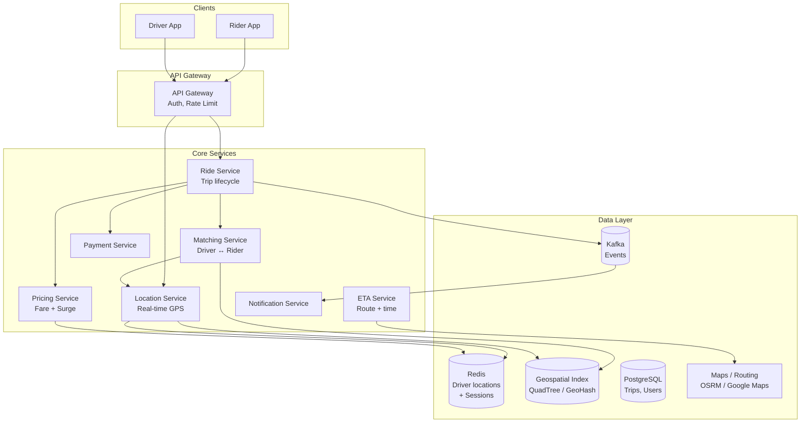
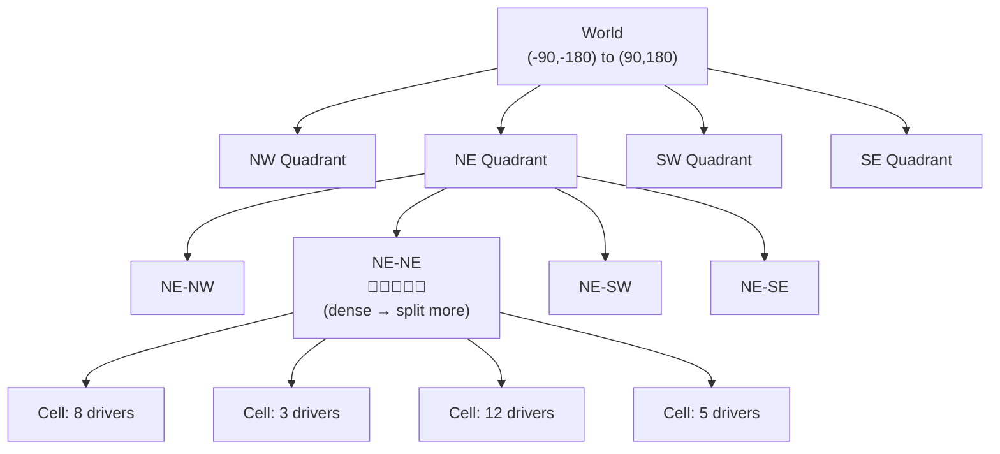
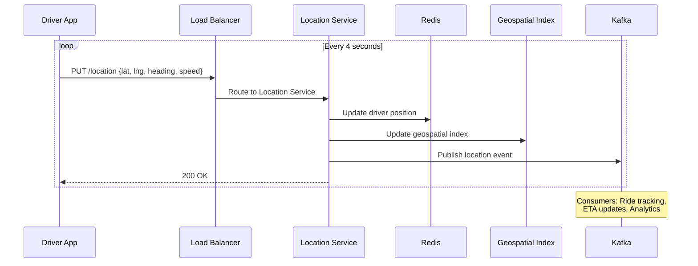
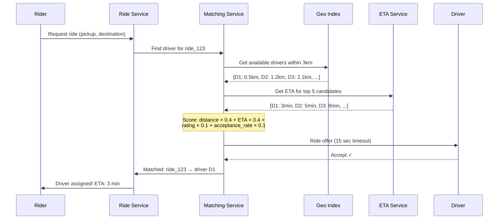
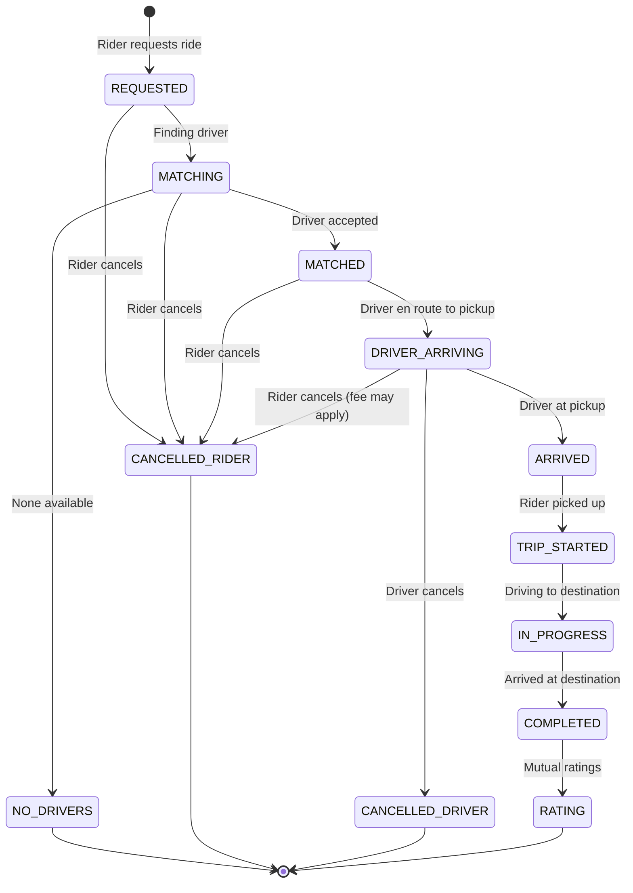
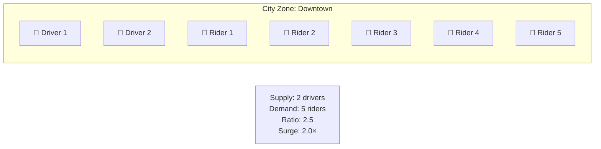
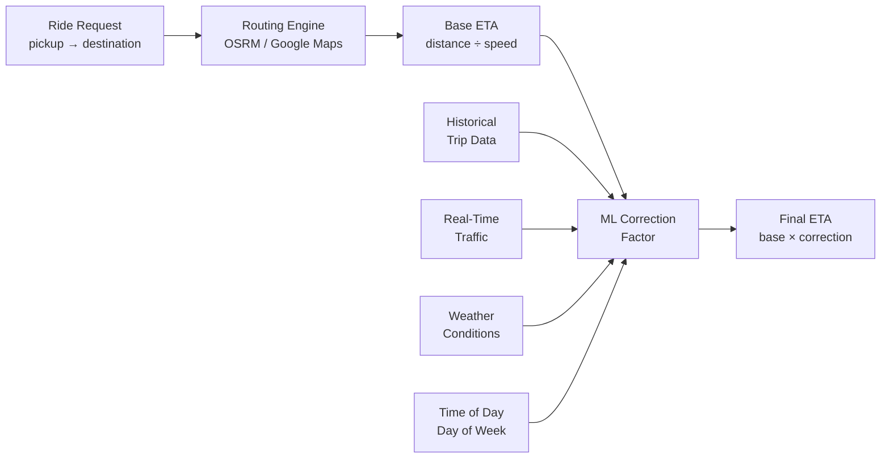
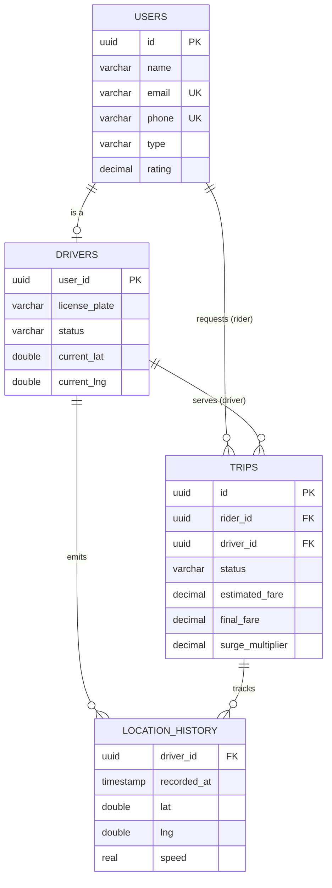
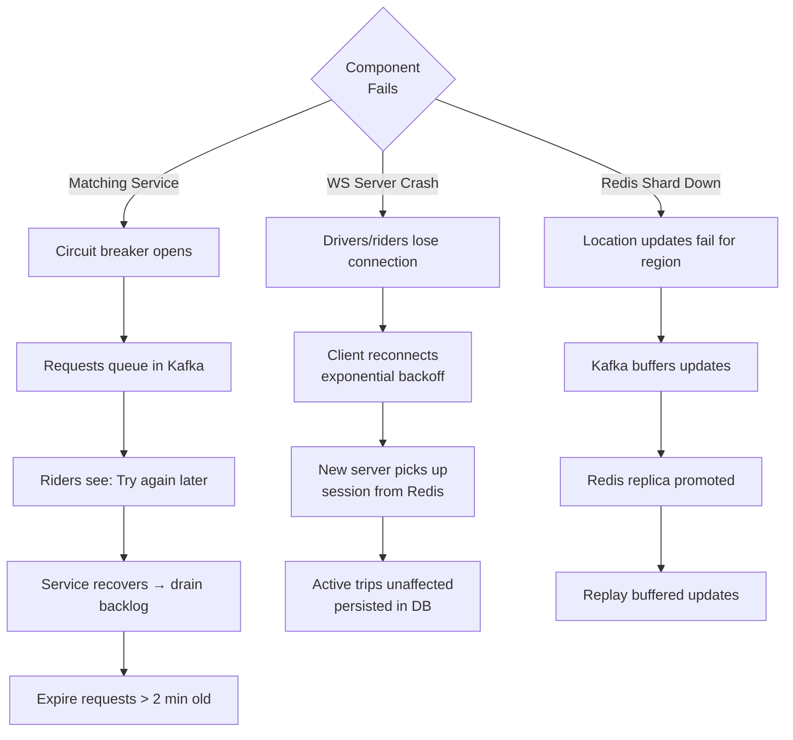

# Chapter 19: Uber & Location-Based Services

> *"Uber completes 23 million rides per day across 70+ countries. Behind every 'Your driver is arriving' is a system matching supply and demand in real-time across millions of GPS coordinates."*

Ride-hailing is a uniquely challenging design problem: it combines **real-time location tracking**, **geospatial indexing**, **dynamic matching algorithms**, and **time-critical operations** where a 5-second delay means a worse user experience. This chapter covers the full architecture.

---

## 19.1 Requirements & Estimation

### Functional Requirements

| Requirement | Details |
|---|---|
| Rider requests ride | Enter pickup & destination, see price estimate, confirm |
| Driver matching | Match nearest available driver to rider |
| Real-time tracking | Both rider and driver see each other's live location |
| Trip management | Start trip, navigate, complete trip, payment |
| ETA estimation | Estimated time of arrival (pickup + trip) |
| Surge pricing | Dynamic pricing based on supply/demand |
| Driver/rider ratings | Post-trip mutual rating |
| Ride history | Past trips, receipts, routes |

### Non-Functional Requirements

- **Latency**: Driver match within 10 seconds, location updates < 1 second
- **Accuracy**: Location within 10 meters, ETA within 2 minutes
- **Availability**: 99.99% — people rely on this for transportation
- **Scale**: Millions of concurrent rides, millions of driver location updates/second
- **Consistency**: A driver can only be matched to ONE ride at a time

### Back-of-Envelope Estimation

```
Daily rides:         23M
Active drivers:      5M at any time
Active riders:       ~5M requesting at any time
Concurrent rides:    ~1M (avg ride = 15 min, spread across 24 hours)

Location updates:
  Drivers: 5M drivers × 1 update/4 sec = 1.25M updates/sec
  Active rides: 1M rides × 2 participants × 1/sec = 2M updates/sec
  Total: ~3M location updates/sec

Storage:
  Location update: ~50 bytes (lat, lng, timestamp, driver_id)
  3M/sec × 50 bytes = 150 MB/sec = ~13 TB/day

Trip records:
  23M trips/day × 1 KB/trip = 23 GB/day

Matching:
  ~500K ride requests per hour
  Each request: search nearby drivers → ~140 requests/sec
```

---

## 19.2 High-Level Architecture



### Service Responsibilities

| Service | Responsibility |
|---|---|
| **Location Service** | Ingest GPS updates, maintain real-time driver positions |
| **Matching Service** | Find nearest available driver for a ride request |
| **Ride Service** | Trip lifecycle: request → match → pickup → complete |
| **Pricing Service** | Calculate fare, apply surge multiplier |
| **ETA Service** | Estimate arrival times using routing engine |
| **Payment Service** | Charge rider, pay driver |
| **Notification Service** | Push updates to rider/driver apps |

---

## 19.3 Geospatial Indexing

The core problem: given a rider at `(lat, lng)`, find the **K nearest available drivers** efficiently. A brute-force scan of 5M drivers per request won't work.

### Approach 1: Geohash

Geohash encodes a 2D coordinate into a 1D string. Nearby locations share a common prefix.

```
Geohash: "9q8yy" (San Francisco)
         "9q8yz" (nearby — shares "9q8y" prefix)
         "dp3wt" (New York — completely different)

Precision levels:
  4 chars → ~39 km × 19.5 km cell
  5 chars → ~4.9 km × 4.9 km cell   ← Good for city-level
  6 chars → ~1.2 km × 0.6 km cell   ← Good for nearby search
  7 chars → ~153 m × 153 m cell     ← Very precise
```

```python
import geohash2

class GeohashLocationIndex:
    """
    Index drivers by geohash for fast nearby lookups.
    Uses Redis sorted sets for each geohash cell.
    """
    PRECISION = 6  # ~1.2km cells

    def __init__(self, redis_client):
        self.redis = redis_client

    def update_driver_location(self, driver_id: str, lat: float, lng: float):
        new_hash = geohash2.encode(lat, lng, precision=self.PRECISION)

        # Remove from old cell (if moved to a new one)
        old_hash = self.redis.hget("driver_geohash", driver_id)
        if old_hash and old_hash != new_hash:
            self.redis.srem(f"geo:{old_hash}", driver_id)

        # Add to new cell
        self.redis.sadd(f"geo:{new_hash}", driver_id)
        self.redis.hset("driver_geohash", driver_id, new_hash)

        # Store precise location
        self.redis.geoadd("driver_locations", lng, lat, driver_id)

    def find_nearby_drivers(self, lat: float, lng: float,
                            radius_km: float = 3.0, limit: int = 20) -> list:
        """
        Find available drivers near a point.
        Search the target geohash cell + 8 neighboring cells.
        """
        center_hash = geohash2.encode(lat, lng, precision=self.PRECISION)
        neighbors = geohash2.neighbors(center_hash)
        search_cells = [center_hash] + list(neighbors.values())

        candidate_drivers = set()
        for cell in search_cells:
            members = self.redis.smembers(f"geo:{cell}")
            candidate_drivers.update(members)

        # Filter by exact distance and availability
        nearby = []
        for driver_id in candidate_drivers:
            dist = self.redis.geodist("driver_locations", driver_id,
                                       f"query_{lat}_{lng}", unit="km")
            if dist and float(dist) <= radius_km:
                if self.is_available(driver_id):
                    nearby.append((driver_id, float(dist)))

        # Sort by distance, return closest
        nearby.sort(key=lambda x: x[1])
        return nearby[:limit]

    def is_available(self, driver_id: str) -> bool:
        status = self.redis.hget("driver_status", driver_id)
        return status == "available"
```

### Approach 2: QuadTree

A QuadTree recursively divides 2D space into four quadrants. Dense areas get more subdivisions.



```python
from dataclasses import dataclass, field

@dataclass
class Point:
    lat: float
    lng: float
    driver_id: str

@dataclass
class BoundingBox:
    min_lat: float
    min_lng: float
    max_lat: float
    max_lng: float

    def contains(self, point: Point) -> bool:
        return (self.min_lat <= point.lat <= self.max_lat and
                self.min_lng <= point.lng <= self.max_lng)

    def intersects(self, other: 'BoundingBox') -> bool:
        return not (other.min_lat > self.max_lat or
                    other.max_lat < self.min_lat or
                    other.min_lng > self.max_lng or
                    other.max_lng < self.min_lng)

class QuadTree:
    MAX_POINTS = 10  # Split threshold
    MAX_DEPTH = 12   # Prevent infinite splits

    def __init__(self, boundary: BoundingBox, depth: int = 0):
        self.boundary = boundary
        self.depth = depth
        self.points: list[Point] = []
        self.children: list[QuadTree] = []  # NW, NE, SW, SE
        self.divided = False

    def insert(self, point: Point) -> bool:
        if not self.boundary.contains(point):
            return False

        if len(self.points) < self.MAX_POINTS or self.depth >= self.MAX_DEPTH:
            self.points.append(point)
            return True

        if not self.divided:
            self._subdivide()

        for child in self.children:
            if child.insert(point):
                return True
        return False

    def query_range(self, search_box: BoundingBox) -> list[Point]:
        """Find all points within a bounding box."""
        results = []

        if not self.boundary.intersects(search_box):
            return results

        for point in self.points:
            if search_box.contains(point):
                results.append(point)

        if self.divided:
            for child in self.children:
                results.extend(child.query_range(search_box))

        return results

    def _subdivide(self):
        mid_lat = (self.boundary.min_lat + self.boundary.max_lat) / 2
        mid_lng = (self.boundary.min_lng + self.boundary.max_lng) / 2
        b = self.boundary

        self.children = [
            QuadTree(BoundingBox(mid_lat, b.min_lng, b.max_lat, mid_lng), self.depth + 1),  # NW
            QuadTree(BoundingBox(mid_lat, mid_lng, b.max_lat, b.max_lng), self.depth + 1),  # NE
            QuadTree(BoundingBox(b.min_lat, b.min_lng, mid_lat, mid_lng), self.depth + 1),  # SW
            QuadTree(BoundingBox(b.min_lat, mid_lng, mid_lat, b.max_lng), self.depth + 1),  # SE
        ]
        self.divided = True

        # Redistribute existing points
        for point in self.points:
            for child in self.children:
                if child.insert(point):
                    break
        self.points = []
```

### Geohash vs QuadTree vs Redis GEO

| Feature | Geohash | QuadTree | Redis GEO |
|---|---|---|---|
| Complexity | Simple | Moderate | Simplest (built-in) |
| Update cost | O(1) hash | O(log N) tree | O(log N) sorted set |
| Query cost | O(neighbors × cell size) | O(log N + K results) | O(N log N) radius |
| Distribution | Fixed-size cells | Adaptive density | Sorted set |
| Edge cases | Cell boundary misses | Balanced for all densities | Built-in distance |
| In production | Uber (S2 cells) | Some custom solutions | Small-medium scale |

**Uber's actual choice**: Google S2 Geometry library — similar to geohash but uses a sphere-to-cube projection, avoiding distortion at poles and boundaries.

---

## 19.4 Real-Time Location Tracking

### Location Update Flow



### Location Service Implementation

```python
class LocationService:
    """
    Ingests 3M+ location updates per second.
    Write-heavy, latency-sensitive.
    """

    def update_location(self, driver_id: str, lat: float, lng: float,
                        heading: float, speed: float):
        timestamp = time.time()

        # 1. Update current position in Redis (for real-time queries)
        location_data = {
            "lat": lat, "lng": lng,
            "heading": heading, "speed": speed,
            "ts": timestamp
        }
        self.redis.hset(f"driver:{driver_id}:location", mapping=location_data)
        self.redis.geoadd("driver_positions", lng, lat, driver_id)

        # 2. Update geospatial index (for matching)
        self.geo_index.update_driver_location(driver_id, lat, lng)

        # 3. Publish to Kafka (for ride tracking, analytics)
        self.kafka.send("driver-locations", key=driver_id, value={
            "driver_id": driver_id,
            **location_data
        })

    def get_driver_location(self, driver_id: str) -> dict:
        return self.redis.hgetall(f"driver:{driver_id}:location")

    def get_drivers_in_area(self, lat: float, lng: float,
                            radius_km: float) -> list:
        # Use Redis GEORADIUS for simple queries
        return self.redis.georadius(
            "driver_positions", lng, lat,
            radius_km, unit="km",
            withcoord=True, withdist=True,
            sort="ASC", count=50
        )
```

```java
@Service
public class LocationService {

    public void updateLocation(String driverId, double lat, double lng,
                                double heading, double speed) {
        long timestamp = Instant.now().toEpochMilli();

        // 1. Redis current position
        Map<String, String> locationData = Map.of(
            "lat", String.valueOf(lat),
            "lng", String.valueOf(lng),
            "heading", String.valueOf(heading),
            "speed", String.valueOf(speed),
            "ts", String.valueOf(timestamp)
        );
        redis.opsForHash().putAll("driver:" + driverId + ":location", locationData);
        redis.opsForGeo().add("driver_positions", new Point(lng, lat), driverId);

        // 2. Geospatial index
        geoIndex.updateDriverLocation(driverId, lat, lng);

        // 3. Kafka event
        kafkaTemplate.send("driver-locations", driverId,
            new LocationEvent(driverId, lat, lng, heading, speed, timestamp));
    }

    public List<GeoResult<String>> getDriversInArea(double lat, double lng,
                                                     double radiusKm) {
        return redis.opsForGeo().radius(
            "driver_positions",
            new Circle(new Point(lng, lat), new Distance(radiusKm, Metrics.KILOMETERS)),
            RedisGeoCommands.GeoRadiusCommandArgs.newGeoRadiusArgs()
                .includeCoordinates()
                .includeDistance()
                .sortAscending()
                .limit(50)
        ).getContent();
    }
}
```

### Location Smoothing

GPS data is noisy. Raw updates jump around. Apply **Kalman filtering** or simple smoothing:

```python
class LocationSmoother:
    """
    Simple exponential moving average to smooth GPS noise.
    Production systems use Kalman filters.
    """

    ALPHA = 0.3  # Smoothing factor (0 = ignore new, 1 = ignore old)

    def smooth(self, driver_id: str, raw_lat: float, raw_lng: float) -> tuple:
        prev = self.redis.hgetall(f"driver:{driver_id}:smooth")

        if not prev:
            return raw_lat, raw_lng

        prev_lat = float(prev["lat"])
        prev_lng = float(prev["lng"])

        smooth_lat = self.ALPHA * raw_lat + (1 - self.ALPHA) * prev_lat
        smooth_lng = self.ALPHA * raw_lng + (1 - self.ALPHA) * prev_lng

        self.redis.hset(f"driver:{driver_id}:smooth", mapping={
            "lat": smooth_lat, "lng": smooth_lng
        })

        return smooth_lat, smooth_lng
```

---

## 19.5 Driver Matching

### Matching Flow



### Matching Algorithm

```python
class MatchingService:
    SEARCH_RADIUS_KM = 3.0
    MAX_SEARCH_RADIUS_KM = 10.0
    OFFER_TIMEOUT_SECS = 15
    MAX_RETRY_DRIVERS = 3

    def find_driver(self, ride: Ride) -> Driver | None:
        """
        Find the best available driver for a ride.
        Expanding radius search with scoring.
        """
        radius = self.SEARCH_RADIUS_KM

        while radius <= self.MAX_SEARCH_RADIUS_KM:
            candidates = self.geo_index.find_nearby_drivers(
                lat=ride.pickup_lat,
                lng=ride.pickup_lng,
                radius_km=radius,
                limit=20
            )

            if not candidates:
                radius *= 2  # Expand search
                continue

            # Score and rank candidates
            scored = self._score_candidates(candidates, ride)

            # Try top candidates in order
            for driver_id, score in scored[:self.MAX_RETRY_DRIVERS]:
                accepted = self._offer_ride(driver_id, ride)
                if accepted:
                    self._lock_driver(driver_id, ride.id)
                    return self.driver_store.get(driver_id)

            radius *= 2  # All rejected — expand search

        return None  # No driver found

    def _score_candidates(self, candidates: list, ride: Ride) -> list:
        """
        Multi-factor scoring.
        Lower score = better match.
        """
        scored = []
        for driver_id, distance_km in candidates:
            driver = self.driver_store.get(driver_id)
            eta = self.eta_service.estimate(
                driver.lat, driver.lng,
                ride.pickup_lat, ride.pickup_lng
            )

            score = (
                distance_km * 0.3 +            # Proximity
                eta.minutes * 0.4 +             # Actual ETA (accounts for traffic)
                (5.0 - driver.rating) * 0.2 +   # Higher rating = lower penalty
                (1.0 - driver.acceptance_rate) * 0.1  # Higher acceptance = lower penalty
            )
            scored.append((driver_id, score))

        scored.sort(key=lambda x: x[1])
        return scored

    def _offer_ride(self, driver_id: str, ride: Ride) -> bool:
        """Send ride offer to driver, wait for response."""
        # Atomically mark driver as "offered" (prevent double-matching)
        locked = self.redis.set(
            f"driver_lock:{driver_id}", ride.id,
            nx=True, ex=self.OFFER_TIMEOUT_SECS
        )
        if not locked:
            return False  # Driver already has a pending offer

        # Push offer to driver app
        self.notification_service.send_ride_offer(driver_id, ride)

        # Wait for response (up to 15 seconds)
        response = self.wait_for_response(driver_id, ride.id,
                                           timeout=self.OFFER_TIMEOUT_SECS)

        if response != "accepted":
            self.redis.delete(f"driver_lock:{driver_id}")
            return False

        return True

    def _lock_driver(self, driver_id: str, ride_id: str):
        """Mark driver as unavailable."""
        self.redis.hset("driver_status", driver_id, "on_trip")
        self.redis.set(f"driver_ride:{driver_id}", ride_id)
```

### Preventing Double-Matching

Critical invariant: **a driver can only be matched to ONE ride at a time**.

```python
# Redis-based distributed lock
def try_match_driver(driver_id: str, ride_id: str) -> bool:
    """
    Atomic: only one ride can claim a driver.
    SET NX = Set if Not eXists (atomic compare-and-swap).
    """
    return redis.set(
        key=f"driver_lock:{driver_id}",
        value=ride_id,
        nx=True,    # Only set if key doesn't exist
        ex=20       # Auto-expire after 20 seconds (safety net)
    )
```

---

## 19.6 Trip Lifecycle

### State Machine



### Trip Service

```python
class TripService:
    def request_ride(self, rider_id: str, pickup: Location,
                     destination: Location) -> Trip:
        # 1. Estimate fare
        estimate = self.pricing_service.estimate(pickup, destination)

        # 2. Create trip record
        trip = Trip(
            id=str(uuid.uuid4()),
            rider_id=rider_id,
            pickup=pickup,
            destination=destination,
            estimated_fare=estimate.fare,
            surge_multiplier=estimate.surge,
            status=TripStatus.REQUESTED,
            created_at=datetime.utcnow(),
        )
        self.trip_store.save(trip)

        # 3. Start matching (async)
        self.kafka.send("ride-requests", {
            "trip_id": trip.id,
            "pickup": {"lat": pickup.lat, "lng": pickup.lng},
            "destination": {"lat": destination.lat, "lng": destination.lng},
        })

        return trip

    def start_trip(self, trip_id: str, driver_id: str):
        trip = self.trip_store.get(trip_id)
        self._assert_status(trip, TripStatus.ARRIVED)
        self._assert_driver(trip, driver_id)

        trip.status = TripStatus.IN_PROGRESS
        trip.started_at = datetime.utcnow()
        self.trip_store.save(trip)

        # Start recording route
        self.route_recorder.start(trip_id)

        self.notify_rider(trip.rider_id, "Your trip has started!")

    def complete_trip(self, trip_id: str, driver_id: str):
        trip = self.trip_store.get(trip_id)
        self._assert_status(trip, TripStatus.IN_PROGRESS)
        self._assert_driver(trip, driver_id)

        trip.status = TripStatus.COMPLETED
        trip.completed_at = datetime.utcnow()

        # Calculate final fare (actual route may differ from estimate)
        route = self.route_recorder.stop(trip_id)
        trip.actual_distance_km = route.total_distance_km
        trip.actual_duration_min = route.total_duration_min
        trip.final_fare = self.pricing_service.calculate_final(
            trip.actual_distance_km,
            trip.actual_duration_min,
            trip.surge_multiplier
        )
        self.trip_store.save(trip)

        # Release driver
        self.matching_service.release_driver(trip.driver_id)

        # Process payment
        self.payment_service.charge(trip)

        # Prompt for ratings
        self.notify_rider(trip.rider_id, "Rate your driver!")
        self.notify_driver(trip.driver_id, "Rate your rider!")
```

---

## 19.7 Pricing & Surge

### Fare Calculation

```python
class PricingService:
    BASE_FARE = 2.50       # dollars
    PER_KM = 1.50          # dollars per km
    PER_MINUTE = 0.25      # dollars per minute
    MINIMUM_FARE = 5.00    # dollars
    BOOKING_FEE = 1.75     # flat service fee

    def estimate(self, pickup: Location, destination: Location) -> FareEstimate:
        # Get route from routing engine
        route = self.routing_service.get_route(pickup, destination)
        surge = self.get_surge_multiplier(pickup.lat, pickup.lng)

        base = (
            self.BASE_FARE +
            route.distance_km * self.PER_KM +
            route.duration_min * self.PER_MINUTE
        )
        fare = max(base * surge, self.MINIMUM_FARE) + self.BOOKING_FEE

        return FareEstimate(
            fare=round(fare, 2),
            surge=surge,
            distance_km=route.distance_km,
            duration_min=route.duration_min,
            breakdown={
                "base": self.BASE_FARE,
                "distance": round(route.distance_km * self.PER_KM, 2),
                "time": round(route.duration_min * self.PER_MINUTE, 2),
                "surge": round((base * surge) - base, 2),
                "booking_fee": self.BOOKING_FEE,
            }
        )
```

### Surge Pricing

```python
class SurgePricingService:
    """
    Dynamic pricing based on supply/demand ratio in each zone.
    """

    def get_surge_multiplier(self, lat: float, lng: float) -> float:
        zone = self.get_zone(lat, lng)

        # Count demand (pending ride requests in zone)
        demand = self.redis.get(f"demand:{zone}") or 0
        # Count supply (available drivers in zone)
        supply = self.redis.get(f"supply:{zone}") or 1

        ratio = int(demand) / max(int(supply), 1)

        # Surge pricing tiers
        if ratio < 1.0:
            return 1.0    # More drivers than riders — no surge
        elif ratio < 1.5:
            return 1.25   # Slight imbalance
        elif ratio < 2.0:
            return 1.5    # Moderate demand
        elif ratio < 3.0:
            return 2.0    # High demand
        elif ratio < 5.0:
            return 2.5    # Very high demand
        else:
            return 3.0    # Extreme (capped)

    def update_zone_metrics(self):
        """
        Run every 30 seconds.
        Count active requests and available drivers per zone.
        """
        for zone in self.get_all_zones():
            pending_requests = self.ride_store.count_pending(zone)
            available_drivers = self.geo_index.count_available(zone)

            self.redis.setex(f"demand:{zone}", 60, pending_requests)
            self.redis.setex(f"supply:{zone}", 60, available_drivers)
```



---

## 19.8 ETA Estimation

### ETA Calculation Pipeline



### ETA Architecture

```python
class ETAService:
    """
    ETA = routing distance / expected speed, adjusted for conditions.
    """

    def estimate(self, from_lat: float, from_lng: float,
                 to_lat: float, to_lng: float) -> ETAResult:
        # 1. Get route from routing engine (OSRM, Google Maps, Mapbox)
        route = self.router.get_route(
            origin=(from_lat, from_lng),
            destination=(to_lat, to_lng),
            departure_time=datetime.utcnow()
        )

        # 2. Apply ML-based correction
        # Historical data shows actual trip times differ from routing estimates
        correction_factor = self.ml_model.predict_correction(
            route_distance_km=route.distance_km,
            route_duration_min=route.duration_min,
            hour_of_day=datetime.utcnow().hour,
            day_of_week=datetime.utcnow().weekday(),
            weather=self.weather_service.current_conditions(from_lat, from_lng),
            zone_congestion=self.congestion_level(from_lat, from_lng),
        )

        adjusted_eta = route.duration_min * correction_factor

        return ETAResult(
            distance_km=route.distance_km,
            duration_min=round(adjusted_eta, 1),
            route_polyline=route.polyline,
        )

    def estimate_pickup_eta(self, driver_id: str, ride: Ride) -> float:
        """How long until driver reaches rider?"""
        driver_loc = self.location_service.get_driver_location(driver_id)
        return self.estimate(
            driver_loc["lat"], driver_loc["lng"],
            ride.pickup_lat, ride.pickup_lng
        ).duration_min
```

---

## 19.9 Data Model

### Entity Relationship Diagram



```sql
-- Core tables
CREATE TABLE users (
    id          UUID PRIMARY KEY,
    name        VARCHAR(100),
    email       VARCHAR(200) UNIQUE,
    phone       VARCHAR(20) UNIQUE,
    type        VARCHAR(10),  -- 'rider' or 'driver'
    rating      DECIMAL(3, 2) DEFAULT 5.00,
    total_trips INTEGER DEFAULT 0,
    created_at  TIMESTAMPTZ DEFAULT NOW()
);

CREATE TABLE drivers (
    user_id         UUID PRIMARY KEY REFERENCES users(id),
    license_number  VARCHAR(50),
    vehicle_make    VARCHAR(50),
    vehicle_model   VARCHAR(50),
    vehicle_year    INTEGER,
    license_plate   VARCHAR(20),
    status          VARCHAR(20) DEFAULT 'offline',
    -- offline, available, on_trip, offered
    current_lat     DOUBLE PRECISION,
    current_lng     DOUBLE PRECISION,
    last_location_update TIMESTAMPTZ
);

CREATE TABLE trips (
    id              UUID PRIMARY KEY,
    rider_id        UUID REFERENCES users(id),
    driver_id       UUID REFERENCES users(id),
    status          VARCHAR(20) NOT NULL,
    -- requested, matching, matched, driver_arriving,
    -- arrived, in_progress, completed, cancelled
    pickup_lat      DOUBLE PRECISION,
    pickup_lng      DOUBLE PRECISION,
    pickup_address  TEXT,
    dest_lat        DOUBLE PRECISION,
    dest_lng        DOUBLE PRECISION,
    dest_address    TEXT,
    estimated_fare  DECIMAL(10, 2),
    final_fare      DECIMAL(10, 2),
    surge_multiplier DECIMAL(3, 2) DEFAULT 1.00,
    distance_km     DECIMAL(8, 2),
    duration_min    DECIMAL(8, 2),
    route_polyline  TEXT,
    requested_at    TIMESTAMPTZ DEFAULT NOW(),
    matched_at      TIMESTAMPTZ,
    started_at      TIMESTAMPTZ,
    completed_at    TIMESTAMPTZ,
    cancelled_at    TIMESTAMPTZ,
    cancel_reason   TEXT
);

-- Indexes for common queries
CREATE INDEX idx_trips_rider ON trips(rider_id, requested_at DESC);
CREATE INDEX idx_trips_driver ON trips(driver_id, requested_at DESC);
CREATE INDEX idx_trips_status ON trips(status) WHERE status IN ('requested', 'matching', 'in_progress');

-- Location history (Cassandra/TimescaleDB for time-series)
CREATE TABLE location_history (
    driver_id   UUID,
    recorded_at TIMESTAMPTZ,
    lat         DOUBLE PRECISION,
    lng         DOUBLE PRECISION,
    speed       REAL,
    heading     REAL,
    trip_id     UUID,
    PRIMARY KEY (driver_id, recorded_at)
);
```

---

## 19.10 Scaling & Reliability

### Failure Recovery Flowchart



### Handling 3M Location Updates/Second

```
Strategy: Shard by geography

┌──────────────────────────────────────────┐
│          Global Location Router          │
│  (Route by geohash prefix to region)    │
└─────┬─────────┬──────────┬──────────────┘
      │         │          │
┌─────▼───┐ ┌───▼────┐ ┌──▼──────┐
│ US Shard│ │EU Shard│ │Asia    │
│ Redis   │ │ Redis  │ │Shard   │
│ Cluster │ │Cluster │ │Redis   │
│ (1M/s)  │ │(1M/s)  │ │Cluster │
└─────────┘ └────────┘ └────────┘

Each shard:
  - 10-node Redis Cluster
  - ~100K updates/sec per node
  - <1ms write latency
```

### Reliability Patterns

```python
class RideServiceWithResilience:
    @circuit_breaker(failure_threshold=5, recovery_timeout=30)
    def find_driver(self, ride: Ride):
        return self.matching_service.find_driver(ride)

    @retry(max_attempts=3, backoff=exponential(base=1))
    def update_location(self, driver_id: str, lat: float, lng: float):
        self.location_service.update_location(driver_id, lat, lng)

    def handle_ws_server_crash(self, server_id: str):
        """
        When a WebSocket server dies, all connected drivers/riders
        lose their connection. They reconnect to a new server.
        """
        # Clients have reconnection logic with exponential backoff
        # Session registry (Redis) is the source of truth
        # Active trips are not affected (persisted in DB)
        # Location updates resume on reconnection
        pass
```

### What Happens If Matching Service Goes Down?

```
1. Ride requests queue up in Kafka (durable)
2. Circuit breaker opens → riders get "No drivers available, try again"
3. Service recovers → drain Kafka backlog
4. Rides requested > 2 minutes ago → auto-expire (rider may have left)
```

---

## 19.11 Interview Tips — Uber

### Common Follow-Up Questions

| Question | Key Points |
|---|---|
| "How to handle GPS inaccuracy?" | Kalman filter, snap to road using map data, reject outliers |
| "What if driver's app crashes mid-trip?" | Trip persisted in DB, rider sees last known location, driver reconnects and resumes |
| "How does surge pricing update?" | Every 30-60 seconds, per zone, based on real-time supply/demand counts |
| "Why not just find the closest driver?" | Distance ≠ ETA (traffic, one-way streets). Score by ETA, rating, acceptance rate |
| "How to handle peak events (concerts, sports)?" | Pre-position drivers, temporary surge zones, notifications to nearby drivers |
| "How to prevent drivers from gaming surge?" | Monitor on/off patterns, minimum acceptance rate, algorithmic detection |

### Architecture Checklist

```
✅ Geospatial index (Geohash / QuadTree / S2) for driver lookup
✅ Redis for real-time location (write-heavy, low-latency)
✅ Matching: multi-factor scoring (ETA + distance + rating)
✅ Atomic driver locking (Redis SET NX) prevents double-matching
✅ Trip state machine with clear transitions
✅ Surge pricing: supply/demand per zone, updated every 30s
✅ ETA: routing engine + ML correction factor
✅ Location updates: 3M/sec, sharded by geography
✅ Kafka for async processing (matching, analytics, notifications)
✅ Circuit breaker + retry for service resilience
```

---

## Key Takeaways

| Concept | Key Insight |
|---|---|
| Geospatial Index | Geohash/QuadTree/S2 for O(1) nearby queries instead of O(N) scan |
| Location Updates | Redis for real-time (3M writes/sec), Kafka for persistence + analytics |
| Driver Matching | Multi-factor scoring: ETA > raw distance; account for traffic |
| Atomic Locking | Redis SET NX prevents same driver matched to two rides |
| Trip State Machine | Clear lifecycle: requested → matched → in_progress → completed |
| Surge Pricing | Supply/demand ratio per zone; update every 30-60 seconds |
| ETA Estimation | Routing engine + ML correction; actual > estimated is common |
| GPS Smoothing | Raw GPS is noisy; Kalman filter or exponential smoothing required |
| Sharding | Shard by geography — locations are spatially local |
| Resilience | Kafka buffers requests during outages; trips are DB-durable |

---

## Practice Questions

1. **Pool rides**: How would you modify the matching algorithm to support UberPool (shared rides with multiple riders)? What constraints change?

2. **Driver positioning**: Uber predicts demand 15 minutes ahead and suggests drivers reposition. How would you design this demand forecasting system?

3. **International expansion**: You're launching in a new country with poor GPS accuracy and unreliable mobile networks. What architectural changes do you make?

4. **Safety**: How would you design a real-time trip safety system that detects route deviations, unexpected stops, and triggers emergency alerts?

5. **Scaling**: During New Year's Eve, ride requests spike 10× in a 5-minute window. Walk through what happens at each layer and how the system handles it.

---

[← Chapter 18: YouTube & Netflix](ch18-youtube-netflix.md) | [Chapter 20: Distributed Systems Theory →](../part5-advanced/ch20-distributed-systems.md)
