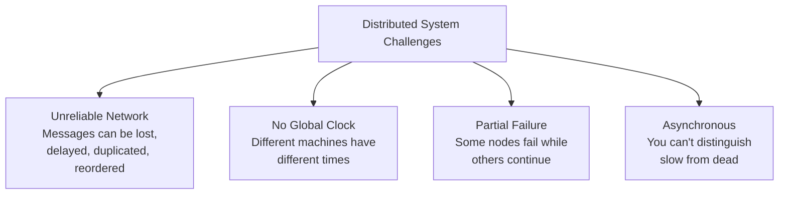
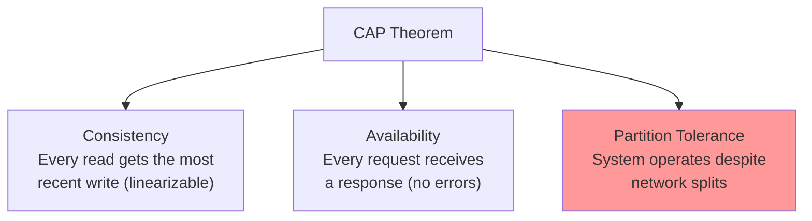
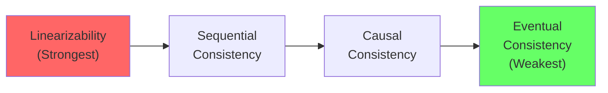
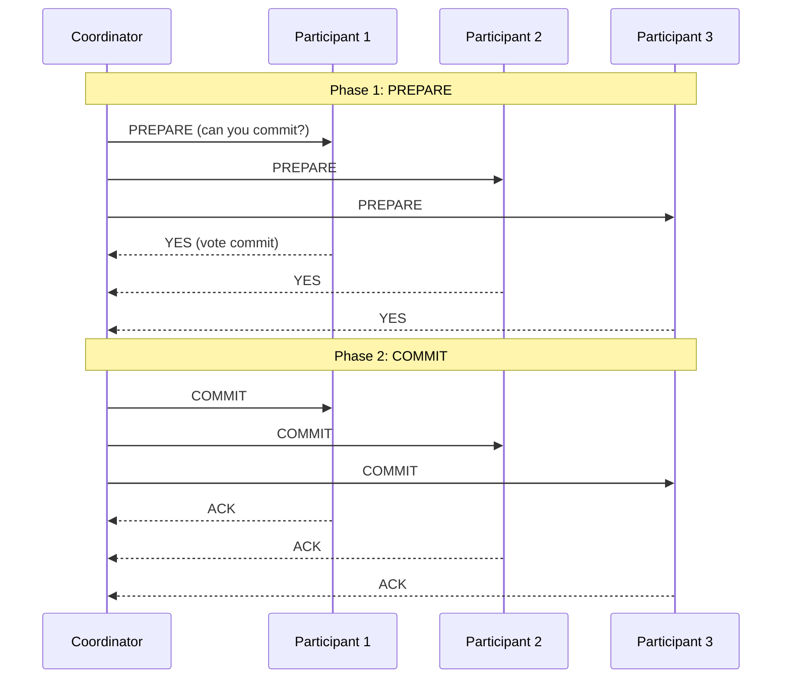
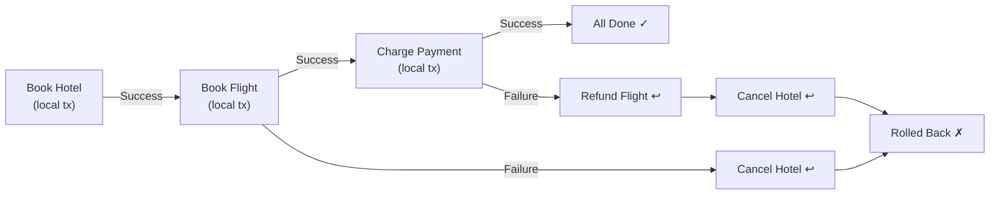
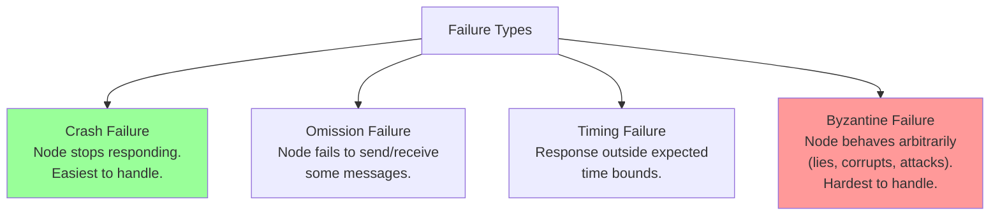
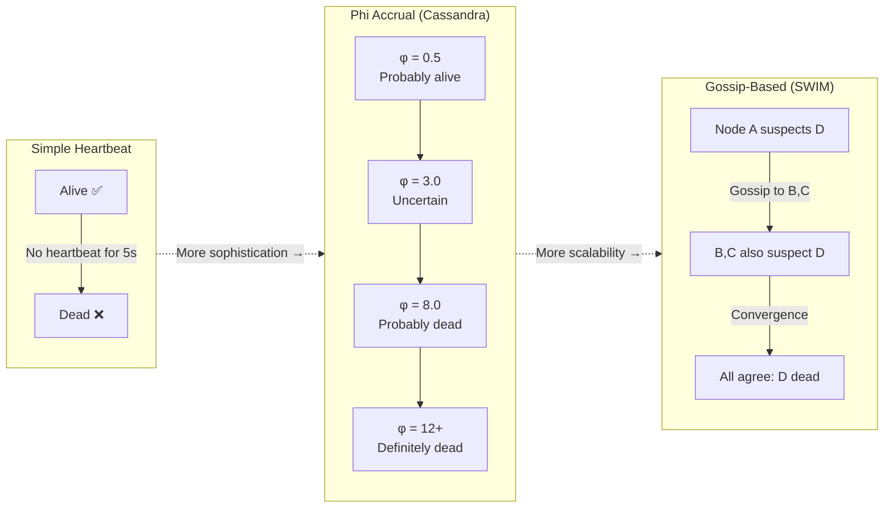
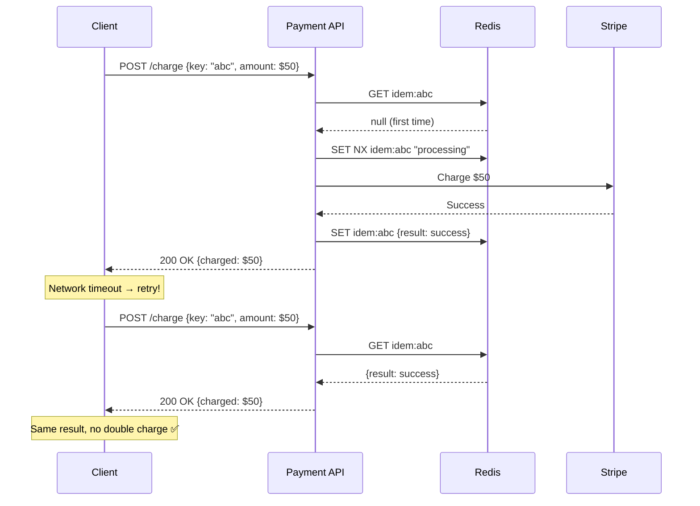
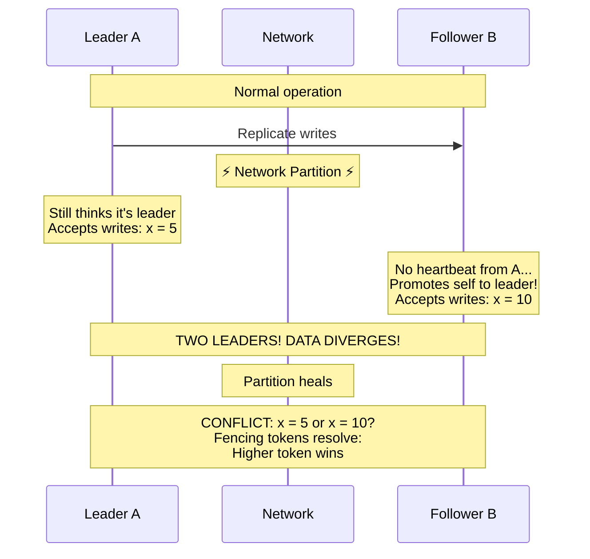

# Chapter 20: Distributed Systems Theory

> *"A distributed system is one in which the failure of a computer you didn't even know existed can render your own computer unusable." — Leslie Lamport*

Every system design in Parts 3-4 (load balancers, databases, message queues, microservices) is a distributed system. This chapter formalizes the theory behind the trade-offs we've been making intuitively. Understanding these fundamentals separates the "I read a blog post" answers from the "I actually understand the constraints" answers in interviews.

---

## 20.1 What Makes a System "Distributed"?

A distributed system is a collection of independent computers that **appears to its users as a single coherent system**.

### Why Distribute?

| Reason | Example |
|---|---|
| **Scale** | One machine can't handle 1B requests/day |
| **Reliability** | If one machine dies, others continue serving |
| **Latency** | Serve users from geographically close nodes |
| **Legal** | Data residency laws (GDPR: EU data stays in EU) |

### The Fundamental Challenges



**The core difficulty**: You can never tell if a remote machine has crashed or is just slow. This single fact drives most of the complexity in distributed systems.

---

## 20.2 The CAP Theorem

### Statement

In the presence of a **network partition**, a distributed system must choose between **Consistency** and **Availability**. You cannot have both.



### Why "Pick 2 of 3" is Misleading

**You don't actually choose P** — network partitions happen whether you like it or not. The real choice is:

- **CP**: During a partition, **reject some requests** to maintain consistency → System is correct but may be unavailable
- **AP**: During a partition, **serve stale data** to maintain availability → System is available but may return outdated results

### Real-World Examples

| System | Choice | Behavior During Partition |
|---|---|---|
| **ZooKeeper** | CP | Minority partition refuses reads/writes |
| **etcd** | CP | Raft leader in minority → no writes |
| **Cassandra** | AP (tunable) | All nodes serve reads/writes; may diverge |
| **DynamoDB** | AP | Eventual consistency; last-writer-wins |
| **PostgreSQL (single)** | CA | No partition tolerance (single node) |
| **MongoDB** | CP (default) | Primary unreachable → no writes |

### A Concrete Example

```
                    Network Partition
                         ║
    ┌──────────┐         ║         ┌──────────┐
    │ Node A   │         ║         │ Node B   │
    │ x = 1    │   ✗ ✗ ✗ ║ ✗ ✗ ✗   │ x = 1    │
    └──────────┘         ║         └──────────┘
         │               ║              │
    Client writes        ║         Client reads
    x = 2 to A           ║         x from B
         │               ║              │
    ┌──────────┐         ║         ┌──────────┐
    │ Node A   │  Can't  ║  Can't  │ Node B   │
    │ x = 2    │  sync!  ║  sync!  │ x = ???  │
    └──────────┘         ║         └──────────┘

CP choice: Node B refuses the read → "503 Service Unavailable"
AP choice: Node B returns x = 1 (stale) → "200 OK, x = 1" (wrong!)
```

### Beyond CAP: PACELC

CAP only describes behavior **during partitions**. PACELC extends it:

```
If Partition → choose Availability or Consistency
Else (normal operation) → choose Latency or Consistency

PA/EL:  Partition → Available;  Normal → Low Latency  (DynamoDB, Cassandra)
PC/EC:  Partition → Consistent; Normal → Consistent   (ZooKeeper, etcd)
PA/EC:  Partition → Available;  Normal → Consistent   (MongoDB default)
```

---

## 20.3 Consistency Models

"Consistency" means different things at different levels. Here's the spectrum from strongest to weakest:

### The Consistency Spectrum



### 1. Linearizability (Strong Consistency)

**Every operation appears to happen atomically at a single point in time.**

- Reads always return the most recent write
- All clients see the same order of operations
- As if there's a single copy of the data

```python
# Linearizable behavior:
# Time →
# Client A: write(x=1) ────────────────── OK
# Client B:              read(x) → 1 ✓   (must see 1, not 0)
# Client C:                   read(x) → 1 ✓

# Non-linearizable behavior:
# Client A: write(x=1) ────────────────── OK
# Client B:              read(x) → 1 ✓
# Client C:                   read(x) → 0 ✗  (stale! saw 0 after B saw 1)
```

**Cost**: High latency (must coordinate across nodes). Used by: ZooKeeper, etcd, Spanner.

### 2. Sequential Consistency

**All clients see the same order of operations, but that order doesn't have to match real-time.**

```python
# Client A: write(x=1), write(y=2)
# Client B: read(y) → 2, read(x) → 0  ← VALID in sequential consistency
#                                          (A's writes are ordered, but B might
#                                           see y=2 before x=1 propagates)
```

### 3. Causal Consistency

**Operations that are causally related are seen in the same order by all. Concurrent operations may appear in different orders.**

```python
# Causal:
# Client A: write(x=1)
# Client B: read(x) → 1, then write(y=2)  ← y=2 causally depends on x=1
# Client C: must see x=1 before y=2       ← causal order preserved

# But: two independent writes have no required ordering
# Client A: write(x=1)
# Client B: write(y=2)    ← independent (concurrent)
# Client C: can see y=2 before x=1  ← OK! no causal relationship
```

### 4. Eventual Consistency

**If no new writes occur, all replicas will eventually converge to the same value. No ordering guarantees.**

```python
# Eventually consistent:
# Client A: write(x=1) at time T
# Client B: read(x) → 0 (stale)    at T+1ms
# Client B: read(x) → 0 (still stale) at T+10ms
# Client B: read(x) → 1 (converged!)  at T+100ms

# "Eventually" can mean milliseconds or minutes — no bound guaranteed
```

### Read-Your-Writes Consistency

A practical guarantee: **you always see your own writes**.

```python
class ReadYourWritesClient:
    """
    Track the latest write timestamp.
    Ensure reads go to replicas that are at least this fresh.
    """

    def __init__(self):
        self.last_write_ts = 0

    def write(self, key: str, value: str):
        result = self.primary.write(key, value)
        self.last_write_ts = result.timestamp
        return result

    def read(self, key: str):
        # Option 1: Always read from primary (simple but doesn't scale)
        # Option 2: Read from replica, but verify freshness
        for replica in self.replicas:
            if replica.last_applied_ts >= self.last_write_ts:
                return replica.read(key)
        # Fallback to primary
        return self.primary.read(key)
```

### Comparison Table

| Model | Guarantee | Latency | Use Case |
|---|---|---|---|
| Linearizability | Most recent write always visible | High | Leader election, locks |
| Sequential | All see same order | Medium | Not commonly isolated |
| Causal | Cause before effect | Medium | Social media (comments) |
| Eventual | Will converge eventually | Low | Shopping cart, DNS, CDN |

---

## 20.4 Time, Clocks, and Ordering

### The Problem with Physical Clocks

```
Server A clock: 10:00:00.000
Server B clock: 10:00:00.150  ← 150ms ahead (NTP drift)

Event on A at 10:00:00.100 (A's clock)
Event on B at 10:00:00.050 (B's clock)

By wall-clock, A's event seems earlier (100 < 200 ms).
But B's event actually happened first in real time!
(B is 150ms ahead, so B's real time was 09:59:59.900)
```

**Physical clocks drift**. NTP can synchronize to ~100ms, but that's too imprecise for ordering events.

### Lamport Clocks (Logical Clocks)

Capture **causal ordering** without relying on physical time.

**Rules**:
1. Each process maintains a counter `C`
2. Before sending a message: `C += 1`
3. On receiving a message with timestamp `T`: `C = max(C, T) + 1`

```python
class LamportClock:
    def __init__(self):
        self.counter = 0

    def tick(self) -> int:
        """Local event."""
        self.counter += 1
        return self.counter

    def send(self) -> int:
        """Sending a message — advance and include timestamp."""
        self.counter += 1
        return self.counter

    def receive(self, received_ts: int) -> int:
        """Receiving a message — sync clocks."""
        self.counter = max(self.counter, received_ts) + 1
        return self.counter
```

```
Process A: [1] ──send──→ [2]           [5]
                  │                      ↑
                  └────────────→ [3] ──send
Process B:            [1] [2] → [3]    [4]
                                  ↑
                            received 2 from A
                            max(2, 2) + 1 = 3
```

**Limitation**: If `L(a) < L(b)`, we can't conclude `a happened before b`. Lamport clocks capture a **necessary but not sufficient** condition for causality.

### Vector Clocks

**Detect actual causal relationships** — know whether events are causally related or concurrent.

Each process maintains a vector of counters, one per process.

```python
class VectorClock:
    def __init__(self, process_id: str, processes: list[str]):
        self.id = process_id
        self.clock = {p: 0 for p in processes}

    def tick(self):
        """Local event."""
        self.clock[self.id] += 1

    def send(self) -> dict:
        """Send message: advance own clock, return vector."""
        self.clock[self.id] += 1
        return dict(self.clock)

    def receive(self, received_clock: dict):
        """Receive message: merge clocks, then advance own."""
        for p in self.clock:
            self.clock[p] = max(self.clock[p], received_clock.get(p, 0))
        self.clock[self.id] += 1

    @staticmethod
    def compare(vc1: dict, vc2: dict) -> str:
        """
        Returns:
          'before'     if vc1 happened-before vc2
          'after'      if vc2 happened-before vc1
          'concurrent' if neither caused the other
        """
        less = any(vc1.get(k, 0) < vc2.get(k, 0) for k in set(vc1) | set(vc2))
        greater = any(vc1.get(k, 0) > vc2.get(k, 0) for k in set(vc1) | set(vc2))

        if less and not greater:
            return "before"
        elif greater and not less:
            return "after"
        else:
            return "concurrent"
```

```
Process A: {A:1, B:0} → {A:2, B:0} ──send──→ {A:3, B:0}
                                         │
Process B: {A:0, B:1}             {A:2, B:2} ← received A's {A:2, B:0}
                                               max each + increment B

Compare {A:3, B:0} vs {A:2, B:2}:
  A: 3 > 2 (A is greater)
  B: 0 < 2 (B is greater)
  → CONCURRENT (neither happened-before the other)
```

### Hybrid Logical Clocks (HLC)

Combine **physical time** (for human-readable ordering) with **logical counters** (for causality). Used by CockroachDB and others.

```python
class HybridLogicalClock:
    def __init__(self):
        self.physical = 0   # max known physical time
        self.logical = 0    # tie-breaking counter

    def now(self) -> tuple[int, int]:
        """Generate timestamp for a local event."""
        pt = self._physical_time()

        if pt > self.physical:
            self.physical = pt
            self.logical = 0
        else:
            self.logical += 1

        return (self.physical, self.logical)

    def receive(self, msg_physical: int, msg_logical: int) -> tuple[int, int]:
        """Update clock on message receipt."""
        pt = self._physical_time()

        if pt > self.physical and pt > msg_physical:
            self.physical = pt
            self.logical = 0
        elif msg_physical > self.physical:
            self.physical = msg_physical
            self.logical = msg_logical + 1
        elif self.physical == msg_physical:
            self.logical = max(self.logical, msg_logical) + 1
        else:
            self.logical += 1

        return (self.physical, self.logical)

    def _physical_time(self) -> int:
        return int(time.time() * 1000)  # Milliseconds
```

---

## 20.5 Distributed Transactions

### Two-Phase Commit (2PC)

The classic approach to atomic transactions across multiple nodes.



```python
class TwoPhaseCommitCoordinator:
    def execute(self, transaction: DistributedTransaction) -> bool:
        participants = transaction.get_participants()

        # Phase 1: Prepare
        votes = {}
        for p in participants:
            try:
                vote = p.prepare(transaction)
                votes[p.id] = vote
            except Exception:
                votes[p.id] = False

        # Decision
        all_yes = all(votes.values())

        # Phase 2: Commit or Abort
        if all_yes:
            for p in participants:
                p.commit(transaction.id)  # What if this fails?
            return True
        else:
            for p in participants:
                p.abort(transaction.id)
            return False
```

### 2PC Problems

| Problem | Description |
|---|---|
| **Blocking** | If coordinator crashes after PREPARE, participants are stuck holding locks |
| **Single point of failure** | Coordinator crash = entire system blocks |
| **Latency** | Two round-trips minimum (prepare + commit) |
| **Not partition tolerant** | If network splits between phases, some commit, some don't |

### Three-Phase Commit (3PC)

Adds a **PRE-COMMIT** phase to reduce blocking:

```
Phase 1: CAN-COMMIT?  → Yes/No
Phase 2: PRE-COMMIT   → ACK  (everyone knows decision, no locks yet)
Phase 3: DO-COMMIT    → ACK
```

**In practice, 3PC is rarely used.** The overhead isn't worth it when consensus algorithms (Paxos, Raft) solve the problem better.

### Saga Pattern (Alternative to 2PC)

Instead of distributed transactions, use a **sequence of local transactions with compensating actions**.



```python
class BookingOrchestrator:
    """
    Saga: sequence of local transactions with compensation.
    If any step fails, undo previous steps in reverse.
    """

    def book_trip(self, booking: TripBooking):
        completed_steps = []

        steps = [
            SagaStep(
                action=lambda: self.hotel_service.reserve(booking.hotel),
                compensate=lambda: self.hotel_service.cancel(booking.hotel)
            ),
            SagaStep(
                action=lambda: self.flight_service.book(booking.flight),
                compensate=lambda: self.flight_service.cancel(booking.flight)
            ),
            SagaStep(
                action=lambda: self.payment_service.charge(booking.payment),
                compensate=lambda: self.payment_service.refund(booking.payment)
            ),
        ]

        for step in steps:
            try:
                step.action()
                completed_steps.append(step)
            except Exception as e:
                # Compensate in reverse order
                for completed in reversed(completed_steps):
                    try:
                        completed.compensate()
                    except Exception as comp_error:
                        # Log for manual intervention
                        self.alert("Compensation failed", comp_error)
                raise SagaAborted(f"Step failed: {e}")
```

### 2PC vs Saga

| Aspect | 2PC | Saga |
|---|---|---|
| Atomicity | Strong (all-or-nothing) | Eventual (compensating) |
| Isolation | Full (locks held) | None (intermediate states visible) |
| Latency | High (2 round-trips + locks) | Lower (async steps) |
| Availability | Low (coordinator SPOF) | Higher (no coordinator lock) |
| Complexity | Simpler logic | Complex compensation logic |
| Use case | Cross-DB transactions | Microservice workflows |

---

## 20.6 Failure Modes

### Types of Failures



### Crash Failures

```
Node A: ────────X (dies, never comes back)

Detection: Heartbeat timeout
Recovery:  Replica takes over, replayed from log
```

### Network Failures

```
Partition:    A ──✗──✗──✗── B    (no messages between A and B)
Message loss: A ──msg──→ (dropped) B never receives
Reorder:      A sends msg1, msg2 → B receives msg2, msg1
Duplicate:    A sends msg → B receives msg, msg (twice)
```

### Byzantine Failures

A node behaves **arbitrarily** — it may lie, send contradictory messages to different nodes, or actively sabotage the system.

```
Byzantine node might:
  - Tell A "I voted YES" and tell B "I voted NO"
  - Claim a transaction was committed when it wasn't
  - Send corrupted data
  - Intentionally delay responses

Required tolerance: 3f + 1 nodes to tolerate f Byzantine faults
  (Need 2/3 honest majority)
```

**Most internal distributed systems don't handle Byzantine faults** — they assume nodes are honest but may crash. Byzantine fault tolerance matters for **blockchain** and systems where nodes are untrusted.

### The FLP Impossibility

**Fischer, Lynch, Paterson (1985)**: In an asynchronous system with even one faulty process, it is **impossible** to guarantee consensus will be reached.

**Practical meaning**: You can't build a perfect consensus algorithm that always terminates. Real systems work around this with:
- Timeouts (break asynchrony assumption)
- Randomization (probabilistic termination)
- Partial synchrony (eventual synchrony assumption)

---

## 20.7 Failure Detection

### Failure Detection Spectrum



### Heartbeat-Based Detection

```python
class HeartbeatFailureDetector:
    """
    Simple timeout-based failure detection.
    """
    HEARTBEAT_INTERVAL = 1.0   # Send heartbeat every 1 second
    FAILURE_THRESHOLD = 5.0    # Mark dead after 5 seconds of silence

    def __init__(self):
        self.last_heartbeat: dict[str, float] = {}

    def on_heartbeat(self, node_id: str):
        self.last_heartbeat[node_id] = time.time()

    def is_alive(self, node_id: str) -> bool:
        if node_id not in self.last_heartbeat:
            return False
        return (time.time() - self.last_heartbeat[node_id]) < self.FAILURE_THRESHOLD

    def get_suspected_dead(self) -> list[str]:
        now = time.time()
        return [
            node_id for node_id, last in self.last_heartbeat.items()
            if now - last >= self.FAILURE_THRESHOLD
        ]
```

### Phi Accrual Failure Detector

Instead of binary alive/dead, output a **suspicion level** (phi) that increases over time.

```python
import math
import statistics

class PhiAccrualDetector:
    """
    Cassandra's approach: suspicion level based on
    historical heartbeat intervals.
    """

    PHI_THRESHOLD = 8  # Higher = more conservative

    def __init__(self):
        self.intervals: dict[str, list[float]] = {}
        self.last_arrival: dict[str, float] = {}

    def on_heartbeat(self, node_id: str):
        now = time.time()
        if node_id in self.last_arrival:
            interval = now - self.last_arrival[node_id]
            self.intervals.setdefault(node_id, []).append(interval)
            # Keep last 100 intervals
            self.intervals[node_id] = self.intervals[node_id][-100:]
        self.last_arrival[node_id] = now

    def phi(self, node_id: str) -> float:
        """
        Higher phi = more likely the node is dead.
        phi > PHI_THRESHOLD → suspect failure.
        """
        if node_id not in self.last_arrival:
            return float('inf')

        intervals = self.intervals.get(node_id, [1.0])
        mean = statistics.mean(intervals)
        stddev = statistics.stdev(intervals) if len(intervals) > 1 else mean / 4

        elapsed = time.time() - self.last_arrival[node_id]

        # Probability of receiving a heartbeat this late
        # Using normal distribution approximation
        exponent = -(elapsed - mean) ** 2 / (2 * stddev ** 2)
        p = max(1e-10, math.exp(exponent))

        return -math.log10(p)

    def is_suspected(self, node_id: str) -> bool:
        return self.phi(node_id) >= self.PHI_THRESHOLD
```

### Gossip-Based Failure Detection

Nodes **gossip** about each other's health. More scalable than centralized heartbeats.

```
Node A knows: {B: alive, C: alive, D: suspected}
Node A gossips to B: "Here's what I know about everyone"
Node B merges: {A: alive, B: alive, C: alive, D: suspected}

After enough gossip rounds, all nodes converge on the same view.
Time to detect failure: O(log N) gossip rounds.
```

---

## 20.8 Idempotency & Exactly-Once Semantics

### Idempotency Key Flow



### The Delivery Guarantee Problem

```
Sender → Network → Receiver

Did the receiver get the message?

Scenario 1: Message delivered, ACK lost
  Sender thinks: "Failed!" → Retries → Receiver gets DUPLICATE

Scenario 2: Message lost in transit
  Sender thinks: "Failed!" → Retries → Receiver gets it

Sender can't distinguish these scenarios!
```

### Making Operations Idempotent

**Idempotent**: performing the operation multiple times has the same effect as performing it once.

```python
class IdempotentPaymentService:
    """
    Use an idempotency key to prevent double-charging.
    """

    def charge(self, idempotency_key: str, amount: float, card_id: str) -> PaymentResult:
        # Check if we already processed this request
        existing = self.redis.get(f"idem:{idempotency_key}")
        if existing:
            return PaymentResult.deserialize(existing)  # Return cached result

        # Process payment
        result = self._process_payment(amount, card_id)

        # Cache result (TTL: 24 hours)
        self.redis.setex(
            f"idem:{idempotency_key}",
            86400,
            result.serialize()
        )

        return result
```

```java
@Service
public class IdempotentPaymentService {

    public PaymentResult charge(String idempotencyKey, BigDecimal amount, String cardId) {
        // Check for existing result
        String cached = redis.opsForValue().get("idem:" + idempotencyKey);
        if (cached != null) {
            return PaymentResult.deserialize(cached);
        }

        // Atomically claim the key (prevent concurrent duplicates)
        Boolean claimed = redis.opsForValue()
            .setIfAbsent("idem:" + idempotencyKey, "processing",
                Duration.ofHours(24));

        if (Boolean.FALSE.equals(claimed)) {
            // Another request is processing — wait and return its result
            return waitForResult(idempotencyKey);
        }

        PaymentResult result = processPayment(amount, cardId);
        redis.opsForValue().set("idem:" + idempotencyKey,
            result.serialize(), Duration.ofHours(24));

        return result;
    }
}
```

### Naturally Idempotent vs Not

| Idempotent | Not Idempotent |
|---|---|
| `SET balance = 100` | `SET balance = balance + 10` |
| `DELETE WHERE id = 5` | `INSERT INTO orders (...)` |
| `PUT /users/123 {name: "Bob"}` | `POST /users {name: "Bob"}` |
| `UPSERT (overwrite)` | `INCREMENT counter` |

**Strategy**: Convert non-idempotent operations to idempotent ones using unique request IDs.

---

## 20.9 Replication Strategies

### Single-Leader Replication

```
         ┌──────────┐
    ───→ │  Leader   │ ← All writes go here
         │ (Primary) │
         └──┬───┬────┘
            │   │
       ┌────▼┐ ┌▼────┐
       │Follower│ │Follower│ ← Replicate writes, serve reads
       │  (R1)  │ │  (R2)  │
       └────────┘ └────────┘
```

**Pros**: Simple, strong consistency possible
**Cons**: Single point of failure, write bottleneck

### Multi-Leader Replication

```
    ┌──────────┐     ┌──────────┐
    │ Leader A  │ ←→  │ Leader B  │   Both accept writes
    │ (US-East) │     │ (EU-West) │
    └──────────┘     └──────────┘
```

**Pros**: Better latency for geo-distributed writes
**Cons**: Conflict resolution required

### Leaderless Replication

```
    ┌────────┐ ┌────────┐ ┌────────┐
    │ Node A │ │ Node B │ │ Node C │   All accept reads and writes
    └────────┘ └────────┘ └────────┘

    Write quorum: W=2 (write to 2 of 3)
    Read quorum:  R=2 (read from 2 of 3)
    W + R > N → guaranteed to read latest write
```

### Quorum Formula

```
N = total replicas
W = write quorum (nodes that must ACK a write)
R = read quorum (nodes that must respond to a read)

Requirement: W + R > N → overlap guarantees freshness

Common configurations:
  N=3, W=2, R=2 → balanced (Cassandra default)
  N=3, W=3, R=1 → fast reads, slow writes
  N=3, W=1, R=3 → fast writes, slow reads
```

```python
class QuorumClient:
    def __init__(self, nodes: list, n: int, w: int, r: int):
        self.nodes = nodes
        self.n = n
        self.w = w
        self.r = r
        assert w + r > n, "Quorum condition not met"

    def write(self, key: str, value: str, version: int):
        acks = 0
        for node in self.nodes[:self.n]:
            try:
                node.write(key, value, version)
                acks += 1
            except Exception:
                pass

        if acks < self.w:
            raise WriteFailure(f"Only {acks}/{self.w} acks received")

    def read(self, key: str) -> str:
        responses = []
        for node in self.nodes[:self.n]:
            try:
                result = node.read(key)
                responses.append(result)
            except Exception:
                pass

        if len(responses) < self.r:
            raise ReadFailure(f"Only {len(responses)}/{self.r} responses")

        # Return the value with the highest version
        return max(responses, key=lambda r: r.version).value
```

---

## 20.10 Split-Brain Problem

### Split-Brain Scenario



### What Is Split-Brain?

When a network partition causes **two nodes to both believe they are the leader**.

```
BEFORE PARTITION:
    Leader A ←→ Follower B

DURING PARTITION:
    Leader A  ║  Follower B
              ║  (promotes itself to Leader!)
              ║
    Leader A  ║  Leader B    ← SPLIT BRAIN!
    x = 5     ║  x = 10     ← diverged!
```

### Prevention: Fencing Tokens

```python
class FencedLeaderElection:
    """
    Each new leader gets a monotonically increasing fencing token.
    Storage nodes reject operations from old leaders.
    """

    def elect_leader(self) -> tuple[str, int]:
        token = self.redis.incr("fencing_token")
        leader_id = self.node_id
        return leader_id, token

    def write_with_fence(self, key: str, value: str, token: int):
        """Storage node checks fencing token."""
        current_token = self.storage.get_token(key)
        if token < current_token:
            raise StaleFenceToken(
                f"Token {token} < current {current_token}. Old leader?"
            )
        self.storage.write(key, value, token)
```

---

## Key Takeaways

| Concept | Key Insight |
|---|---|
| CAP Theorem | During partitions, choose consistency OR availability — not both |
| PACELC | Even without partitions, there's a latency vs consistency trade-off |
| Linearizability | Strongest guarantee — appears as single copy. Expensive. |
| Eventual Consistency | Weakest — will converge "eventually." Cheap and fast. |
| Lamport Clocks | Capture causal ordering without physical time |
| Vector Clocks | Detect concurrent events (causality tracking) |
| 2PC | Atomic distributed transactions, but blocking and fragile |
| Saga | Local transactions + compensations — no distributed locks |
| Byzantine Faults | Arbitrary behavior — need 3f+1 nodes for f faults |
| FLP Impossibility | Can't guarantee consensus in async systems — use timeouts |
| Quorums | W+R > N ensures overlap between writers and readers |
| Split-Brain | Fencing tokens prevent stale leaders from corrupting data |

---

## Practice Questions

1. **CAP in practice**: Your e-commerce platform has a shopping cart service and an inventory service. During a network partition, should you favor CP or AP for each? Why might the answer differ?

2. **Clock ordering**: Two users edit the same document simultaneously from different continents. How would you use vector clocks to detect the conflict and let the user resolve it?

3. **Saga failure**: In a travel booking saga (hotel → flight → car → payment), the payment step fails. The flight compensation also fails (API is down). How do you handle this cascading failure?

4. **Quorum math**: You have N=5 replicas. What values of W and R would you choose if: (a) reads are 100× more frequent than writes? (b) both are equally frequent? (c) you need strong consistency?

5. **Split-brain**: Your Redis Sentinel cluster detects a network partition and both sides elect a new master. Describe exactly what happens to writes during the partition and after it heals.

---

[← Chapter 19: Uber & Location Services](../part4-hld-case-studies/ch19-uber-location-services.md) | [Chapter 21: Consensus & Consistency Protocols →](ch21-consensus-and-consistency.md)
