# Chapter 21: Consensus & Consistency Protocols

> *"The consensus problem is deceptively simple: get a group of nodes to agree on a value. The difficulty is doing it when nodes crash, messages get lost, and the network partitions."*

In Chapter 20 we learned that distributed systems face partitions, failures, and clock drift. This chapter tackles the fundamental question: **how do distributed nodes agree on anything?**

---

## 21.1 The Consensus Problem

### What Is Consensus?

Consensus means getting N nodes to agree on a single value, even when some nodes crash or messages are delayed.

**Properties every consensus protocol must satisfy:**

| Property | Meaning |
|---|---|
| **Agreement** | All non-faulty nodes decide the same value |
| **Validity** | The decided value was proposed by some node |
| **Termination** | Every non-faulty node eventually decides |
| **Integrity** | Each node decides at most once |

### Why Is It Hard?

The **FLP Impossibility Result** (Fischer, Lynch, Paterson, 1985) proves that in an asynchronous system with even one possible crash failure, no deterministic algorithm can guarantee consensus.

**How real systems work around FLP:**
- Use **timeouts** (partial synchrony assumption)
- Use **randomization** (probabilistic termination)
- Accept **liveness** violations during partitions (safety over liveness)

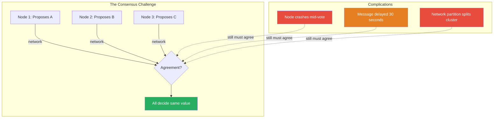

### Where Consensus Appears

| Use Case | What Nodes Agree On |
|---|---|
| **Leader election** | Who is the current leader |
| **Atomic broadcast** | Order of messages/transactions |
| **Distributed lock** | Who holds the lock |
| **Configuration** | Cluster membership, settings |
| **State machine replication** | Sequence of commands to apply |

---

## 21.2 Leader Election

Before diving into full consensus protocols, let's examine a simpler (but critical) sub-problem: choosing a leader.

### Why Leaders?

A single leader simplifies consistency — all writes go through one node that determines ordering. But the leader can fail, so we need election protocols.

### Bully Algorithm

The simplest election algorithm. The node with the highest ID wins.

```python
from enum import Enum
from dataclasses import dataclass, field
from typing import Optional
import threading
import time


class NodeState(Enum):
    FOLLOWER = "follower"
    CANDIDATE = "candidate"
    LEADER = "leader"


@dataclass
class BullyNode:
    """Simplified Bully Election Algorithm."""
    node_id: int
    cluster_size: int
    state: NodeState = NodeState.FOLLOWER
    leader_id: Optional[int] = None
    election_timeout: float = 3.0  # seconds
    _lock: threading.Lock = field(default_factory=threading.Lock)

    def start_election(self, alive_nodes: set[int]) -> int:
        """
        Start election. Send ELECTION to all higher-ID nodes.
        If none respond, declare self leader.
        """
        with self._lock:
            self.state = NodeState.CANDIDATE
            higher_nodes = {n for n in alive_nodes if n > self.node_id}

            if not higher_nodes:
                # No higher nodes — I am the leader
                self._become_leader()
                return self.node_id

            # Send ELECTION message to all higher-ID nodes
            responses = self._send_election_to(higher_nodes)

            if not responses:
                # No response — higher nodes are down
                self._become_leader()
                return self.node_id

            # A higher node responded — wait for it to become leader
            self.state = NodeState.FOLLOWER
            return max(responses)

    def _become_leader(self) -> None:
        self.state = NodeState.LEADER
        self.leader_id = self.node_id
        print(f"Node {self.node_id}: I am the leader!")

    def _send_election_to(self, nodes: set[int]) -> list[int]:
        """Simulate sending ELECTION messages. Returns IDs of nodes that respond."""
        # In real implementation: RPC calls with timeout
        responses = []
        for node_id in nodes:
            # Simulate: node responds if alive
            responses.append(node_id)
        return responses

    def receive_victory(self, leader_id: int) -> None:
        """Receive VICTORY message from new leader."""
        with self._lock:
            self.state = NodeState.FOLLOWER
            self.leader_id = leader_id
            print(f"Node {self.node_id}: Accepted {leader_id} as leader")


# Example
nodes = {1, 2, 3, 4, 5}
node3 = BullyNode(node_id=3, cluster_size=5)

# Node 3 detects leader (5) is down. Nodes 4, 5 are dead.
alive = {1, 2, 3}
winner = node3.start_election(alive)
print(f"Election winner: Node {winner}")
# Output: Node 3: I am the leader!
# Election winner: Node 3
```

```java
import java.util.*;
import java.util.concurrent.ConcurrentHashMap;

public class BullyElection {
    
    enum State { FOLLOWER, CANDIDATE, LEADER }
    
    private final int nodeId;
    private volatile State state = State.FOLLOWER;
    private volatile int leaderId = -1;
    
    public BullyElection(int nodeId) {
        this.nodeId = nodeId;
    }
    
    public synchronized int startElection(Set<Integer> aliveNodes) {
        state = State.CANDIDATE;
        
        Set<Integer> higherNodes = new TreeSet<>();
        for (int n : aliveNodes) {
            if (n > nodeId) higherNodes.add(n);
        }
        
        if (higherNodes.isEmpty()) {
            becomeLeader();
            return nodeId;
        }
        
        List<Integer> responses = sendElectionTo(higherNodes);
        
        if (responses.isEmpty()) {
            becomeLeader();
            return nodeId;
        }
        
        state = State.FOLLOWER;
        return Collections.max(responses);
    }
    
    private void becomeLeader() {
        state = State.LEADER;
        leaderId = nodeId;
        System.out.printf("Node %d: I am the leader!%n", nodeId);
    }
    
    private List<Integer> sendElectionTo(Set<Integer> nodes) {
        // Simulate: in real systems, RPC with timeout
        return new ArrayList<>(nodes);
    }
}
```

**Bully Algorithm Flow:**

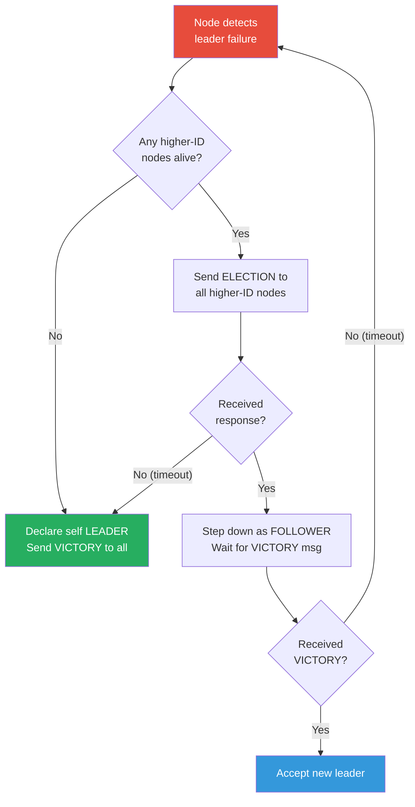

**Bully Algorithm Problems:**
- Assumes reliable failure detection (often wrong)
- Highest-ID bias (newly restarted node with high ID takes over)
- Network partition → split brain (two leaders)

### Ring-Based Election

Nodes arranged in a logical ring. Election token circulates collecting candidates.

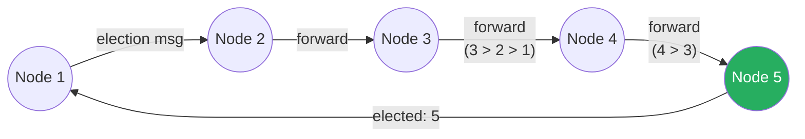

### Production Leader Election: ZooKeeper

Real systems don't roll their own — they use proven coordination services.

```python
# ZooKeeper-based leader election (using Kazoo client)
from kazoo.client import KazooClient
from kazoo.recipe.election import Election


class ZooKeeperLeaderElection:
    """Production leader election using ZooKeeper."""

    def __init__(self, zk_hosts: str, election_path: str, node_id: str):
        self.node_id = node_id
        self.zk = KazooClient(hosts=zk_hosts)
        self.zk.start()
        self.election = Election(self.zk, election_path, identifier=node_id)
        self._is_leader = False

    def run_for_leader(self) -> None:
        """
        Block until this node becomes leader.
        ZooKeeper uses ephemeral sequential znodes:
        1. Each candidate creates /election/candidate-000000N
        2. Node with lowest sequence number is leader
        3. Others watch the next-lower node (herd-avoidance)
        4. If leader dies, ephemeral node auto-deleted → next takes over
        """
        self.election.run(self._on_elected)

    def _on_elected(self) -> None:
        self._is_leader = True
        print(f"Node {self.node_id}: Elected as leader!")
        # Start leader duties...
        self._do_leader_work()

    def _do_leader_work(self) -> None:
        """Leader-specific operations."""
        pass

    def shutdown(self) -> None:
        self.zk.stop()
        self.zk.close()
```

---

## 21.3 Paxos

Paxos, invented by Leslie Lamport, is the foundational consensus algorithm. It's notoriously difficult to understand, so we'll build intuition step by step.

### The Setup

Three roles (a node can play multiple roles):
- **Proposer**: Proposes values
- **Acceptor**: Votes on proposals
- **Learner**: Learns the decided value

### Basic Paxos: Two Phases

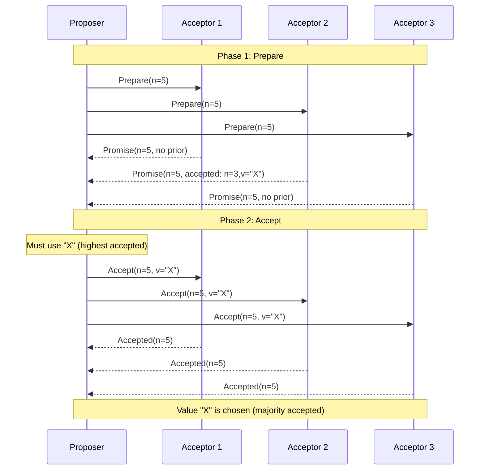

### Paxos Rules

**Phase 1 — Prepare:**
1. Proposer picks a unique proposal number `n` (must be higher than any it's used before)
2. Sends `Prepare(n)` to a majority of acceptors
3. Each acceptor:
   - If `n` > any previously promised number → Promise not to accept anything < `n`
   - Return any already-accepted value

**Phase 2 — Accept:**
1. If proposer receives promises from a majority:
   - If any promise includes an accepted value → **must use the highest-numbered accepted value**
   - Otherwise → free to propose its own value
2. Sends `Accept(n, value)` to acceptors
3. Each acceptor: Accept if no higher promise made since

```python
from dataclasses import dataclass, field
from typing import Optional


@dataclass
class Proposal:
    number: int
    value: Optional[str] = None


@dataclass
class PaxosAcceptor:
    """Single Paxos acceptor."""
    node_id: int
    promised_number: int = 0
    accepted_proposal: Optional[Proposal] = None

    def receive_prepare(self, proposal_number: int) -> tuple[bool, Optional[Proposal]]:
        """
        Phase 1b: Handle Prepare request.
        Returns (promise_granted, previously_accepted_proposal).
        """
        if proposal_number > self.promised_number:
            self.promised_number = proposal_number
            return True, self.accepted_proposal
        return False, None

    def receive_accept(self, proposal: Proposal) -> bool:
        """
        Phase 2b: Handle Accept request.
        Accept if proposal number >= promised number.
        """
        if proposal.number >= self.promised_number:
            self.promised_number = proposal.number
            self.accepted_proposal = proposal
            return True
        return False


@dataclass
class PaxosProposer:
    """Single-decree Paxos proposer."""
    node_id: int
    proposal_counter: int = 0
    num_nodes: int = 5  # For generating unique proposal numbers

    def _next_proposal_number(self) -> int:
        """
        Generate globally unique, monotonically increasing proposal number.
        Use (round * num_nodes) + node_id to ensure uniqueness across proposers.
        """
        self.proposal_counter += 1
        return self.proposal_counter * self.num_nodes + self.node_id

    def run_paxos(
        self, value: str, acceptors: list[PaxosAcceptor]
    ) -> Optional[str]:
        """Run single-decree Paxos. Returns chosen value or None."""
        n = self._next_proposal_number()
        majority = len(acceptors) // 2 + 1

        # Phase 1: Prepare
        promises = []
        highest_accepted: Optional[Proposal] = None

        for acceptor in acceptors:
            granted, prev_accepted = acceptor.receive_prepare(n)
            if granted:
                promises.append(acceptor)
                if prev_accepted and (
                    highest_accepted is None
                    or prev_accepted.number > highest_accepted.number
                ):
                    highest_accepted = prev_accepted

        if len(promises) < majority:
            print(f"Proposer {self.node_id}: Failed to get majority promises")
            return None

        # Phase 2: Accept
        # CRITICAL: If any acceptor already accepted a value, we MUST use it
        chosen_value = (
            highest_accepted.value if highest_accepted else value
        )
        proposal = Proposal(number=n, value=chosen_value)

        accept_count = 0
        for acceptor in promises:
            if acceptor.receive_accept(proposal):
                accept_count += 1

        if accept_count >= majority:
            print(f"Proposer {self.node_id}: Value '{chosen_value}' chosen!")
            return chosen_value

        print(f"Proposer {self.node_id}: Accept phase failed")
        return None


# Example: Three acceptors, one proposer
acceptors = [PaxosAcceptor(i) for i in range(3)]
proposer = PaxosProposer(node_id=0, num_nodes=3)

result = proposer.run_paxos("set x=42", acceptors)
# Output: Proposer 0: Value 'set x=42' chosen!
```

### Paxos Problems

| Problem | Description |
|---|---|
| **Dueling proposers** | Two proposers keep outbidding each other's proposal numbers → livelock |
| **Single-decree only** | Basic Paxos decides one value. Need Multi-Paxos for a sequence |
| **Complex** | Notoriously hard to implement correctly |
| **Performance** | Two round-trips per decision |

**Solution: Multi-Paxos** — Elect a stable leader that runs Phase 2 repeatedly (skipping Phase 1). This is essentially what Raft formalizes.

---

## 21.4 Raft: Consensus Made Understandable

Raft was designed specifically to be more understandable than Paxos while providing equivalent safety guarantees. It's the algorithm behind **etcd**, **CockroachDB**, **TiKV**, and **Consul**.

### Raft Overview

Raft decomposes consensus into three sub-problems:
1. **Leader election** — Choose one leader at a time
2. **Log replication** — Leader replicates entries to followers
3. **Safety** — Guarantee no conflicting decisions

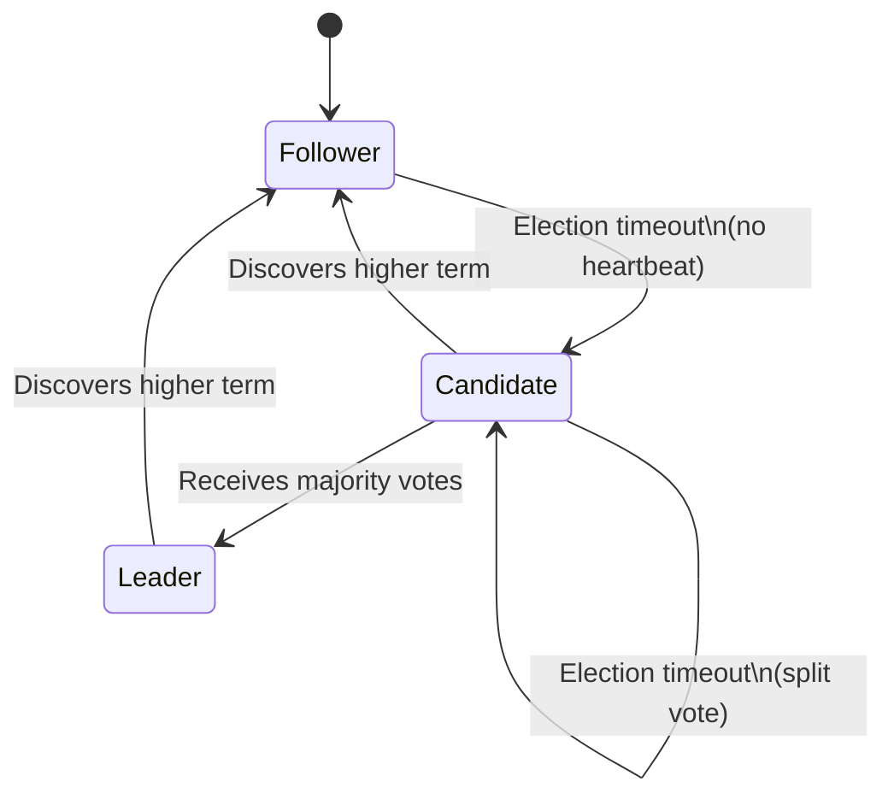

### Terms and State

Every Raft node maintains:

```python
from dataclasses import dataclass, field
from enum import Enum
from typing import Optional
import random
import time
import threading


class Role(Enum):
    FOLLOWER = "follower"
    CANDIDATE = "candidate"
    LEADER = "leader"


@dataclass
class LogEntry:
    term: int
    index: int
    command: str


@dataclass
class RaftNode:
    """Core Raft state."""
    node_id: int
    cluster_nodes: list[int]

    # Persistent state (survives restart)
    current_term: int = 0
    voted_for: Optional[int] = None
    log: list[LogEntry] = field(default_factory=list)

    # Volatile state
    role: Role = Role.FOLLOWER
    commit_index: int = 0
    last_applied: int = 0

    # Leader-only volatile state
    next_index: dict[int, int] = field(default_factory=dict)
    match_index: dict[int, int] = field(default_factory=dict)

    # Timing
    election_timeout_ms: int = 0
    last_heartbeat: float = 0.0
    _lock: threading.Lock = field(default_factory=threading.Lock)

    def __post_init__(self) -> None:
        self._reset_election_timeout()
        self.last_heartbeat = time.time()

    def _reset_election_timeout(self) -> None:
        """Randomized timeout prevents split votes."""
        self.election_timeout_ms = random.randint(150, 300)

    # ─── Leader Election ───

    def start_election(self) -> bool:
        """Transition to candidate and request votes."""
        with self._lock:
            self.current_term += 1
            self.role = Role.CANDIDATE
            self.voted_for = self.node_id
            self._reset_election_timeout()

            votes_received = 1  # Vote for self
            majority = len(self.cluster_nodes) // 2 + 1

            last_log_index = len(self.log)
            last_log_term = self.log[-1].term if self.log else 0

            for peer_id in self.cluster_nodes:
                if peer_id == self.node_id:
                    continue

                # In real impl: async RPC
                vote_granted = self._request_vote_rpc(
                    peer_id, self.current_term,
                    last_log_index, last_log_term
                )
                if vote_granted:
                    votes_received += 1

            if votes_received >= majority:
                self._become_leader()
                return True

            return False

    def handle_request_vote(
        self, candidate_id: int, candidate_term: int,
        last_log_index: int, last_log_term: int
    ) -> tuple[int, bool]:
        """
        Handle RequestVote RPC.
        Grant vote if:
          1. Candidate's term >= my term
          2. Haven't voted for someone else this term
          3. Candidate's log is at least as up-to-date as mine
        """
        with self._lock:
            if candidate_term > self.current_term:
                self.current_term = candidate_term
                self.role = Role.FOLLOWER
                self.voted_for = None

            vote_granted = False

            if candidate_term >= self.current_term:
                if self.voted_for is None or self.voted_for == candidate_id:
                    # Log up-to-date check (CRITICAL for safety)
                    my_last_term = self.log[-1].term if self.log else 0
                    my_last_index = len(self.log)

                    log_ok = (
                        last_log_term > my_last_term
                        or (
                            last_log_term == my_last_term
                            and last_log_index >= my_last_index
                        )
                    )
                    if log_ok:
                        self.voted_for = candidate_id
                        vote_granted = True
                        self.last_heartbeat = time.time()

            return self.current_term, vote_granted

    def _become_leader(self) -> None:
        """Initialize leader state."""
        self.role = Role.LEADER
        # Initialize next_index to leader's last log index + 1
        last_index = len(self.log) + 1
        for peer_id in self.cluster_nodes:
            if peer_id != self.node_id:
                self.next_index[peer_id] = last_index
                self.match_index[peer_id] = 0
        print(f"Node {self.node_id}: Became leader for term {self.current_term}")
        # Immediately send heartbeats
        self._send_heartbeats()

    # ─── Log Replication ───

    def client_request(self, command: str) -> bool:
        """Handle client write request (leader only)."""
        if self.role != Role.LEADER:
            return False  # Redirect to leader

        with self._lock:
            entry = LogEntry(
                term=self.current_term,
                index=len(self.log) + 1,
                command=command
            )
            self.log.append(entry)

            # Replicate to followers
            return self._replicate_entry(entry)

    def _replicate_entry(self, entry: LogEntry) -> bool:
        """Replicate log entry to majority."""
        replicated = 1  # Leader has it
        majority = len(self.cluster_nodes) // 2 + 1

        for peer_id in self.cluster_nodes:
            if peer_id == self.node_id:
                continue

            success = self._append_entries_rpc(peer_id, [entry])
            if success:
                replicated += 1
                self.match_index[peer_id] = entry.index
                self.next_index[peer_id] = entry.index + 1

        if replicated >= majority:
            # Safe to commit
            self.commit_index = entry.index
            self._apply_committed()
            return True
        return False

    def handle_append_entries(
        self, leader_term: int, leader_id: int,
        prev_log_index: int, prev_log_term: int,
        entries: list[LogEntry], leader_commit: int
    ) -> tuple[int, bool]:
        """
        Handle AppendEntries RPC (log replication + heartbeat).
        """
        with self._lock:
            if leader_term < self.current_term:
                return self.current_term, False

            # Valid leader — reset election timer
            self.last_heartbeat = time.time()
            self.role = Role.FOLLOWER

            if leader_term > self.current_term:
                self.current_term = leader_term
                self.voted_for = None

            # Check log consistency
            if prev_log_index > 0:
                if prev_log_index > len(self.log):
                    return self.current_term, False
                if self.log[prev_log_index - 1].term != prev_log_term:
                    # Conflict: delete this entry and all after
                    self.log = self.log[:prev_log_index - 1]
                    return self.current_term, False

            # Append new entries
            for entry in entries:
                if entry.index <= len(self.log):
                    # Overwrite conflicting entry
                    self.log[entry.index - 1] = entry
                else:
                    self.log.append(entry)

            # Update commit index
            if leader_commit > self.commit_index:
                self.commit_index = min(leader_commit, len(self.log))
                self._apply_committed()

            return self.current_term, True

    def _apply_committed(self) -> None:
        """Apply committed entries to state machine."""
        while self.last_applied < self.commit_index:
            self.last_applied += 1
            entry = self.log[self.last_applied - 1]
            # Apply entry.command to state machine
            print(f"Node {self.node_id}: Applied '{entry.command}' "
                  f"(index={entry.index}, term={entry.term})")

    # Stubs for network calls
    def _request_vote_rpc(self, peer: int, term: int,
                          last_idx: int, last_term: int) -> bool:
        return False  # Implement with real RPC

    def _append_entries_rpc(self, peer: int,
                            entries: list[LogEntry]) -> bool:
        return False  # Implement with real RPC

    def _send_heartbeats(self) -> None:
        """Send empty AppendEntries as heartbeat."""
        for peer_id in self.cluster_nodes:
            if peer_id != self.node_id:
                self._append_entries_rpc(peer_id, [])
```

```java
import java.util.*;
import java.util.concurrent.locks.ReentrantLock;

public class RaftNode {
    
    enum Role { FOLLOWER, CANDIDATE, LEADER }
    
    record LogEntry(int term, int index, String command) {}
    
    // Persistent state
    private int currentTerm = 0;
    private Integer votedFor = null;
    private final List<LogEntry> log = new ArrayList<>();
    
    // Volatile state
    private Role role = Role.FOLLOWER;
    private int commitIndex = 0;
    private int lastApplied = 0;
    private final int nodeId;
    private final List<Integer> clusterNodes;
    private final ReentrantLock lock = new ReentrantLock();
    
    // Leader state
    private final Map<Integer, Integer> nextIndex = new HashMap<>();
    private final Map<Integer, Integer> matchIndex = new HashMap<>();
    
    public RaftNode(int nodeId, List<Integer> clusterNodes) {
        this.nodeId = nodeId;
        this.clusterNodes = clusterNodes;
    }
    
    public record VoteResponse(int term, boolean granted) {}
    
    public VoteResponse handleRequestVote(
            int candidateId, int candidateTerm,
            int lastLogIndex, int lastLogTerm) {
        lock.lock();
        try {
            if (candidateTerm > currentTerm) {
                currentTerm = candidateTerm;
                role = Role.FOLLOWER;
                votedFor = null;
            }
            
            boolean granted = false;
            if (candidateTerm >= currentTerm) {
                if (votedFor == null || votedFor == candidateId) {
                    int myLastTerm = log.isEmpty() ? 0
                        : log.get(log.size() - 1).term();
                    int myLastIndex = log.size();
                    
                    boolean logOk = lastLogTerm > myLastTerm
                        || (lastLogTerm == myLastTerm
                            && lastLogIndex >= myLastIndex);
                    
                    if (logOk) {
                        votedFor = candidateId;
                        granted = true;
                    }
                }
            }
            return new VoteResponse(currentTerm, granted);
        } finally {
            lock.unlock();
        }
    }
    
    public record AppendResponse(int term, boolean success) {}
    
    public AppendResponse handleAppendEntries(
            int leaderTerm, int leaderId,
            int prevLogIndex, int prevLogTerm,
            List<LogEntry> entries, int leaderCommit) {
        lock.lock();
        try {
            if (leaderTerm < currentTerm) {
                return new AppendResponse(currentTerm, false);
            }
            
            role = Role.FOLLOWER;
            if (leaderTerm > currentTerm) {
                currentTerm = leaderTerm;
                votedFor = null;
            }
            
            // Log consistency check
            if (prevLogIndex > 0) {
                if (prevLogIndex > log.size()) {
                    return new AppendResponse(currentTerm, false);
                }
                if (log.get(prevLogIndex - 1).term() != prevLogTerm) {
                    log.subList(prevLogIndex - 1, log.size()).clear();
                    return new AppendResponse(currentTerm, false);
                }
            }
            
            // Append entries
            for (LogEntry entry : entries) {
                if (entry.index() <= log.size()) {
                    log.set(entry.index() - 1, entry);
                } else {
                    log.add(entry);
                }
            }
            
            if (leaderCommit > commitIndex) {
                commitIndex = Math.min(leaderCommit, log.size());
            }
            
            return new AppendResponse(currentTerm, true);
        } finally {
            lock.unlock();
        }
    }
}
```

### Raft Visual: Log Replication

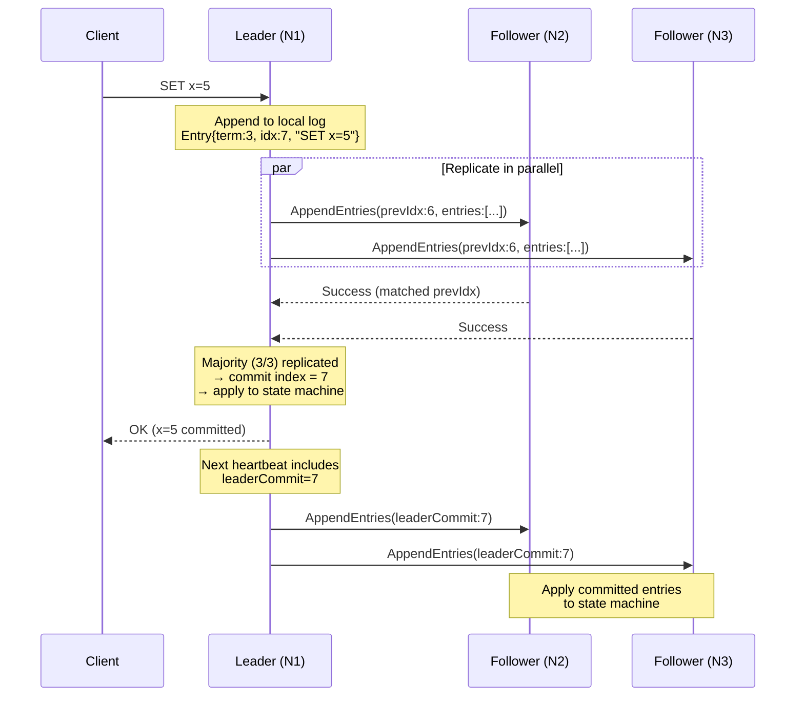

### Raft Safety: The Election Restriction

The key Raft safety insight: **a candidate cannot win an election unless its log contains all committed entries.**

This is enforced by the log up-to-date check in `handle_request_vote`:
- Compare last log entry terms
- If equal terms, compare log lengths
- Voter rejects candidates with less up-to-date logs

This guarantees the **Leader Completeness Property**: if a log entry is committed in a given term, it will be present in the logs of all leaders for higher terms.

### Raft vs. Paxos Comparison

| Aspect | Paxos | Raft |
|---|---|---|
| **Understandability** | Notoriously difficult | Designed for clarity |
| **Leader** | Optional optimization (Multi-Paxos) | Mandatory, central role |
| **Log gaps** | Allowed (each slot independent) | No gaps (sequential) |
| **Membership change** | Not specified | Joint consensus protocol |
| **Implementations** | Google Chubby, Spanner | etcd, Consul, CockroachDB, TiKV |
| **Correctness proofs** | Complex | TLA+ specification available |
| **Performance** | Similar (with Multi-Paxos) | Similar |

---

## 21.5 Gossip Protocols

Not all distributed coordination requires strong consensus. Gossip protocols provide **eventually consistent** information dissemination — like rumors spreading through a crowd.

### How Gossip Works

Each node periodically picks a random peer and exchanges information. After O(log N) rounds, all nodes have the information.

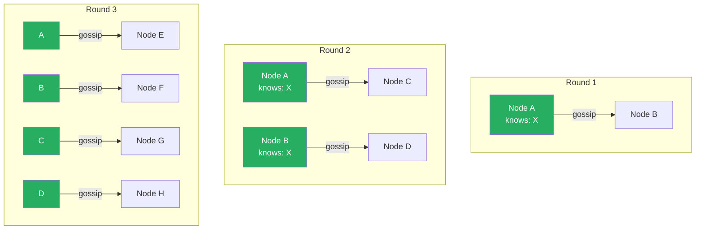

### Gossip Implementation

```python
import random
import time
from dataclasses import dataclass, field
from typing import Any


@dataclass
class GossipState:
    """State item with version for conflict resolution."""
    key: str
    value: Any
    version: int  # Lamport timestamp or counter
    node_id: str  # Originator


class GossipNode:
    """
    Epidemic-style gossip protocol.
    Used by: Cassandra, DynamoDB, Consul (for membership),
    Redis Cluster, Riak.
    """

    def __init__(self, node_id: str, peers: list[str]):
        self.node_id = node_id
        self.peers = peers
        self.state: dict[str, GossipState] = {}
        self.version_counter = 0

    def update_local(self, key: str, value: Any) -> None:
        """Local state change — will be gossiped."""
        self.version_counter += 1
        self.state[key] = GossipState(
            key=key,
            value=value,
            version=self.version_counter,
            node_id=self.node_id,
        )

    def gossip_round(self) -> None:
        """
        One gossip round:
        1. Pick random peer
        2. Send digest (keys + versions)
        3. Peer responds with newer data
        4. Merge states
        """
        if not self.peers:
            return

        # Pick random peer (fan-out of 1; some systems use 2-3)
        target = random.choice(self.peers)

        # Build digest: key → version
        digest = {k: s.version for k, s in self.state.items()}

        # Simulate: send digest, receive peer's state
        peer_state = self._exchange_with_peer(target, digest)

        # Merge: keep highest version for each key
        self._merge(peer_state)

    def _merge(self, remote_state: dict[str, GossipState]) -> None:
        """Merge remote state into local. Higher version wins."""
        for key, remote in remote_state.items():
            local = self.state.get(key)
            if local is None or remote.version > local.version:
                self.state[key] = remote
            elif remote.version == local.version and remote.node_id > (local.node_id if local else ""):
                # Tiebreak by node_id for determinism
                self.state[key] = remote

    def _exchange_with_peer(
        self, peer_id: str, digest: dict[str, int]
    ) -> dict[str, GossipState]:
        """Stub: exchange state with peer."""
        # In real implementation: UDP or TCP message
        return {}

    def get_state_summary(self) -> dict[str, Any]:
        return {k: (s.value, s.version) for k, s in self.state.items()}


# Simulation
nodes = [GossipNode(f"node-{i}", [f"node-{j}" for j in range(5) if j != i])
         for i in range(5)]

# Node 0 learns something
nodes[0].update_local("leader", "node-2")
nodes[0].update_local("config_version", 42)

# After O(log 5) ≈ 3 rounds, all nodes know
for round_num in range(5):
    for node in nodes:
        node.gossip_round()
```

### Gossip Protocol Variants

| Variant | How It Works | Use Case |
|---|---|---|
| **Anti-entropy** | Periodically sync entire state with random peer | Full state convergence (Cassandra repair) |
| **Rumor-mongering** | Spread new updates like epidemics, stop when "old news" | Fast dissemination (membership changes) |
| **SWIM** | Combine failure detection with gossip | Membership + health (Consul, Serf) |

### SWIM Failure Detection

**S**calable **W**eakly-consistent **I**nfection-style Process Group **M**embership:

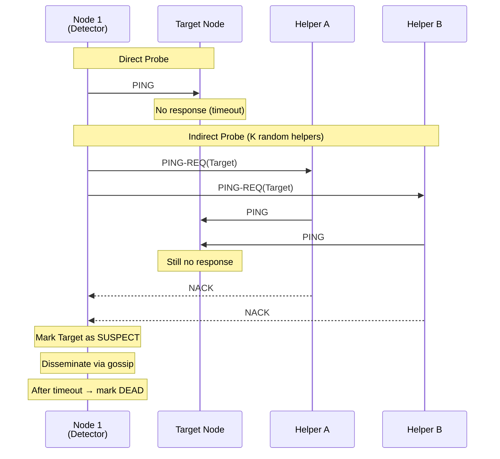

```python
import random
import time
from enum import Enum
from dataclasses import dataclass


class MemberStatus(Enum):
    ALIVE = "alive"
    SUSPECT = "suspect"
    DEAD = "dead"


@dataclass
class Member:
    node_id: str
    status: MemberStatus
    incarnation: int  # Increases to refute suspicion
    last_updated: float


class SWIMProtocol:
    """
    SWIM protocol for scalable failure detection.
    O(1) load per member per round.
    """

    def __init__(self, node_id: str, protocol_period_ms: int = 1000):
        self.node_id = node_id
        self.protocol_period_ms = protocol_period_ms
        self.members: dict[str, Member] = {}
        self.incarnation = 0

    def probe_round(self) -> None:
        """
        Each round:
        1. Pick random member to probe
        2. Send PING
        3. If no ACK → ask K random members to indirect-ping
        4. If still no ACK → mark SUSPECT
        5. After timeout → mark DEAD
        """
        alive_members = [
            m for m in self.members.values()
            if m.status == MemberStatus.ALIVE and m.node_id != self.node_id
        ]
        if not alive_members:
            return

        target = random.choice(alive_members)

        # Direct probe
        ack = self._send_ping(target.node_id)
        if ack:
            return  # All good

        # Indirect probe: ask K random members to ping target
        k = min(3, len(alive_members) - 1)
        helpers = random.sample(
            [m for m in alive_members if m.node_id != target.node_id], k
        )

        indirect_ack = False
        for helper in helpers:
            if self._send_ping_req(helper.node_id, target.node_id):
                indirect_ack = True
                break

        if not indirect_ack:
            self._mark_suspect(target.node_id)

    def _mark_suspect(self, node_id: str) -> None:
        """Mark member as suspected. Disseminate via gossip."""
        if node_id in self.members:
            member = self.members[node_id]
            member.status = MemberStatus.SUSPECT
            member.last_updated = time.time()
            print(f"{self.node_id}: Suspecting {node_id}")
            # After suspicion_timeout, mark DEAD if not refuted

    def refute_suspicion(self) -> None:
        """If I'm suspected, increase incarnation to refute."""
        self.incarnation += 1
        # Broadcast ALIVE message with higher incarnation

    def _send_ping(self, target: str) -> bool:
        return False  # Implement with real network

    def _send_ping_req(self, helper: str, target: str) -> bool:
        return False  # Implement with real network
```

### Gossip vs. Consensus Comparison

| Aspect | Gossip | Consensus (Raft/Paxos) |
|---|---|---|
| **Consistency** | Eventual | Strong (linearizable) |
| **Scalability** | O(log N) dissemination | O(N) per decision |
| **Fault tolerance** | Probabilistic, very resilient | Deterministic, needs majority |
| **Use case** | Membership, metrics, config | Leader election, replicated state |
| **Latency** | Higher (probabilistic) | Lower (direct replication) |
| **Real systems** | Cassandra, Consul membership | etcd, ZooKeeper, CockroachDB |

---

## 21.6 CRDTs: Conflict-Free Replicated Data Types

CRDTs solve a specific problem: **how to allow concurrent writes on multiple replicas without coordination, and still converge to the same state.**

### The Problem

When two replicas independently modify the same data, they diverge. Traditional approaches use locks or consensus to prevent this. CRDTs instead use **mathematical properties** to guarantee convergence.

### Two Flavors

| Type | Name | How It Works |
|---|---|---|
| **CvRDT** | Convergent (state-based) | Send full state, merge with join operation |
| **CmRDT** | Commutative (operation-based) | Send operations, apply in any order |

### G-Counter (Grow-Only Counter)

The simplest CRDT. Each node maintains its own counter; the total is the sum.

```python
from dataclasses import dataclass, field


@dataclass
class GCounter:
    """
    Grow-only counter CRDT.
    Each node increments its own slot.
    Value = sum of all slots.
    Merge = element-wise max.
    
    Used by: Cassandra counters, Riak.
    """
    node_id: str
    counts: dict[str, int] = field(default_factory=dict)

    def increment(self, amount: int = 1) -> None:
        current = self.counts.get(self.node_id, 0)
        self.counts[self.node_id] = current + amount

    def value(self) -> int:
        return sum(self.counts.values())

    def merge(self, other: "GCounter") -> "GCounter":
        """
        Merge two G-Counters: take max of each node's count.
        This is idempotent, commutative, and associative
        → guaranteed convergence.
        """
        merged_counts: dict[str, int] = {}
        all_nodes = set(self.counts.keys()) | set(other.counts.keys())
        for node in all_nodes:
            merged_counts[node] = max(
                self.counts.get(node, 0),
                other.counts.get(node, 0),
            )
        return GCounter(node_id=self.node_id, counts=merged_counts)


# Example: Two data centers tracking page views
dc1 = GCounter("dc1")
dc2 = GCounter("dc2")

dc1.increment(100)  # 100 views in DC1
dc2.increment(75)   # 75 views in DC2
dc1.increment(50)   # 50 more in DC1

print(f"DC1 sees: {dc1.value()}")  # 150
print(f"DC2 sees: {dc2.value()}")  # 75

# After sync
merged = dc1.merge(dc2)
print(f"After merge: {merged.value()}")  # 225
```

### PN-Counter (Positive-Negative Counter)

Supports both increment and decrement.

```python
@dataclass
class PNCounter:
    """
    Positive-Negative Counter.
    Two G-Counters: one for increments, one for decrements.
    Value = P.value() - N.value()
    """
    node_id: str
    p: GCounter = None  # Positive
    n: GCounter = None  # Negative

    def __post_init__(self):
        if self.p is None:
            self.p = GCounter(self.node_id)
        if self.n is None:
            self.n = GCounter(self.node_id)

    def increment(self, amount: int = 1) -> None:
        self.p.increment(amount)

    def decrement(self, amount: int = 1) -> None:
        self.n.increment(amount)

    def value(self) -> int:
        return self.p.value() - self.n.value()

    def merge(self, other: "PNCounter") -> "PNCounter":
        result = PNCounter(self.node_id)
        result.p = self.p.merge(other.p)
        result.n = self.n.merge(other.n)
        return result


# Example: Shopping cart item quantity
cart_eu = PNCounter("eu-west")
cart_us = PNCounter("us-east")

cart_eu.increment(3)   # Add 3 items in EU
cart_us.decrement(1)   # Remove 1 in US (concurrent)

merged = cart_eu.merge(cart_us)
print(f"Cart quantity: {merged.value()}")  # 2
```

### LWW-Register (Last-Writer-Wins Register)

```python
import time
from dataclasses import dataclass
from typing import Any, Optional


@dataclass
class LWWRegister:
    """
    Last-Writer-Wins Register.
    Resolves conflicts using timestamps.
    Warning: Depends on synchronized clocks!
    """
    node_id: str
    value: Optional[Any] = None
    timestamp: float = 0.0

    def set(self, value: Any) -> None:
        self.value = value
        self.timestamp = time.time()

    def merge(self, other: "LWWRegister") -> "LWWRegister":
        if other.timestamp > self.timestamp:
            return LWWRegister(self.node_id, other.value, other.timestamp)
        elif other.timestamp == self.timestamp:
            # Tiebreak by node_id
            if other.node_id > self.node_id:
                return LWWRegister(self.node_id, other.value, other.timestamp)
        return LWWRegister(self.node_id, self.value, self.timestamp)
```

### OR-Set (Observed-Remove Set)

The most practical set CRDT. Supports both add and remove without conflicts.

```python
import uuid
from dataclasses import dataclass, field


@dataclass
class ORSet:
    """
    Observed-Remove Set CRDT.
    Each element gets a unique tag on add.
    Remove deletes all currently-observed tags for that element.
    Concurrent add + remove → element is present (add wins).
    
    Used by: Riak sets, Automerge, Yjs.
    """
    elements: dict[str, set[str]] = field(default_factory=dict)  # value → {tags}
    tombstones: dict[str, set[str]] = field(default_factory=dict)  # value → {removed tags}

    def add(self, value: str) -> None:
        tag = str(uuid.uuid4())
        if value not in self.elements:
            self.elements[value] = set()
        self.elements[value].add(tag)

    def remove(self, value: str) -> None:
        """Remove all currently-observed instances."""
        if value in self.elements:
            if value not in self.tombstones:
                self.tombstones[value] = set()
            # Move all current tags to tombstones
            self.tombstones[value].update(self.elements[value])
            del self.elements[value]

    def contains(self, value: str) -> bool:
        return value in self.elements and len(self.elements[value]) > 0

    def values(self) -> set[str]:
        return {v for v, tags in self.elements.items() if tags}

    def merge(self, other: "ORSet") -> "ORSet":
        """Merge two OR-Sets."""
        result = ORSet()
        all_values = set(self.elements.keys()) | set(other.elements.keys())

        for value in all_values:
            my_tags = self.elements.get(value, set())
            other_tags = other.elements.get(value, set())
            my_tombstones = self.tombstones.get(value, set())
            other_tombstones = other.tombstones.get(value, set())

            all_tombstones = my_tombstones | other_tombstones
            surviving_tags = (my_tags | other_tags) - all_tombstones

            if surviving_tags:
                result.elements[value] = surviving_tags
            result.tombstones[value] = all_tombstones

        return result


# Example: Collaborative document — concurrent edits
replica_a = ORSet()
replica_b = ORSet()

# User A adds "Alice" and "Bob"
replica_a.add("Alice")
replica_a.add("Bob")

# User B (concurrently) adds "Alice" and "Charlie"
replica_b.add("Alice")
replica_b.add("Charlie")

# User A removes "Alice"
replica_a.remove("Alice")

# After merge: "Alice" is present! (B's concurrent add wins)
merged = replica_a.merge(replica_b)
print(f"Members: {merged.values()}")
# Output: Members: {'Alice', 'Bob', 'Charlie'}
```

### CRDT Decision Guide

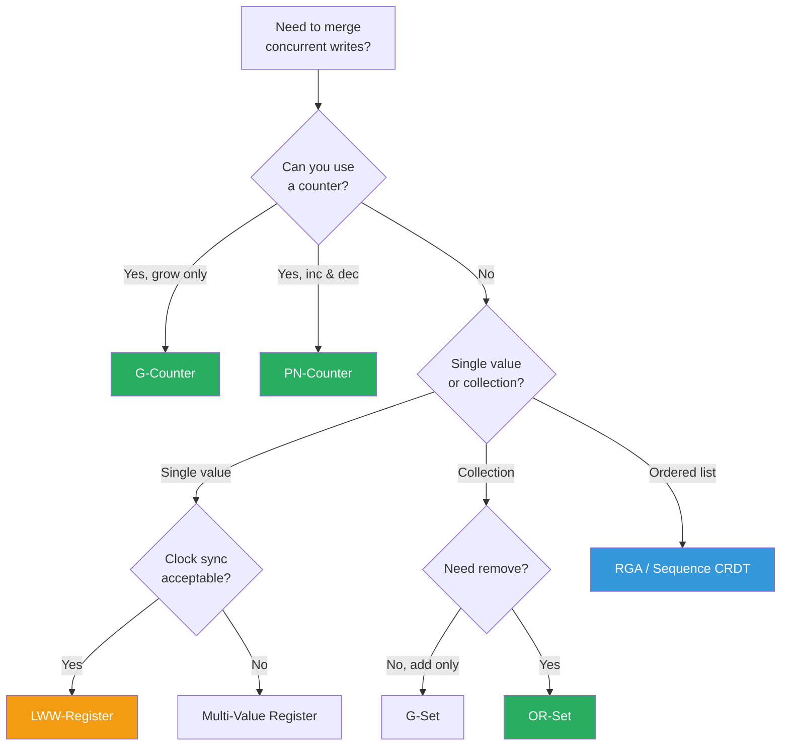

### Real-World CRDT Usage

| System | CRDTs Used | Purpose |
|---|---|---|
| **Riak** | G-Counter, PN-Counter, OR-Set, LWW-Register, Map | Multi-datacenter replication |
| **Redis (CRDB)** | Counter, Set, String | Active-active geo-replication |
| **Figma** | Custom sequence CRDT | Real-time collaborative design |
| **Apple Notes** | Custom text CRDT | Cross-device text sync |
| **Automerge** | JSON CRDT | Collaborative JSON documents |
| **Yjs** | Sequence + Map CRDT | Collaborative text editing |

---

## 21.7 Consistency Models in Practice

### How Real Databases Implement Consistency

| Database | Consistency Model | Protocol |
|---|---|---|
| **etcd** | Linearizable | Raft |
| **ZooKeeper** | Linearizable writes, sequential reads | ZAB (ZooKeeper Atomic Broadcast) |
| **CockroachDB** | Serializable | Raft + hybrid logical clocks |
| **Spanner** | External consistency (strongest) | Paxos + TrueTime (GPS/atomic clocks) |
| **Cassandra** | Tunable (ONE to ALL) | Gossip + quorum reads/writes |
| **DynamoDB** | Eventual (default), Strong (optional) | Vector clocks + quorum |
| **MongoDB** | Linearizable (optional) | Raft-based replica sets |

### Google Spanner: TrueTime

Spanner achieves **external consistency** (stronger than linearizability) using hardware-synchronized time.

```python
from dataclasses import dataclass


@dataclass
class TrueTimeInterval:
    """
    TrueTime returns an interval [earliest, latest] instead of a point.
    GPS receivers + atomic clocks keep uncertainty (ε) under 7ms typically.
    """
    earliest: float  # Definitely not before this
    latest: float    # Definitely not after this

    @property
    def uncertainty(self) -> float:
        return self.latest - self.earliest


class SpannerCommitProtocol:
    """
    Simplified Spanner commit-wait protocol.
    Ensures transaction timestamps reflect real-time ordering.
    """

    def commit_transaction(self, txn_id: str) -> float:
        """
        1. Choose commit timestamp s
        2. Wait until TrueTime guarantees s is in the past
        3. Apply the transaction
        
        This "commit wait" means:
        - If T1 commits before T2 starts, T1.timestamp < T2.timestamp
        - External consistency guaranteed!
        """
        # Get current TrueTime interval
        tt = self._get_truetime()

        # Choose commit timestamp = latest possible now
        commit_ts = tt.latest

        # COMMIT WAIT: sleep until we're sure commit_ts is in the past
        wait_time = commit_ts - self._get_truetime().earliest
        if wait_time > 0:
            import time
            time.sleep(wait_time)
            # Now TrueTime.earliest > commit_ts
            # → commit_ts is definitely in the past

        # Safe to reveal committed data
        print(f"Transaction {txn_id} committed at {commit_ts}")
        return commit_ts

    def _get_truetime(self) -> TrueTimeInterval:
        """Stub: real TrueTime uses GPS + atomic clocks."""
        import time
        now = time.time()
        epsilon = 0.007  # ~7ms typical uncertainty
        return TrueTimeInterval(now - epsilon, now + epsilon)
```

### Tunable Consistency (Cassandra/DynamoDB Style)

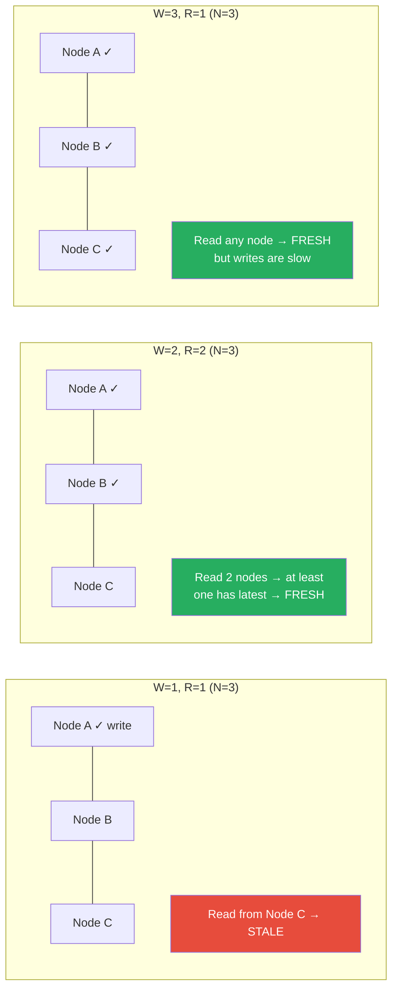

```python
from enum import Enum


class ConsistencyLevel(Enum):
    ONE = 1        # Fastest, weakest
    QUORUM = 2     # Balanced
    ALL = 3        # Strongest, slowest
    LOCAL_QUORUM = 4  # Quorum within datacenter


class TunableConsistency:
    """
    Quorum-based tunable consistency.
    
    N = replication factor (e.g., 3)
    W = write consistency (nodes that must ACK write)
    R = read consistency (nodes that must respond to read)
    
    Strong consistency when: W + R > N
    """

    def __init__(self, replication_factor: int = 3):
        self.n = replication_factor

    def is_strongly_consistent(self, w: int, r: int) -> bool:
        return w + r > self.n

    def analyze_configuration(self, w: int, r: int) -> str:
        """Explain the consistency trade-offs."""
        strong = self.is_strongly_consistent(w, r)
        read_latest = r >= self.n - w + 1

        if w == self.n and r == 1:
            return (
                f"W={w}, R={r}, N={self.n}: "
                "All-write. Fast reads, slow writes. "
                "Write fails if ANY node down."
            )
        elif w == 1 and r == self.n:
            return (
                f"W={w}, R={r}, N={self.n}: "
                "Fast writes, slow reads. "
                "Read fails if ANY node down."
            )
        elif strong:
            return (
                f"W={w}, R={r}, N={self.n}: "
                f"Strongly consistent (W+R={w+r} > N={self.n}). "
                "Read always sees latest write."
            )
        else:
            return (
                f"W={w}, R={r}, N={self.n}: "
                f"Eventually consistent (W+R={w+r} <= N={self.n}). "
                "May read stale data."
            )


tc = TunableConsistency(replication_factor=3)
configs = [(1, 1), (2, 2), (3, 1), (1, 3), (2, 1)]
for w, r in configs:
    print(tc.analyze_configuration(w, r))

# W=1, R=1, N=3: Eventually consistent (W+R=2 <= N=3). May read stale data.
# W=2, R=2, N=3: Strongly consistent (W+R=4 > N=3). Read always sees latest write.
# W=3, R=1, N=3: Strongly consistent (W+R=4 > N=3). ...
# W=1, R=3, N=3: Strongly consistent (W+R=4 > N=3). ...
# W=2, R=1, N=3: Eventually consistent (W+R=3 <= N=3). May read stale data.
```

> **Gotcha**: `W + R = N` is NOT strongly consistent — there's an edge case where a read contacts only nodes that haven't received the write yet. You need `W + R > N`.

---

## 21.8 Putting It All Together: Real System Architecture

### ZooKeeper Architecture

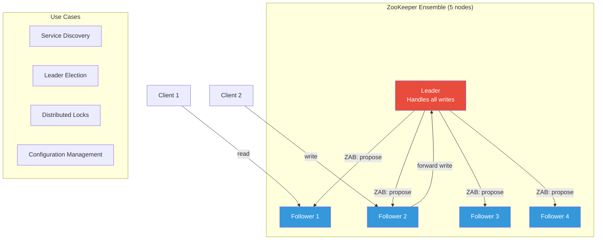

### Choosing the Right Protocol

| Scenario | Protocol | Why |
|---|---|---|
| Metadata/config (small, critical) | **Raft/Paxos** (via etcd/ZK) | Need strong consistency, small dataset |
| User session data | **Gossip + CRDTs** | High availability, eventual OK |
| Financial transactions | **Raft** (via CockroachDB/Spanner) | Must be serializable |
| Cluster membership | **SWIM/Gossip** | Scalable, availability over consistency |
| Real-time collaboration | **CRDTs** | Offline-capable, merge without coordination |
| Distributed lock | **Raft** (via etcd) | Need mutual exclusion guarantee |
| Multi-DC replication | **CRDTs or async Raft** | Latency constraints across regions |

---

## 21.9 Key Takeaways

| Concept | Key Insight |
|---|---|
| **Consensus** | Get N nodes to agree; impossible in pure async (FLP), practical with timeouts |
| **Paxos** | Foundational but complex; two-phase prepare/accept with majority |
| **Raft** | Understandable consensus: leader election + log replication + safety |
| **Gossip** | Eventual consistency at scale; O(log N) dissemination; perfect for membership |
| **CRDTs** | Math-based convergence without coordination; counters, sets, registers |
| **Tunable consistency** | W + R > N for strong; trade latency vs consistency per query |
| **TrueTime** | Hardware clocks eliminate uncertainty; Spanner's secret weapon |
| **Protocol choice** | Strong consistency for critical data; eventual for availability-first workloads |

---

## 21.10 Practice Questions

1. **Design a distributed lock service** using Raft. How do you handle lock expiry if the lock holder crashes? What about the "lock holder is slow, not dead" problem? (Hint: fencing tokens)

2. **Your team is debating** Cassandra (gossip + tunable consistency) vs. CockroachDB (Raft + serializable) for a new payment service. What are the trade-offs? Which would you recommend and why?

3. **Implement a G-Set CRDT** (grow-only set) and prove that merge is commutative, associative, and idempotent. Then extend it to a 2P-Set that supports removal. What limitation does the 2P-Set have that OR-Set solves?

4. **Explain why** Raft's election restriction (candidates must have all committed entries) is necessary for safety. What could go wrong if a candidate with a shorter log won the election?

5. **A collaborative text editor** is being built for a team. Users in different offices may go offline temporarily. Would you use OT (Operational Transformation), CRDTs, or Raft-based replication? Justify your choice considering latency, offline support, and consistency guarantees.

---

| [← Chapter 20: Distributed Systems](../part5-advanced/ch20-distributed-systems.md) | [Home](../README.md) | [Chapter 22: Event Sourcing, CQRS & Stream Processing →](../part5-advanced/ch22-event-sourcing-cqrs.md) |
|---|---|---|
