# Chapter 22: Event Sourcing, CQRS & Stream Processing

> *"Instead of storing the current state, store the sequence of events that led to it. You can always rebuild state from events, but you can never recover lost events from state."*

Traditional databases store the current state of the world. Event sourcing stores **every change that ever happened**. Combined with CQRS and stream processing, this creates architectures that are auditable, scalable, and capable of real-time reactions.

---

## 22.1 Event Sourcing Fundamentals

### The Problem with State-Only Storage

```
Traditional approach:
  Account { id: 123, balance: 750 }

What happened to get to $750? No idea.
Was there fraud? Can't tell.
Need to rebuild yesterday's balance? Impossible.
```

### The Event Sourcing Approach

Instead of mutating state, append immutable events:

```
Event 1: AccountOpened { id: 123, owner: "Alice", timestamp: "2024-01-01" }
Event 2: MoneyDeposited { id: 123, amount: 1000, timestamp: "2024-01-02" }
Event 3: MoneyWithdrawn { id: 123, amount: 200, timestamp: "2024-01-15" }
Event 4: MoneyWithdrawn { id: 123, amount: 50, timestamp: "2024-02-01" }

Current state: balance = 1000 - 200 - 50 = $750
State on Jan 10: balance = $1000
```

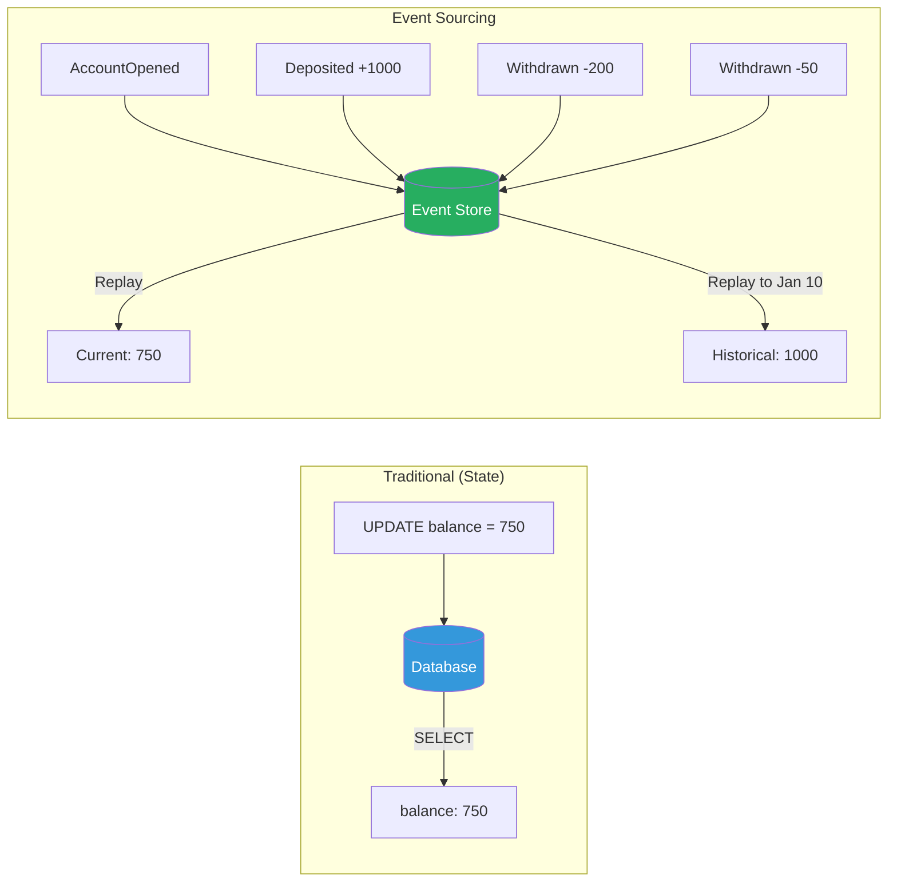

### Core Implementation

```python
from dataclasses import dataclass, field
from datetime import datetime
from typing import Any
from abc import ABC, abstractmethod
import json
import uuid


# ─── Events ───

@dataclass(frozen=True)
class DomainEvent:
    """Base event. Immutable facts about what happened."""
    event_id: str = field(default_factory=lambda: str(uuid.uuid4()))
    timestamp: datetime = field(default_factory=datetime.utcnow)
    aggregate_id: str = ""
    version: int = 0


@dataclass(frozen=True)
class AccountOpened(DomainEvent):
    owner: str = ""
    initial_deposit: float = 0.0


@dataclass(frozen=True)
class MoneyDeposited(DomainEvent):
    amount: float = 0.0
    source: str = ""


@dataclass(frozen=True)
class MoneyWithdrawn(DomainEvent):
    amount: float = 0.0
    destination: str = ""


@dataclass(frozen=True)
class AccountFrozen(DomainEvent):
    reason: str = ""


# ─── Aggregate ───

class BankAccount:
    """
    Aggregate root. State is derived from events.
    Commands produce events; events mutate state.
    """

    def __init__(self, account_id: str):
        self.account_id = account_id
        self.balance: float = 0.0
        self.owner: str = ""
        self.is_frozen: bool = False
        self.version: int = 0
        self._pending_events: list[DomainEvent] = []

    # ─── Commands (business logic + validation) ───

    def open(self, owner: str, initial_deposit: float) -> None:
        if initial_deposit < 0:
            raise ValueError("Initial deposit must be non-negative")
        self._apply(AccountOpened(
            aggregate_id=self.account_id,
            owner=owner,
            initial_deposit=initial_deposit,
        ))

    def deposit(self, amount: float, source: str = "") -> None:
        if amount <= 0:
            raise ValueError("Deposit must be positive")
        if self.is_frozen:
            raise ValueError("Account is frozen")
        self._apply(MoneyDeposited(
            aggregate_id=self.account_id,
            amount=amount,
            source=source,
        ))

    def withdraw(self, amount: float, destination: str = "") -> None:
        if amount <= 0:
            raise ValueError("Withdrawal must be positive")
        if self.is_frozen:
            raise ValueError("Account is frozen")
        if amount > self.balance:
            raise ValueError(
                f"Insufficient funds: {self.balance} < {amount}"
            )
        self._apply(MoneyWithdrawn(
            aggregate_id=self.account_id,
            amount=amount,
            destination=destination,
        ))

    def freeze(self, reason: str) -> None:
        if self.is_frozen:
            return  # Idempotent
        self._apply(AccountFrozen(
            aggregate_id=self.account_id,
            reason=reason,
        ))

    # ─── Event Application (state mutation) ───

    def _apply(self, event: DomainEvent) -> None:
        """Apply event: mutate state + track for persistence."""
        self._mutate(event)
        self._pending_events.append(event)

    def _mutate(self, event: DomainEvent) -> None:
        """Pure state mutation from event. No side effects."""
        self.version += 1

        if isinstance(event, AccountOpened):
            self.owner = event.owner
            self.balance = event.initial_deposit
        elif isinstance(event, MoneyDeposited):
            self.balance += event.amount
        elif isinstance(event, MoneyWithdrawn):
            self.balance -= event.amount
        elif isinstance(event, AccountFrozen):
            self.is_frozen = True

    def load_from_history(self, events: list[DomainEvent]) -> None:
        """Rebuild state by replaying events."""
        for event in events:
            self._mutate(event)

    def get_pending_events(self) -> list[DomainEvent]:
        events = self._pending_events.copy()
        self._pending_events.clear()
        return events


# ─── Event Store ───

class EventStore:
    """
    Append-only event store.
    Real implementations: EventStoreDB, Kafka, PostgreSQL with append-only table.
    """

    def __init__(self):
        self._streams: dict[str, list[DomainEvent]] = {}

    def append(
        self, stream_id: str, events: list[DomainEvent],
        expected_version: int
    ) -> None:
        """
        Append events with optimistic concurrency control.
        expected_version prevents concurrent writes from conflicting.
        """
        current = self._streams.get(stream_id, [])
        if len(current) != expected_version:
            raise ConcurrencyError(
                f"Expected version {expected_version}, "
                f"but stream has {len(current)} events"
            )
        self._streams.setdefault(stream_id, []).extend(events)

    def load(self, stream_id: str) -> list[DomainEvent]:
        """Load all events for a stream."""
        return self._streams.get(stream_id, []).copy()

    def load_from_version(
        self, stream_id: str, from_version: int
    ) -> list[DomainEvent]:
        """Load events from a specific version."""
        events = self._streams.get(stream_id, [])
        return events[from_version:]


class ConcurrencyError(Exception):
    pass


# ─── Repository ───

class BankAccountRepository:
    """Repository that loads/saves aggregates via events."""

    def __init__(self, event_store: EventStore):
        self.event_store = event_store

    def load(self, account_id: str) -> BankAccount:
        events = self.event_store.load(f"account-{account_id}")
        account = BankAccount(account_id)
        account.load_from_history(events)
        return account

    def save(self, account: BankAccount) -> None:
        pending = account.get_pending_events()
        if pending:
            expected_version = account.version - len(pending)
            self.event_store.append(
                f"account-{account.account_id}",
                pending,
                expected_version,
            )


# Usage
store = EventStore()
repo = BankAccountRepository(store)

# Create and use account
account = BankAccount("ACC-001")
account.open("Alice", 1000.0)
account.deposit(500.0, source="salary")
account.withdraw(200.0, destination="rent")
repo.save(account)

# Reload from events
loaded = repo.load("ACC-001")
print(f"Balance: ${loaded.balance}")  # Balance: $1300.0
print(f"Owner: {loaded.owner}")       # Owner: Alice
print(f"Version: {loaded.version}")   # Version: 3

# Full audit trail
events = store.load("account-ACC-001")
for e in events:
    print(f"  {type(e).__name__}: {e}")
```

```java
import java.time.Instant;
import java.util.*;

// Events
sealed interface AccountEvent {
    String accountId();
    Instant timestamp();
}

record AccountOpened(String accountId, String owner,
        double initialDeposit, Instant timestamp) implements AccountEvent {}
record MoneyDeposited(String accountId, double amount,
        String source, Instant timestamp) implements AccountEvent {}
record MoneyWithdrawn(String accountId, double amount,
        String destination, Instant timestamp) implements AccountEvent {}

// Aggregate
public class BankAccount {
    private String accountId;
    private double balance;
    private String owner;
    private int version;
    private final List<AccountEvent> pendingEvents = new ArrayList<>();
    
    public BankAccount(String accountId) {
        this.accountId = accountId;
    }
    
    // Commands
    public void deposit(double amount, String source) {
        if (amount <= 0) throw new IllegalArgumentException("Amount must be positive");
        apply(new MoneyDeposited(accountId, amount, source, Instant.now()));
    }
    
    public void withdraw(double amount, String destination) {
        if (amount > balance) throw new IllegalStateException("Insufficient funds");
        apply(new MoneyWithdrawn(accountId, amount, destination, Instant.now()));
    }
    
    // Event application
    private void apply(AccountEvent event) {
        mutate(event);
        pendingEvents.add(event);
    }
    
    private void mutate(AccountEvent event) {
        version++;
        switch (event) {
            case AccountOpened e -> { owner = e.owner(); balance = e.initialDeposit(); }
            case MoneyDeposited e -> balance += e.amount();
            case MoneyWithdrawn e -> balance -= e.amount();
        }
    }
    
    public void loadFromHistory(List<AccountEvent> events) {
        events.forEach(this::mutate);
    }
    
    public List<AccountEvent> getPendingEvents() {
        var events = List.copyOf(pendingEvents);
        pendingEvents.clear();
        return events;
    }
    
    public double getBalance() { return balance; }
    public int getVersion() { return version; }
}
```

### Snapshots: Solving the Replay Problem

Replaying thousands of events on every load is slow. Snapshots periodically save the current state.

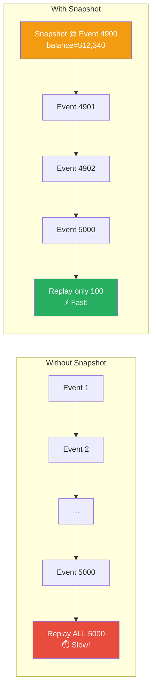

```python
@dataclass
class Snapshot:
    aggregate_id: str
    version: int
    state: dict  # Serialized aggregate state
    timestamp: datetime = field(default_factory=datetime.utcnow)


class SnapshotStore:
    """Store periodic snapshots to speed up aggregate loading."""

    def __init__(self):
        self._snapshots: dict[str, Snapshot] = {}

    def save(self, snapshot: Snapshot) -> None:
        self._snapshots[snapshot.aggregate_id] = snapshot

    def load(self, aggregate_id: str) -> Snapshot | None:
        return self._snapshots.get(aggregate_id)


class SnapshottingRepository:
    """Load from snapshot + recent events (not full replay)."""

    SNAPSHOT_INTERVAL = 100  # Snapshot every 100 events

    def __init__(self, event_store: EventStore, snapshot_store: SnapshotStore):
        self.event_store = event_store
        self.snapshot_store = snapshot_store

    def load(self, account_id: str) -> BankAccount:
        stream_id = f"account-{account_id}"
        account = BankAccount(account_id)

        # Try loading snapshot first
        snapshot = self.snapshot_store.load(stream_id)
        if snapshot:
            account.balance = snapshot.state["balance"]
            account.owner = snapshot.state["owner"]
            account.is_frozen = snapshot.state["is_frozen"]
            account.version = snapshot.version
            # Only replay events AFTER snapshot
            recent_events = self.event_store.load_from_version(
                stream_id, snapshot.version
            )
        else:
            recent_events = self.event_store.load(stream_id)

        account.load_from_history(recent_events)
        return account

    def save(self, account: BankAccount) -> None:
        pending = account.get_pending_events()
        if not pending:
            return

        stream_id = f"account-{account.account_id}"
        expected_version = account.version - len(pending)
        self.event_store.append(stream_id, pending, expected_version)

        # Create snapshot if needed
        if account.version % self.SNAPSHOT_INTERVAL == 0:
            snapshot = Snapshot(
                aggregate_id=stream_id,
                version=account.version,
                state={
                    "balance": account.balance,
                    "owner": account.owner,
                    "is_frozen": account.is_frozen,
                },
            )
            self.snapshot_store.save(snapshot)
```

---

## 22.2 CQRS: Command Query Responsibility Segregation

### The Insight

Most systems have asymmetric read/write patterns:
- **Writes** are complex (validation, business rules, consistency)
- **Reads** are diverse (different views, aggregations, search)

CQRS separates the write model (commands) from the read model (queries), allowing each to be optimized independently.

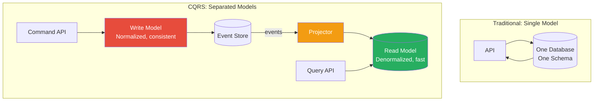

### Full CQRS Implementation

```python
from dataclasses import dataclass, field
from datetime import datetime
from typing import Any, Protocol
from abc import abstractmethod


# ─── Commands ───

@dataclass(frozen=True)
class Command:
    pass


@dataclass(frozen=True)
class CreateOrder(Command):
    order_id: str
    customer_id: str
    items: list[dict]  # [{product_id, quantity, price}]


@dataclass(frozen=True)
class ShipOrder(Command):
    order_id: str
    tracking_number: str


@dataclass(frozen=True)
class CancelOrder(Command):
    order_id: str
    reason: str


# ─── Events ───

@dataclass(frozen=True)
class OrderEvent:
    order_id: str
    timestamp: datetime = field(default_factory=datetime.utcnow)


@dataclass(frozen=True)
class OrderCreated(OrderEvent):
    customer_id: str = ""
    items: list[dict] = field(default_factory=list)
    total: float = 0.0


@dataclass(frozen=True)
class OrderShipped(OrderEvent):
    tracking_number: str = ""


@dataclass(frozen=True)
class OrderCancelled(OrderEvent):
    reason: str = ""


# ─── Write Side: Command Handler ───

class OrderAggregate:
    """Write model — enforces business rules."""

    def __init__(self, order_id: str):
        self.order_id = order_id
        self.status = "new"
        self.customer_id = ""
        self.items: list[dict] = []
        self.total = 0.0
        self._events: list[OrderEvent] = []

    def handle_create(self, cmd: CreateOrder) -> None:
        if self.status != "new":
            raise ValueError("Order already exists")
        total = sum(i["price"] * i["quantity"] for i in cmd.items)
        self._apply(OrderCreated(
            order_id=cmd.order_id,
            customer_id=cmd.customer_id,
            items=cmd.items,
            total=total,
        ))

    def handle_ship(self, cmd: ShipOrder) -> None:
        if self.status != "created":
            raise ValueError(f"Cannot ship order in '{self.status}' status")
        self._apply(OrderShipped(
            order_id=cmd.order_id,
            tracking_number=cmd.tracking_number,
        ))

    def handle_cancel(self, cmd: CancelOrder) -> None:
        if self.status in ("shipped", "cancelled"):
            raise ValueError(f"Cannot cancel order in '{self.status}' status")
        self._apply(OrderCancelled(
            order_id=cmd.order_id,
            reason=cmd.reason,
        ))

    def _apply(self, event: OrderEvent) -> None:
        self._mutate(event)
        self._events.append(event)

    def _mutate(self, event: OrderEvent) -> None:
        if isinstance(event, OrderCreated):
            self.status = "created"
            self.customer_id = event.customer_id
            self.items = event.items
            self.total = event.total
        elif isinstance(event, OrderShipped):
            self.status = "shipped"
        elif isinstance(event, OrderCancelled):
            self.status = "cancelled"

    def get_uncommitted_events(self) -> list[OrderEvent]:
        events = self._events.copy()
        self._events.clear()
        return events


class CommandBus:
    """Routes commands to handlers."""

    def __init__(self, event_store: EventStore, event_bus: "EventBus"):
        self.event_store = event_store
        self.event_bus = event_bus

    def handle(self, command: Command) -> None:
        if isinstance(command, CreateOrder):
            agg = OrderAggregate(command.order_id)
            agg.handle_create(command)
        elif isinstance(command, ShipOrder):
            agg = self._load_aggregate(command.order_id)
            agg.handle_ship(command)
        elif isinstance(command, CancelOrder):
            agg = self._load_aggregate(command.order_id)
            agg.handle_cancel(command)
        else:
            raise ValueError(f"Unknown command: {type(command)}")

        events = agg.get_uncommitted_events()
        self.event_store.append(
            f"order-{agg.order_id}", events, agg.total  # simplified
        )
        # Publish events for read-side projections
        for event in events:
            self.event_bus.publish(event)

    def _load_aggregate(self, order_id: str) -> OrderAggregate:
        events = self.event_store.load(f"order-{order_id}")
        agg = OrderAggregate(order_id)
        for e in events:
            agg._mutate(e)
        return agg


# ─── Read Side: Projections ───

class EventBus:
    """Simple in-process event bus."""

    def __init__(self):
        self._handlers: dict[type, list] = {}

    def subscribe(self, event_type: type, handler) -> None:
        self._handlers.setdefault(event_type, []).append(handler)

    def publish(self, event: Any) -> None:
        for handler in self._handlers.get(type(event), []):
            handler(event)


class OrderSummaryProjection:
    """
    Read model: Denormalized order summaries for fast queries.
    Updated asynchronously from events.
    """

    def __init__(self):
        self.orders: dict[str, dict] = {}

    def on_order_created(self, event: OrderCreated) -> None:
        self.orders[event.order_id] = {
            "order_id": event.order_id,
            "customer_id": event.customer_id,
            "total": event.total,
            "item_count": sum(i["quantity"] for i in event.items),
            "status": "created",
            "created_at": event.timestamp.isoformat(),
            "shipped_at": None,
            "tracking_number": None,
        }

    def on_order_shipped(self, event: OrderShipped) -> None:
        if event.order_id in self.orders:
            self.orders[event.order_id]["status"] = "shipped"
            self.orders[event.order_id]["shipped_at"] = event.timestamp.isoformat()
            self.orders[event.order_id]["tracking_number"] = event.tracking_number

    def on_order_cancelled(self, event: OrderCancelled) -> None:
        if event.order_id in self.orders:
            self.orders[event.order_id]["status"] = "cancelled"

    # Queries
    def get_order(self, order_id: str) -> dict | None:
        return self.orders.get(order_id)

    def get_customer_orders(self, customer_id: str) -> list[dict]:
        return [
            o for o in self.orders.values()
            if o["customer_id"] == customer_id
        ]

    def get_orders_by_status(self, status: str) -> list[dict]:
        return [o for o in self.orders.values() if o["status"] == status]


class CustomerAnalyticsProjection:
    """
    A completely different read model from the SAME events.
    This is the power of CQRS: multiple optimized views.
    """

    def __init__(self):
        self.customers: dict[str, dict] = {}

    def on_order_created(self, event: OrderCreated) -> None:
        cid = event.customer_id
        if cid not in self.customers:
            self.customers[cid] = {
                "customer_id": cid,
                "total_orders": 0,
                "total_spent": 0.0,
                "first_order": event.timestamp.isoformat(),
                "last_order": event.timestamp.isoformat(),
            }
        self.customers[cid]["total_orders"] += 1
        self.customers[cid]["total_spent"] += event.total
        self.customers[cid]["last_order"] = event.timestamp.isoformat()

    def get_customer_stats(self, customer_id: str) -> dict | None:
        return self.customers.get(customer_id)

    def get_top_customers(self, limit: int = 10) -> list[dict]:
        sorted_customers = sorted(
            self.customers.values(),
            key=lambda c: c["total_spent"],
            reverse=True,
        )
        return sorted_customers[:limit]


# ─── Wire Everything Together ───

event_store = EventStore()
event_bus = EventBus()
command_bus = CommandBus(event_store, event_bus)

# Read-side projections
order_summary = OrderSummaryProjection()
analytics = CustomerAnalyticsProjection()

# Subscribe projections to events
event_bus.subscribe(OrderCreated, order_summary.on_order_created)
event_bus.subscribe(OrderShipped, order_summary.on_order_shipped)
event_bus.subscribe(OrderCancelled, order_summary.on_order_cancelled)
event_bus.subscribe(OrderCreated, analytics.on_order_created)

# Execute commands
command_bus.handle(CreateOrder(
    order_id="ORD-001",
    customer_id="CUST-42",
    items=[
        {"product_id": "P1", "quantity": 2, "price": 29.99},
        {"product_id": "P2", "quantity": 1, "price": 49.99},
    ],
))

command_bus.handle(ShipOrder(order_id="ORD-001", tracking_number="TRACK-123"))

# Query different read models
print(order_summary.get_order("ORD-001"))
# {'order_id': 'ORD-001', 'status': 'shipped', 'total': 109.97, ...}

print(analytics.get_customer_stats("CUST-42"))
# {'customer_id': 'CUST-42', 'total_orders': 1, 'total_spent': 109.97, ...}
```

### Eventual Consistency in CQRS

The read model updates asynchronously from events. This means queries may return **stale data** briefly.

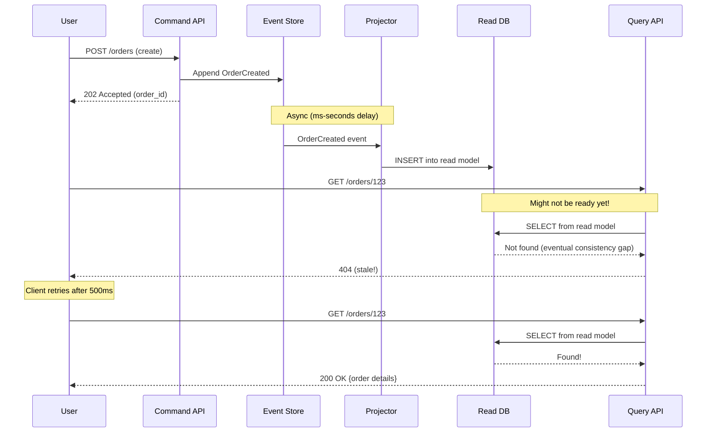

**Handling the consistency gap:**

| Strategy | How |
|---|---|
| **Return command result** | Include created entity data in command response |
| **Polling** | Client polls until read model catches up |
| **Write-follows-read** | After write, route reads to write model temporarily |
| **Subscription** | WebSocket/SSE pushes when projection updates |
| **Causal tokens** | Attach version token; query waits until projection reaches that version |

---

## 22.3 Stream Processing

Stream processing handles **unbounded, continuous data** — events flowing through a pipeline in real-time.

### Batch vs. Stream

| Aspect | Batch | Stream |
|---|---|---|
| **Data** | Bounded (finite dataset) | Unbounded (continuous) |
| **Latency** | Minutes to hours | Milliseconds to seconds |
| **Example** | Nightly ETL job | Real-time fraud detection |
| **Tools** | Hadoop, Spark Batch | Kafka Streams, Flink, Spark Streaming |

### Stream Processing Topology

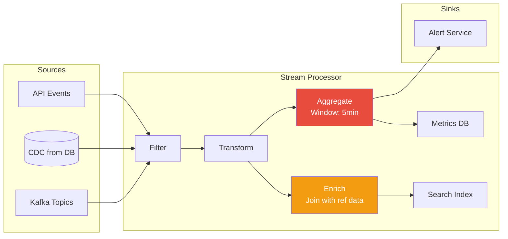

### Kafka Streams Example

```python
"""
Conceptual Kafka Streams implementation in Python.
Real Kafka Streams is Java/Scala; Python uses Faust or kafka-python.
"""
from dataclasses import dataclass, field
from collections import defaultdict
from datetime import datetime, timedelta
from typing import Any, Callable


@dataclass
class StreamEvent:
    key: str
    value: dict
    timestamp: datetime
    topic: str


class StreamProcessor:
    """
    Simplified stream processor demonstrating core concepts:
    - filter, map, flatMap
    - windowed aggregation
    - joins
    - exactly-once semantics
    """

    def __init__(self, name: str):
        self.name = name
        self._pipeline: list[Callable] = []

    def filter(self, predicate: Callable[[StreamEvent], bool]) -> "StreamProcessor":
        self._pipeline.append(("filter", predicate))
        return self

    def map(self, transform: Callable[[StreamEvent], StreamEvent]) -> "StreamProcessor":
        self._pipeline.append(("map", transform))
        return self

    def process(self, event: StreamEvent) -> list[StreamEvent]:
        """Process one event through the pipeline."""
        results = [event]
        for op_type, fn in self._pipeline:
            new_results = []
            for e in results:
                if op_type == "filter":
                    if fn(e):
                        new_results.append(e)
                elif op_type == "map":
                    new_results.append(fn(e))
            results = new_results
        return results


# ─── Windowed Aggregation ───

@dataclass
class TimeWindow:
    start: datetime
    end: datetime

    def contains(self, timestamp: datetime) -> bool:
        return self.start <= timestamp < self.end


class WindowedAggregator:
    """
    Tumbling window aggregation.
    Groups events into fixed-size time windows and aggregates.
    """

    def __init__(self, window_size: timedelta):
        self.window_size = window_size
        self.windows: dict[str, dict[str, Any]] = {}  # window_key → state

    def _get_window_key(self, timestamp: datetime) -> str:
        """Assign event to a window."""
        # Floor timestamp to window boundary
        epoch = datetime(2024, 1, 1)
        elapsed = (timestamp - epoch).total_seconds()
        window_start = epoch + timedelta(
            seconds=(elapsed // self.window_size.total_seconds())
            * self.window_size.total_seconds()
        )
        return window_start.isoformat()

    def add(self, key: str, event: StreamEvent) -> None:
        window_key = self._get_window_key(event.timestamp)
        agg_key = f"{window_key}:{key}"

        if agg_key not in self.windows:
            self.windows[agg_key] = {
                "count": 0,
                "sum": 0.0,
                "min": float("inf"),
                "max": float("-inf"),
                "window_start": window_key,
                "key": key,
            }

        state = self.windows[agg_key]
        value = event.value.get("amount", 0)
        state["count"] += 1
        state["sum"] += value
        state["min"] = min(state["min"], value)
        state["max"] = max(state["max"], value)

    def get_window_results(self) -> list[dict]:
        return list(self.windows.values())


# ─── Real-Time Fraud Detection Pipeline ───

class FraudDetectionPipeline:
    """
    Stream processing pipeline for real-time fraud detection.
    
    Pattern: Transaction events → 
             Filter (amount > threshold) → 
             Window (5 min) →
             Aggregate per user →
             Detect anomalies →
             Alert
    """

    def __init__(self):
        self.window = WindowedAggregator(timedelta(minutes=5))
        self.user_baselines: dict[str, dict] = {}  # Historical averages
        self.alerts: list[dict] = []

    def process_transaction(self, event: StreamEvent) -> list[dict]:
        """Process a single transaction event."""
        user_id = event.key
        amount = event.value.get("amount", 0)
        alerts = []

        # Rule 1: Single large transaction
        if amount > 10000:
            alerts.append({
                "type": "large_transaction",
                "user_id": user_id,
                "amount": amount,
                "severity": "high",
            })

        # Rule 2: Windowed frequency check
        self.window.add(user_id, event)
        window_key = self.window._get_window_key(event.timestamp)
        agg_key = f"{window_key}:{user_id}"
        window_state = self.window.windows.get(agg_key, {})

        if window_state.get("count", 0) > 10:
            alerts.append({
                "type": "high_frequency",
                "user_id": user_id,
                "count_in_window": window_state["count"],
                "severity": "medium",
            })

        # Rule 3: Velocity check (compare to baseline)
        baseline = self.user_baselines.get(user_id, {})
        avg_amount = baseline.get("avg_amount", 500)
        if amount > avg_amount * 5:
            alerts.append({
                "type": "unusual_amount",
                "user_id": user_id,
                "amount": amount,
                "baseline_avg": avg_amount,
                "severity": "high",
            })

        self.alerts.extend(alerts)
        return alerts


# Usage
pipeline = FraudDetectionPipeline()
pipeline.user_baselines["user-123"] = {"avg_amount": 50.0}

# Simulate events
events = [
    StreamEvent("user-123", {"amount": 49.99}, datetime(2024, 6, 1, 10, 0), "transactions"),
    StreamEvent("user-123", {"amount": 500.00}, datetime(2024, 6, 1, 10, 1), "transactions"),
    StreamEvent("user-123", {"amount": 15000.00}, datetime(2024, 6, 1, 10, 2), "transactions"),
]

for event in events:
    alerts = pipeline.process_transaction(event)
    if alerts:
        for a in alerts:
            print(f"ALERT: {a['type']} - user={a['user_id']} severity={a['severity']}")

# Output:
# ALERT: unusual_amount - user=user-123 severity=high   (500 > 50*5)
# ALERT: large_transaction - user=user-123 severity=high (15000 > 10000)
# ALERT: unusual_amount - user=user-123 severity=high   (15000 > 50*5)
```

### Windowing Strategies

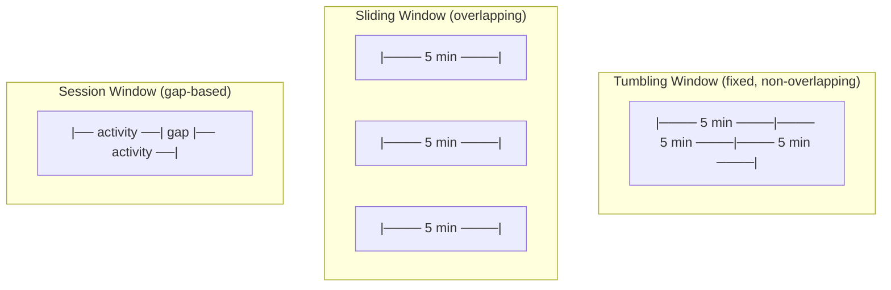

| Window Type | Description | Use Case |
|---|---|---|
| **Tumbling** | Fixed-size, non-overlapping | Hourly revenue reports |
| **Sliding** | Fixed-size, overlapping (slides by interval) | Moving average alerts |
| **Session** | Dynamic size, closed after inactivity gap | User session analytics |
| **Global** | Single window for all time | Running totals |

### Handling Late Events

Events can arrive out of order. A transaction from 10:01 might arrive at 10:05.

```python
from dataclasses import dataclass
from datetime import datetime, timedelta


@dataclass
class Watermark:
    """
    Watermark tracks the progress of event time.
    Events arriving after the watermark are "late."
    
    watermark = max(event_times) - allowed_lateness
    """
    current: datetime
    allowed_lateness: timedelta

    def advance(self, event_time: datetime) -> None:
        new_watermark = event_time - self.allowed_lateness
        if new_watermark > self.current:
            self.current = new_watermark

    def is_late(self, event_time: datetime) -> bool:
        return event_time < self.current


class LateEventHandler:
    """Strategies for handling late-arriving events."""

    def __init__(self, allowed_lateness: timedelta = timedelta(minutes=5)):
        self.watermark = Watermark(
            current=datetime.min,
            allowed_lateness=allowed_lateness,
        )
        self.late_events: list[StreamEvent] = []
        self.side_output: list[StreamEvent] = []  # For reprocessing

    def process(self, event: StreamEvent) -> str:
        self.watermark.advance(event.timestamp)

        if self.watermark.is_late(event.timestamp):
            # Options:
            # 1. Drop (simplest, lossy)
            # 2. Side output (for later reprocessing)
            # 3. Update result (retraction/correction)
            self.side_output.append(event)
            return "late → side output"
        return "on-time → processed"
```

---

## 22.4 Change Data Capture (CDC)

CDC captures row-level changes from a database and streams them as events — turning your database into an event source.

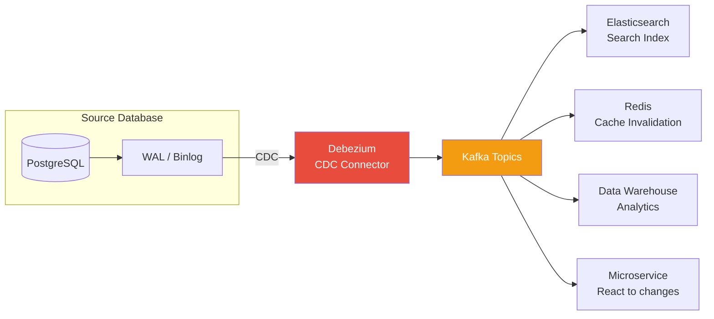

### CDC with Debezium (Conceptual)

```python
"""
CDC event structure from Debezium.
Debezium reads the database's write-ahead log (WAL/binlog)
and produces Kafka events for every row change.
"""
from dataclasses import dataclass
from typing import Optional
from datetime import datetime


@dataclass
class CDCEvent:
    """
    Debezium CDC event structure.
    
    op: 'c' (create), 'u' (update), 'd' (delete), 'r' (read/snapshot)
    before: row state before change (null for inserts)
    after: row state after change (null for deletes)
    source: metadata about the change origin
    """
    op: str  # c, u, d, r
    before: Optional[dict]
    after: Optional[dict]
    source: dict  # {db, schema, table, lsn, ts_ms}
    ts_ms: int


class CDCProcessor:
    """
    Process CDC events to maintain derived data stores.
    Pattern: Database → WAL → Debezium → Kafka → Processor → Target
    """

    def __init__(self):
        self.search_index: dict[str, dict] = {}  # Simulated Elasticsearch
        self.cache: dict[str, dict] = {}          # Simulated Redis

    def process_event(self, event: CDCEvent) -> None:
        table = event.source.get("table", "")

        if table == "products":
            self._handle_product_change(event)
        elif table == "orders":
            self._handle_order_change(event)

    def _handle_product_change(self, event: CDCEvent) -> None:
        """Keep search index in sync with products table."""
        if event.op in ("c", "u", "r"):  # Create, Update, Read(snapshot)
            product = event.after
            product_id = product["id"]
            # Update Elasticsearch
            self.search_index[product_id] = {
                "id": product_id,
                "name": product["name"],
                "description": product["description"],
                "price": product["price"],
                "category": product["category"],
                "updated_at": event.ts_ms,
            }
            # Invalidate cache
            cache_key = f"product:{product_id}"
            if cache_key in self.cache:
                del self.cache[cache_key]

        elif event.op == "d":  # Delete
            product_id = event.before["id"]
            self.search_index.pop(product_id, None)
            self.cache.pop(f"product:{product_id}", None)

    def _handle_order_change(self, event: CDCEvent) -> None:
        """React to order changes."""
        if event.op == "c":
            order = event.after
            print(f"New order: {order['id']} for customer {order['customer_id']}")
            # Trigger downstream: notification, inventory reservation, etc.
        elif event.op == "u":
            before_status = event.before.get("status") if event.before else None
            after_status = event.after.get("status") if event.after else None
            if before_status != after_status:
                print(f"Order {event.after['id']}: {before_status} → {after_status}")


# Example: Process CDC events from Debezium/Kafka
processor = CDCProcessor()

# Simulated CDC events
processor.process_event(CDCEvent(
    op="c",
    before=None,
    after={"id": "P1", "name": "Widget", "description": "A nice widget",
           "price": 29.99, "category": "gadgets"},
    source={"db": "shop", "schema": "public", "table": "products"},
    ts_ms=1700000000000,
))

processor.process_event(CDCEvent(
    op="u",
    before={"id": "P1", "name": "Widget", "price": 29.99},
    after={"id": "P1", "name": "Super Widget", "description": "An amazing widget",
           "price": 34.99, "category": "gadgets"},
    source={"db": "shop", "schema": "public", "table": "products"},
    ts_ms=1700000060000,
))

print(f"Search index: {processor.search_index}")
```

### The Outbox Pattern

**Problem**: How to atomically update a database AND publish an event?

Writing to the DB and publishing to Kafka are two separate operations — they can fail independently.

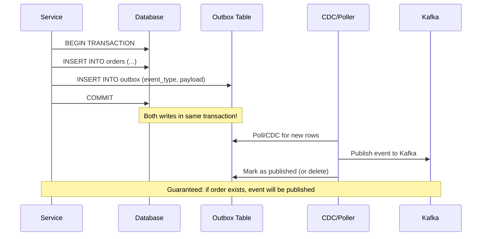

```python
import json
from dataclasses import dataclass
from datetime import datetime
from typing import Any


@dataclass
class OutboxEntry:
    id: str
    aggregate_type: str
    aggregate_id: str
    event_type: str
    payload: str  # JSON
    created_at: datetime
    published: bool = False


class OutboxPattern:
    """
    Transactional outbox pattern.
    
    Write business data + event to same database transaction.
    Separate process (CDC or poller) publishes events to Kafka.
    
    Guarantees at-least-once event publishing.
    """

    def __init__(self):
        # Simulated database tables
        self.orders: dict[str, dict] = {}
        self.outbox: list[OutboxEntry] = []

    def create_order(self, order_id: str, customer_id: str, total: float) -> None:
        """
        Single transaction: write order + outbox entry.
        In real code:
            BEGIN;
            INSERT INTO orders (...) VALUES (...);
            INSERT INTO outbox (...) VALUES (...);
            COMMIT;
        """
        # Business write
        self.orders[order_id] = {
            "id": order_id,
            "customer_id": customer_id,
            "total": total,
            "status": "created",
        }

        # Outbox write (same transaction)
        import uuid
        self.outbox.append(OutboxEntry(
            id=str(uuid.uuid4()),
            aggregate_type="Order",
            aggregate_id=order_id,
            event_type="OrderCreated",
            payload=json.dumps({
                "order_id": order_id,
                "customer_id": customer_id,
                "total": total,
            }),
            created_at=datetime.utcnow(),
        ))

    def poll_outbox(self) -> list[OutboxEntry]:
        """
        Background process: poll for unpublished entries.
        Alternative: Use Debezium CDC on the outbox table.
        """
        unpublished = [e for e in self.outbox if not e.published]
        return unpublished

    def mark_published(self, entry_id: str) -> None:
        for e in self.outbox:
            if e.id == entry_id:
                e.published = True
                break
```

---

## 22.5 Event-Driven Architecture Patterns

### Choreography vs. Orchestration

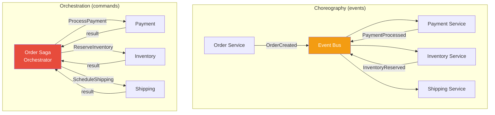

| Aspect | Choreography | Orchestration |
|---|---|---|
| **Coupling** | Loose (services don't know each other) | Moderate (orchestrator knows all steps) |
| **Visibility** | Hard to track full flow | Single point shows full flow |
| **Complexity** | Grows with number of services | Contained in orchestrator |
| **Failure handling** | Each service handles its own | Centralized compensation |
| **Best for** | Simple flows, few steps | Complex flows, many steps |

### Saga with Orchestrator (Full Example)

```python
from dataclasses import dataclass, field
from enum import Enum
from typing import Callable, Optional


class SagaStatus(Enum):
    RUNNING = "running"
    COMPLETED = "completed"
    COMPENSATING = "compensating"
    FAILED = "failed"


@dataclass
class SagaStep:
    name: str
    action: Callable[[], bool]
    compensation: Callable[[], bool]


class SagaOrchestrator:
    """
    Saga pattern: sequence of local transactions with compensating actions.
    If step N fails, compensate steps N-1, N-2, ..., 1.
    """

    def __init__(self, saga_id: str, steps: list[SagaStep]):
        self.saga_id = saga_id
        self.steps = steps
        self.status = SagaStatus.RUNNING
        self.completed_steps: list[SagaStep] = []
        self.log: list[str] = []

    def execute(self) -> bool:
        """Execute saga steps in order."""
        self.log.append(f"Saga {self.saga_id} started")

        for step in self.steps:
            self.log.append(f"Executing: {step.name}")
            try:
                success = step.action()
                if not success:
                    self.log.append(f"Step failed: {step.name}")
                    self._compensate()
                    return False
                self.completed_steps.append(step)
                self.log.append(f"Completed: {step.name}")
            except Exception as e:
                self.log.append(f"Step error: {step.name} - {e}")
                self._compensate()
                return False

        self.status = SagaStatus.COMPLETED
        self.log.append(f"Saga {self.saga_id} completed successfully")
        return True

    def _compensate(self) -> None:
        """Compensate in reverse order."""
        self.status = SagaStatus.COMPENSATING
        self.log.append("Starting compensation...")

        for step in reversed(self.completed_steps):
            self.log.append(f"Compensating: {step.name}")
            try:
                step.compensation()
                self.log.append(f"Compensated: {step.name}")
            except Exception as e:
                self.log.append(f"Compensation failed: {step.name} - {e}")
                # In production: alert, manual intervention needed

        self.status = SagaStatus.FAILED


# Example: Order fulfillment saga
def reserve_inventory() -> bool:
    print("Reserving inventory...")
    return True

def unreserve_inventory() -> bool:
    print("Releasing inventory reservation...")
    return True

def process_payment() -> bool:
    print("Processing payment...")
    return True

def refund_payment() -> bool:
    print("Refunding payment...")
    return True

def schedule_shipping() -> bool:
    print("Scheduling shipping...")
    return False  # Simulate failure!

def cancel_shipping() -> bool:
    print("Cancelling shipping...")
    return True


saga = SagaOrchestrator("order-saga-001", [
    SagaStep("Reserve Inventory", reserve_inventory, unreserve_inventory),
    SagaStep("Process Payment", process_payment, refund_payment),
    SagaStep("Schedule Shipping", schedule_shipping, cancel_shipping),
])

result = saga.execute()
print(f"\nSaga result: {saga.status.value}")
print(f"Log: {saga.log}")

# Output:
# Reserving inventory...
# Processing payment...
# Scheduling shipping...
# Starting compensation...
# Refunding payment...
# Releasing inventory reservation...
# Saga result: failed
```

---

## 22.6 Event Sourcing + CQRS Architecture

Bringing it all together in a production architecture:

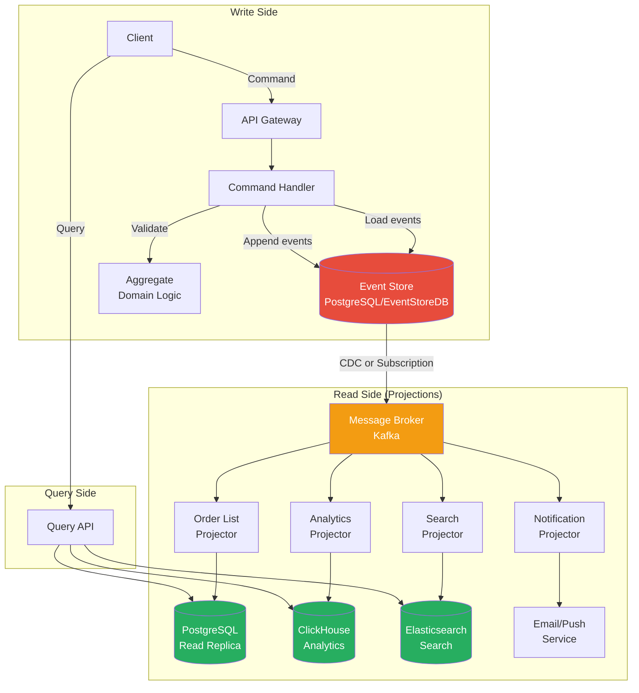

### When to Use Event Sourcing + CQRS

| Use When | Avoid When |
|---|---|
| Full audit trail required (finance, healthcare) | Simple CRUD app |
| Complex domain with many business rules | Team unfamiliar with patterns |
| Need to rebuild state at any point in time | Strong consistency is critical everywhere |
| Multiple read models with different shapes | Small team, short timeline |
| Event-driven integrations between services | Simple reporting needs |
| High read/write ratio asymmetry | Database is already the bottleneck and you haven't tried simpler optimizations |

### Anti-Patterns

| Anti-Pattern | Why It's Bad | Fix |
|---|---|---|
| **CRUD events** (UserUpdated with full entity) | Loses intent — "what changed?" is unclear | Name events after domain actions: PriceIncreased, AddressChanged |
| **Event store as message bus** | Tight coupling between services | Use separate message broker |
| **Deleting events** | Violates immutability, breaks replay | Use compensating events instead |
| **Fat events** | Events containing entire aggregate state | Include only changed data + aggregate ID |
| **Synchronous projections** | Defeats the purpose of CQRS | Project asynchronously, handle eventual consistency |
| **Event versioning ignored** | Schema evolution breaks old consumers | Use upcasters or event version fields |

---

## 22.7 Stream Processing Deep Dive

### Exactly-Once Semantics

The holy grail of stream processing. Three approaches:

```python
class ExactlyOnceStrategies:
    """
    Three approaches to exactly-once processing:
    1. Idempotent consumers (simplest)
    2. Transactional outbox
    3. Kafka transactions (EOS)
    """

    # Strategy 1: Idempotent consumer
    def idempotent_process(
        self, event_id: str, event: dict, processed_set: set[str]
    ) -> bool:
        """
        Track processed event IDs. Skip duplicates.
        Works for: any message broker.
        Limitation: need to store all processed IDs.
        """
        if event_id in processed_set:
            return False  # Already processed, skip
        # Process event...
        processed_set.add(event_id)
        return True

    # Strategy 2: Transactional processing
    def transactional_process(self, event: dict, db_connection) -> None:
        """
        Process event + update offset in same DB transaction.
        If either fails, both roll back.
        
        Works for: when sink is a database.
        """
        # BEGIN TRANSACTION
        # Process event → write results to DB
        # UPDATE consumer_offsets SET offset = ? WHERE consumer_group = ?
        # COMMIT
        pass


class KafkaExactlyOnce:
    """
    Kafka's built-in exactly-once semantics (EOS).
    
    Uses idempotent producer + transactional API:
    1. Producer deduplicates via sequence numbers
    2. Consumer + Producer in same transaction
    3. Offsets committed atomically with output
    
    Pattern: read from topic A → process → write to topic B
    (consume-transform-produce in one transaction)
    """

    def process_with_eos(self) -> None:
        """
        # Kafka Transactions pseudocode:
        producer.initTransactions()
        
        while True:
            records = consumer.poll()
            producer.beginTransaction()
            
            for record in records:
                result = process(record)
                producer.send(output_topic, result)
            
            # Commit offsets AND produced messages atomically
            producer.sendOffsetsToTransaction(consumer_offsets)
            producer.commitTransaction()
        """
        pass
```

### Stream-Table Duality

A powerful concept from Kafka: **streams and tables are dual representations of the same data.**

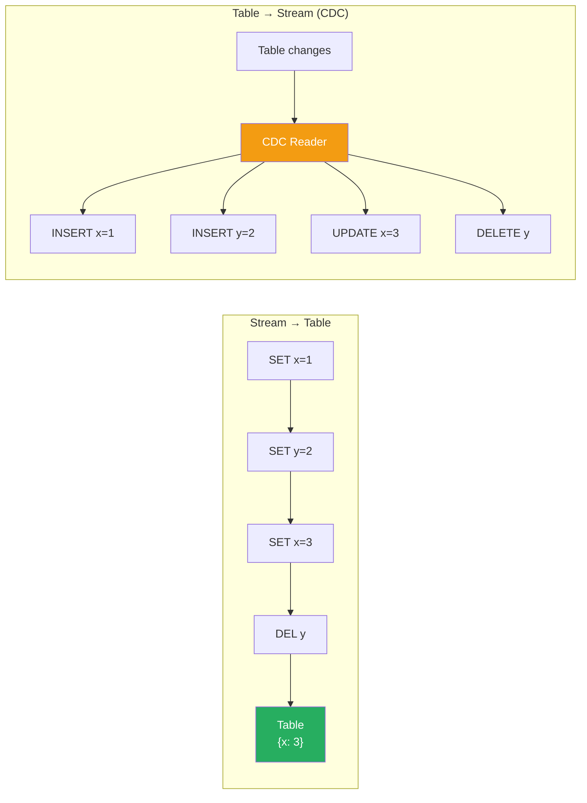

```
Stream → Table:  Replay events to build current state
Table  → Stream: Track every change as an event (CDC)

Example:
  Stream: [SET x=1, SET y=2, SET x=3, DEL y]
  Table:  {x: 3}   (after replaying all events)
```

```python
class StreamTableDuality:
    """
    Demonstrate the duality between streams and tables.
    Used in: Kafka Streams KTable, ksqlDB, Flink.
    """

    def stream_to_table(self, events: list[dict]) -> dict:
        """
        Materialize a stream into a table (compacted view).
        This is what Kafka log compaction does.
        """
        table = {}
        for event in events:
            key = event["key"]
            if event.get("tombstone"):
                table.pop(key, None)
            else:
                table[key] = event["value"]
        return table

    def table_to_stream(
        self, before: dict, after: dict
    ) -> list[dict]:
        """
        Generate change events from table state diff.
        This is what CDC does.
        """
        events = []
        # Detect inserts and updates
        for key, value in after.items():
            if key not in before:
                events.append({"op": "INSERT", "key": key, "value": value})
            elif before[key] != value:
                events.append({"op": "UPDATE", "key": key, "value": value})
        # Detect deletes
        for key in before:
            if key not in after:
                events.append({"op": "DELETE", "key": key, "tombstone": True})
        return events


# Example
dual = StreamTableDuality()

# Stream → Table
stream = [
    {"key": "user:1", "value": {"name": "Alice", "age": 30}},
    {"key": "user:2", "value": {"name": "Bob", "age": 25}},
    {"key": "user:1", "value": {"name": "Alice", "age": 31}},  # Update
    {"key": "user:3", "value": {"name": "Charlie", "age": 35}},
    {"key": "user:2", "tombstone": True},  # Delete
]

table = dual.stream_to_table(stream)
print(f"Table: {table}")
# Table: {'user:1': {'name': 'Alice', 'age': 31}, 'user:3': {'name': 'Charlie', 'age': 35}}
```

### Stream Processing Technology Comparison

| Tool | Type | Language | Strengths | When to Use |
|---|---|---|---|---|
| **Kafka Streams** | Library | Java | No separate cluster, exactly-once | JVM apps, embedded processing |
| **Apache Flink** | Framework | Java/SQL | True streaming, event time, state management | Complex event processing, low latency |
| **Spark Structured Streaming** | Framework | Scala/Python/SQL | Batch + stream unified, ML integration | When you already use Spark |
| **ksqlDB** | Database | SQL | SQL interface to Kafka Streams | Stream analytics without Java |
| **Apache Pulsar** | Broker+Processing | Java | Multi-tenancy, geo-replication | Cloud-native, multi-region |

---

## 22.8 Event Schema Evolution

Events are immutable, but your domain evolves. How do you handle schema changes?

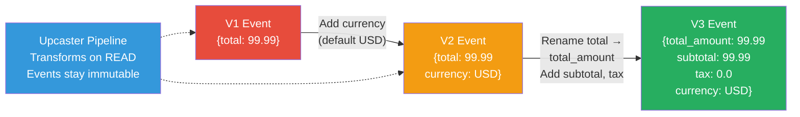

```python
import json
from typing import Any


class EventUpcaster:
    """
    Upcaster: transform old event schemas to current schema.
    Run during event replay / projection rebuilding.
    
    Approach: events stay immutable in the store.
    Upcasters transform them to latest version on read.
    """

    def __init__(self):
        self.upcasters: dict[tuple[str, int], callable] = {}

    def register(
        self, event_type: str, from_version: int, transform: callable
    ) -> None:
        self.upcasters[(event_type, from_version)] = transform

    def upcast(self, event_type: str, version: int, data: dict) -> dict:
        """Upcast event through all version transforms."""
        current = data.copy()
        current_version = version

        while (event_type, current_version) in self.upcasters:
            transform = self.upcasters[(event_type, current_version)]
            current = transform(current)
            current_version += 1

        return current


# Example: OrderCreated schema evolved over time
upcaster = EventUpcaster()

# V1 → V2: Added "currency" field (default USD)
upcaster.register("OrderCreated", 1, lambda e: {
    **e, "currency": "USD", "schema_version": 2
})

# V2 → V3: Renamed "total" to "total_amount", added "subtotal" and "tax"
upcaster.register("OrderCreated", 2, lambda e: {
    **{k: v for k, v in e.items() if k != "total"},
    "total_amount": e.get("total", 0),
    "subtotal": e.get("total", 0),
    "tax": 0.0,
    "schema_version": 3,
})

# Old V1 event from 2022
old_event = {"order_id": "123", "customer_id": "C1", "total": 99.99}

# Upcast to V3
current = upcaster.upcast("OrderCreated", 1, old_event)
print(json.dumps(current, indent=2))
# {
#   "order_id": "123",
#   "customer_id": "C1",
#   "currency": "USD",
#   "total_amount": 99.99,
#   "subtotal": 99.99,
#   "tax": 0.0,
#   "schema_version": 3
# }
```

---

## 22.9 Key Takeaways

| Concept | Key Insight |
|---|---|
| **Event Sourcing** | Store events, not state; replay to rebuild; full audit trail; use snapshots for performance |
| **CQRS** | Separate write model (commands) from read models (queries); optimize each independently |
| **Eventual Consistency** | Read models update asynchronously; handle with polling, causal tokens, or optimistic UI |
| **Stream Processing** | Continuous processing of unbounded data; windowing for time-based aggregation |
| **CDC** | Turn database changes into events; keep derived stores in sync without dual writes |
| **Outbox Pattern** | Atomically write business data + event in one transaction; publish from outbox |
| **Saga** | Distributed transaction via compensating actions; choreography vs. orchestration |
| **Schema Evolution** | Events are immutable; use upcasters to transform old schemas on read |

---

## 22.10 Practice Questions

1. **Design an e-commerce order system** using Event Sourcing + CQRS. What events does the Order aggregate produce? Design at least three different read models (e.g., order tracking, analytics dashboard, customer order history). How do you handle the case where a customer queries their order immediately after placing it?

2. **Your company processes 100K financial transactions per second.** Regulators require a complete audit trail. Compare: (a) Event sourcing with EventStoreDB, (b) Traditional RDBMS with an audit trigger table, (c) Append-only Kafka topics. Which approach would you recommend and why?

3. **Design a real-time fraud detection system** using stream processing. What windowing strategy would you use? How do you handle late events from mobile devices with unreliable connectivity? How do you update fraud rules without redeploying?

4. **Implement the Outbox Pattern** for a microservice that creates orders and needs to notify the inventory service. What happens if the outbox poller crashes after publishing to Kafka but before marking the entry as published? How do you handle this?

5. **You're migrating from a monolith to microservices** and want to use CDC to keep the old and new systems in sync during the transition. Design the CDC pipeline. How do you handle schema differences between the old monolith database and the new microservice databases?

---

| [← Chapter 21: Consensus & Consistency](../part5-advanced/ch21-consensus-and-consistency.md) | [Home](../README.md) | [Chapter 23: Interview Framework →](../part6-interview-prep/ch23-interview-framework.md) |
|---|---|---|
