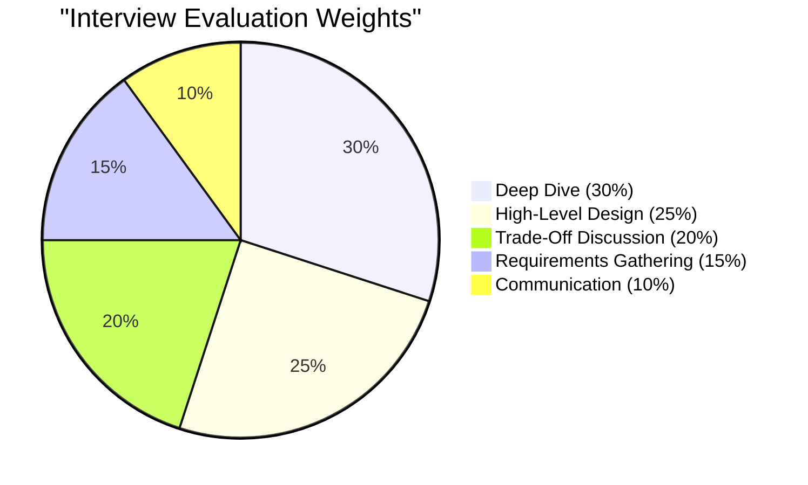
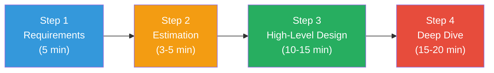
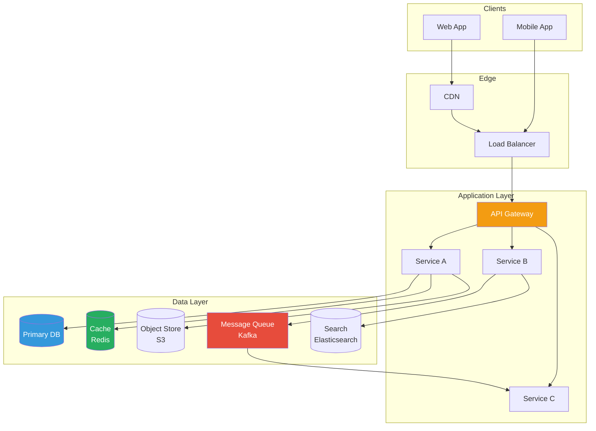
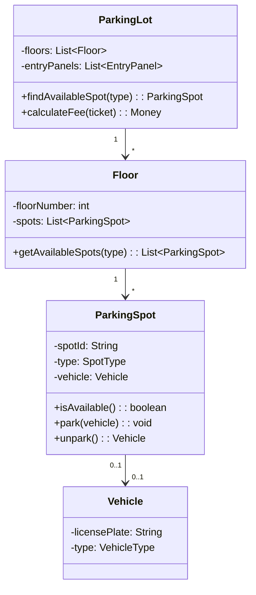
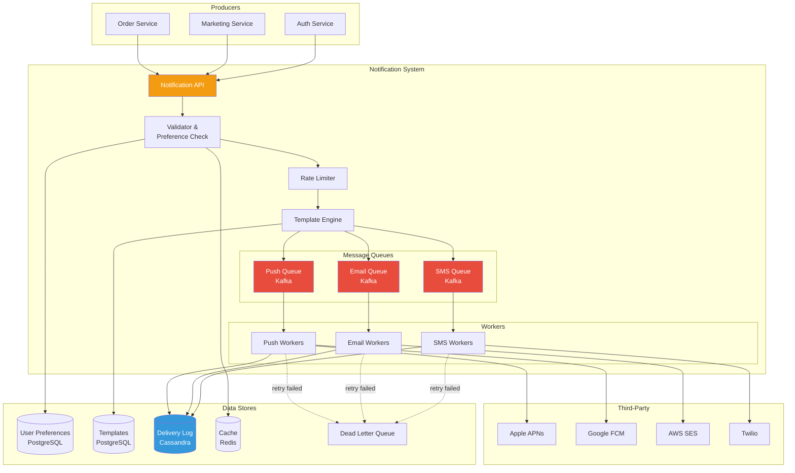
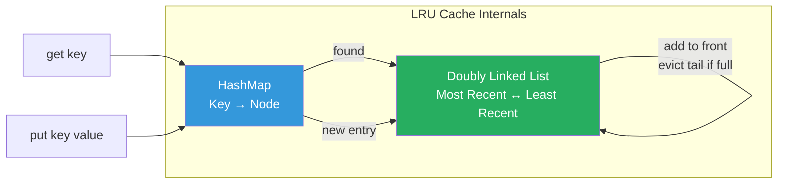
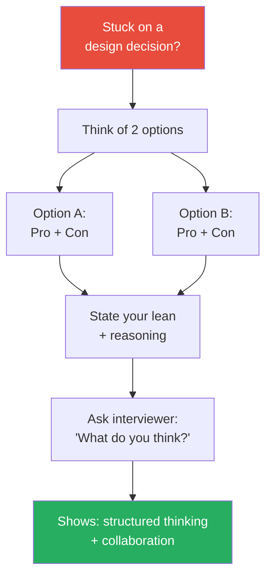

# Chapter 23: System Design Interview Framework

> *"The interviewer isn't looking for the 'right' answer — they're evaluating how you think, communicate trade-offs, and navigate ambiguity under pressure."*

This chapter gives you a repeatable framework for both **LLD** and **HLD** interviews. We'll walk through the time management, the structure, and complete mock interviews.

---

## 23.1 What Interviewers Actually Evaluate

### The Scorecard (What's in their head)



| Dimension | Weight | What They Look For |
|---|---|---|
| **Requirements Gathering** | 15% | Do you clarify scope before diving in? |
| **High-Level Design** | 25% | Can you decompose the system into logical components? |
| **Deep Dive** | 30% | Can you go deep on specific components with real trade-offs? |
| **Trade-Off Discussion** | 20% | Do you acknowledge alternatives and justify choices? |
| **Communication** | 10% | Are you structured, clear, and collaborative? |

### What Separates Levels

| Level | Expected Depth |
|---|---|
| **Junior (L3/L4)** | Functional design, basic components, one database choice |
| **Mid (L5)** | Scalability, caching, queues, reasonable trade-offs |
| **Senior (L6)** | Non-obvious trade-offs, failure modes, operational concerns |
| **Staff+ (L7+)** | Cross-system implications, organizational impact, evolution strategy |

---

## 23.2 The 4-Step Framework (HLD)

Every HLD interview follows the same skeleton. Master this and you'll never freeze.



### Step 1: Requirements (5 minutes)

**Goal:** Narrow the problem from "design X" to a concrete scope you can design in 35 minutes.

**Functional Requirements — Ask:**
- Who are the users? (B2B vs B2C, geo-distribution)
- What are the core use cases? (List 3-5, prioritize)
- What features are MVP vs. nice-to-have?

**Non-Functional Requirements — Ask:**
- Scale: How many users? Read-heavy or write-heavy?
- Latency: What's acceptable? (p99 < 200ms?)
- Availability: 99.9%? 99.99%?
- Consistency: Is eventual OK? Or strong consistency needed?
- Durability: Can we lose data? (financial = NO)

**Template response:**

```
"Let me make sure I understand the scope. We're designing [system] that needs to:
 
Functional:
1. [Core feature 1]
2. [Core feature 2]  
3. [Core feature 3]

Non-functional:
- [X] DAU, [Y] requests/sec peak
- Latency: p99 < [Z]ms for reads
- Availability: [N] nines
- [Eventual/Strong] consistency for [specific operation]

Out of scope for this discussion: [list what you're NOT designing]

Does that match your expectations?"
```

> **Pro tip**: Explicitly state what's OUT of scope. This shows maturity and prevents scope creep.

### Step 2: Back-of-Envelope Estimation (3-5 minutes)

**Goal:** Derive numbers that inform your design choices (sharding, caching, storage).

**The estimation chain:**

```
DAU → Peak QPS → Storage → Bandwidth → Infrastructure

Example (Twitter-like):
- 300M DAU, each reads 100 tweets/day, posts 1 tweet/day
- Read QPS: 300M × 100 / 86,400 ≈ 350K/sec → peak 2x ≈ 700K/sec
- Write QPS: 300M × 1 / 86,400 ≈ 3.5K/sec
- Read:Write ratio ≈ 100:1 → read-heavy → cache aggressively

- Tweet size: ~250 bytes text + metadata ≈ 1KB
- Daily new data: 300M × 1KB = 300GB/day
- 5-year storage: 300GB × 365 × 5 ≈ 550TB
- Media (images): ~200KB × 50M images/day = 10TB/day → CDN + object storage
```

**Useful numbers to memorize:**

| Resource | Number |
|---|---|
| Seconds in a day | 86,400 ≈ 10^5 |
| QPS from 1M daily requests | ~12 QPS |
| 1 server handles | ~1K-10K concurrent connections |
| 1 DB server handles | ~5K-10K simple queries/sec |
| Redis throughput | ~100K ops/sec per node |
| Kafka throughput | ~1M msgs/sec per partition |
| SSD random read | ~100μs |
| Network round trip (same DC) | ~0.5ms |
| Network round trip (cross-continent) | ~100-150ms |

### Step 3: High-Level Design (10-15 minutes)

**Goal:** Draw the architecture with all major components.



**How to present:**
1. Start with the API — what endpoints exist?
2. Walk through the **write path** (data flow in)
3. Walk through the **read path** (data flow out)
4. Identify the **data stores** and justify each choice
5. Add **caching** and **async processing** where needed

**API design first:**
```
POST /api/v1/tweets          → Create tweet
GET  /api/v1/feed?cursor=X   → Get home timeline
GET  /api/v1/users/:id       → Get user profile
POST /api/v1/follow           → Follow user
```

### Step 4: Deep Dive (15-20 minutes)

**Goal:** Go deep on the most interesting / challenging component.

The interviewer typically asks: *"Let's dig into [specific component]."* or *"What's the hardest part of this system?"*

**Common deep-dive topics:**

| Topic | What to Discuss |
|---|---|
| **Database schema** | Tables, indexes, partitioning strategy, query patterns |
| **Caching strategy** | What to cache, invalidation, thundering herd |
| **Scaling bottleneck** | What breaks first at 10x scale? How to fix? |
| **Consistency** | What happens during partition? Trade-offs made? |
| **Data pipeline** | How data flows from write to all read models |
| **Failure scenarios** | What if [component] goes down? Cascading failures? |

---

## 23.3 The LLD Interview Framework

LLD interviews focus on **object-oriented design** and **clean code** under constraints.

### Time Allocation (45 min)

```mermaid
gantt
    title HLD Interview Timeline (45 min)
    dateFormat mm
    axisFormat %M min

    section Phase
    Requirements & Scope     :req, 00, 5m
    Back-of-Envelope Estimation :est, after req, 5m
    High-Level Architecture  :hld, after est, 15m
    Deep Dive & Trade-offs   :deep, after hld, 20m
```



```
[0-5 min]   Clarify requirements, identify actors and use cases
[5-10 min]  Identify core classes and relationships  
[10-35 min] Write code (classes, methods, key algorithms)
[35-45 min] Discuss extensibility, edge cases, testing
```

### Step-by-Step

**1. Gather Requirements (5 min)**
```
"Let me clarify the requirements:
- Who are the actors? (User, Admin, System)
- What are the core actions? (Create, Read, Update, Delete + domain-specific)
- What are the constraints? (Concurrency? Scale? Real-time?)
- What's in scope vs. out of scope?"
```

**2. Identify Classes (5 min)**

Extract nouns from requirements → candidate classes.

```
Parking Lot Example:
  Nouns: ParkingLot, Floor, ParkingSpot, Vehicle, Ticket, Payment
  
  Relationships:
    ParkingLot has many Floors
    Floor has many ParkingSpots
    ParkingSpot holds one Vehicle
    Ticket links Vehicle to ParkingSpot
```

**3. Design Class Diagram**



**4. Write Code (25 min)**

Focus on:
- Core domain logic (not getters/setters)
- Design patterns where appropriate
- Thread safety if concurrency is relevant
- SOLID principles

**5. Discuss (5 min)**
- How would you test this?
- What if we need to add [new feature]?
- What design patterns did you use and why?

---

## 23.4 Common Interview Questions

### HLD Questions by Difficulty

| Difficulty | Questions | Key Concepts |
|---|---|---|
| **Easy** | URL Shortener, Pastebin, Rate Limiter | Hashing, DB choice, caching |
| **Medium** | Twitter Feed, Instagram, Web Crawler | Fan-out, message queues, distributed processing |
| **Medium** | Chat System, Notification Service | WebSockets, pub/sub, delivery guarantees |
| **Hard** | YouTube/Netflix, Google Docs, Search Engine | Video pipeline, CRDTs, inverted index |
| **Hard** | Uber, Distributed Cache, Payment System | Geospatial, consistency, exactly-once |
| **Expert** | Google Maps, Ad Auction, Stock Exchange | Graph algorithms, real-time bidding, low latency |

### LLD Questions by Difficulty

| Difficulty | Questions | Key Concepts |
|---|---|---|
| **Easy** | Parking Lot, Library System, Tic-Tac-Toe | OOP basics, encapsulation |
| **Medium** | Elevator System, Vending Machine, Chess | State machines, Strategy pattern |
| **Medium** | Hotel Booking, Movie Ticket Booking | Concurrency, reservation systems |
| **Hard** | Splitwise, LRU Cache, File System | Algorithms, thread safety |
| **Hard** | Rate Limiter, Task Scheduler, Pub/Sub | Concurrent data structures |

---

## 23.5 Mock Interview: Design a Notification System

Let's walk through a complete HLD interview.

### Step 1: Requirements (5 min)

> *"Design a notification system that can send notifications to millions of users."*

**My questions to the interviewer:**

| Question | Assumed Answer |
|---|---|
| What types? Push, SMS, Email? | All three |
| How many notifications/day? | 1 billion |
| Latency requirement? | Push < 1s, Email < 5min, SMS < 30s |
| Do users customize preferences? | Yes — opt in/out per channel per type |
| Need delivery tracking? | Yes — sent, delivered, read |
| Rate limiting needed? | Yes — don't spam users |
| Templates? | Yes — parameterized templates |

**Requirements summary:**

```
Functional:
1. Send push, SMS, email notifications
2. User preference management (opt-in/out per channel)
3. Template-based notification content
4. Delivery tracking (sent → delivered → read)
5. Rate limiting per user

Non-functional:
- 1B notifications/day ≈ ~12K/sec avg, ~50K/sec peak
- Push: < 1s latency
- 99.9% delivery rate
- At-least-once delivery (no lost notifications)
- Graceful degradation under load

Out of scope: Rich media notifications, A/B testing, analytics dashboard
```

### Step 2: Estimation (3 min)

```
1B notifications/day:
- ~12K/sec average, ~50K/sec peak
- Split: 70% push, 20% email, 10% SMS
- Push: ~35K/sec peak
- Email: ~10K/sec peak  
- SMS: ~5K/sec peak

Storage:
- Each notification record: ~500 bytes
- Daily: 1B × 500B = 500GB/day
- 30-day retention: ~15TB
- → Need partitioned DB or time-series storage

Third-party API limits:
- APNs: ~100K/sec per connection (need connection pool)
- FCM: ~500K/sec (generous)
- Email (SES): ~50K/sec
- SMS (Twilio): ~1K/sec (need multiple accounts or queuing)
```

### Step 3: High-Level Design (12 min)



**Write path walkthrough:**

1. Producer calls `POST /notifications` with `{user_id, type, template_id, params}`
2. Validator checks user preferences → skip opted-out channels
3. Rate limiter checks per-user quotas (Redis sliding window)
4. Template engine renders content from template + params
5. Routed to per-channel Kafka topics (push/email/SMS)
6. Workers consume, call third-party APIs, log delivery status
7. Failed deliveries → retry with exponential backoff → DLQ after 3 attempts

### Step 4: Deep Dive (15 min)

**Interviewer: "How do you ensure reliability — no lost notifications?"**

```
1. Durability: Kafka persists messages to disk with replication.
   Even if workers crash, messages survive.

2. At-least-once delivery:
   - Workers commit Kafka offset AFTER successful send
   - If worker crashes mid-send, message will be redelivered
   - Third-party APIs are idempotent (use notification_id as dedup key)

3. Retry strategy:
   - Attempt 1: immediate
   - Attempt 2: after 30 seconds
   - Attempt 3: after 5 minutes
   - Then → Dead Letter Queue for manual review

4. Monitoring:
   - Track: sent / delivered / failed / bounced per channel
   - Alert on delivery rate dropping below 99%
   - Alert on DLQ depth > threshold

5. Graceful degradation:
   - If push is down → queue backs up, no data loss
   - If email provider is slow → workers auto-scale
   - Priority queues: critical (2FA codes) > transactional > marketing
```

**Interviewer: "How do you handle user preferences efficiently at 50K req/sec?"**

```
1. Cache preferences in Redis:
   Key: "pref:{user_id}" → {push: true, email: true, sms: false, ...}
   TTL: 1 hour

2. Cache-aside pattern:
   - Check Redis first → hit rate ~95%
   - Miss → query PostgreSQL → write to Redis
   
3. Invalidation:
   - When user updates preferences → delete Redis key
   - Next notification check → cache miss → fresh read from DB

4. Optimization: Bloom filter for "definitely no preferences set"
   → Skip DB/Redis entirely for users with default settings
   → 80% of users never customize preferences
```

---

## 23.6 Mock Interview: Design an LRU Cache (LLD)

### Requirements

> *"Design an in-memory LRU (Least Recently Used) cache with O(1) get and put."*

**Clarifications:**
- Fixed capacity, evicts least recently used when full
- Thread-safe? → Yes
- Expiry (TTL)? → Yes, optional per entry
- Generic types? → Yes

### Design



### Implementation

```python
import threading
import time
from dataclasses import dataclass
from typing import Optional, Generic, TypeVar

K = TypeVar("K")
V = TypeVar("V")


@dataclass
class CacheNode:
    """Doubly linked list node."""
    key: str
    value: object
    prev: Optional["CacheNode"] = None
    next: Optional["CacheNode"] = None
    expires_at: Optional[float] = None  # Unix timestamp

    @property
    def is_expired(self) -> bool:
        if self.expires_at is None:
            return False
        return time.time() > self.expires_at


class DoublyLinkedList:
    """
    Doubly linked list with sentinel head/tail.
    Supports O(1) add-to-front, remove-any, remove-tail.
    """

    def __init__(self):
        self.head = CacheNode(key="HEAD", value=None)
        self.tail = CacheNode(key="TAIL", value=None)
        self.head.next = self.tail
        self.tail.prev = self.head

    def add_to_front(self, node: CacheNode) -> None:
        """Add node right after head (most recently used position)."""
        node.prev = self.head
        node.next = self.head.next
        self.head.next.prev = node
        self.head.next = node

    def remove(self, node: CacheNode) -> None:
        """Remove a node from anywhere in the list. O(1)."""
        node.prev.next = node.next
        node.next.prev = node.prev
        node.prev = None
        node.next = None

    def remove_tail(self) -> Optional[CacheNode]:
        """Remove and return the least recently used node."""
        if self.tail.prev == self.head:
            return None  # Empty
        node = self.tail.prev
        self.remove(node)
        return node

    def move_to_front(self, node: CacheNode) -> None:
        """Move existing node to front (mark as recently used)."""
        self.remove(node)
        self.add_to_front(node)


class LRUCache:
    """
    Thread-safe LRU Cache with optional TTL.
    
    Time complexity:
      get: O(1)
      put: O(1)
      delete: O(1)
    
    Space complexity: O(capacity)
    """

    def __init__(self, capacity: int):
        if capacity <= 0:
            raise ValueError("Capacity must be positive")
        self.capacity = capacity
        self.cache: dict[str, CacheNode] = {}
        self.list = DoublyLinkedList()
        self.lock = threading.Lock()
        # Stats
        self.hits = 0
        self.misses = 0

    def get(self, key: str) -> Optional[object]:
        """
        Get value by key.
        Returns None if not found or expired.
        Marks entry as recently used.
        """
        with self.lock:
            node = self.cache.get(key)

            if node is None:
                self.misses += 1
                return None

            if node.is_expired:
                self._remove_node(node)
                self.misses += 1
                return None

            # Move to front (most recently used)
            self.list.move_to_front(node)
            self.hits += 1
            return node.value

    def put(self, key: str, value: object, ttl: Optional[int] = None) -> None:
        """
        Add or update entry.
        ttl: Time-to-live in seconds. None = no expiry.
        Evicts LRU entry if at capacity.
        """
        with self.lock:
            expires_at = time.time() + ttl if ttl else None

            if key in self.cache:
                # Update existing
                node = self.cache[key]
                node.value = value
                node.expires_at = expires_at
                self.list.move_to_front(node)
                return

            # Add new entry
            if len(self.cache) >= self.capacity:
                self._evict()

            node = CacheNode(key=key, value=value, expires_at=expires_at)
            self.cache[key] = node
            self.list.add_to_front(node)

    def delete(self, key: str) -> bool:
        """Explicitly remove an entry."""
        with self.lock:
            node = self.cache.get(key)
            if node is None:
                return False
            self._remove_node(node)
            return True

    def _evict(self) -> None:
        """Remove the least recently used entry."""
        node = self.list.remove_tail()
        if node:
            del self.cache[node.key]

    def _remove_node(self, node: CacheNode) -> None:
        """Remove a specific node from both map and list."""
        self.list.remove(node)
        del self.cache[node.key]

    @property
    def size(self) -> int:
        return len(self.cache)

    @property
    def hit_rate(self) -> float:
        total = self.hits + self.misses
        return self.hits / total if total > 0 else 0.0

    def __repr__(self) -> str:
        return (
            f"LRUCache(capacity={self.capacity}, size={self.size}, "
            f"hit_rate={self.hit_rate:.1%})"
        )


# Usage
cache = LRUCache(capacity=3)

cache.put("a", 1)
cache.put("b", 2)
cache.put("c", 3)
print(cache.get("a"))  # 1 (now "a" is most recent)

cache.put("d", 4)      # Evicts "b" (least recently used)
print(cache.get("b"))  # None (evicted)
print(cache.get("c"))  # 3
print(cache.get("d"))  # 4

# With TTL
cache.put("temp", "data", ttl=2)
print(cache.get("temp"))  # "data"
time.sleep(3)
print(cache.get("temp"))  # None (expired)

print(cache)  # LRUCache(capacity=3, size=2, hit_rate=66.7%)
```

```java
import java.util.*;
import java.util.concurrent.locks.ReentrantReadWriteLock;

public class LRUCache<K, V> {
    
    private static class Node<K, V> {
        K key;
        V value;
        Node<K, V> prev, next;
        Long expiresAt; // null = no expiry
        
        Node(K key, V value, Long expiresAt) {
            this.key = key;
            this.value = value;
            this.expiresAt = expiresAt;
        }
        
        boolean isExpired() {
            return expiresAt != null && System.currentTimeMillis() > expiresAt;
        }
    }
    
    private final int capacity;
    private final Map<K, Node<K, V>> cache;
    private final Node<K, V> head, tail;
    private final ReentrantReadWriteLock lock = new ReentrantReadWriteLock();
    
    public LRUCache(int capacity) {
        this.capacity = capacity;
        this.cache = new HashMap<>();
        this.head = new Node<>(null, null, null);
        this.tail = new Node<>(null, null, null);
        head.next = tail;
        tail.prev = head;
    }
    
    public V get(K key) {
        lock.writeLock().lock();
        try {
            Node<K, V> node = cache.get(key);
            if (node == null) return null;
            if (node.isExpired()) {
                removeNode(node);
                cache.remove(key);
                return null;
            }
            moveToFront(node);
            return node.value;
        } finally {
            lock.writeLock().unlock();
        }
    }
    
    public void put(K key, V value, Long ttlMs) {
        lock.writeLock().lock();
        try {
            Long expiresAt = ttlMs != null
                ? System.currentTimeMillis() + ttlMs : null;
            
            if (cache.containsKey(key)) {
                Node<K, V> node = cache.get(key);
                node.value = value;
                node.expiresAt = expiresAt;
                moveToFront(node);
                return;
            }
            
            if (cache.size() >= capacity) evict();
            
            Node<K, V> node = new Node<>(key, value, expiresAt);
            cache.put(key, node);
            addToFront(node);
        } finally {
            lock.writeLock().unlock();
        }
    }
    
    public void put(K key, V value) { put(key, value, null); }
    
    private void addToFront(Node<K, V> node) {
        node.prev = head;
        node.next = head.next;
        head.next.prev = node;
        head.next = node;
    }
    
    private void removeNode(Node<K, V> node) {
        node.prev.next = node.next;
        node.next.prev = node.prev;
    }
    
    private void moveToFront(Node<K, V> node) {
        removeNode(node);
        addToFront(node);
    }
    
    private void evict() {
        Node<K, V> lru = tail.prev;
        if (lru != head) {
            removeNode(lru);
            cache.remove(lru.key);
        }
    }
    
    public int size() { return cache.size(); }
}
```

---

## 23.7 Common Mistakes & How to Avoid Them

### HLD Mistakes

| Mistake | Why It's Bad | Fix |
|---|---|---|
| **Diving into code immediately** | Shows you can't design at high level | Start with requirements → estimation → boxes → then details |
| **Not clarifying requirements** | You'll design the wrong thing | Spend 5 min asking questions — it's expected |
| **"We'll use microservices"** | Buzzword without justification | Explain WHY the architecture choice fits |
| **Ignoring failure modes** | Real systems fail constantly | Proactively discuss: "What if [X] goes down?" |
| **Over-engineering for Day 1** | Shows poor judgment | Start simple, explain scaling path |
| **Single point of failure** | Critical architectural flaw | Ask yourself: "Does anything have only one instance?" |
| **Skipping estimation** | Guessing instead of reasoning | 3-5 min of math prevents bad decisions |
| **Not discussing trade-offs** | Seems like you don't know alternatives | "I chose X over Y because [reason]. The trade-off is [cost]." |

### LLD Mistakes

| Mistake | Why It's Bad | Fix |
|---|---|---|
| **God class** | One class doing everything | Apply SRP — split responsibilities |
| **No interfaces/abstractions** | Can't extend or test | Depend on abstractions, not concrete classes |
| **Forgetting thread safety** | Race conditions in concurrent systems | Identify shared state, use locks or immutable objects |
| **Over-using design patterns** | Adds complexity without benefit | Use patterns when they solve a real problem |
| **Ignoring edge cases** | System breaks in production | Ask: "What happens when input is null/empty/huge?" |

---

## 23.8 Interview Communication Playbook

### Opening Lines (The First 30 Seconds)

```
"Thanks for the problem. Before I start designing, I'd like to spend 
a couple minutes clarifying requirements and constraints. Then I'll do 
a quick estimation, draw the high-level architecture, and we can deep 
dive into whichever component you find most interesting. Sound good?"
```

This shows: structure, maturity, collaboration.

### During Design — Think Out Loud

```
❌ Bad: *silently draws boxes for 3 minutes*

✅ Good: "I'm thinking about the data model here. We have a 100:1 
read-to-write ratio, so I want to optimize for reads. That means 
caching and possibly denormalized read models. Let me draw the 
read path..."
```

### When You're Stuck



```
✅ "I'm not sure about the best approach here. Let me think through 
two options:
 
Option A: [approach]. Pro: [X]. Con: [Y].
Option B: [approach]. Pro: [X]. Con: [Y].

I'd lean toward Option A because [reason]. What do you think?"
```

### Trade-Off Template

```
"For [component], I'm choosing [X] over [Y].

[X] gives us: [benefit 1], [benefit 2]
The cost is: [trade-off 1], [trade-off 2]

[Y] would be better if: [condition when Y wins]

For our requirements, [X] is the better fit because [specific reason]."
```

### Handling Curveball Questions

```
Interviewer: "What if your traffic suddenly 10x's?"

"Good question. Let me walk through what breaks:
1. [Component A] hits its limit first because [reason]
2. Short-term: [immediate mitigation — e.g., auto-scale workers, increase cache TTL]
3. Medium-term: [architectural change — e.g., add read replicas, shard database]
4. The bottleneck shifts to [next thing], which we'd address with [approach]"
```

---

## 23.9 Quick Reference Cheat Sheets

### Technology Selection Guide

| Need | Technology | When to Use |
|---|---|---|
| **Relational data, ACID** | PostgreSQL | Strong consistency, complex queries |
| **High write throughput** | Cassandra | Time-series, IoT, messaging |
| **Document store** | MongoDB | Flexible schema, rapid prototyping |
| **Caching** | Redis | Session, cache, rate limiting, pub/sub |
| **Search** | Elasticsearch | Full-text search, log analysis |
| **Message queue** | Kafka | Event streaming, high throughput |
| **Task queue** | RabbitMQ/SQS | Worker tasks, short-lived messages |
| **Object storage** | S3 | Images, videos, backups |
| **CDN** | CloudFront/Fastly | Static assets, media delivery |
| **Graph queries** | Neo4j | Social graphs, recommendations |

### Scaling Patterns Cheat Sheet

| Problem | Pattern | Key Concept |
|---|---|---|
| Too many reads | **Read replicas + cache** | Cache-aside, CDN |
| Too many writes | **Sharding + async** | Partition key, message queue |
| Hot partition | **Consistent hashing** | Virtual nodes |
| Slow queries | **Denormalize + materialized views** | Trade write speed for read speed |
| Tight coupling | **Event-driven + queues** | Async communication |
| Single point of failure | **Redundancy** | Leader-follower, multi-AZ |
| Thundering herd | **Request coalescing** | Single-flight, cache lock |
| Cascading failure | **Circuit breaker** | Fail fast, fallback |

### Numbers to Know

| Metric | Value |
|---|---|
| L1 cache reference | 1 ns |
| L2 cache reference | 4 ns |
| RAM reference | 100 ns |
| SSD random read | 100 μs |
| HDD seek | 10 ms |
| Network (same DC) | 0.5 ms |
| Network (cross-continent) | 150 ms |
| Read 1 MB from SSD | 1 ms |
| Read 1 MB from network | 10 ms |
| 1M rows × 1KB each | 1 GB |
| Seconds in a day | 86,400 ≈ 100K |
| QPS from 1M daily requests | ~12 |
| 99.9% availability | 8.7 hours downtime/year |
| 99.99% availability | 52 minutes downtime/year |

---

## 23.10 Study Plan

### 4-Week Plan (2 hours/day)

| Week | Focus | Chapters | Practice |
|---|---|---|---|
| **1** | Foundations + LLD | Ch 1-9 | 2 LLD problems on whiteboard |
| **2** | HLD Fundamentals | Ch 10-14 | Estimation drills, 1 HLD problem |
| **3** | HLD Case Studies | Ch 15-19 | 2-3 HLD problems with timer |
| **4** | Advanced + Mock | Ch 20-23 | Mock interviews with peers, review weak areas |

### 8-Week Plan (1 hour/day)

| Week | Focus | Chapters |
|---|---|---|
| **1-2** | CS Foundations | Ch 1-4 |
| **3-4** | LLD (OOP, Patterns, Cases) | Ch 5-9 |
| **5-6** | HLD Fundamentals | Ch 10-14 |
| **7** | HLD Case Studies | Ch 15-19 |
| **8** | Advanced + Interview Practice | Ch 20-23 |

### How to Practice Effectively

1. **Use a timer**: 45 minutes max per problem
2. **Draw on whiteboard/paper first**: Not in an IDE
3. **Explain out loud**: Record yourself or practice with a peer
4. **After each practice**: Write down what went well and what didn't
5. **Focus on weak areas**: Don't just repeat problems you're good at

---

## 23.11 Key Takeaways

| Aspect | Key Insight |
|---|---|
| **Framework** | Requirements → Estimation → Design → Deep Dive; always in this order |
| **Requirements** | 5 minutes of questions prevents 30 minutes of wrong design |
| **Estimation** | Round aggressively; the goal is informing decisions, not precision |
| **Communication** | Think out loud; explain trade-offs; show collaborative mindset |
| **Trade-offs** | There is no perfect design; the best answer explains WHY you chose |
| **Depth** | Go deep on 1-2 components rather than shallow on everything |
| **Mistakes** | The biggest mistake is diving in without clarifying scope |
| **Practice** | Practice with a timer and out loud; reading alone won't prepare you |

---

## 23.12 Practice Questions

1. **Mock HLD (35 min)**: Design a ride-sharing surge pricing system. How do you calculate real-time supply/demand per zone? How often do prices update? What happens during events (concerts, sports)?

2. **Mock HLD (35 min)**: Design a collaborative document editor (Google Docs). How do multiple users edit simultaneously? How do you handle offline edits? What consistency model do you use?

3. **Mock LLD (35 min)**: Design a rate limiter that supports multiple algorithms (token bucket, sliding window, fixed window). It should be configurable per API endpoint and per user.

4. **Mock HLD (35 min)**: Design a web crawler that can crawl 1 billion pages per month. How do you prioritize URLs? Handle duplicates? Respect robots.txt? Distribute the work?

5. **Mock LLD (35 min)**: Design a task scheduler (like cron) that can handle millions of scheduled jobs with at-least-once execution guarantee. How do you handle clock skew across servers? What happens when the scheduler node crashes?

---

| [← Chapter 22: Event Sourcing, CQRS & Stream Processing](../part5-advanced/ch22-event-sourcing-cqrs.md) | [Home](../README.md) | |
|---|---|---|
